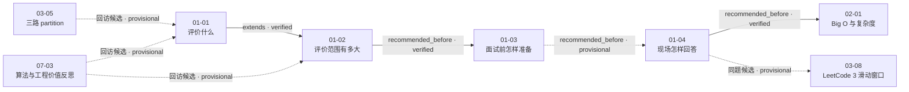

# 第 1 章 算法面试到底是什么鬼？

## 本章解决什么问题

本章不是在教第一种数据结构或第一道算法题，而是在建立整门课程的**面试问题解决框架**：

1. 算法面试究竟在评价什么；
2. 算法能力在完整面试中处于什么位置；
3. 面试前应准备哪些内容、准备到什么程度；
4. 面试现场如何从题目条件走到可解释、可实现、可优化的回答。

四课合起来给出的核心命题是：

> 高质量的算法面试表现，不只是得到一个正确结果，而是让面试官看见一条与约束相符、能够交流、能够验证、能够继续优化的推理链。

这条主线来自 01-01 对“正确回答”的重新定义，以及 01-04 对现场解题流程的具体展开。[视频 01-01 00:02:55–00:19:40]；[视频 01-04 00:00:25–00:12:29]

## 四课速览

| 课次                         | 核心问题                   | 一句话结论                                                                 | 实测时长 |
| ---------------------------- | -------------------------- | -------------------------------------------------------------------------- | -------- |
| [01-01](../lessons/01-01.md) | 算法面试在考什么？         | 重点不只在最终答案，还在约束分析、思考路径、权衡、优化、代码质量与持续表达 | 19:40.28 |
| [01-02](../lessons/01-02.md) | 算法面试是不是面试的全部？ | 算法面试只是技术面试的一部分；项目、专业知识、行为表现与反向提问同样重要   | 14:51.76 |
| [01-03](../lessons/01-03.md) | 应该怎样准备？             | 基础优先、目标匹配，避免把厚重教材、高级主题、竞赛水平或机械刷题当作门槛   | 17:38.40 |
| [01-04](../lessons/01-04.md) | 拿到题后怎样回答？         | 读约束、画用例、建暴力基线、算复杂度、找瓶颈、再优化并写出可靠代码         | 13:44.44 |

第一章总实测时长为 **1:05:54.88**。

## 推荐学习顺序

建议按原顺序学习，因为四课分别回答“评价目标 → 面试范围 → 面试前准备 → 面试中执行”。不过这里没有需要死记的硬先修：

实线表示当前已有视频证据确认的关系；虚线表示有价值但仍需等待后续课次证据的候选关系。

## 核心框架一：让思考过程可观察

### 1. 最终答案不是唯一评价对象

01-01 明确否定了三个过度简化的判断：

- 没有完整回答每一道题，不自动等于算法面试失败；
- 算法面试不等于技术面试全貌；
- 算法面试表现也不能单独保证 Offer。[视频 01-01 00:02:55–00:05:26]

课程把“正确回答”扩展到以下维度：

- 是否发现问题中的关键信息；
- 能否主动确认尚未给出的约束；
- 能否比较不同方案的适用条件；
- 能否继续优化；
- 代码是否清晰、规范并考虑容错；
- 面对难题时，能否继续说明尝试方向和当前卡点。[视频 01-01 00:16:50–00:19:40]

因此，面试者真正需要训练的是把内部推理变成面试官可以跟随的外部表达。[整理推导]

### 2. 约束决定算法选型

01-01 用排序任务说明：脱离数据与运行环境，单独回答一个算法名并不充分。[视频 01-01 00:05:26–00:16:50]

| 需要澄清的条件       | 课程示例中的候选方向 | 这一问的价值                 |
| -------------------- | -------------------- | ---------------------------- |
| 是否有大量重复元素   | 三路快速排序         | 数据分布会改变算法表现       |
| 是否近乎有序         | 插入排序             | 利用已有顺序                 |
| 值域是否很小         | 计数排序             | 把有限取值范围转化为计数     |
| 是否要求稳定         | 归并排序             | 保留相等元素原有相对顺序     |
| 是否使用链表存储     | 归并排序             | 存储结构改变可高效执行的操作 |
| 数据能否全部装入内存 | 外排序               | 系统资源会改变问题模型       |

这些是课程为了说明“约束驱动选型”给出的例子，不是每种条件与算法之间唯一、无条件的机械映射。[整理推导]

## 核心框架二：把算法放回完整面试

01-02 建立了一个重要的包含关系：

> 算法面试是技术面试的一部分，技术面试又是完整招聘评价的一部分。

### 算法之外还会被观察什么

- 简历中的真实项目与承担的角色；
- 对项目中深刻 Bug、失败和取舍的理解；
- 岗位相关的面向对象、设计模式、网络、安全、内存、并发和系统设计等知识；
- 过去面对挑战、错误、失败或冲突时的行为方式；
- 面试结尾提出的问题反映出的关注点与专业判断。[视频 01-02 00:00:00–00:14:37]

### 没有正式工作项目怎么办

课程并不把“没有工作项目”视为无法准备。它提出的积累路径包括：

- 实习、毕业设计和课程设计；
- 参与实战课程并真正完成项目；
- 独立做计划表、备忘录、播放器等小应用；
- 为真实小问题写爬虫、数据分析或词频统计等工具；
- 在 GitHub 上整理和实践优质技术书中的代码。[视频 01-02 00:03:43–00:10:34]

关键不是把项目数量堆进简历，而是能从具体项目中讲清“场景—挑战—判断—行动—结果—复盘”。最后这套六段表达是编辑性整理，不是老师逐字稿。[整理推导]

### 行为题与反向提问

行为题不应只回答抽象品质。课程建议把最大挑战、错误、失败、冲突等问题落到具体项目经历中。[视频 01-02 00:10:34–00:12:25]

反向提问则可以围绕：

- 团队如何协作和运行；
- 项目下一阶段的规划；
- 产品当前最难的技术问题；
- 关键技术选型的标准；
- 加入后继续深入学习技术的机会。[视频 01-02 00:12:25–00:14:37]

## 核心框架三：准备要“基础优先、目标匹配”

### 1. 先拆掉三个不必要的门槛

01-03 依次强调：

- 不需要读完整本《算法导论》才开始准备；
- 一般算法面试不要求先掌握大量低频高级数据结构与复杂算法；
- 不需要达到 ACM/ICPC 等程序设计竞赛水平。[视频 01-03 00:00:39–00:05:47]

课程并不是说这些知识没有价值，而是在讨论**一般算法面试准备的投入顺序**。把所有高级主题都学完再开始做题，容易把完美主义变成拖延。[整理推导]

### 2. 建立基础知识主线

课程列出的准备范围可整理成三层：

| 层次         | 示例                                                   | 证据                           |
| ------------ | ------------------------------------------------------ | ------------------------------ |
| 基础算法     | 排序、二分查找                                         | [视频 01-03 00:05:47–00:09:18] |
| 基础数据结构 | 链表、栈、队列、二叉树、堆、图、哈希表、Trie、并查集等 | [视频 01-03 00:05:47–00:09:18] |
| 通用算法思想 | DFS/BFS、递归、分治、回溯、贪心、动态规划              | [视频 01-03 00:05:47–00:09:18] |

这些内容与后续第 2–10 章的目录形成明显呼应，但具体课次之间的知识边仍需在后续视频处理后逐条确认。

### 3. 选择与目标匹配的练习平台

视频在录制时建议：

- 以面试题为主的 LeetCode 作为主要练习平台；
- 用分类更细的 HackerRank 做专项补充；
- 不把偏竞赛的 OJ 作为一般算法面试准备的主线。[视频 01-03 00:10:34–00:16:06]

这是课程录制时期的建议。本项目没有把它升级为这些平台在 2026 年的当前功能或商业规则判断。

### 4. 让学习与练习形成反馈循环

01-03 反对只追求题量的机械刷题，强调理解算法思想与动手实践之间的平衡。[视频 01-03 00:16:06–00:17:38]

可执行的学习循环是：

1. 学习一个基础结构或思想；
2. 用少量匹配题目验证能否识别和应用；
3. 记录错误来自题型识别、边界、实现还是复杂度；
4. 回到知识点补弱；
5. 再用新题验证迁移。[整理推导]

## 核心框架四：现场解题的八步闭环

01-04 把前面的方法论落到拿到题后的动作。可整理为：

1. **读条件**：识别有序性、目标复杂度、额外空间和数据规模等暗示。[视频 01-04 00:00:25–00:02:16]
2. **补澄清**：确认条件的准确含义，不把暗示误当固定公式。[整理推导]
3. **画简单用例**：没有思路时，先手动推演少量输入。[视频 01-04 00:02:16–00:03:25]
4. **建立暴力基线**：先描述一个覆盖全部候选的直接方案。[视频 01-04 00:02:16–00:06:23]
5. **结合规模判断可行性**：暴力不自动等于不可用，先估算复杂度和数据量。[视频 01-04 00:00:25–00:06:23]
6. **定位瓶颈并优化**：检查常见算法、数据结构、空间换时间和预处理，优先处理主导成本。[视频 01-04 00:06:23–00:10:23]
7. **可靠实现**：处理空输入、特殊数量和空指针，使用有语义的变量名与清晰模块。[视频 01-04 00:10:23–00:11:42]
8. **手动验证并解释**：用普通和极端用例走查关键状态，复核复杂度是否满足原约束。[整理推导，依据 01-04 ev-003、ev-006]

可以压缩成一句面试记忆口诀：

> **条件 → 用例 → 基线 → 规模 → 瓶颈 → 优化 → 实现 → 验证**

这是项目根据视频顺序整理的记忆表达，不是讲师原话。[整理推导]

## 本章唯一展开的题目示例：LeetCode 3

01-04 用“无重复字符的最长子串”说明暴力解法的价值，但没有给出完整优化题解。[视频 01-04 00:03:25–00:06:23]

暴力基线是：

1. 枚举所有连续子串，共 `O(n^2)` 个候选；
2. 对每个候选扫描并检查重复，单次最多 `O(n)`；
3. 总时间复杂度为 `O(n^3)`。

课程用 `n = 100` 说明这个方案在某些小规模场景下可能已经可行。这是数量级意识的示例，不能解读为所有 `n = 100` 的三次算法都一定满足任意时间限制。[视频 01-04 00:03:25–00:06:23]

该题在 `03-08` 会以滑动窗口再次出现。目前关系图只把 `01-04 ↔ 03-08` 记为高置信度候选，待处理 `03-08` 后再决定具体是“回访”“扩展”还是“同题不同阶段”。

## 关键对照

| 容易走向的极端             | 本章建议的平衡点                             |
| -------------------------- | -------------------------------------------- |
| 只看最终答案               | 同时展示约束、推理、取舍、优化和代码质量     |
| 把算法题当作完整面试       | 算法、项目、专业知识、行为表现与沟通一起准备 |
| 学完所有理论再开始         | 先掌握面试高频基础，再在实践中补弱           |
| 追求竞赛级难度             | 让学习内容与一般面试目标匹配                 |
| 只学不做                   | 用题目验证理解和迁移                         |
| 只做不复盘                 | 记录思路来源、错误类型和下次识别信号         |
| 没有最优解就沉默           | 先给可解释的暴力基线，再继续优化             |
| 看到一个关键词就机械套算法 | 把条件作为候选过滤器，仍要确认完整题意       |
| 只优化局部细节             | 先识别主导复杂度的瓶颈                       |

## 面试表达模板

下面是对四课内容的统一整理，不是视频逐字稿：

1. “我先复述目标，并确认数据规模、数据特征和空间等约束。”
2. “这些条件让我优先检查几个方向，我会先比较它们的适用性。”
3. “如果暂时没有更优方案，我先给一个能覆盖所有候选的基线，并分析复杂度。”
4. “当前主要瓶颈在这里；我会尝试用某种数据结构、预处理或不同算法减少重复工作。”
5. “实现前我先列出空输入、首尾位置、重复值和最大规模等边界。”
6. “写完后我用一个普通例子和一个极端例子走查，再复核时间与空间成本。”
7. “如果还不能完整求解，我会说明已经确认的事实、尝试过的方向、当前卡点和下一步可能的突破口。”

[整理推导，依据 01-01 ev-004、ev-005；01-04 ev-002–ev-007]

## 常见错误

### 认知与准备阶段

- 把算法面试理解成只判最终答案的考试；
- 把所有时间都投入算法题，忽略项目和行为准备；
- 因没有正式工作项目而不主动创造实践经历；
- 把读完厚重教材、掌握高级主题或达到竞赛水平设为开始门槛；
- 用刷题数量代替理解、复盘和迁移。[视频 01-01 00:02:55–00:19:40]；[视频 01-02 00:00:00–00:12:25]；[视频 01-03 00:00:39–00:17:38]

### 面试现场

- 未看清有序性、规模和空间限制就套用熟悉算法；
- 因暂时没有最优解而直接说“没有想法”；
- 只报复杂度，不解释各层工作量；
- 罗列哈希表、排序等名词，却说不清它优化了哪个瓶颈；
- 忽略空输入、空指针、变量命名、模块化和复用性；
- 依赖 IDE 才能写出快排、归并或堆等基础实现。[视频 01-04 00:00:25–00:12:29]

## 本章练习清单

1. 对“排序一组数据”只写澄清问题，不写任何代码；确保覆盖分布、规模、稳定性、存储和内存。
2. 选一道已经会做的题，先口述暴力方案、复杂度和瓶颈，再讲优化方案。
3. 选一道不会的题，练习表达“已知信息—尝试方向—卡点—下一步”，不以写完代码为目标。
4. 为一个真实项目准备“最深 Bug”和“最大失败”两个具体故事。
5. 写出五个准备在面试末尾向面试官询问的问题。
6. 按“能解释 / 能手写 / 能迁移”三个等级盘点排序、基础数据结构和通用算法思想。
7. 不依赖 IDE 手写一个基础排序或堆实现，再用编译错误反推自己的白板准备清单。

前五项分别对应 01-01、01-02 和 01-04 的课程观点；后三项含编辑性练习设计。[整理推导]

## 与其他章节的桥梁

### 已验证

- **01-04 → 02-01，`recommended_before`：**01-04 结尾明确预告下一章将系统介绍时间复杂度。[视频 01-04 00:12:29–00:13:40]

### 高价值候选

- **01-01 ↔ 03-05：**01-01 用大量重复元素引出三路快排，03-05 将讲三路 partition；等待后课视频确认具体承接。
- **01-04 ↔ 03-08：**两课都涉及 LeetCode 3；第一章只建立 `O(n^3)` 暴力基线，03-08 预计进入滑动窗口优化。
- **07-03 → 01-01 / 01-02：**07-03 配套文本从工程师能力和用户价值角度重新讨论算法面试争议，等待正式文本索引后裁决。

候选关系不会进入主知识地图，直到另一端素材完成证据审核。

## 章节复习清单

如果能独立回答以下问题，就掌握了本章主干：

1. 为什么“答对”不是算法面试的唯一评价维度？
2. 面对排序任务，至少应澄清哪六类条件？
3. 算法面试、技术面试和完整招聘评价是什么关系？
4. 没有正式工作项目时，可以怎样积累可讲述的经历？
5. 行为题为什么必须落到具体项目？
6. 一般算法面试准备为什么不等于读完《算法导论》或达到竞赛水平？
7. 基础准备范围可以分成哪三层？
8. 为什么练习平台要与面试目标匹配？
9. 机械刷题和有效练习的差别是什么？
10. 现场解题的八步闭环是什么？
11. 为什么暴力法可以是高质量回答的起点？
12. 怎样识别并优先优化算法瓶颈？
13. 算法正确之外，代码实现还要检查哪些质量维度？

## 关系校准记录

本章审核后，关系图发生以下变化：

- `01-01 → 01-02 extends`：从目录候选升级为 `verified`，证据为 01-01 ev-003 与 01-02 ev-001。
- `01-02 → 01-03 recommended_before`：升级为 `verified`，证据为 01-02 ev-005 与 01-03 ev-001。
- `01-03 → 01-01 revisits`：新增并标记为 `verified`，两课都直接讨论“不必把读完《算法导论》设为门槛”。
- `01-04 → 02-01 recommended_before`：新增并标记为 `verified`，由 01-04 片尾预告直接支持。
- `01-03 → 01-04 recommended_before`：保留 `provisional`，因为目前只有主题与目录递进，没有直接回指或预告。
- `01-04 ↔ 03-08`、`03-05 → 01-01`、`07-03 → 01-01/01-02`：保留 `provisional`，等待后续课次证据。

## 证据、验证与限制

### 处理记录

| 课次  | 视频证据数 | Prompt                          | ZenMux 请求 ID                     |
| ----- | ---------- | ------------------------------- | ---------------------------------- |
| 01-01 | 5          | `video-evidence-v1.1`           | `032651b2d1354c9283e15daa887d5e8b` |
| 01-02 | 5          | `video-evidence-v1.1`           | `47b3c3a5e00d4dff9940c10205be11b5` |
| 01-03 | 10         | `video-evidence-v1`（校准调用） | `258709a09e4544ea9b9328fce8b73953` |
| 01-04 | 8          | `video-evidence-v1.1`           | `06925f7fb10f427dbc2f6af8f3fe1e09` |

- 四次调用均使用 `google/gemini-3.6-flash`，每课一次，无失败重试。
- 原始响应、响应封装、规范化证据和压缩副本均已由 `manifest.json` 串联；密钥未写入项目文件。
- 第一章没有独立文本讲义、字幕文件或内嵌字幕流，因此不能做同课文本交叉校验。
- 四课都做了九宫格画面抽样，关键课件标题与结构化证据一致；这不是逐帧、逐字人工校对。
- 时间戳用于定位语义段落，不应视为逐字稿级精度。01-01 的 `ev-004` 覆盖约 11 分钟，尤其适合主题定位，不适合作为逐句引文依据。
- 01-03 在 `09:18–10:34` 没有形成独立证据条目，本章没有补写该区间的具体内容。
- 01-04 大纲标题为“如何回答算法面试问题”，视频片头为“解决算法面试问题的整体思路”；大纲标注 13:40，文件实测 13:44.44。两项差异均已保留，没有擅自统一。
- 01-04 对 `O(n^2)`、`O(n^3)` 与数据规模的判断是经验性示例，实际可行性仍取决于常数、语言、硬件和时间限制。
- 规范化脚本完成了字段、证据引用和时长检查；本次没有运行完整 Draft 2020-12 JSON Schema 引擎，因此不把它表述为正式 schema 验证。
