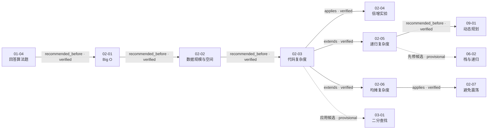

# 第 2 章 面试中的复杂度分析

## 本章解决什么问题

第一章给出了“条件 → 用例 → 基线 → 规模 → 瓶颈 → 优化 → 实现 → 验证”的面试闭环。第二章专门补齐其中的**规模判断与成本分析工具**：

1. Big O 到底表达什么，不表达什么；
2. 怎样把复杂度与题目的数据规模、时间预算和空间预算联系起来；
3. 怎样从普通代码、递归结构和操作序列推导复杂度；
4. 怎样用倍增实验检查实现的增长趋势；
5. 为什么单次最坏为 `O(n)` 的动态数组操作仍可以均摊为 `O(1)`；
6. 为什么不恰当的扩缩容阈值又会破坏这个结论。

七课合起来形成一条完整推理链：

> **先定义规模变量和基本操作，再推导其执行次数；随后用题目规模判断可行性，用空间成本补全结论，并在必要时用实验检查增长趋势。对于数据结构操作，还必须明确分析的是单次、最坏、平均还是均摊成本。**

[视频 02-01 00:38–12:47]；[视频 02-02 04:26–11:26]；[视频 02-04 00:00–14:53]；[视频 02-06 00:00–15:16]

## 七课速览

| 课次                         | 核心问题                 | 一句话结论                                                                           | 实测时长 |
| ---------------------------- | ------------------------ | ------------------------------------------------------------------------------------ | -------: |
| [02-01](../lessons/02-01.md) | Big O 是什么？           | 它描述基本操作数随输入规模增长的量级；常数、低阶项、多变量和输入情形要按各自条件处理 | 19:55.60 |
| [02-02](../lessons/02-02.md) | 复杂度怎样落到真实规模？ | 用时间预算反推可接受的增长阶，同时不能漏掉辅助数组和递归栈的空间成本                 | 11:26.29 |
| [02-03](../lessons/02-03.md) | 怎样从代码看出复杂度？   | 不数循环层数，而是数基本操作随 `n` 实际执行多少次                                    | 19:20.56 |
| [02-04](../lessons/02-04.md) | 怎样实验检查复杂度？     | 让输入翻倍并观察耗时比率，可诊断实现的增长趋势是否符合理论预期                       | 14:53.48 |
| [02-05](../lessons/02-05.md) | 递归复杂度怎样分析？     | 单分支看每次成本乘深度，多分支看调用树节点或每层总工作量                             | 14:46.44 |
| [02-06](../lessons/02-06.md) | 什么是均摊分析？         | 把偶发扩容的 `O(n)` 复制分配到一串插入上，2 倍扩容可使 `push_back` 均摊 `O(1)`       | 15:16.28 |
| [02-07](../lessons/02-07.md) | 怎样避免复杂度震荡？     | 扩缩容阈值不能紧贴同一临界点；延迟缩容为后续操作留出缓冲                             | 11:29.89 |

第二章总实测时长为 **1:47:08.537**。

## 推荐学习顺序与课程关系



其中 `02-04` 是对理论分析的实验检查，`02-05` 和 `02-06` 则从普通代码分成“递归结构”和“操作序列”两条扩展线。虚线关系仍要等待目标课次处理后复核。

## 核心一：Big O 描述增长量级，不是精确秒数

### 1. 先明确规模变量与成本单位

课程用下面的直观表达引入 Big O：

> 设 `n` 表示数据规模，`O(f(n))` 表示运行算法所需要执行的指令数和 `f(n)` 成正比。

[视频 02-01 00:38–01:49]

这句话至少要求回答者先说清两件事：

- `n` 表示数组长度、字符串长度、节点数，还是别的规模；
- 被计数的是比较、交换、访问、递归调用，还是在当前模型中视为常数时间的基本操作。

Big O 通常不负责给出精确秒数。实际时间还会受到语言、编译优化、硬件、缓存、输入分布和实现常数等因素影响。[整理推导，依据 02-01 ev-003–ev-004；02-04 ev-001–ev-002]

### 2. 为什么可以省略常数和低阶项

02-01 用 `10000n` 与 `10n²` 对比说明：小规模时，大常数的线性算法可能更慢；但随着 `n` 持续增大，平方项最终会主导。因此 Big O 关注的是渐进增长，而不是某一个固定输入点的绝对快慢。[视频 02-01 03:29–07:42]

对同一个规模变量，可以做：

```text
O(n log n + n) = O(n log n)
O(n log n + n²) = O(n²)
```

但“只保留最高阶”不能机械跨越彼此独立的变量。例如邻接表图遍历写作 `O(V + E)`，不能在不知道 `V` 与 `E` 关系时删掉其中一项。[视频 02-01 09:57–12:47]

### 3. 课程中的大 O 语境

视频特别区分：

- 严格数学语境中的 Big O 表示渐进上界；
- 课程所说的业界和面试语境，常用 Big O 表示希望给出的最紧、最有信息量的上界。

[视频 02-01 08:04–09:57]

因此面试中只说“归并排序是 `O(n²)`”虽然可构成一个宽松上界，却没有回答通常真正想问的增长阶。按课程语境应给出 `O(n log n)`。[整理推导]

### 4. 输入情形也属于结论的一部分

插入排序和快速排序会随输入排列而出现最好、最坏与平均情况差异。一个完整回答应明确自己讨论的是哪种情况，而不是把三者混成一个无条件结论。[视频 02-01 17:25–19:55]

## 核心二：多变量复杂度不能丢掉比较成本

02-01 的字符串数组题是本章最完整的多变量推导：

- `n`：字符串个数；
- `s`：最长字符串长度。

任务分两步：

1. 对每个字符串内部排序：单个字符串 `O(s log s)`，共 `n` 个，所以是 `O(ns log s)`；
2. 对字符串数组按字典序排序：需要 `O(n log n)` 次字符串比较，每次最坏比较 `O(s)` 个字符，所以是 `O(sn log n)`。

相加得到：

```text
O(ns log s + sn log n)
= O(ns(log s + log n))
```

[视频 02-01 12:47–17:25]

这里的关键不是背最终公式，而是识别“数组排序的一次比较并不是无条件 `O(1)`”。当容器元素本身是字符串、数组或复杂对象时，比较与复制的成本也可能随另一个规模变量增长。

## 核心三：用数据规模把复杂度变成方案约束

02-02 给出录制环境中的经验数量级：

| 目标复杂度   | 1 秒内可处理规模的课程经验值 |
| ------------ | ---------------------------: |
| `O(n²)`      |                     约 `10⁴` |
| `O(n log n)` |                     约 `10⁷` |
| `O(n)`       |                     约 `10⁸` |

[视频 02-02 04:26–08:43]

这些数字的用途是建立数量级直觉：

- 已知 `n`，排除明显不可行的增长阶；
- 已知时间限制，估计算法需要达到的大致复杂度；
- 面试时解释为什么一个正确的暴力法仍可能超时。

它们不是跨机器、跨语言、跨实现的固定定律。视频中的循环实验显示约 `10⁸` 次操作为 0.41 秒、`10⁹` 次为 4.12 秒，但编译设置、具体操作、硬件和计时方式都会改变常数。[视频 02-02 01:01–04:26] 因此正确用法是“数量级筛选 + 理论推导 + 必要时实测”，而不是拿经验表替代分析。[整理推导]

### 空间成本不能漏掉调用栈

02-02 用两个求和实现对比：

- 循环累加只保留常数个变量，辅助空间 `O(1)`；
- 递归累加虽然没有显式创建长度为 `n` 的数组，但递归深度为 `n`，调用栈空间为 `O(n)`。

[视频 02-02 08:43–11:26]

面试中说“没有 `new` 数组，所以空间是 `O(1)`”是不完整的。递归栈、辅助容器和返回路径上需要保留的状态都应进入空间分析。

## 核心四：从代码结构计算执行次数

02-03 的核心不是背复杂度列表，而是校正“看到几层循环就写几次方”的误区。

| 代码结构                   | 课程示例           | 推导                            | 结论         |
| -------------------------- | ------------------ | ------------------------------- | ------------ |
| 固定次数操作               | 交换两个整数       | 操作数与 `n` 无关               | `O(1)`       |
| 线性遍历                   | `reverse`          | 约执行 `n/2` 次交换，常数被省略 | `O(n)`       |
| 递减嵌套循环               | `selectionSort`    | `(n-1)+...+1 = n²/2-n/2`        | `O(n²)`      |
| 内层固定 30 次             | `printInformation` | `30n`，不是 `n·n`               | `O(n)`       |
| 每次丢掉一半               | `binarySearch`     | 迭代约 `log₂n` 次               | `O(log n)`   |
| 每次除以 10                | `intToString`      | 迭代约 `log₁₀n` 次              | `O(log n)`   |
| 外层规模翻倍、内层遍历 `n` | `hello`            | `log n` 轮，每轮 `n` 次         | `O(n log n)` |
| 循环到 `x² ≤ n`            | `isPrime`          | `x` 最大到 `√n`                 | `O(√n)`      |

[视频 02-03 00:00–19:20]

对数底数在大 O 中通常省略，因为换底只引入常数因子：[视频 02-03 11:45–14:46]

```text
logₐN = logₐb · log_bN
```

不过，复杂度正确不等于程序完整正确。视频也指出 `intToString` 对负数和 0、`isPrime` 对 `n ≤ 1` 仍有边界问题。[视频 02-03 11:45–14:46；16:46–19:20]

## 核心五：用倍增实验检查增长趋势

02-04 的实验方法是：保持实现和测试方式基本不变，每次令输入从 `N` 变为 `2N`，观察耗时比率 `T(2N)/T(N)`。

| 理论复杂度   | 输入翻倍后的理论趋势                         | 来源                     |
| ------------ | -------------------------------------------- | ------------------------ |
| `O(1)`       | 约不变                                       | [整理推导]               |
| `O(log N)`   | `1 + log 2 / log N`，随 `N` 增大越来越接近 1 | [视频 02-04 09:58–12:00] |
| `O(N)`       | 约 2 倍                                      | [视频 02-04 04:16–08:22] |
| `O(N log N)` | 略高于 2 倍                                  | [视频 02-04 13:18–14:53] |
| `O(N²)`      | 约 4 倍                                      | [视频 02-04 08:22–09:58] |

课程展示的部分测量值如下：

| 算法            | 输入规模与耗时示例                                        | 观察                                      |
| --------------- | --------------------------------------------------------- | ----------------------------------------- |
| `findMax`       | `2¹¹`: `7e-6s`；`2¹²`: `1.3e-5s`；`2²⁶`: `0.244654s`      | 趋势接近 `O(N)`                           |
| `selectionSort` | `2¹⁰`: `0.001774s`；`2¹¹`: `0.007317s`；`2¹⁵`: `2.00809s` | 翻倍后约 4 倍，符合 `O(N²)`               |
| `binarySearch`  | `2¹⁰`: `2e-6s`；`2²⁸`: `1.2e-5s`                          | 巨大规模变化只带来很小耗时增长            |
| `mergeSort`     | `2¹⁰`: `0.000142s`；`2²⁶`: `13.5022s`                     | 翻倍后略高于 2 倍，符合 `O(N log N)` 趋势 |

[视频 02-04 04:16–14:53]

### 实验能做什么、不能做什么

倍增实验很适合发现：

- 自以为是 `O(n log n)` 的实现是否表现出接近 `O(n²)` 的增长；
- 某个优化是否只改变常数，还是改变了增长阶；
- 理论分析与实际代码是否明显不一致。

但本课记录的实验没有完整给出硬件、编译优化、预热和重复次数，微秒级小样本还容易受计时精度和系统抖动影响。因此这些结果应视为课程内的趋势演示，不是可跨环境复用的基准成绩；实验也不能取代理论证明。[整理推导，依据 02-04 experiments；02-07 ev-006]

## 核心六：递归复杂度要看调用结构

### 1. 单分支递归：每次成本 × 深度

当每次调用只继续进入一个子问题时，课程给出的通用观察是：

```text
总成本 ≈ 单次调用内成本 T × 递归深度 depth
```

[视频 02-05 00:45–03:21]

| 示例         | 单次调用内主要成本 |       深度 |   总复杂度 |
| ------------ | -----------------: | ---------: | ---------: |
| 递归二分查找 |             `O(1)` | `O(log n)` | `O(log n)` |
| 递归求和     |             `O(1)` |     `O(n)` |     `O(n)` |
| 快速幂       |             `O(1)` | `O(log n)` | `O(log n)` |

[视频 02-05 00:45–06:49]

所以“代码里有递归，因此是 `O(n log n)`”没有依据。复杂度来自子问题规模怎样变化、每次产生几个子调用，以及每一层做了多少额外工作。

### 2. 多分支递归：画出递归树

对：

```text
f(n) = f(n-1) + f(n-1)
```

调用树每层节点数翻倍，节点总数为：

```text
2⁰ + 2¹ + ... + 2ⁿ = 2ⁿ⁺¹ - 1 = O(2ⁿ)
```

[视频 02-05 06:49–10:57]

归并排序也是二叉递归，但不能只因为“每个节点分成两个”就写 `O(2ⁿ)`：其树深为 `log n`，每一层合并工作的总量为 `n`，因此是 `O(n log n)`。[视频 02-05 10:57–13:52]

课程最后展示了主定理，但明确把它放在一般面试要求之外作为延伸线索。[视频 02-05 13:52–14:46]

## 核心七：均摊复杂度分析的是操作序列

02-06 用动态数组说明均摊分析：

1. 普通 `push_back` 只写入一个元素，成本 `O(1)`；
2. 数组满时，`resize` 需要申请新数组并复制 `n` 个元素，单次为 `O(n)`；
3. 容量按 2 倍增长时，在下一次扩容前会先经历足够多次便宜插入。

[视频 02-06 00:44–09:59]

若当前容量为 `n`，前 `n` 次添加各耗费 1，第 `n+1` 次添加包含复制 `n` 个元素和写入新元素：

```text
总成本 ≈ n + n + 1 ≈ 2n
平均到 n+1 次操作 ≈ 2
```

因此 `push_back` 的**单次最坏**仍是 `O(n)`，但在这串操作中的**均摊成本**是 `O(1)`。[视频 02-06 10:00–13:08]

这与概率意义上的“平均输入情况”不是一回事：均摊分析针对的是一个操作序列的总成本，不要求假设输入服从某种概率分布。[整理推导]

02-06 的倍增实验也显示，连续插入总数翻倍时，总耗时大致翻倍，与“总成本 `O(n)`、单次均摊 `O(1)`”一致。[视频 02-06 13:08–14:40]

## 核心八：阈值设计不当会产生复杂度震荡

若动态数组在满时扩容一倍，又在元素数降到容量一半时立刻缩容一半，那么临界点附近可能发生：

1. 添加一个元素触发扩容并复制 `n` 个元素；
2. 紧接着删除一个元素又触发缩容并复制 `n` 个元素；
3. 反复交替时，每次操作都支付 `O(n)`。

这就是复杂度震荡。[视频 02-07 02:13–05:10]

课程采用延迟缩容：

```text
触发条件：size == capacity / 4
缩容目标：capacity / 2
```

缩容后数组仍有一半空闲空间，下一次添加不会立即触发扩容，从而在两个高成本操作之间重新建立足够多的便宜操作，恢复 `pop_back` 的均摊 `O(1)`。[视频 02-07 05:10–06:56]

本课还修正了一个与复杂度无关但很典型的逻辑问题：`pop_back` 必须先保存待返回元素，再调整 `size` 或触发 `resize`，否则返回值可能被覆盖。[视频 02-07 00:00–02:13]

## 一套可复用的复杂度回答模板

下面是根据本章整理的面试表达顺序，不是讲师逐字稿：

1. **定义规模**：“令 `n` 表示……；如果还有独立维度，我会分别用 `m`、`V`、`E` 或 `s` 表示。”
2. **选基本操作**：“我以比较/交换/节点访问作为当前成本单位。”
3. **数执行次数**：“这一段执行……次；内层是否随 `n` 变化需要单独判断。”
4. **合并成本**：“顺序部分相加，嵌套部分按实际次数相乘；只对同一规模变量省略低阶项。”
5. **声明情形**：“这是最坏/平均/均摊复杂度；触发该结论的输入或操作序列是……”
6. **补空间**：“额外数组、容器和递归调用栈分别占用……”
7. **核对规模**：“结合 `n` 和时间限制，这个增长阶是否可行。”
8. **必要时实测**：“用倍增输入检查耗时比率，但把实验作为诊断证据，不替代理论推导。”

[整理推导，依据 02-01–02-07]

## 常见错误与修正

| 常见错误                                    | 为什么不对                                       | 修正方法                                   |
| ------------------------------------------- | ------------------------------------------------ | ------------------------------------------ |
| 把 Big O 当精确运行时间                     | 它描述增长量级，实际常数取决于环境和实现         | 分开回答渐进复杂度与实测性能               |
| 机械“只留最高阶”                            | 独立变量之间没有可随意比较的大小关系             | 先写清变量关系，再决定能否化简             |
| 看到两层循环就写 `O(n²)`                    | 内层可能只执行固定 30 次，或各层范围并非都为 `n` | 数基本操作的真实执行次数                   |
| 对数复杂度保留底数纠结不休                  | 换底只差常数倍                                   | 大 O 中通常写 `O(log n)`                   |
| 忽略字符串比较成本                          | 一次比较可能需要扫描 `s` 个字符                  | 把元素内部操作建成独立规模维度             |
| 没创建数组就写空间 `O(1)`                   | 递归调用栈也占空间                               | 同时统计显式辅助空间和调用栈               |
| 看到递归就猜 `O(n log n)`                   | 分支数、深度和每层工作量都可能不同               | 单分支算深度，多分支画递归树               |
| `resize` 是 `O(n)`，所以每次插入都是 `O(n)` | 大部分插入不触发复制                             | 区分单次最坏与操作序列的均摊成本           |
| 扩容和缩容使用同一临界点                    | 交替操作会反复复制                               | 在阈值之间留下缓冲区                       |
| 一次计时结果就证明复杂度                    | 噪声、优化和输入分布都可能误导                   | 多规模、最好多次重复，并与理论推导交叉检查 |
| 复杂度正确就认为代码正确                    | 边界条件和返回值仍可能出错                       | 独立走查 `0`、负数、空输入和临界状态       |

## 本章复习清单

完成第二章后，应能独立回答：

- `O(f(n))` 中的 `n` 和 `f(n)` 分别表示什么；
- 为什么 `10000n` 仍是 `O(n)`，却可能在小规模慢于 `10n²`；
- 什么时候可以删低阶项，什么时候必须保留 `V + E`；
- 为什么字符串数组排序不能把每次字符串比较当成 `O(1)`；
- 如何从数据规模和时间限制反推需要的复杂度；
- 为什么递归求和的辅助空间是 `O(n)`；
- 为什么固定次数内层循环不会增加一个 `n`；
- 输入翻倍时，`O(n)`、`O(n²)`、`O(log n)` 和 `O(n log n)` 的耗时比率分别怎样变化；
- 为什么双分支递归可能是 `O(2ⁿ)`，而归并排序是 `O(n log n)`；
- 为什么动态数组的 `resize` 是 `O(n)`，`push_back` 却可均摊 `O(1)`；
- 如何构造使扩缩容发生复杂度震荡的操作序列；
- 四分之一触发、二分之一缩容为什么能避免震荡。

## 证据与校验边界

- 本章 7 个视频均完成文件哈希、FFprobe、画面抽样、视频理解和本地结构门禁。
- 所有时间戳以视频实测时长为边界；目录标称总时长约 `1:46:58`，实测总时长为 `1:47:08.537`。
- 屏幕中的代码用于还原讲解和复杂度推导，当前没有把课程代码整理成可独立编译的源码工程，因此不能标记为“本地编译验证”。
- 02-04 与 02-07 的原始模型响应曾根据 IDE 路径推断操作系统；规范化证据已把相关字段降为未知，正式笔记不把它作为课程事实。
- 本章实验值按视频画面记录；由于环境信息不完整，只用于解释趋势，不作为通用性能基准。
