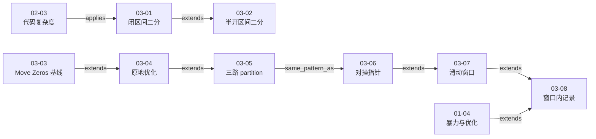

# 第 3 章 数组中的问题其实最常见

## 本章解决什么问题

前两章分别建立了算法面试的回答流程与复杂度分析工具。第三章第一次把这些方法连续用在具体数组题上：

1. 怎样先定义索引、区间和已处理区域，再由定义写出不易出错的代码；
2. 怎样从一个功能可行的暴力或辅助空间方案出发，识别重复工作、未满足的约束并逐步优化；
3. 怎样用 partition、对撞指针和滑动窗口把“尚未处理的候选区域”不断缩小；
4. 怎样在窗口中维护和、频次等状态，使重复计算变成常数时间更新；
5. 怎样用初始化、状态保持、终止条件和返回契约解释算法为什么正确。

八课形成的共同主线是：

> **先把变量代表的集合或区间说清楚，再让初始化、循环条件、分支更新和终止后的答案服从同一套语义；优化的实质通常是复用已有状态，避免重新扫描已经知道的信息。**

[视频 03-01 01:41–13:40]；[视频 03-04 00:00–09:20]；[视频 03-05 09:05–19:23]；[视频 03-07 05:39–14:09]；[视频 03-08 02:34–09:46]

## 八课速览

| 课次                         | 核心问题                         | 一句话结论                                                                  | 实测时长 |
| ---------------------------- | -------------------------------- | --------------------------------------------------------------------------- | -------: |
| [03-01](../lessons/03-01.md) | 闭区间二分查找怎样写对？         | 定义候选区间为 `[l,r]`，由此推导 `r=n-1`、`l<=r`、`mid±1`                   | 15:30.52 |
| [03-02](../lessons/03-02.md) | 改成半开区间后代码怎样同步变化？ | 定义 `[l,r)` 后，初始化、循环与右边界更新必须一并改成 `r=n`、`l<r`、`r=mid` | 12:06.48 |
| [03-03](../lessons/03-03.md) | 怎样完成第一个 LeetCode 数组题？ | 先用辅助数组稳定收集非零元素，得到功能正确但不满足原地约束的线性基线        | 13:27.52 |
| [03-04](../lessons/03-04.md) | 简单题还能怎样继续优化？         | 用 `[0,k)` 维护非零前缀，把 Move Zeros 优化为原地、稳定的 `O(n)` 解法       | 15:30.48 |
| [03-05](../lessons/03-05.md) | 三路 partition 怎样一次分类？    | 维护 0 区、1 区、未知区和 2 区；每个分支都缩小未知区且不破坏已分类区域      | 22:26.64 |
| [03-06](../lessons/03-06.md) | 有序 Two Sum 怎样用对撞指针？    | 和偏小排除最左值，和偏大排除最右值，把 `O(n²)` 优化为 `O(n)`                | 19:44.28 |
| [03-07](../lessons/03-07.md) | 怎样维护连续子数组的最小长度？   | 在 `nums[i]>0`、`s>0` 前提下按窗口和扩缩，左右指针各至多走一遍              | 14:09.92 |
| [03-08](../lessons/03-08.md) | 滑动窗口怎样记录重复字符？       | 用 `freq[256]` 维护窗口成员状态，使合法性判断和窗口更新都为常数时间         | 15:24.68 |

第三章总实测时长为 **2:08:20.520**。

## 推荐学习顺序与课程关系



这不是八个彼此孤立的模板。03-01、03-02 先建立“变量定义驱动实现”的原则；03-03 至 03-05 把它迁移到数组分区；03-06 把两端候选区间向内收缩；03-07、03-08 再把两个索引之间的连续区域变成可扩张、可收缩且可记录状态的窗口。

图中只展示两端课次均已处理、经章节级双侧复核后可以确认的关系；它们表示课程承接、应用或模式相似，不等于每条都是硬性先修。指向第四、第五章的候选关系已在后续对应章节完成双侧复核；本图仍聚焦第三章主线，跨章结果见第四、第五章综述和统一关系图。

## 核心一：变量定义不是注释，而是算法契约

### 闭区间与半开区间都可以正确

03-01 与 03-02 使用同一个二分查找问题，故意选择两套区间定义：

| 决策                 | 闭区间版本  | 左闭右开版本 |
| -------------------- | ----------- | ------------ |
| 候选集合             | `[l,r]`     | `[l,r)`      |
| 初始右边界           | `r=n-1`     | `r=n`        |
| 非空条件             | `l<=r`      | `l<r`        |
| `arr[mid] < target`  | `l=mid+1`   | `l=mid+1`    |
| `arr[mid] > target`  | `r=mid-1`   | `r=mid`      |
| 空区间               | `l>r`       | `l==r`       |
| 视频初始中点写法     | `(l+r)/2`   | `(l+r)/2`    |
| 03-02 补充的安全写法 | `l+(r-l)/2` | `l+(r-l)/2`  |

[视频 03-01 05:00–13:40]；[视频 03-02 00:00–08:19] 安全写法由 03-02 在说明整数溢出风险后引入；它与区间开闭无关，因此表中把它同时列为两种约定都可采用的改进。[视频 03-02 06:02–08:19] [整理推导]

两种写法没有谁天然更正确。真正危险的是混用两套语义，例如把 `r` 初始化为 `n`，却仍使用 `l<=r`；或者采用 `[l,r)`，却在排除右半区间时写 `r=mid-1`。此时某些候选会被漏掉，或者代码会访问无效索引。

### 循环不变量把局部代码连成一个整体

闭区间版本的不变量可写成：

```text
若 target 存在且尚未返回，则 target 位于 [l,r]。
```

半开区间版本只把集合表示改为 `[l,r)`。检查一个循环时，可依次问：

1. **初始化**：初始区间是否覆盖所有合法候选？
2. **保持**：每个分支是否只排除已经证明不可能的元素？
3. **进展**：每轮是否严格缩小候选区间？
4. **终止与后置条件**：退出时区间为空是否足以推出“未找到”？

课程用代码、图示和小区间例子建立这一逻辑。[视频 03-01 05:00–13:40]；[视频 03-02 01:00–05:23] 上面的四阶段检查是对课程讲解的结构化整理，不应误写成讲师逐字给出的形式化证明。

### 大规模断言不是正确性证明

两课都展示了在百万元素有序数组上逐个查找的源码与 `assert`，画面分别给出约 `0.39443s` 和 `0.389827s`。[视频 03-01 13:40–14:59]；[视频 03-02 05:23–06:02]

视频显示课程当时的源码、无断言失败输出和一次耗时；若该构建启用了 `assert`，这些检查覆盖了生成器产生的一百万个已存在目标。构建是否定义 `NDEBUG`、编译器、优化、硬件和重复次数均未记录，所以它们既不能穷尽输入，也不能作为可复现性能基准。正确性仍应来自区间语义与分支排除论证。[整理推导]

## 核心二：从功能基线到原地数组压缩

### Move Zeros 的问题契约

LeetCode 283 要把所有零移到数组末尾，同时保持非零元素的相对顺序。例如：

```text
[0,1,0,3,12] → [1,3,12,0,0]
```

[视频 03-03 02:13–02:58]

“保持相对顺序”意味着不能只把任意零与末尾元素交换；算法还要保持稳定性。

### 三步解法演进

| 方案            | 状态与操作                                             | 时间   | 辅助空间 | 特点                             |
| --------------- | ------------------------------------------------------ | ------ | -------- | -------------------------------- |
| 辅助数组基线    | 收集所有非零元素，再写回并补零                         | `O(n)` | `O(n)`   | 视频当时显示 21/21 与 Accepted   |
| 原地覆写 + 补零 | `[0,k)` 保存已扫描的非零元素，扫描后把 `[k,n)` 写成零  | `O(n)` | `O(1)`   | 原地，但有第二段补零循环         |
| 原地交换        | 遇到非零值就与 `nums[k]` 交换，再令 `k++`              | `O(n)` | `O(1)`   | 一次主扫描，仍保持非零相对顺序   |
| 跳过自交换      | 当 `i==k` 时只推进 `k`，不执行 `swap(nums[k],nums[i])` | `O(n)` | `O(1)`   | 避免无零或长非零前缀中的无效交换 |

[视频 03-03 05:35–13:27]；[视频 03-04 00:00–09:20]

视频中的 Accepted 是当时的 OJ 测试结果；本项目没有重新提交，而且该辅助数组版本并不满足题目希望原地完成的空间目标。

三种原地版本共同保持：

```text
[0,k) = 已处理且按原相对顺序排列的非零元素
[i,n) = 尚未检查
```

但 `[k,i)` 的语义不能混用：

- 覆写补零版不保证 `[k,i)` 的当前值；其中可能保留旧值，之后会被新非零元素覆写或在末尾统一补零；
- 两个交换版在每轮开始时额外保证 `[k,i)` 全为零；等价地，处理完当前 `i` 后可把已知零区写作 `[k,i]`。

[视频 03-04 00:00–09:20] [整理推导]

当 `nums[i] != 0` 时，把它放到位置 `k`，随后增加 `k`。因为输入按 `i` 从左到右读取，非零元素被放入前缀的顺序与原顺序一致。

### 优化不等于只改复杂度记号

03-03 的辅助数组方案已经是 `O(n)` 时间，因此 03-04 的价值不是把时间从线性降得更低，而是：

- 把辅助空间从 `O(n)` 降为 `O(1)`；
- 减少第二次补零或无意义自交换；
- 让状态定义更接近后续 partition 模式。

这说明面试中的优化可能针对时间、空间、写操作次数或特定约束，而不只是追求一个更小的大 O。[整理推导]

## 核心三：partition 的本质是维护已分类区域

### Sort Colors 的三层方案

LeetCode 75 的数组只包含 `0`、`1`、`2`。课程依次给出：

1. 通用排序：时间 `O(n log n)`，但没有利用只有三种取值的条件；
2. 计数排序：统计三种频次再写回，时间 `O(n)`，辅助空间 `O(k)`；本题 `k=3`，可视为 `O(1)`；
3. 三路 partition：一次主扫描、原地维护三个已分类区域，时间 `O(n)`、辅助空间 `O(1)`。

[视频 03-05 00:27–10:13]

课程没有指定第一种通用排序的具体实现，因此不能无条件给它附加 `O(1)` 空间结论。

### 四段状态

三路 partition 维护：

```text
[0,zero]       全部为 0
[zero+1,i)     全部为 1
[i,two)        尚未分类
[two,n)        全部为 2
```

[视频 03-05 10:13–13:36]

每次只查看未知区的第一个元素 `nums[i]`：

| `nums[i]` | 操作                           | 为什么这样更新                                             |
| --------- | ------------------------------ | ---------------------------------------------------------- |
| `0`       | `swap(nums[++zero],nums[i++])` | 把 0 扩入左区；若不是自交换，换回的是已知 1，可随 `i` 前进 |
| `1`       | `i++`                          | 当前元素已属于中间区                                       |
| `2`       | `swap(nums[--two],nums[i])`    | 把 2 扩入右区；右侧换回来的值尚未分类，所以 `i` 不能前进   |

[视频 03-05 13:36–19:23]

`2` 分支漏写或多写一个 `i++` 是这段代码最典型的错误。判断方法不是背模板，而是问：“交换到 `i` 的新元素属于哪个已知区域？”若答案是“未知”，就必须在下一轮继续检查。

### 从 Move Zeros 到三路 partition

以 03-04 的交换版为例，`[0,k)` 是稳定非零前缀，`[k,i)` 是已知零区，`[i,n)` 尚未处理；覆写补零版只共享 `[0,k)` 的稳定前缀语义。Sort Colors 再把这一边界划分方法扩展成三类，并显式维护右侧已分类区域。

因此两题的共同模式是：

> 用边界索引描述已完成区域，让每轮把一个未知元素归入正确区域，并保证未知区严格缩小。

[整理推导，依据 03-04 ev-001–ev-005 与 03-05 ev-005–ev-007]

## 核心四：对撞指针依靠有序性安全排除候选

### Two Sum II 的解法阶梯

LeetCode 167 给定有序数组，要求返回两数和等于 `target` 的 1-based 索引。课程先澄清是否保证有解、是否唯一、是否允许重复使用同一元素，再给出三层方案：[视频 03-06 00:00–02:59]

| 方案        | 做法                                              | 时间         | 辅助空间 |
| ----------- | ------------------------------------------------- | ------------ | -------- |
| 暴力枚举    | 检查所有 `i<j`                                    | `O(n²)`      | `O(1)`   |
| 遍历 + 二分 | 对每个 `numbers[i]`，在右侧查 `target-numbers[i]` | `O(n log n)` | `O(1)`   |
| 对撞指针    | `l=0,r=n-1`，按两端和与 `target` 的关系向内移动   | `O(n)`       | `O(1)`   |

[视频 03-06 03:00–12:00]

### 为什么只移动一端不会漏解

设数组非递减：

- 若 `numbers[l]+numbers[r] < target`，则对任何 `l<k≤r` 都有 `numbers[l]+numbers[k]≤numbers[l]+numbers[r]<target`；当前 `l` 可安全排除；
- 若 `numbers[l]+numbers[r] > target`，则对任何 `l≤k<r` 都有 `numbers[k]+numbers[r]≥numbers[l]+numbers[r]>target`；当前 `r` 可安全排除。

[视频 03-06 06:59–09:36]

这段论证依赖数组有序。若数组无序，同样的指针移动没有逻辑依据；后续无序 Two Sum 将与查找表方案形成对照，目前该跨章关系仍待第四章复核。

### 返回契约也是算法的一部分

内部指针使用 0-based 索引，题目要求 1-based 返回值，因此命中后返回 `l+1` 与 `r+1`。视频代码还断言数组至少有两个元素，并在未找到时抛出异常。[视频 03-06 09:37–13:47]

复杂度和指针移动都正确，却忘记索引制转换，仍然会得到错误答案。

## 核心五：滑动窗口把连续区间变成可维护状态

### Minimum Size Subarray Sum

LeetCode 209 要找和至少为 `s` 的最短连续子数组；无解返回 0。[视频 03-07 00:43–03:59]

课程先给出：

- 枚举所有连续子数组并重新求和：`O(n³)`；
- 复用同一起点的累计和：可优化到 `O(n²)`；
- 使用滑动窗口：左右边界各至多前进 `n` 次，因此为 `O(n)` 时间、`O(1)` 辅助空间。

[视频 03-07 03:59–14:09]

窗口定义为闭区间 `nums[l...r]`，初始 `l=0,r=-1` 表示空窗口：

```text
若 sum < s 且右侧仍有元素：扩张 r，并把新元素加入 sum
否则：从 sum 中移除 nums[l]，再推进 l
每轮若 sum >= s：用 r-l+1 更新最短长度
```

这里必须补出适用前提：本章按 `nums[i]>0` 且 `s>0` 解释屏幕算法。正数使扩张严格增大窗口和、收缩严格减小窗口和；`s>0` 又保证初始空窗口的 `sum=0` 不会误入收缩分支。因此“和不足就扩张、已经满足就收缩”才有单调性依据。当前结构化题面和抽帧只明确显示“整型数组”和 `s`，没有把这两个正数条件单列出来，所以这是算法成立条件的编辑性补全，不是课程逐字约束。[视频 03-07 00:43–02:06] [视频 03-07 05:39–13:14] [整理推导] 若允许负数，这一移动规则通常不再成立，不能直接套模板。

### Longest Substring Without Repeating Characters

03-08 延续同一窗口框架，但判定条件从“窗口和”变成“是否含重复字符”。课程用固定大小的 `freq[256]` 记录当前窗口中每个 ASCII 字符的频次：[视频 03-08 00:00–05:54]

```text
窗口 s[l...r] 始终没有重复字符
freq[c] 精确等于字符 c 在窗口中的出现次数
```

- 若 `s[r+1]` 尚未出现，右扩并增加其频次；
- 若即将加入的字符已出现，左缩并减少移出字符的频次；
- 每轮用 `r-l+1` 更新最大长度。

[视频 03-08 02:34–09:46]

与 03-07 相比，新增的不是另一套指针口诀，而是**窗口状态表**：若朴素实现每次重新扫描窗口查重，`freq` 可以把这项判断改成增量更新。这是根据屏幕状态模型作出的优化解释，不表示视频先完整讲授了一个重复扫描基线。[整理推导]

### 复杂度及其证据边界

屏幕代码中的 `l`、`r` 都只向右移动，每个字符至多经右边界进入一次、经左边界离开一次，据此可推出总时间 `O(n)`。不过 03-08 的对应视频区间展示的是窗口设计与代码，没有单独的复杂度讲解片段；因此本章把 `O(n)` 及其指针计数论证标为整理推导，而不冒充课程直述。[视频 03-08 02:34–09:46] [整理推导]

`freq[256]` 的大小不随字符串长度 `n` 增长，所以在课程采用的固定 ASCII 字符集模型下，辅助空间可记为 `O(1)`；更一般地应写成 `O(C)`，其中 `C` 是字符集或状态表大小。这个复杂度结论同样是依据屏幕数据结构作出的整理推导。若题目允许任意 Unicode 字符并使用动态映射，空间应按不同字符数量或字符集规模重新分析。[视频 03-08 02:34–09:46] [整理推导]

视频代码直接用 `char` 值索引数组；在某些 C++ 实现中，非 ASCII 高位字节对应的 `char` 可能为负。课程已把输入范围澄清为 ASCII，正式实现若扩大字符范围，应转换为 `unsigned char` 或改用合适的映射结构。[补充说明]

## 一套可复用的数组题决策框架

下面是根据本章整理的选择顺序，不是讲师逐字稿：

| 题目线索                              | 优先检查的方法            | 必须说明的成立条件                                 |
| ------------------------------------- | ------------------------- | -------------------------------------------------- |
| 数组有序、查找单个目标                | 二分查找                  | 候选区间定义与比较顺序一致                         |
| 数组有序、寻找满足关系的两端元素      | 对撞指针                  | 单调性足以安全排除一端                             |
| 原地删除、移动或稳定压缩              | 快慢指针 / 原地 partition | `[0,k)` 等已处理区域的语义                         |
| 取值种类很少                          | 计数或多路 partition      | 值域大小、是否允许额外空间、是否要求单次扫描       |
| 连续子数组/子串，条件对扩缩具有单调性 | 滑动窗口                  | 为什么该条件决定扩张或收缩                         |
| 窗口合法性需要成员、次数或计数信息    | 窗口 + 频次数组 / 查找表  | 状态与窗口同步更新；空间复杂度取决于字符集或键空间 |

通用回答流程可以写成：

1. **澄清题意**：连续还是任意子序列，是否有序，是否允许额外空间，是否要求稳定，返回索引采用哪种编号；
2. **给出基线**：先得到正确、易解释的方案与复杂度；
3. **识别重复工作**：是否重复求和、查重、移动、排序或扫描已经处理的区域；
4. **定义状态**：明确每个指针、区间、频次和答案变量表示什么；
5. **写出转移**：逐分支说明哪些区域改变、哪些性质保持；
6. **证明进展**：每轮至少有一个边界移动，未知区域严格缩小；
7. **分析复杂度**：按指针总移动次数和辅助状态规模计算，而不是只数循环层数；
8. **走查边界**：空输入、单元素、全零/无零、无解、重复值、索引制和字符集。

## 常见错误与修正

| 常见错误                        | 问题所在                           | 修正方法                                  |
| ------------------------------- | ---------------------------------- | ----------------------------------------- |
| 背二分模板却说不清 `[l,r]`      | 初始化、循环和更新可能来自不同模板 | 先写区间语义，再逐项推导                  |
| 用 `(l+r)/2` 忽略整数溢出       | 大边界相加可能越界                 | 使用 `l+(r-l)/2`                          |
| 把大量断言通过当成证明          | 测试只能覆盖有限输入               | 用不变量论证正确性，以测试补充检查        |
| Move Zeros 只顾“零到末尾”       | 可能破坏非零元素相对顺序           | 在状态中明确稳定前缀 `[0,k)`              |
| 完全无零时仍执行每次自交换      | 结果正确但产生无意义写操作         | 当 `i==k` 时只推进边界                    |
| Sort Colors 遇到 `2` 后推进 `i` | 从右边换回的元素尚未分类           | 保持 `i`，下一轮重新检查                  |
| 无序数组照搬对撞指针            | “排除一端”的单调性证明失效         | 先确认有序性；否则考虑查找表等方案        |
| 把双指针代码误判为 `O(n²)`      | 两个指针通常不是每轮从头扫描       | 统计每个指针整个算法中的总移动次数        |
| 负数数组直接套最小和滑动窗口    | 窗口和对扩张/收缩不再单调          | 重新选择前缀和、单调结构或其他方法        |
| `freq` 与窗口边界更新不同步     | 记录状态不再代表当前窗口           | 扩张时加、收缩时减，并把更新顺序写清      |
| 固定表无条件写成 `O(1)` 空间    | 字符集或键空间可能随输入增长       | 声明 ASCII 等固定域假设；动态域按键数分析 |
| 只报内部 0-based 位置           | 题目可能要求 1-based 索引          | 把返回契约纳入最后的后置条件              |

## 本章复习清单

完成第三章后，应能独立回答：

- `[l,r]` 与 `[l,r)` 的初始化、非空条件和右边界更新分别是什么；
- 为什么二分查找的 `mid` 要从新候选区间排除；
- 为什么 `l+(r-l)/2` 比 `(l+r)/2` 更稳健；
- Move Zeros 的辅助数组、覆写补零、交换和跳过自交换四层方案各解决什么问题；
- 怎样用 `[0,k)` 说明原地压缩仍保持非零元素相对顺序；
- Sort Colors 的四段区域分别是什么；
- 为什么处理 `2` 的分支不能让 `i` 前进；
- 为什么 Two Sum II 中和偏小时可以排除左端，和偏大时可以排除右端；
- 为什么对撞指针的结论依赖数组有序；
- 为什么两个指针仍可是 `O(n)`，而不是机械写成 `O(n²)`；
- Minimum Size Subarray Sum 的滑动规则依赖什么单调条件；
- `l=0,r=-1` 为什么能表示空窗口；
- `freq[256]` 怎样与窗口同步维护；
- `freq[256]` 的 `O(1)` 空间结论依赖什么字符集假设；
- 测试、OJ Accepted、复杂度实验和正确性证明之间有什么区别。

## 证据与校验边界

- 本章 8 个视频均完成 SHA-256、FFprobe、压缩副本、12 帧联系表和关键代码画面的人工复核；无损坏、黑屏、裁切或拉伸异常。
- 8 次到达 ZenMux 服务端的理解请求均一次成功，使用 `google/gemini-3.6-flash` 与 `https://zenmux.dev/api/v1`；没有因解析失败而重试。
- v1.4 门禁会执行完整 JSON Schema、课次/素材/时长匹配、证据引用、解法—代码—状态模型引用和人工 QA 状态检查；未通过人工代码/OCR QA 的结果不能登记为可综合。
- 视频中的 C++ 代码均保留为 `shown_in_video`、`verification: not_run`。本项目没有重新编译或执行这些屏幕代码，各单课中的建议测试矩阵也不算已运行验证，因此不标记为“本地编译验证”。
- 03-01、03-02 的百万元素断言和 03-03 的 LeetCode Accepted 属于课程演示证据；正式笔记不把有限测试或 OJ 结果扩大为形式化正确性证明。
- 通用排序的空间成本、03-07 正数前提与窗口和单调性的关系、03-08 的线性时间推导、ASCII 之外的字符索引风险等内容均在笔记中标为整理推导或补充说明，不冒充讲师原话。
