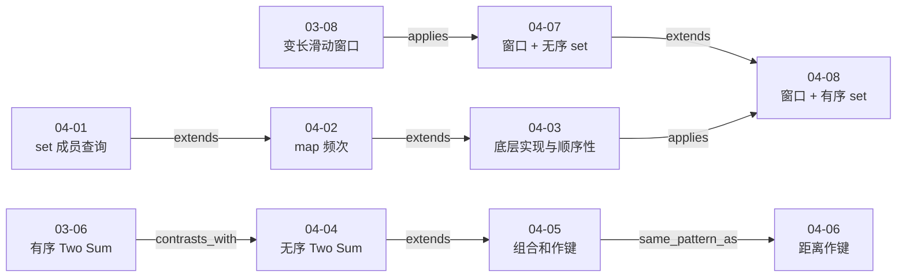

# 第 4 章 查找表相关问题

## 本章解决什么问题

第三章用数组、双指针和滑动窗口建立了“定义状态—缩小候选范围”的方法。第四章进一步回答：当算法需要反复查询已经见过的信息时，应该记录什么、怎样选择键和值，以及是否需要数据的顺序性。

本章八课形成三条相互连接的主线：

1. `04-01` 至 `04-03` 先区分 `set` 与 `map` 的存储语义，再比较平衡二叉搜索树与哈希表实现的复杂度和顺序能力；
2. `04-04` 至 `04-06` 从 Two Sum 的补数查询出发，把查找表的键扩展为“两数之和”和“距离平方”，把值扩展为索引或频次；
3. `04-07`、`04-08` 把查找表放进滑动窗口，用窗口限制索引差，再分别用无序集合做精确成员查询、用有序集合做数值范围查询。

统一主线可以概括为：

> **先写清查询谓词，再决定查找表的键和值；如果查询只关心精确相等，可使用哈希结构，如果还要找前驱、后继或范围内候选，就必须保留顺序性。查找表中的内容也不是静态副本，而是算法状态的一部分，插入、查询和删除顺序必须与题目约束一致。**

[视频 04-01 00:00–03:48]；[视频 04-03 00:00–08:45]；[视频 04-04 04:02–12:37]；[视频 04-05 03:00–11:03]；[视频 04-06 01:33–12:11]；[视频 04-07 00:53–10:26]；[视频 04-08 01:04–06:48]

## 八课速览

| 课次                         | 核心问题                       | 一句话结论                                                            |  实测时长 |
| ---------------------------- | ------------------------------ | --------------------------------------------------------------------- | --------: |
| [04-01](../lessons/04-01.md) | 唯一交集怎样用集合表示？       | 一个集合记录成员，另一个集合去重答案；题目不承诺输出顺序              | 11:15.283 |
| [04-02](../lessons/04-02.md) | 重复交集怎样保存次数？         | `map[x]` 保存剩余频次，每次命中消费一次，结果次数取两边频次最小值     | 13:05.960 |
| [04-03](../lessons/04-03.md) | 有序与无序容器怎样选择？       | 哈希结构按课程口径提供平均常数级精确查找；树结构保留顺序查询能力      | 19:00.120 |
| [04-04](../lessons/04-04.md) | 无序 Two Sum 怎样返回原索引？  | 维护 `value→index` 的历史前缀表，必须先查补数、未命中再插入当前值     | 16:57.000 |
| [04-05](../lessons/04-05.md) | 四数组组合怎样降到二次复杂度？ | 把 `C+D` 的和作为键、出现次数作为值，再查询 `-(A+B)` 并累加频次       | 13:25.200 |
| [04-06](../lessons/04-06.md) | 等距三元组怎样设计键？         | 固定枢纽，以距离平方为键统计频次；同距 `m` 个点贡献 `m(m-1)` 个有序对 | 14:45.600 |
| [04-07](../lessons/04-07.md) | 索引差受限的重复值怎样查询？   | 查询前让集合只保存最近 `k` 个候选，先查、再插入、最后淘汰过期值       | 11:20.484 |
| [04-08](../lessons/04-08.md) | 索引差与数值差同时受限怎么办？ | 滑动窗口限制索引，有序集合和 `lower_bound` 完成闭区间查询             | 10:54.280 |

第四章总实测时长为 **1:50:43.927**。

## 推荐学习顺序与课程关系



图中三条链分别训练“容器语义与实现”“补数与键值建模”“窗口内查询”。它们最终在 `04-08` 汇合：这道题既要理解滑动窗口状态，也要理解树结构提供的顺序性。

关系边在章节级复核时要求两端都具备视频证据。只凭课程目录推测、或仅处理到一端的未来章节候选，不在本章图中升级为已验证关系。

## 核心一：`set` 与 `map` 的第一差别是“存什么”

### `set` 表达成员关系

LeetCode 349 只要求返回两个数组共同拥有的**唯一值**。课程使用：

```text
record    = nums1 中有哪些值
resultSet = 已确认属于交集的唯一值
```

扫描 `nums2` 时，若 `record.find(x) != record.end()`，就把 `x` 插入 `resultSet`。第二个集合使同一公共值即使在 `nums2` 中重复出现，也只进入答案一次。[视频 04-01 03:48–09:18]

最终版本用两个区间构造函数化简机械循环：

```cpp
set<int> record(nums1.begin(), nums1.end());
return vector<int>(resultSet.begin(), resultSet.end());
```

[视频 04-01 09:18–11:15.283]

题目明确允许任意答案顺序。`std::set` 按比较器顺序迭代是容器契约，但这是实现选择带来的输出行为，不应反向升级为题目的返回契约。[视频 04-01 03:48–05:22] [整理推导]

### `map` 表达键值关系

LeetCode 350 要保留重复次数。对每个值 `x`，结果中的次数应为：

```text
min(count_nums1[x], count_nums2[x])
```

课程先统计 `nums1`：

```cpp
record[nums1[i]]++;
```

再扫描 `nums2`；只有 `record[x] > 0` 时才输出 `x` 并执行 `record[x]--`。因此 `record[x]` 从“总频次”转变为“尚未被答案消费的配额”。[视频 04-02 00:00–03:47]

### “值为 0”不等于“键不存在”

04-02 还通过课程内运行实验展示了 C++ `std::map::operator[]` 的两个重要行为：

1. 对不存在的键读取 `myMap[42]`，会插入键 `42`，并把 `int` 值默认初始化为 `0`；
2. 把某个键的值减到 `0`，该键仍可被 `find` 找到；只有 `erase(42)` 才会删除键。

[视频 04-02 03:47–11:35]

因此“键集合”和“映射值”是两层状态，不能只看值是否为零。课程随后用显式 `find`、`insert`、`erase` 重写题解，使状态变化更清楚，也降低对特定语言默认行为的依赖。[视频 04-02 11:35–11:56]

视频中的控制台输出属于课程演示。本项目没有重新编译或复现实验，不能把它写成本机运行结果。

## 核心二：底层实现决定复杂度，也决定可用的查询

### 课程给出的复杂度模型

04-03 对比了数组、顺序数组、平衡二叉搜索树和哈希表，并采用以下课程口径：

| 结构                       | 插入       | 精确查找   | 删除       | 是否保留键的顺序能力 |
| -------------------------- | ---------- | ---------- | ---------- | -------------------- |
| 普通数组                   | `O(1)`     | `O(n)`     | `O(n)`     | 否                   |
| 有序数组                   | `O(n)`     | `O(log n)` | `O(n)`     | 是                   |
| 平衡二叉搜索树             | `O(log n)` | `O(log n)` | `O(log n)` | 是                   |
| 哈希表（课程平均成本口径） | `O(1)`     | `O(1)`     | `O(1)`     | 否                   |

[视频 04-03 00:00–06:15]

课程把 C++ 的 `set/map` 对应到平衡二叉搜索树口径，把 `unordered_set/unordered_map` 对应到哈希表口径。于是 349 和 350 只需把容器替换成 `unordered_*`，状态设计不变，课程分析中的时间就从 `O(n log n)` 降为 `O(n)`。[视频 04-03 07:37–12:06]

这里必须保留证据边界：视频没有展开哈希碰撞、扩容、负载因子或最坏情况。因此笔记可以忠实记录课程的 `O(1)`，但不能把它说成无条件的最坏情况保证。

### 顺序性是一组算法能力

课程这里讨论的是有序查找结构的一般能力，而不只是“遍历看起来整齐”。它列出的顺序性包括：

- 最大值、最小值；
- 前驱、后继；
- `floor`、`ceil`；
- `rank`、`select`；
- `lower_bound` 等范围候选查询。

[视频 04-03 06:16–08:45]

需要区分抽象能力与 C++ 标准接口：普通 `std::set` 直接提供有序迭代、`lower_bound` 等操作，但标准接口不直接提供按秩查询的 `rank` / `select`；若需要后两者，通常要使用带子树规模信息的顺序统计树等扩展结构。课程幻灯片列举的是“数据顺序性可以支持哪些问题”，不能据此声称 `std::set` 原生拥有全部接口。[视频 04-03 06:16–07:36] [补充说明]

04-08 正是这一能力的直接应用：题目不是查询一个确定的值，而是查询窗口中是否存在任意 `x` 落在 `[v-t,v+t]`。哈希集合的精确 `find` 不足以完成这个谓词；有序 `set` 可以先找第一个 `x >= v-t`，再检查 `x <= v+t`。[视频 04-08 01:04–03:59]

## 核心三：Two Sum 的关键是“历史前缀 + 先查后插”

### 四层方案

04-04 对无序 Two Sum 给出或讨论了四个阶段：

| 方案           | 做法                                         | 课程时间口径 | 主要限制                       |
| -------------- | -------------------------------------------- | ------------ | ------------------------------ |
| 暴力           | 枚举所有数对                                 | `O(n²)`      | 没有复用已见信息               |
| 排序 + 双指针  | 排序后从两端对撞                             | `O(n log n)` | 直接排序会丢失原始索引         |
| 全量单索引 Map | 先写入全部 `value→index`，再查询补数         | `O(n)`       | 重复值会覆盖旧索引             |
| 动态历史 Map   | 处理当前值时先查历史前缀，未命中再插入当前值 | `O(n)`       | 依赖课程的哈希平均常数成本模型 |

[视频 04-04 02:11–12:37]

表中的“全量单索引 Map”特指课程展示的朴素预存设计：同值后写入的索引会覆盖旧索引，使单张 `value→index` 表不能独立表达两个相同值的位置。它不是对所有“两遍 Map”方案的普遍否定；若继续扫描原数组并显式检查索引不等，可以另行设计可行版本，但那不是视频展示的三行预存片段。[视频 04-04 05:23–07:28] [补充说明]

最终状态定义为：

```text
处理下标 i 之前：
record 只保存 [0, i-1] 中已遍历值到原始索引的映射
```

每轮：

```text
complement = target - nums[i]
if complement in record:
    return [i, record[complement]]
record[nums[i]] = i
```

[视频 04-04 07:28–11:43]

“先查后插”不是代码风格偏好，而是正确性条件：

- 当前 `nums[i]` 尚未进入表，因此不能与自己匹配；
- 如果答案是两个相等值，第一个已经在历史前缀中，第二个到来时即可匹配；
- 每次返回的历史索引都严格小于 `i`，故两个位置不同。

[整理推导，依据视频 04-04 07:28–11:43]

### 与第三章有序 Two Sum 的对照

03-06 的输入已经有序，端点和的大小可以安全淘汰一端，因此使用对撞指针并保持 `O(1)` 额外空间。04-04 的输入无序，端点不具备同样的单调语义；查找表用 `O(n)` 空间保存历史信息，换取一次扫描中的补数查询。[视频 03-06 06:59–12:00]；[视频 04-04 01:20–12:37]

两种方案不是竞争模板，而是由输入顺序性和返回原索引要求共同决定的不同选择。

## 核心四：键和值可以是“加工后的信息”

### 4Sum II：把四变量等式拆成两半

LeetCode 454 给出四个长度均为 `N`、`N<=500` 的数组。课程按数据规模推进：

1. 四重枚举：`O(N⁴)`；
2. 只把 `D` 放入表：仍需枚举 `A、B、C`，为 `O(N³)`；
3. 把所有 `C+D` 的和及频次放入表：建表 `O(N²)`，查询 `A+B` 也为 `O(N²)`。

[视频 04-05 00:00–04:58]

核心状态是：

```text
record[s] = 满足 C[k] + D[l] == s 的索引对 (k,l) 数量
```

随后对每个 `(i,j)` 查询：

```text
complement = 0 - A[i] - B[j]
res += record[complement]
```

[视频 04-05 04:58–09:05]

必须保存频次而不是只保存存在性。若同一个 `C+D` 和由多组索引产生，每一组都对应不同的四元组答案；使用 `set` 会把这些组合压成一个布尔事实，导致少计。

课程画面写出 `500⁴ = 625,0000,0000`，即 `62,500,000,000`，约 **625 亿**。模型结构化摘要一度把它误换算为 6250 亿，章节人工 QA 已按画面公式校正。[视频 04-05 01:17–01:58] [补充说明]

### Number of Boomerangs：把几何关系变成可哈希的整数键

LeetCode 447 固定一个枢纽点 `i`，统计其他点到 `i` 的距离平方：

```text
record[d²] = 到 i 的距离平方等于 d² 的点数
```

若某个距离桶中有 `m` 个点，题目三元组 `(i,j,k)` 中 `j`、`k` 有顺序，因此贡献：

```text
m * (m - 1)
```

而不是无序选两个点的 `m(m-1)/2`。[视频 04-06 01:33–11:17]

视频代码在累加前还显示：

```cpp
if (iter->second >= 2)
```

人工 QA 发现 normalized 的模型代码转录漏掉了这一行，因此代码对象已降为 `partial`。对实际存在的频次键，省略条件在数值上等价——`m=1` 时也只会增加 0——但等价改写不等于精确转录；正式单课笔记按关键画面保留该条件，代码仍为本地 `not_run`。[视频 04-06 05:17–11:17] [人工 QA 校正] [整理推导]

课程使用距离平方：

```text
(x1-x2)² + (y1-y2)²
```

这样无需开根号，也避免用浮点数距离作键带来的精度问题。课程还根据坐标范围 `[-10000,10000]` 核对最大距离平方为 `8×10⁸`，没有超过有符号 32 位 `int` 上限。[视频 04-06 05:17–13:38]

这类题的通用步骤是：

1. 固定一个角色，减少自由变量；
2. 把“满足同一关系”转换成可比较的键；
3. 用值记录每个键出现的次数；
4. 根据题目是否区分顺序，把频次转换成组合或排列数量。

[整理推导]

## 核心五：查找表必须与滑动窗口同步

### Contains Duplicate II：固定索引范围内做精确查询

LeetCode 219 要判断是否存在相等元素，且索引差不超过 `k`。课程把问题转成滑动窗口中的成员查询。[视频 04-07 00:00–03:46]

准确的轮次状态是：

```text
处理 nums[i]、执行查询之前：
record 对应先前索引 [max(0, i-k), i-1]
```

每轮顺序：

```text
if nums[i] in record:
    return true
record.insert(nums[i])
if record.size() == k + 1:
    record.erase(nums[i-k])
```

[视频 04-07 03:46–08:58]

`record` 保存的是这些索引贡献的**值集合**，不是索引集合。沿着没有提前返回的执行路径，查询前窗口内若有重复值，本轮或更早就已经返回 `true`；因此留下来的窗口值互不重复，集合大小才可以对应活跃索引数量。插入后集合可能暂时表示 `k+1` 个索引位置；删除 `nums[i-k]` 后，下一轮查询前又只保留最多 `k` 个历史候选。把“查询前状态”和“插入后的临时状态”混成一句“窗口永远有 k+1 个元素”，容易写错删除下标。[视频 04-07 03:46–08:58] [整理推导]

课程使用 `unordered_set`，按查找、插入、删除平均 `O(1)` 得到时间 `O(n)`、空间 `O(k)`。[视频 04-07 08:58–09:37]

### Contains Duplicate III：在同一窗口中做范围查询

LeetCode 220 再加一条数值约束：

```text
|nums[i] - nums[j]| <= t
```

令当前值为 `v`，等价条件是窗口中存在：

```text
v - t <= x <= v + t
```

因此可以把查询整理成下面的等价写法：

```cpp
auto iter = record.lower_bound(v - t);
if (iter != record.end() && *iter <= v + t)
    return true;
```

[视频 04-08 01:04–06:48] [整理改写]

视频屏幕代码实际重复调用了两次 `record.lower_bound(nums[i]-t)`；上面的版本把迭代器保存下来，便于解释且避免重复树查询，但不是逐帧原码。两种写法使用同一个候选判定，正式单课笔记保留了屏幕代码并把保存迭代器的版本明确标为工程改写。[视频 04-08 03:59–06:48] [补充说明]

只检查 `lower_bound` 返回的一个候选就足够：它是集合中第一个不小于下界的元素；若它已经超过上界，后续元素只会更大，均不可能命中。[整理推导]

窗口更新仍是先查、再插入、最后删除 `nums[i-k]`。课程给出的复杂度为时间 `O(n log n)`、空间 `O(k)`。[视频 04-08 03:59–06:48]

若按活跃集合大小细化，可以整理为时间 `O(n log min(n,k))`、空间 `O(min(n,k))`，常简写为 `O(n log k)` / `O(k)`；这是对屏幕状态的更紧推导，不是课程在本视频中写出的原始表达。[整理推导]

### 整数溢出会破坏查询区间

第一版使用 `set<int>`，直接计算 `nums[i]-t` 和 `nums[i]+t`。视频中的失败用例为：

```text
nums = [0, 2147483647]
k = 1
t = 2147483647
```

其中第二轮的 `nums[i]+t` 超出 32 位有符号 `int` 范围，视频内 LeetCode 显示 Wrong Answer。[视频 04-08 06:48–08:11]

课程随后把集合改为 `set<long long>`，并把上下界写成在 64 位类型中求值的：

```cpp
(long long)nums[i] - (long long)t
(long long)nums[i] + (long long)t
```

再次提交后，视频页面显示 Accepted。[视频 04-08 08:11–09:51]

关键点是**运算本身**要在宽类型中发生。只把已经溢出的 `int` 结果存进 `long long` 容器，无法恢复正确值。

从标准 C++ 语义看，有符号整数溢出属于未定义行为，不能依赖某个平台恰好回绕成某个值；使用宽类型的目的，是在溢出发生前改变表达式求值类型。[补充说明]

视频内 Accepted 是课程当时的在线判题结果；本项目仍没有编译、执行或提交屏幕代码，代码验证状态保持 `not_run`。

## 复杂度总表

| 课次  | 方案                         | 时间                  | 辅助空间        | 成立条件或证据边界                                  |
| ----- | ---------------------------- | --------------------- | --------------- | --------------------------------------------------- |
| 04-01 | `std::set` 两集合交集        | 课程回顾 `O(n log n)` | 课程回顾 `O(n)` | 结论在 04-03 02:49–04:36 给出；04-01 当课未直接分析 |
| 04-02 | `std::map` 频次交集          | 课程回顾 `O(n log n)` | 课程回顾 `O(n)` | 结论在 04-03 04:37–05:35 给出；04-02 当课未直接分析 |
| 04-03 | 换用 `unordered_*`           | 课程写作 `O(n)`       | 视题目而定      | 哈希操作采用平均 `O(1)` 口径                        |
| 04-04 | 动态 `unordered_map` Two Sum | `O(n)`                | `O(n)`          | 课程哈希成本模型                                    |
| 04-05 | `C+D` 频次表                 | `O(N²)`               | `O(N²)`         | 课程哈希成本模型；最坏有 `N²` 个不同和              |
| 04-06 | 每个枢纽建距离表             | `O(n²)`               | `O(n)`          | 每个枢纽的表在外层下一轮重建                        |
| 04-07 | 窗口 + `unordered_set`       | `O(n)`                | `O(k)`          | 课程原始记法；哈希操作采用平均 `O(1)`               |
| 04-08 | 窗口 + 有序 `set`            | `O(n log n)`          | `O(k)`          | 课程原始记法；更紧的窗口规模表达属于整理推导        |

04-01、04-02 各自的 normalized evidence 没有顶层复杂度结论；表中的课程直接结论来自 04-03 对前两题的回顾。若区分两个数组长度 `n、m` 和不同键规模 `u`，可以进一步整理出类似 `O((n+m)log(u+1))` 的上界，空间也可按键数细化；这些变量化表达属于编辑性推导，不冒充课程原始的统一 `O(n log n)` / `O(n)` 写法。[视频 04-03 02:49–05:35] [整理推导]

04-07、04-08 的 `O(k)` 同样是课程表达；当 `k>n` 时，活跃集合实际不超过 `n`，更紧空间界是 `O(min(n,k))`。其他课程直述的复杂度也都应连同数据结构成本假设一起回答。[整理推导]

## 一套可复用的查找表设计框架

下面是根据本章整理的决策顺序，不是讲师逐字稿：

### 1. 先写查询谓词

```text
我要查询的是：
- 某个键是否存在？
- 某个键对应什么值？
- 某个键出现多少次？
- 是否存在一个键落在区间 [L,R]？
```

查询谓词决定集合、映射或有序结构，而不是先选一个熟悉的容器再硬套。

### 2. 决定键

键可以是：

- 输入元素本身：04-01、04-02、04-04、04-07；
- 两个元素的和：04-05；
- 两点距离平方：04-06；
- 经过规范化的字符串签名：04-05 的 Group Anagrams 练习提示；
- 其他能让“同一关系”落入同一桶的表示。

一个好键至少满足：

1. 应判为同类的对象得到相同键；
2. 不应判为同类的对象不会被错误合并，或碰撞后还有额外验证。

### 3. 决定值

值可以是：

- 不需要值，仅记录存在性；
- 原始索引；
- 剩余频次；
- 产生该键的组合数量；
- 题目后续计算需要的其他状态。

如果答案按索引组合计数，布尔存在性通常不够；如果只要判断是否存在，保存完整列表又可能浪费空间。

### 4. 决定生命周期

查找表可能表示：

- 整个输入的静态摘要；
- 已处理前缀；
- 最近 `k` 个候选组成的滑动窗口；
- 对某个固定枢纽临时建立的局部统计。

必须写清何时插入、何时查询、何时删除。04-04、04-07、04-08 的正确性都依赖更新顺序；04-06 的 `record` 则必须在每个新枢纽开始时清空。

### 5. 决定是否需要顺序性

| 查询需求                     | 首先考虑                |
| ---------------------------- | ----------------------- |
| 精确成员查询                 | `set` / `unordered_set` |
| 键到索引、计数或对象的映射   | `map` / `unordered_map` |
| 最大最小、前驱后继、范围候选 | 有序 `set` / `map`      |
| 只需精确查找且不使用顺序     | 哈希 `unordered_*`      |

最后再结合最坏情况要求、键是否可哈希、内存、实现语言和题目约束确认选择。

## 高频错误清单

1. **把 `set` 当作频次表**：会丢失重复次数。[视频 04-02 00:00–03:47]
2. **把值为 0 当作键已删除**：`find` 仍可能找到该键。[视频 04-02 05:10–11:35]
3. **忽略 `operator[]` 的插入副作用**：查询缺失键可能改变表大小。[视频 04-02 03:47–08:16]
4. **认为哈希表无条件最坏 `O(1)`**：课程没有给出这一保证。[视频 04-03 05:36–06:15] [补充说明]
5. **对无序 Two Sum 先插再查**：当前值可能与自己匹配。[视频 04-04 07:28–11:43] [整理推导]
6. **全量单索引 Map 覆盖重复值**：后写入的相同值抹去旧索引。[视频 04-04 05:23–07:28]
7. **4Sum II 只记录和是否存在**：同一和的多组索引被少计。[视频 04-05 03:00–09:05]
8. **把 `m(m-1)` 写成 `m(m-1)/2`**：忽略 Boomerang 中 `j、k` 的顺序。[视频 04-06 01:33–11:17]
9. **用真实浮点距离作键**：开根号和浮点误差没有必要。[视频 04-06 05:17–11:17]
10. **混淆查询前窗口与插入后临时窗口**：容易删错 `i-k`。[视频 04-07 03:46–08:58]
11. **把 `lower_bound` 上界判断写成严格小于**：题目允许差值恰好等于 `t`。[视频 04-08 01:04–06:48]
12. **宽类型转换太晚**：`int` 中间表达式已经溢出后再转 `long long` 无法修复。[视频 04-08 06:48–09:51]

## 代码与 QA 证据边界

- 八课原片均完成 SHA-256、FFprobe 和 12 帧联系表检查；未发现黑帧、拉伸、冻结或解码损坏。
- 所有屏幕代码保持 `verification: not_run`。视频内运行、Wrong Answer 或 Accepted 只记录为课程视觉证据，不等于本项目本地执行。
- `04-05` 的模型摘要曾把 `500⁴` 的中文数量级误换算为 6250 亿；人工 QA 按画面公式校正为 625 亿。
- `04-06` 的模型代码转录漏掉视频中的 `if (iter->second >= 2)`。规范化代码对象已降为 `partial` 并记录 OCR 不确定项；正式笔记按关键画面补回真实屏幕条件。省略条件虽不改变当前频次状态的数值结果，也不能冒充精确转录。
- `04-02` 前两次服务端输出分别因顶层 `complexity` 为 `null`、实验对象缺少自身 `evidenceIds` 被本地门禁拒绝；`04-08` 第一次输出因把空转移状态模型标为 `state_transition` 被拒绝。失败响应均保留，但不参与综合。
- Prompt v1.4 已增加这些对象约束，避免后续课次重复产生同类结构错误。

## 完成本章后应能回答

1. `set` 与 `map` 的存储语义分别是什么？
2. LeetCode 349 为什么需要两个集合？
3. LeetCode 350 为什么必须保存剩余频次？
4. C++ `map::operator[]` 对不存在键会发生什么？
5. 值为 0 与键不存在有什么区别？
6. `set/map` 与 `unordered_set/unordered_map` 在课程中的底层实现和复杂度口径有何差异？
7. 哪些查询必须使用有序结构？
8. 无序 Two Sum 为什么必须先查补数再插入当前值？
9. 排序加双指针为什么还要考虑原始索引？
10. 4Sum II 为什么把 `C+D` 作为键，又为什么把频次作为值？
11. Boomerang 的距离桶为什么贡献 `m(m-1)`？
12. 距离平方作键相比真实距离有什么优势？
13. Contains Duplicate II 第 `i` 轮查询前的窗口到底包含哪些索引？
14. `record.size()==k+1` 后为什么删除 `nums[i-k]`？
15. Contains Duplicate III 怎样把绝对值条件改写成区间查询？
16. 为什么 `lower_bound(v-t)` 只需再检查一个候选？
17. 只把容器换成 `set<long long>` 为什么仍可能没有消除溢出？
18. 怎样向面试官说明哈希复杂度结论的成本假设？

## 本章复习建议

第一轮按 `04-01 → 04-02 → 04-03` 复习容器语义和实现；第二轮按 `04-04 → 04-05 → 04-06` 练习键值建模；第三轮把 `03-08 → 04-07 → 04-08` 连起来，逐轮手写查询前窗口和更新顺序。

复习每道查找表题时，固定写出五行：

```text
查询谓词：
key：
value：
表所代表的输入范围：
query / insert / erase 顺序：
```

再补上数据结构的操作成本假设、题目数值范围和中间表达式类型。这样比记住某个容器名更容易迁移到新题。

## 证据与不确定项

- 本章综述依据 `asset:video-04-01` 至 `asset:video-04-08` 的视听联合证据、八份规范化 evidence card、关键代码帧和正式单课笔记整理；原片均无字幕流。
- 本章实测总时长为 **6643.927 秒**。`04-01` 和 `04-08` 分别比目录标称长约 3.283 秒、4.280 秒，其他课次差异不超过 1 秒。
- 课程关于哈希表的 `O(1)` 和相应总复杂度按其平均成本口径记录；碰撞、负载因子、扩容和最坏情况属于本课未展开内容。
- `04-01`、`04-02` 的精细复杂度，04-04/04-07/04-08 的完整状态证明，以及若干反例与测试建议均标为整理推导，不冒充讲师逐字结论。
- 04-04 的 3Sum、4Sum、3Sum Closest，04-05 的 Group Anagrams，04-06 的 Max Points on a Line，04-07 的 Contains Duplicate 都只是练习或题面提示；本章没有补写视频未讲授的完整题解。
- 八课屏幕代码均为 `not_run`；本项目没有重新编译、运行或向在线判题平台提交。
