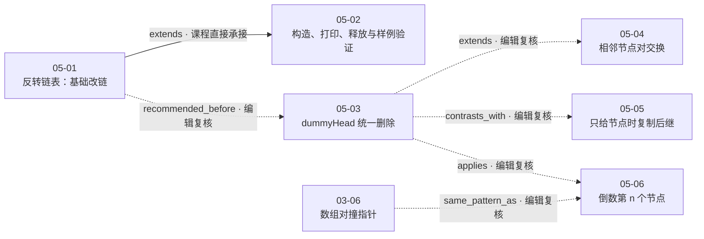

# 第 5 章 在链表中穿针引线

## 本章解决什么问题

数组题通常通过下标描述状态；单链表没有随机访问能力，算法状态更多地体现为“当前指针指向谁、哪条边准备被覆盖、哪一段结构仍然可达”。第五章用反转、删除、两两交换和固定间距双指针回答一个共同问题：

> **怎样在修改 `next` 的同时，始终保存继续遍历所需的入口，并让头结点、尾节点、空链表等边界落入清晰且可验证的状态模型？**

六课形成四条主线：

1. `05-01` 从反转链表建立最基本的改链纪律：覆盖 `next` 前先保存后继；
2. `05-02` 补上链表构造、打印、释放和本地样例运行，使结构算法具备可观察、可复现的测试入口；
3. `05-03`、`05-04` 用虚拟头结点统一头部边界，并从删除单节点推进到交换一对节点的多处重连；
4. `05-05` 讨论“只拿到待删节点”时复制后继值的特殊技巧，`05-06` 则把数组中的双指针迁移成链表上的固定间距状态。

本章统一解题主线是：

`定义每个指针的语义 → 画出改链前后的局部结构 → 在覆盖边之前保存仍需访问的入口 → 按依赖顺序重连 → 推进状态 → 验证头/尾/空/单节点边界 → 用构造、打印、释放和测试检查实现`

## 六课速览

| 课次                         | 核心问题                          | 一句话结论                                                               |  实测时长 |
| ---------------------------- | --------------------------------- | ------------------------------------------------------------------------ | --------: |
| [05-01](../lessons/05-01.md) | 怎样原地反转整条单链表？          | 用 `pre/cur/next` 把已反转段和未处理段分开；覆盖当前边前先保存后继       | 15:47.520 |
| [05-02](../lessons/05-02.md) | 怎样在本地测试链表程序？          | 构造、打印、调用、释放要形成闭环；一次样例通过只是实验验证，不是一般证明 | 16:26.960 |
| [05-03](../lessons/05-03.md) | 怎样删除所有指定值节点？          | `dummyHead` 让原头结点也拥有前驱，从而统一头部和中间节点的删除逻辑       | 17:08.800 |
| [05-04](../lessons/05-04.md) | 怎样交换每对相邻节点？            | 把局部结构 `p→node1→node2→next` 重连为 `p→node2→node1→next`              | 13:30.720 |
| [05-05](../lessons/05-05.md) | 只给待删节点、没有前驱怎么办？    | 非尾节点可复制后继值再删除后继；尾节点不满足该技巧的必要前提             | 07:29.960 |
| [05-06](../lessons/05-06.md) | 怎样一次遍历删除倒数第 n 个节点？ | 快指针先走 `n+1` 步，再与慢指针同速移动，用固定间距定位目标前驱          | 16:53.520 |

第五章总实测时长为 **1:27:17.480**。

### 代码证据状态

| 课次  | 规范化代码对象 | `sourceKind`     | `completeness` | `verification` | 必须保留的边界                                                                                 |
| ----- | -------------- | ---------------- | -------------- | -------------- | ---------------------------------------------------------------------------------------------- |
| 05-01 | `code-001`     | `shown_in_video` | `complete`     | `not_run`      | 视频页面显示 Accepted，但本项目未复现                                                          |
| 05-02 | `code-001`     | `shown_in_video` | `complete`     | `not_run`      | 对象只含三个辅助函数；最终 `main` 是另行整理的屏幕片段；课程单样例为 `experimental_validation` |
| 05-03 | `code-001/002` | `shown_in_video` | `complete`     | `not_run`      | 有、无 `dummyHead` 两版均完整可见                                                              |
| 05-04 | `code-001`     | `shown_in_video` | `complete`     | `not_run`      | 循环条件和三处重连完整可见                                                                     |
| 05-05 | `code-001`     | `shown_in_video` | `complete`     | `not_run`      | “完整可见”不消除尾节点分支的静态缺陷                                                           |
| 05-06 | `code-001`     | `shown_in_video` | `partial`      | `not_run`      | 只能核实到 `delete delNode;`，函数尾部不可见                                                   |

这里的 `complete/partial` 只描述屏幕代码的可见完整度，`not_run` 只描述本项目没有重新执行代码。它们与课程画面中的一次 Accepted 或一次本地样例运行并不矛盾，也都不能单独推出一般正确性。

## 推荐学习顺序与课程关系



图中唯一实线是课程直接承接：05-02 明确以 05-01 的 `reverseList` 为本地测试对象。其余虚线是第五章章级裁决使用两端 accepted 视频证据确认的编辑关系，不代表讲师逐条点名了这些课次。

单课规范化材料中的 `05-01→05-03`、`05-03→05-04`、`03-06→05-06` 仍保留原始的 `editorial_hypothesis / provisional`，且没有直接 evidence ID；章级关系图没有把这些候选直接当作证据，而是补齐两端的素材、时间范围和方向后，登记了图中的 6 条 `verified` 边。这里的 `verified` 表示关系已通过双侧证据复核，不表示课程直接声明，也不把任何一条提升为硬 `prerequisite_of`。

## 核心一：链表算法首先是“可达性管理”

### 数组下标与链表指针的差别

数组可通过索引直接访问目标位置；单链表只能从某个已知节点沿 `next` 继续前进。对链表而言，某个节点是否还能被访问，取决于算法是否保留了通向它的指针。[视频 05-01 00:00–01:13]

因此，数组中的一次覆盖通常只改变值，链表中的一次覆盖却可能改变整段结构的可达性。

例如在反转链表时，若直接执行：

```cpp
cur->next = pre;
```

而没有先保存原来的 `cur->next`，未处理后缀会失去入口。05-01 的安全顺序是：

```cpp
ListNode* next = cur->next;
cur->next = pre;
pre = cur;
cur = next;
```

[视频 05-01 02:58–13:50]

这里真正值得迁移的不是变量名，而是三段状态：

```text
已处理且已反转的前缀 | 当前节点 | 尚未处理的后缀
```

- `pre` 指向已反转前缀入口；
- `cur` 指向当前待处理节点；
- `next` 临时保存未处理后缀入口。

每轮先保存入口，再改变边，再推进两个区域边界。当 `cur == NULL` 时，未处理区为空，`pre` 即新头。

### “穿针引线”的局部检查法

面对链表改链代码，可以先不看整条链表，只检查一个局部：

1. 改动前有哪些节点和边？
2. 哪条边一旦覆盖会丢失导航能力？
3. 改动后哪些节点必须重新接回前缀？
4. 后缀入口保存在谁手中？
5. 下一轮的状态变量是否恢复了同样的语义？

这五问同时适用于 05-01 的单边反转、05-03 的删除、05-04 的节点对交换和 05-06 的目标节点绕过。

## 核心二：变量名不重要，稳定语义才重要

链表题常出现多个 `p`、`q`、`cur`、`next`。仅记住代码顺序很脆弱，更可靠的做法是为每个指针写一句稳定定义。

### 反转链表

| 变量   | 稳定语义                     |
| ------ | ---------------------------- |
| `pre`  | 已反转链段的头               |
| `cur`  | 当前准备反转出边的节点       |
| `next` | 覆盖当前出边后仍需进入的后缀 |

[视频 05-01 02:58–13:50]

### 删除指定值

在虚拟头结点版本中：

| 变量        | 稳定语义                 |
| ----------- | ------------------------ |
| `dummyHead` | 真实头结点之前的统一入口 |
| `cur`       | 当前被检查节点的前驱     |
| `cur->next` | 当前可能删除的节点       |

[视频 05-03 12:03–15:19]

若 `cur->next->val == val`，删除 `cur->next` 后 `cur` 不前进，因为新的 `cur->next` 仍可能需要删除；若不相等，才执行 `cur = cur->next`。

### 交换相邻节点

| 变量    | 稳定语义               |
| ------- | ---------------------- |
| `p`     | 当前待交换节点对的前驱 |
| `node1` | 节点对中的第一个节点   |
| `node2` | 节点对中的第二个节点   |
| `next`  | 节点对之后的后缀入口   |

[视频 05-04 00:58–08:50]

局部结构从：

```text
p → node1 → node2 → next
```

变为：

```text
p → node2 → node1 → next
```

交换后 `node1` 落在这一对的末尾，因此下一轮前驱应更新为 `p = node1`。

### 删除倒数第 n 个节点

| 变量     | 稳定语义                 |
| -------- | ------------------------ |
| `q`      | 先行的快指针             |
| `p`      | 最终定位目标前驱的慢指针 |
| 两者距离 | 始终为 `n+1` 条边        |

[视频 05-06 03:45–11:56]

`q` 到达 `NULL` 时，固定间距使 `p` 正好位于倒数第 `n` 个节点的前驱。这不是数组对撞指针的“根据值淘汰一端”，而是利用位置间距把“从尾部计数”转换成“从头部同步移动”。

## 核心三：虚拟头结点把头部边界变成普通状态

### 为什么头结点经常特殊

删除或交换中间节点时，通常可以通过前驱修改：

```text
predecessor->next
```

但真实头结点没有前驱。没有额外结构时，算法要单独修改 `head`，形成两套逻辑。

05-03 的无虚拟头结点版本先用循环删除连续命中的头部节点：

```text
while (head != NULL && head->val == val) ...
```

然后再次检查 `head` 是否已经为空，才进入处理中间节点的循环。课程用这一版本集中展示了连续头部命中、全部删空和空指针访问等边界陷阱。[视频 05-03 03:43–12:03]

### dummyHead 的统一方式

增加：

```text
dummyHead → head → ...
```

后，原头结点也有了前驱。算法从 `dummyHead` 开始检查 `cur->next`，删除原头结点与删除中间节点都变成同一个操作。[视频 05-03 12:03–15:19]

05-04 用同一技巧处理第一对节点交换；05-06 用它处理“待删节点恰好是原头”的情况。由此可见，虚拟头结点并不是“链表题必加的模板”，而是当操作需要目标节点前驱、且真实头可能成为目标时，用一个辅助节点统一边界。

### 内存管理边界

视频中的 C++ 代码通过 `new` 创建 `dummyHead`，因此返回前需要：

1. 先保存 `dummyHead->next`；
2. `delete dummyHead`；
3. 返回保存的真实头。

[视频 05-03 13:12–15:19]；[视频 05-04 04:18–08:50]

在其他语言中应按语言自身的所有权或垃圾回收语义处理，不能把 C++ 的 `delete` 当成跨语言模板。

05-03 还提到，在有垃圾回收的语言中可以把被删除节点的 `next` 置为 `NULL` 以帮助回收。章级人工复核保留了这条课程说法，同时补充边界：一般追踪式 GC 是否回收对象，关键是对象是否仍然可达，置空并不是所有运行时的普遍必要条件。

## 核心四：链表测试不只是“看输出”

05-02 不是新的 LeetCode 主问题，而是给本章补齐测试基础设施：

- `createLinkedList`：从数组创建链表，并处理 `n == 0`；
- `printLinkedList`：沿 `next` 输出 `value -> ... -> NULL`；
- `deleteLinkedList`：逐个释放动态分配的节点；
- 屏幕最终 `main`：创建、打印、调用 `reverseList`、打印结果，并加入释放新链表的调用。

[视频 05-02 00:00–09:58]

规范化 `code-001` 只包含三个完整辅助函数；最终 `main` 是根据屏幕最终编辑态整理的独立片段。控制台输出出现在最终清理函数完善之前，画面没有保存加入 `deleteLinkedList(head2)` 后的独立重跑日志，因此不能声称该次实验已经执行验证了最终释放路径。[视频 05-02 05:16–09:58]

### 反转后必须使用新头

调用：

```cpp
ListNode* head2 = Solution().reverseList(head);
```

后，原 `head` 不再代表反转后的链表入口。后续打印和释放都必须使用 `head2`。屏幕最终清理调用为：

```cpp
deleteLinkedList(head2);
```

[视频 05-02 05:16–09:58]

### 安全释放的顺序

释放当前节点后不能再通过它读取 `next`。课程采用的思路是先让遍历指针进入后继，再删除旧节点，或先显式保存后继。[视频 05-02 07:44–09:58]

### 一次样例通过意味着什么

课程运行一个本地示例，控制台显示原链表和反转后链表，进程以 exit code 0 结束。这能证明：

- 该次构建和运行没有在样例路径上崩溃；
- 观察到的输出符合该样例预期。

它不能单独证明：

- 空链表、单节点或更长链表都正确；
- 没有内存错误；
- 对所有合法输入都满足后置条件；
- 复杂度结论成立。

因此本项目把它记为 `experimental_validation`，而不是形式化正确性证明。更精确地说，`experimental_validation` 只覆盖 `ev-004` 中该次构造、反转、打印和退出状态；`deleteLinkedList` 及最终 `deleteLinkedList(head2)` 属于随后 `ev-005` 的屏幕实现与编辑态，没有独立运行证据。`not_run` 描述的是规范化代码对象在本项目中的验证状态。

## 核心五：特殊接口可能改变“删除”的含义

### 通常的删除依赖前驱

正常删除节点 `x` 需要让前驱绕过它：

```text
predecessor->next = x->next
```

05-03 正是围绕“让待删节点拥有可操作前驱”组织算法。

### 只给待删节点时：复制后继

LeetCode 237 的接口只给待删节点 `node`，没有头结点和前驱。若 `node` 不是尾节点，可以：

```cpp
node->val = node->next->val;
ListNode* delNode = node->next;
node->next = delNode->next;
delete delNode;
```

[视频 05-05 01:46–05:38]

物理上被释放的是原后继节点，但从外部观察，原 `node` 的值被后继覆盖，因此目标值从链表中消失。这一技巧的成立依赖：

- 允许修改节点值；
- `node->next` 存在；
- 题目关心链表的可观察值序列，而不是要求释放特定节点对象身份。

### 视频尾节点分支的缺陷

屏幕代码随后加入：

```cpp
if (node->next == NULL) {
    delete node;
    node = NULL;
    return;
}
```

[视频 05-05 05:38–07:09]

章级人工 QA 确认：`node` 是按值传入的局部指针，函数没有前驱。`delete node` 释放对象后，前驱的 `next` 仍指向已释放内存；`node = NULL` 也只改变局部副本。因此这一分支会留下悬空指针，不能作为通用的尾节点删除实现。

准确结论不是“加一个空判断就能支持尾节点”，而是：

> 复制后继法只适用于存在后继的节点。若只提供尾节点且接口不允许访问前驱，普通单链表无法通过这一接口安全完成结构删除。

视频原码仍被保留为课程证据，但状态是 `shown_in_video / complete / not_run`，正式笔记明确标注其边界缺陷。

## 核心六：固定间距把尾部位置转换成前驱位置

05-06 先给出两遍法：

1. 第一遍求链表长度 `N`；
2. 第二遍定位并删除倒数第 `n` 个节点。

时间仍是 `O(N)`、辅助空间 `O(1)`，但需要遍历两次。[视频 05-06 02:11–03:45]

一次遍历法使用 `dummyHead` 和两个指针：

1. `p`、`q` 都从 `dummyHead` 开始；
2. `q` 先走 `n+1` 步；
3. 当 `q != NULL` 时，`p`、`q` 同速前进；
4. `q == NULL` 时，`p` 位于目标节点前驱；
5. 绕过并释放 `p->next`。

[视频 05-06 03:45–11:56]

这里用 `N` 表示链表节点总数，用小写 `n` 表示题目参数，避免规范化材料中两个含义都使用 `n` 的符号冲突。

### 为什么是 `n+1`

目标不是让 `p` 停在倒数第 `n` 个节点，而是让它停在该节点的前驱。于是 `q` 需要比 `p` 多走 `n+1` 条边。到 `q == NULL` 时：

```text
p → target → ... → tail → NULL
                共 n 个节点
```

从纯结构重连看，这等价于让 `p->next` 越过目标节点并指向目标后继；但在视频的 C++ 内存管理语境中，不能只写 `p->next = p->next->next` 后丢失目标地址。仍应先保存 `delNode`，完成旁路后再 `delete delNode`。[视频 05-06 03:45–11:56]

### 屏幕代码可见性边界

人工逐帧检查确认，视频画面中的函数代码只可核实到：

```cpp
ListNode* delNode = p->next;
p->next = delNode->next;
delete delNode;
```

模型最初补出的 `retNode`、`delete dummyHead`、`return retNode` 在关键帧中不可见，已经从规范化代码对象移除。因此该代码状态是 `partial / not_run`，本章不能把合理推测的尾部写成“屏幕完整代码”。

### `assert(n >= 0)` 的契约冲突

屏幕明确显示：

```cpp
assert(n >= 0);
```

但本题的 `n` 按 1 起算，合法范围应为 `1 <= n <= N`。若 `n == 0`：

1. `q` 只预走一步；
2. 同步移动结束时 `p` 位于尾节点；
3. `delNode = p->next` 得到 `NULL`；
4. `delNode->next` 发生非法解引用。

所以这不是“n=0 会删除尾节点”，而是空指针访问风险。循环中的 `assert(q)` 可在启用断言时捕获部分 `n > N` 情形，却不能修复 `n=0`，且禁用断言的构建不能把它当作运行时输入校验。

## 复杂度总览

| 课次 / 解法             |   时间 | 辅助空间 | 证据口径                                                              |
| ----------------------- | -----: | -------: | --------------------------------------------------------------------- |
| 05-01 三指针反转        | `O(n)` |   `O(1)` | 课程直接给出                                                          |
| 05-02 三个辅助函数      | `O(n)` |   `O(1)` | 根据屏幕循环的编辑推导；`createLinkedList` 另产生 `O(n)` 返回结果节点 |
| 05-03 无 dummyHead 删除 | `O(n)` |   `O(1)` | 根据代码结构的编辑推导                                                |
| 05-03 dummyHead 删除    | `O(n)` |   `O(1)` | 根据代码结构的编辑推导                                                |
| 05-04 两两交换          | `O(n)` |   `O(1)` | 课程直接给出                                                          |
| 05-05 复制后继删除      | `O(1)` |   `O(1)` | 可由固定次数操作推导；视频未形成正式复杂度分析                        |
| 05-06 两遍法            | `O(N)` |   `O(1)` | 课程直接给出                                                          |
| 05-06 固定间距双指针    | `O(N)` |   `O(1)` | 课程直接给出                                                          |

同样的复杂度记号不代表同样的算法：

- `O(n)` 可以是一遍或两遍链表；
- `O(1)` 辅助空间允许固定数量的指针和一个虚拟节点；
- 05-02 的 `createLinkedList` 若把返回链表也计入总空间，需要 `O(n)` 节点存储；表中的 `O(1)` 只统计除返回结果外的辅助工作空间；
- 05-05 的常数时间成立于接口已经直接给出待删节点，不能与“先从头定位该节点”的成本混在一起；
- 05-03 的复杂度公式是章级编辑推导，不应改写为讲师直接口述。

## 本章常见错误清单

### 1. 覆盖后继前没有保存入口

结果：后续链段失联。<br>
对应：05-01、05-04。

### 2. 删除当前节点后继续解引用它

结果：使用已释放内存。<br>
对应：05-02、05-03、05-05、05-06。

### 3. 删除节点后无条件推进前驱

结果：连续命中的节点被跳过。<br>
对应：05-03。

### 4. 忘记返回头可能变化

结果：仍从旧 `head` 打印或释放，只能看到局部链段或误用已变化入口。<br>
对应：05-01、05-02、05-03、05-04、05-06。

### 5. 把 dummyHead 当成真实数据节点

结果：返回错误入口，或忘记处理其生命周期。<br>
对应：05-03、05-04、05-06。

### 6. 只凭输出值序列判断结构正确

结果：可能遗漏环、断链、重复节点或悬空指针。<br>
对应：全章。

### 7. 把单样例运行当成证明

结果：边界和一般输入仍未覆盖。<br>
对应：05-02。

### 8. 无视接口前提套用复制后继

结果：尾节点没有后继可复制。<br>
对应：05-05。

### 9. 混淆“链表长度 N”和题目参数 n

结果：复杂度解释和固定间距推导不清。<br>
对应：05-06。

### 10. 相信断言已经覆盖所有非法输入

结果：`n=0` 或禁用断言时仍存在风险。<br>
对应：05-06。

## 面试中的统一解题框架

### 第一步：确认接口和允许操作

先问：

- 是否给出 `head`？
- 是否给出目标节点或目标值？
- 是否保证目标存在？
- 是否允许修改节点值？
- 是否保证无环？
- 是否需要释放节点？
- 空输入和非法参数如何处理？

05-01、05-04 禁止用交换值规避结构操作；05-05 恰恰利用允许改值和“只给节点”的接口。约束不同，合法算法就不同。

### 第二步：画局部结构

用最少节点表示：

```text
predecessor → current → successor → suffix
```

在图上标出：

- 要删除或反转的边；
- 必须新建的边；
- 覆盖后会失去的入口；
- 操作后下一轮指针应在哪里。

### 第三步：写变量语义，不急着写代码

例如：

```text
p = 当前待处理区域的前驱
q = 比 p 领先 n+1 条边的指针
```

只要语义稳定，变量名可以替换；若语义随循环悄悄变化，代码通常难以证明。

### 第四步：按依赖关系排列赋值

判断某个右值是否会被前面的赋值破坏。必要时显式保存后继。05-04 说明可以通过谨慎顺序省去 `next`，但固定数量的额外指针不改变 `O(1)`，清晰版本通常更适合面试表达。

### 第五步：验证循环状态

至少回答：

- 初始化时不变量是否成立？
- 一轮之后是否恢复相同语义？
- 每轮是否有单调进展？
- 终止时目标条件如何推出？

### 第六步：系统测试

链表最小测试矩阵：

| 维度     | 代表情形                             |
| -------- | ------------------------------------ |
| 长度     | 0、1、2、3、偶数、奇数               |
| 目标位置 | 头、中间、尾                         |
| 命中数量 | 0 次、1 次、连续多次、全部           |
| 参数     | 最小合法、最大合法、非法             |
| 结构检查 | 不断链、不成环、不重复、不遗漏       |
| 生命周期 | 不泄漏、不重复释放、不使用已释放节点 |

## 练习题地图

课程在六课中提出多道延伸题，但多数只给题面或方向，不应写成视频已完整讲解：

| 来源课 | 练习                                       | 迁移重点                                   |
| ------ | ------------------------------------------ | ------------------------------------------ |
| 05-01  | LC92 Reverse Linked List II                | 区间边界与局部反转                         |
| 05-02  | LC83 Remove Duplicates from Sorted List    | 有序链表删除                               |
| 05-02  | LC86 Partition List                        | 按 `x` 分区；双链段拼接是编辑练习建议      |
| 05-02  | LC328 Odd Even Linked List                 | 按位置拆分与重连                           |
| 05-02  | LC2 Add Two Numbers                        | 逆序数字链表相加；逐位进位是编辑练习建议   |
| 05-02  | LC445 Add Two Numbers II                   | 不改输入时用栈等辅助结构                   |
| 05-03  | LC82 Remove Duplicates from Sorted List II | 连续段删除                                 |
| 05-03  | LC21 Merge Two Sorted Lists                | 多链表指针推进                             |
| 05-04  | LC25 Reverse Nodes in k-Group              | 节点对交换推广到 k 个                      |
| 05-04  | LC147 Insertion Sort List                  | 节点插入与重连                             |
| 05-04  | LC148 Sort List                            | 自底向上归并排序提示                       |
| 05-06  | LC61 Rotate List                           | 右旋题面；尾部定位与首尾重连是编辑练习建议 |
| 05-06  | LC143 Reorder List                         | 中点、后半反转、交替合并                   |
| 05-06  | LC234 Palindrome Linked List               | 挑战 `O(1)` 辅助空间                       |

05-05 没有单独布置课后练习。表中的“迁移重点”只是章级练习定位；除各课正式笔记明确记录的题面、示例或提示外，不代表视频给出了完整算法、代码、证明、复杂度或运行结果。

## 章级复习卡

### 概念卡

- 什么是单链表中的“可达性”？
- 为什么虚拟头结点能统一真实头结点边界？
- 固定间距双指针与对撞指针有何不同？
- 复制后继删除为什么不能处理尾节点？
- 课程演示运行与项目本地验证有何区别？

### 代码卡

- 写出反转链表四条核心更新。
- 写出 `p→node1→node2→next` 的三处重连。
- 写出删除指定值时“删除不推进、不删才推进”的分支。
- 解释为什么 q 要先走 `n+1` 步。
- 写出安全释放链表节点的顺序。

### 证明卡

- 用“已反转前缀 / 未处理后缀”证明 05-01。
- 用“p 始终是当前节点对前驱”证明 05-04。
- 用固定间距证明 05-06 中 p 最终位于目标前驱。
- 给出一个反例说明 05-05 的尾节点分支不正确。

### 测试卡

- 为什么只检查输出值序列不够？
- 怎样发现环或断链？
- 为什么 `deleteLinkedList(head2)` 不能换回旧 `head`？
- `n=0` 在 05-06 屏幕代码中具体走到哪里出错？

## 证据与质量说明

### 视频理解调用

- 六课均使用实时目录中支持视频输入的 `google/gemini-3.6-flash`；
- 统一通过本项目 ZenMux CLI 和本机备用地址 `https://zenmux.dev/api/v1` 调用；
- 共 7 次到达服务端的生成：6 次 accepted，1 次 rejected；
- 唯一拒绝发生在 05-02 首次输出，原因是关系类型使用了 schema 未定义的 `precedes`；定向重试后通过；
- 六课合计记录 **654,717 tokens**；
- accepted 只表示模型结果通过本地结构与人工 QA 门禁，不表示视频中代码已在本项目运行。

### 人工 QA 的关键校正

1. **05-01**：核对五步反转代码；把模型误标为课程直接关系的 `05-01→05-03` 降为编辑假设。
2. **05-02**：核对辅助函数和最终 `deleteLinkedList(head2)`；把单样例运行标为实验验证。
3. **05-03**：核对有无 dummyHead 两版代码；复杂度保留为编辑推导；限制 GC 置空说法的适用范围。
4. **05-04**：核对循环条件和三处重连；明确显式 `next` 是清晰版本，不是唯一可能写法。
5. **05-05**：确认尾节点分支无法更新前驱，保留原码并标出悬空指针风险。
6. **05-06**：移除画面不可见的模型补全代码；把代码降为 partial；修正 `n=0` 的具体失败路径。

### 证据边界

- 六课所有规范化代码对象的 `verification` 均为 `not_run`；05-01 的课程页面 Accepted 与 05-02 的课程单样例运行是各自的视频证据，不是本项目复现；
- 05-01 至 05-05 的代码对象为 `complete`，其中 05-03 有两份完整对象；05-06 为 `partial`；
- 05-06 只可确认到 `delete delNode;`，其后函数尾部不可冒充视觉证据；
- 05-02 的课程运行不等于项目本地复现；
- 05-03 的复杂度是根据循环结构归纳的编辑推导；
- 练习题只记录课程实际给出的题面和提示，不补造完整解法；
- 跨课关系必须经双侧证据复核，不把模型候选自动升级为课程事实。

## 本章最终检查清单

- [ ] 我能在覆盖 `next` 前识别并保存后缀入口。
- [ ] 我能为每个指针写出稳定且不随意变化的语义。
- [ ] 我能解释何时需要 `dummyHead`，而不是机械套模板。
- [ ] 我能手推空、单节点、两节点、奇数和偶数长度。
- [ ] 我能区分物理删除节点与通过复制值实现的逻辑删除。
- [ ] 我知道 05-05 尾节点分支为什么错误。
- [ ] 我能证明固定 `n+1` 间距如何定位目标前驱。
- [ ] 我知道 05-06 的 `assert(n >= 0)` 为什么与题意冲突。
- [ ] 我会构造、打印和释放链表，并能解释一次样例的证据边界。
- [ ] 我不会把视频 Accepted、课程运行、项目测试和形式化证明混为一谈。
