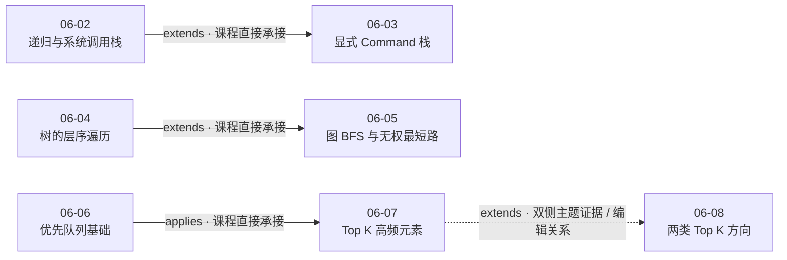

# 第 6 章 栈，队列，优先队列

## 本章解决什么问题

栈、队列和优先队列都在保存“尚待处理的对象”，真正决定算法行为的却不是容器名字，而是：

> **下一步应该取出哪一个状态，以及为了继续计算，容器元素必须携带哪些信息？**

本章用括号匹配、二叉树遍历、无权图最短路径和 Top K 问题，把这个问题拆成四条主线：

1. `06-01` 用栈保存最近尚未闭合的左括号，建立 LIFO 与嵌套结构之间的联系；
2. `06-02`、`06-03` 先观察递归背后的系统调用栈，再把“尚待执行的动作”显式建模为 `Command`，统一实现前序、中序和后序遍历；
3. `06-04`、`06-05` 用 FIFO 保存发现顺序，从树的层序遍历推广到隐式无权图的最短路径，并补上图搜索中的 `visited`；
4. `06-06`、`06-07`、`06-08` 从优先队列的比较规则进入 Top K 候选维护，再与“快速排序算法的思想”作证据受限的方案对照。

本章统一解题主线是：

`定义状态与目标 → 决定“下一个状态”的取出规则 → 设计容器元素 → 写清入队/入栈门禁 → 处理重复状态或容量边界 → 证明终止与结果语义 → 分开记录课程结论、编辑推导和运行证据`

三类容器的核心差异可以先记成：

```text
栈：       最近加入的待处理状态先处理
队列：     最早发现的待处理状态先处理
优先队列： 当前优先级最高的待处理状态先处理
```

## 八课速览

| 课次                         | 核心问题                                     | 一句话结论                                                                                  |         实测时长 |
| ---------------------------- | -------------------------------------------- | ------------------------------------------------------------------------------------------- | ---------------: |
| [06-01](../lessons/06-01.md) | 括号嵌套为什么适合用栈？                     | 栈顶保存最近尚未匹配的左括号；右括号先判空、再比对，扫描结束还必须检查栈空                  |        16:13.440 |
| [06-02](../lessons/06-02.md) | 递归为什么与栈紧密相关？                     | 系统调用栈保存尚未完成的调用现场，使最深层调用先返回，再逐层恢复外层执行                    |        16:03.680 |
| [06-03](../lessons/06-03.md) | 怎样用显式栈统一三种二叉树遍历？             | 把动作拆成 `go/print`，先写目标执行顺序，再按 LIFO 反向压栈                                 |        19:33.120 |
| [06-04](../lessons/06-04.md) | 怎样让二叉树输出按层分组？                   | 队列保存 `(node, level)`；FIFO 保证层号非递减，左右入队顺序保持同层从左到右                 |        10:26.320 |
| [06-05](../lessons/06-05.md) | 怎样把“最少平方数”变成无权图最短路径？       | 把剩余整数当节点、减去平方数当单位边；BFS 入队时去重，第一次生成 `0` 即得到最浅层解         |        21:20.880 |
| [06-06](../lessons/06-06.md) | C++ 优先队列怎样表达最大、最小和自定义优先？ | 默认 `priority_queue<int>` 取最大值；`greater<int>` 取最小值；自定义比较器决定 `top()` 语义 |        11:09.040 |
| [06-07](../lessons/06-07.md) | 怎样只维护 Top K 高频候选？                  | 先统计频率，再用容量为 `k` 的最小堆把当前最弱候选放在堆顶                                   |     15:41.685261 |
| [06-08](../lessons/06-08.md) | Top K 有哪两类求解方向？                     | 文本列出优先队列与“快速排序算法的思想”，但未给第二类实现、复杂度情形或开放问题答案          | 文本课（无时长） |

七个视频的总实测时长为 **1:50:28.165261**。`06-08` 是本地 Markdown 文本教程，没有视频时长，不计入合计，也不为它补造大纲时长。

### 代码与验证状态

| 课次  | 规范化代码对象     | 来源             | 完整度     | 项目侧验证 | 必须保留的边界                                                                          |
| ----- | ------------------ | ---------------- | ---------- | ---------- | --------------------------------------------------------------------------------------- |
| 06-01 | `code-001`         | `shown_in_video` | `complete` | `tested`   | 项目补齐编译入口并跑过 6 组代表性用例；代表性测试不等于穷尽证明                         |
| 06-02 | `code-001`         | `shown_in_video` | `complete` | `compiled` | 只编译了前序递归函数，没有运行输出测试；本课没有中序、后序或显式栈代码                  |
| 06-03 | `code-001/002/003` | `shown_in_video` | `complete` | `tested`   | 三份遍历代码已做项目侧验证；视频中的三次 Accepted 与项目侧测试是两类不同证据            |
| 06-04 | `code-001`         | `shown_in_video` | `complete` | `not_run`  | 已人工核对 `(node, level)`、新层条件、左右入队和返回语句；项目未编译或运行              |
| 06-05 | `code-001/002`     | `shown_in_video` | `complete` | `not_run`  | 不去重基线版和 `visited` 优化版均完整可见；课程报告 MLE/性能改善不等于项目复现          |
| 06-06 | `code-001`         | `shown_in_video` | `complete` | `not_run`  | 课程现场运行三种队列；项目未重跑；自定义比较器最终 token 已人工修正为 `a % 10 > b % 10` |
| 06-07 | `code-001`         | `shown_in_video` | `partial`  | `not_run`  | 画面首行只有 `#include ...`，不能补造真实头文件或把片段称为可独立编译单元               |
| 06-08 | 无                 | 本地文本         | 不适用     | 不适用     | 正文没有代码、运行、提交或正确性证明                                                    |

这里有四个需要始终分开的判断：

1. `complete/partial` 只描述课程画面中代码是否完整可见；
2. `compiled/tested/not_run` 只描述本项目是否独立编译或运行；
3. 课程画面中的 Accepted、MLE 或终端输出，是课程现场证据；
4. 正确性证明需要不变量、归纳或等价性论证，不能由一次运行自动推出。

## 推荐学习顺序与课程关系



前三条实线都有课程材料中的明确承接：

- `06-02` 片尾预告下一课使用自己建立的栈模拟系统栈，`06-03` 开头实际完成这一转换；
- `06-04` 结尾预告图上的 BFS 和无权最短路径，`06-05` 开头明确从树的层序遍历推广到图；
- `06-06` 结尾预告下一节使用优先队列解决算法题，`06-07` 随即把最小堆用于 Top K。

虚线 `06-07→06-08` 的性质不同：

- `06-07` 视频没有直接预告 `06-08`；
- `06-08` 文本开头回顾“使用优先队列求解 Top K”，与前一课主题双侧吻合；
- 因此它适合作为章级学习顺序中的编辑关系，但不能写成讲师在 `06-07` 中直接声明的关系。

关系图中的“课程直接”描述证据性质，不自动表示 `relationships.json` 中的状态已经从 `provisional` 升级。正式关系状态仍以关系图文件的独立校准结果为准。

此外，下面两条顺序有教学价值，但本章不把它们登记为课程直接关系：

```text
06-01 → 06-02：先用括号匹配掌握 LIFO，再观察运行时怎样使用栈
06-03 → 06-04：对比 LIFO 指令调度与 FIFO 层序调度
```

它们是章级编辑复习路线，不代表课程材料逐条声明了 `extends`、`prerequisite_of` 或其他正式关系。

## 核心一：容器选择的本质是“下一个处理谁”

面对一个新问题，可以先暂时忘掉“要套哪种数据结构”，依次问：

1. 待处理对象是什么：字符、节点、调用现场、图状态还是候选？
2. 下一步需要最近加入、最早发现，还是当前最优先的对象？
3. 容器元素只保存对象本身，还是还需要层号、步数、动作类型、频率等上下文？
4. 一个状态是否可能被重复发现？
5. 容器是否需要限制容量？
6. 容器为空意味着成功、失败，还是搜索结束？

| 取出规则           | 典型容器 | 本章状态载荷                   | 必须维护的不变量                                           | 代表课次     |
| ------------------ | -------- | ------------------------------ | ---------------------------------------------------------- | ------------ |
| 最近加入者先处理   | 栈       | 左括号、调用现场、`Command`    | 栈顶代表最近未完成的嵌套或下一条应执行动作                 | 06-01～06-03 |
| 最早发现者先处理   | 队列     | `(node, level)`、`(num, step)` | 队首来自当前最浅的未处理层；新状态追加到队尾               | 06-04～06-05 |
| 当前最高优先者处理 | 优先队列 | 整数、`(frequency, value)`     | `top()` 的含义由比较器定义；容量受限时，堆顶常作为候选边界 | 06-06～06-08 |

容器只是状态调度器。算法能否正确，仍取决于：

- 状态定义是否足够；
- 转移是否覆盖全部合法情况；
- 去重或淘汰是否会丢掉更优答案；
- 终止时容器和累积结果分别代表什么。

## 核心二：栈首先解决“最近未完成的嵌套”

### 括号匹配的状态

`06-01` 中，栈不保存所有已经扫描过的字符，只保存：

> 已出现、但尚未被对应右括号关闭的左括号。

[视频 06-01 01:46–11:27]

扫描到左括号时入栈；扫描到右括号时：

1. 先检查栈是否为空；
2. 读取并弹出栈顶；
3. 把当前右括号映射为期望的左括号；
4. 类型不同立即失败。

循环结束后仍不能直接成功，因为栈中可能残留左括号。完整终止条件是：

```text
全部字符扫描完成 且 栈为空
```

### 为什么 LIFO 正好对应嵌套

若输入前缀是：

```text
{ [ (
```

最后出现的 `(` 位于最内层，必须最先由 `)` 关闭；随后才轮到 `[` 和 `{`。栈顶就是最近尚未完成的嵌套边界。

编辑性不变量可以写成：

> 处理完前缀 `s[0..i)` 后，栈从底到顶保存该前缀中尚未匹配的左括号；栈顶是下一个右括号唯一允许优先匹配的左括号。

课程用动画和分支代码直接说明了状态转移；上述不变量与 `O(n)` 时间、最坏 `O(n)` 空间是根据代码整理出的编辑推导，不是本节记录到的课程直接复杂度。

### 这套状态可以迁移到什么问题

课程只把 LeetCode 150 `Evaluate Reverse Polish Notation` 和 LeetCode 71 `Simplify Path` 列为课尾练习，没有给出两题完整算法或代码。[视频 06-01 11:27–16:13.440]

复习时可以带着下面的问题独立练习：

- 一个新 token 到来时，需要读取几个最近结果？
- `..`、`.` 或运算符到来时，栈顶分别代表什么？
- 空栈是合法边界还是错误输入？

这些是练习提示，不是课程已经完成的题解。

## 核心三：递归把“尚待执行的工作”交给系统栈

### 递归代码短，不代表没有状态

`06-02` 的前序遍历顺序是：

```text
当前节点 → 左子树 → 右子树
```

当函数进入左子树时，外层调用还没有完成，它仍需要在左子树返回后继续右子树。系统调用栈负责保存：

- 当前调用对应的节点；
- 子调用返回后从哪里继续；
- 恢复执行所需的上下文。

[视频 06-02 02:15–15:22]

本课画面中的 `cout 1`、`go 1-L`、`go 1-R` 是帮助理解待执行工作的教学示意，不是 ABI 级栈帧布局。课程没有讨论返回地址、寄存器保存或具体编译器实现。

### 系统栈与用户栈不能混成一个对象

| 维度     | 06-02 系统调用栈   | 06-03 显式用户栈     |
| -------- | ------------------ | -------------------- |
| 维护者   | 运行时系统         | 程序员               |
| 元素     | 调用现场的教学抽象 | 明确定义的 `Command` |
| 建立方式 | 由函数调用隐式产生 | 代码主动 `push`      |
| 消费方式 | 子调用返回时恢复   | 循环主动 `top/pop`   |
| 本课证据 | 递归追踪与示意图   | 三份完整非递归代码   |

二者都利用 LIFO，但不能把 `06-03` 的 `command.s == "go"` 转移提前写成 `06-02` 已讲内容。

### 递归契约与证据边界

可用于复习的编辑性契约是：

> `preorder(node)` 输出以 `node` 为根的子树中的全部节点，顺序为根、左、右；`node == NULL` 时不输出。

可以按树结构做归纳解释，但 `06-02` 课程本身没有给出形式化证明，因此规范化正确性方法保持 `not_applicable`。项目侧只完成语法编译，没有运行输出测试。

复杂度同样属于编辑推导：

```text
时间：O(n)
调用栈：O(h)
最坏退化树：h = n
```

其中 `n` 是节点数，`h` 是树高。

## 核心四：显式指令栈统一前序、中序和后序

### 把“进入节点”与“输出节点”拆开

`06-03` 定义两类命令：

```text
go(node)：以后按目标遍历规则展开这棵子树
print(node)：现在把 node->val 写入结果
```

这个拆分解决了三种遍历中“根节点在什么时候输出”的差异：

- 前序：进入后立即输出；
- 中序：左子树完成后输出；
- 后序：左右子树都完成后输出。

### 先写目标顺序，再整体反向压栈

栈顶最先执行，因此若希望执行：

```text
A → B → C
```

代码必须依次压入：

```text
C → B → A
```

三套状态模型如下：

| 遍历 | 希望的实际执行顺序                   | `go(node)` 中的压栈顺序              | 规范化状态  |
| ---- | ------------------------------------ | ------------------------------------ | ----------- |
| 前序 | `print(node) → go(left) → go(right)` | `go(right) → go(left) → print(node)` | `state-001` |
| 中序 | `go(left) → print(node) → go(right)` | `go(right) → print(node) → go(left)` | `state-002` |
| 后序 | `go(left) → go(right) → print(node)` | `print(node) → go(right) → go(left)` | `state-003` |

[视频 06-03 00:00–15:16]

最常见错误是把目标执行顺序原样压栈。以中序为例，代码先压右、再压根、最后压左，正是为了让左命令最先弹出。

### 三套转移不能因为字段相同而合并

三份实现都使用 `Command` 和同一个循环骨架，但正确性的关键恰好是 `go` 分支内部的不同顺序。复习时应分别手推：

```text
根 1，左 2，右 3
```

得到：

```text
前序：1, 2, 3
中序：2, 1, 3
后序：2, 3, 1
```

### 复杂度与验证

每个真实节点产生一个 `go` 和一个 `print`，所以编辑推导为：

```text
时间：O(n)
显式命令栈：O(h)，最坏 O(n)
输出数组：O(n)
```

课程目标帧没有直接给出这些 Big O。三份代码在视频中分别显示 LeetCode 144、94、145 Accepted；本项目又独立把三份规范化代码标为 `tested`。两类验证都不能替代一般证明。

LeetCode 341 `Flatten Nested List Iterator` 只在课尾介绍题面、接口与示例，没有完整实现。[视频 06-03 15:16–19:33.120]

## 核心五：队列把“发现顺序”转换成层次顺序

### 二叉树层序遍历的状态载荷

`06-04` 的队列元素不是单独的树节点，而是：

```text
(TreeNode*, level)
```

根节点以 `(root, 0)` 入队。每次取出 `(node, level)` 后：

1. 若 `level == res.size()`，先为新层增加空数组；
2. 把 `node->val` 追加到 `res[level]`；
3. 按左、右顺序把非空孩子以 `level + 1` 入队。

[视频 06-04 02:01–08:09]

### 为什么层号不会跳跃

FIFO 保证先发现的状态先处理。处理当前层节点时，新发现的孩子只会追加到队尾，不会越过队列中尚未处理的同层节点。因此：

```text
队列取出的层号非递减
```

当第一次看到层号 `d` 时，前面所有更小层已经建立，且层号不会跳过，所以此时恰好有：

```text
d == res.size()
```

先建立 `res[d]`，再写入该层；若顺序相反就会越界。

### 左右入队顺序是输出契约的一部分

层序遍历不仅要求按深度处理，还要求示例中的同层节点从左到右。屏幕代码先入左孩子、再入右孩子；FIFO 保留这一发现顺序。

如果只想按层分组，也可以使用“每轮读取当前队列长度”的另一种常见写法，但本课屏幕实现明确使用 `(node, level)`。不能把外部常见模板误写成视频代码。

### 复杂度

课程没有直接给公式。根据代码作编辑推导：

```text
时间：O(n)
辅助队列：O(w)
```

其中 `n` 是树节点数，`w` 是最大层宽。若计入返回结果，总空间还包含保存全部节点值的 `O(n)`。

LeetCode 107、103、199 只展示题意和示例，没有完整实现或项目运行。[视频 06-04 08:09–10:26.320]

## 核心六：BFS 的关键不是“有个队列”，而是状态图与层数语义

### 先把原问题翻译成图

`06-05` 对 LeetCode 279 `Perfect Squares` 定义：

```text
节点：0, 1, 2, ..., n，表示当前剩余整数
边：x → x - i²，只要 i ≥ 1 且 i² ≤ x
起点：n
终点：0
边权：每条边都代表使用一个平方数，代价为 1
```

[视频 06-05 05:20–08:08]

因此一条长度为 `d` 的 `n→0` 路径对应一个含 `d` 项的平方数分解；求最少项数就变成求单位边权图上的最短路径。

这一步比“看到最少就套 BFS”更重要。面试中至少要说清：

- 状态是什么；
- 一次合法操作如何产生后继；
- 每条边为什么等价；
- 路径长度怎样对应原问题答案。

### 贪心必须先过反例门禁

“每次减去最大的平方数”看似合理，但：

```text
12 = 9 + 1 + 1 + 1   共 4 项
12 = 4 + 4 + 4       共 3 项
```

[视频 06-05 03:44–05:20]

因此局部选最大平方数不能保证全局项数最少。提出贪心后，没有交换论证或贪心选择性质证明，就应主动找反例。

### 队列状态与层数

队列元素为：

```text
(num, step)
```

- `num`：当前剩余整数；
- `step`：从 `n` 到当前状态已经使用的平方数个数。

从 `(num, step)` 产生的后继是：

```text
(num - i², step + 1)
```

FIFO 让较小 `step` 的状态先展开，所以第一次到达目标层就对应最少操作次数。

### 图搜索必须处理重复状态

整数状态图不是树。同一个剩余数可以经不同平方数组合或不同选择顺序到达。不去重的基线版会让相同状态反复入队，课程展示的结果是 MLE。[视频 06-05 08:08–12:15]

优化版使用：

```cpp
vector<bool> visited(n + 1, false);
visited[n] = true;
```

候选 `a` 的转移顺序为：

```text
a < 0：
    停止继续枚举更大的平方数

a == 0：
    返回 step + 1

a > 0 且未访问：
    入队，并立刻 visited[a] = true

已访问：
    跳过
```

[视频 06-05 12:15–17:34]

### 为什么要“入队即标记”

若等到出队才标记，同一层的多个父状态仍可能在第一次出队前，把同一个后继重复加入队列。入队时标记把“第一次发现”作为唯一入口。

去重安全依赖两个条件：

1. 所有边代价相同；
2. BFS 按非递减步数发现状态。

于是一个状态第一次入队时已经取得最短距离，后续更晚路径不会更短。

### 为什么可以在生成 `0` 时提前返回

当前正在展开的是深度 `step` 的状态，生成 `0` 得到长度 `step + 1` 的路径。队列中不可能还藏着一个尚未处理、深度小于 `step` 的状态，因此以后也不可能找到长度更小的解。

这份最短性链条是根据课程建模和代码整理的编辑证明；课程没有给出形式化四段证明。

### 复杂度

课程没有直接给 Big O。对去重后的实现作编辑推导：

```text
不同整数状态：O(n)
每个状态枚举平方数：O(√n)
时间上界：O(n√n)
辅助空间：O(n)
```

基线版按路径重复扩展，课程以 MLE 说明实用失败，但没有给出精确渐进上界，不能把它也写成优化版复杂度。

LeetCode 127、126 只作为 Word Ladder 练习入口，本课没有给出两题实现。[视频 06-05 17:34–21:20.880]

## 核心七：优先队列把“优先级”变成可执行规则

### 普通队列与优先队列的差别

普通队列的取出规则由到达时间决定：

```text
先入先出
```

优先队列的取出规则由比较器决定：

```text
当前优先级最高者先出
```

因此使用优先队列时，必须先用一句话定义：

> `top()` 现在代表什么？

若这句话说不清，后续的比较器方向、淘汰逻辑和正确性都不可靠。

### C++ 三种声明

| 目标           | 声明                                                                   | `top()` 语义         |
| -------------- | ---------------------------------------------------------------------- | -------------------- |
| 最大值优先     | `priority_queue<int>`                                                  | 当前最大整数         |
| 最小值优先     | `priority_queue<int, vector<int>, greater<int>>`                       | 当前最小整数         |
| 个位数较小优先 | `priority_queue<int, vector<int>, function<bool(int,int)>> pq(myCmp);` | 当前个位数较小的整数 |

[视频 06-06 01:58–10:15]

课程最终自定义比较器是：

```cpp
bool myCmp(int a, int b) {
    return a % 10 > b % 10;
}
```

关键 token 是 `>`，不是 `<`。人工 QA 依据 10:10 目标帧修正了原始模型转录。

### 比较器只定义了什么

比较器只看 `% 10`。若两个数个位数相同，两个比较方向都返回 `false`；课程没有再用原值或入队序号打破平局。因此：

- 可以说个位数较小者优先；
- 不能承诺相同个位数元素保持入队顺序；
- 不能把优先队列当作稳定排序。

### API 能用，不等于堆会实现

课程指出优先队列通常由堆实现，堆可用数组模拟树，并提醒部分面试可能要求手写底层堆。[视频 06-06 00:58–01:58]

本课只覆盖容器接口、最大/最小方向和比较器，没有展开数组索引、上浮、下沉或建堆。复习时可以另学这些内容，但不能补成本课已讲。

课程也没有直接给出 `push/pop/top` 的渐进复杂度；本章不把教材常识冒充课程证据。

## 核心八：Top K 的候选边界比“全排序”更重要

### 先统一三个规模符号

`06-07` 课件复用 `n` 表示规模，容易混淆。本章沿用单课笔记的编辑符号：

```text
N = 原输入数组长度
m = 不同元素数量，也就是频率表条目数
k = 需要返回的元素数量

1 <= k <= m <= N
```

课程原始公式仍按画面保留，不用编辑符号覆盖课程表述。

### 基线：统计频率后全排序

过程：

1. 扫描输入建立 `元素 → 频率`；
2. 对全部频率候选排序；
3. 取前 `k` 个。

课程直接给出：

```text
O(n log n)
```

[视频 06-07 01:08–02:45]

若按 `N/m` 拆分，可编辑解释为：

```text
O(N + m log m)
```

但这不是课件新增公式，且课程没有声明 best、average 或 worst case。

### 容量为 `k` 的最小堆

屏幕代码先统计：

```text
freq[value] = value 在输入中的出现次数
```

再把候选存为：

```text
(frequency, value)
```

使用最小堆的原因是：容量只有 `k` 时，需要随时找到当前 Top K 中最弱的候选。堆顶正是最小频率边界。

状态转移：

```text
堆未满：
    直接加入当前候选

堆已满，且新频率 > 堆顶频率：
    弹出堆顶
    加入新候选

堆已满，且新频率 <= 堆顶频率：
    不改变堆
```

[视频 06-07 02:45–12:27]

编辑性不变量是：

> 处理完频率表任意前缀后，堆中保存该前缀里至多 `k` 个最高频候选；当候选数不少于 `k` 时，堆顶是这 `k` 个候选中的最低频项。

课程直接给出该方案的时间公式：

```text
O(n log k)
```

按 `N/m` 拆分可解释为：

```text
O(N + m log k)
```

后者属于编辑澄清。

### 并列频率与输出顺序

屏幕代码只在新频率严格大于堆顶频率时替换：

```cpp
iter->second > pq.top().first
```

课程没有展开 Top K 截止处并列时必须选择哪个元素，也没有承诺结果顺序。不能因为 `pair` 还有第二字段，就把字典序细节扩写成题目要求的稳定规则。

### 当 `k` 接近候选总数

课程提出维护容量为“候选总数减 `k`”的反向思路，并给出：

```text
O(n log(n-k))
```

[视频 06-07 12:27–13:56]

用本章符号理解，容量是 `m-k`，不是原输入长度 `N-k`。必须保留的边界：

- 课程只给思路和公式，没有完整代码；
- 没有展示比较方向和结果恢复过程；
- 当 `k=m` 时，公式中的 `log(m-k)` 不能直接机械代入；
- 复杂度 case 仍为 `unspecified`。

### 屏幕代码为什么仍是 partial

算法主体完整可见，但头文件画面只有：

```cpp
#include ...
```

因此规范化代码只能标为 `partial/not_run`。不能凭 C++ 常识补上头文件后再把它称为视频原码，也不能声称课程提交 AC；本节视频没有保存该题提交结果。

LeetCode 23 `Merge k Sorted Lists` 只作为练习入口，没有完整优先队列实现。[视频 06-07 13:56–15:41.685261]

## 核心九：Top K 方案选择必须先确认问题契约

### 文本课直接给出的对照

`06-08` 是 Markdown 文本。正文直接列出：

| 方向               | 文本时间复杂度 | 文本空间复杂度 |
| ------------------ | -------------- | -------------- |
| 优先队列           | `O(n log k)`   | `O(k)`         |
| 快速排序算法的思想 | `O(n)`         | `O(1)`         |

[文本 06-08 第 4–5 段]

正文没有说明两组复杂度属于平均、期望还是最坏情形；规范化 `case` 均保持 `unspecified`。

### 不能自动把第二类写成完整 Quickselect

正文只说“快速排序算法的思想”，没有提供：

- 是否具体指 Quickselect；
- partition 的定义或代码；
- pivot 选择；
- 是否允许修改输入；
- 递归栈是否计入空间；
- 最坏输入处理；
- 正确性证明。

因此准确表述只能是：

> 文本把快速排序思想标为 `O(n)` 时间、`O(1)` 空间，但实现模型和复杂度情形未说明。

不能扩写为“任何快速选择实现都无条件具有最坏 `O(n)` 和严格 `O(1)` 空间”。

### 正文提出问题，但没有给出答案

文本追问：既然优先队列的时间和空间看起来都更高，为什么还要使用优先队列？[文本 06-08 第 6 段]

其后只有外部阅读链接，没有正文答案。下面是用于面试选择的编辑框架，不是课程原话：

| 需要先确认的条件         | 对选择的影响方向                                                                 |
| ------------------------ | -------------------------------------------------------------------------------- |
| 数据一次性还是持续到达   | 持续到达时，固定容量候选结构通常更自然                                           |
| 是否允许修改输入         | 原地 partition 类方向可能重排输入；具体实现需确认                                |
| 查询一次还是持续维护     | 一次性选择与长期维护的成本模型不同                                               |
| `k` 相对候选总数大小     | `k` 很小时容量 `k` 的堆较集中；`k` 接近 `m` 时课程还提示了 `m-k` 方向            |
| 要第 `k` 个还是前 `k` 个 | 只定位一个秩与返回完整候选集合不是同一输出契约                                   |
| 是否要求结果内部有序     | 找到集合与输出排序是两步，不能把顺序要求隐含掉                                   |
| 复杂度保证偏好           | 课程没有声明两种方案的复杂度情形，不能只比较两个未注明 case 的公式后就下绝对结论 |

LeetCode 215 和面试题 17.14 在文本中只有题号和题名，没有题面约束、代码或运行结果。正文末尾的外部力扣链接本次没有打开，也没有把网页内容并入课程证据。

## 三类容器的统一状态框架

可以用同一张表复习本章所有主问题：

| 问题                    | 待处理状态           | 取出规则             | 入容器条件                       | 去重/淘汰规则                    | 终止语义                             |
| ----------------------- | -------------------- | -------------------- | -------------------------------- | -------------------------------- | ------------------------------------ |
| Valid Parentheses       | 未匹配左括号         | 最近左括号先匹配     | 看到左括号                       | 匹配成功即弹出                   | 字符扫描完且栈空                     |
| 递归前序遍历            | 调用现场             | 最深调用先返回       | 进入子调用                       | 树结构不需要按值去重             | 当前调用与全部子调用返回             |
| 显式三序遍历            | `go/print` 命令      | 最后压入命令先执行   | 展开非空节点                     | 每个节点一个 `go`、一个 `print`  | 命令栈为空                           |
| 二叉树层序遍历          | `(node, level)`      | 最早发现节点先处理   | 非空孩子                         | 合法树中每个节点由唯一父节点加入 | 队列为空，所有节点已按层写入         |
| Perfect Squares         | `(num, step)`        | 最浅状态先处理       | 未访问的正剩余值                 | 入队即 `visited`                 | 第一次生成 `0`                       |
| Top K Frequent Elements | `(frequency, value)` | 当前最低频候选在堆顶 | 堆未满，或新频率严格高于候选边界 | 容量限制为 `k`，必要时替换堆顶   | 所有不同元素已处理，堆中保留候选集合 |

这张表的迁移价值在于：先设计状态和调度规则，再写代码。若只记 `stack`、`queue`、`priority_queue` 三个类型名，很容易在层号、步数、动作类型或比较方向上丢失关键语义。

## 复杂度总览

| 课次  | 问题/方案                  | 时间复杂度            | 辅助空间                   | 证据性质与边界                                                             |
| ----- | -------------------------- | --------------------- | -------------------------- | -------------------------------------------------------------------------- |
| 06-01 | 括号匹配                   | `O(n)`                | 最坏 `O(n)`                | 根据代码的编辑推导；课程顶层复杂度为空                                     |
| 06-02 | 递归前序遍历               | `O(n)`                | 调用栈 `O(h)`，最坏 `O(n)` | 编辑推导；课程顶层复杂度为空                                               |
| 06-03 | 显式指令栈三种遍历         | `O(n)`                | `O(h)`，最坏 `O(n)`        | 编辑推导；目标帧没有直接 Big O                                             |
| 06-04 | 二叉树层序遍历             | `O(n)`                | 队列 `O(w)`                | 编辑推导；若计输出则另有 `O(n)`                                            |
| 06-05 | `visited` 优化 BFS         | `O(n√n)`              | `O(n)`                     | 编辑上界；课程没有直接公式                                                 |
| 06-05 | 不去重 BFS                 | 未给精确上界          | 可因重复状态膨胀           | 课程直接展示 MLE，但未给渐进公式                                           |
| 06-06 | 优先队列基本操作           | 未记录                | 未记录                     | 不补写通用堆操作复杂度                                                     |
| 06-07 | 频率表 + 全排序            | 课程：`O(n log n)`    | 未记录                     | 课程直接，`case: unspecified`；编辑细分为 `O(N + m log m)`                 |
| 06-07 | 容量 `k` 的最小堆          | 课程：`O(n log k)`    | 未记录                     | 课程直接，`case: unspecified`；编辑细分为 `O(N + m log k)`                 |
| 06-07 | 容量“候选总数减 `k`”的队列 | 课程：`O(n log(n-k))` | 未记录                     | 课程直接，`case: unspecified`；没有完整代码；编辑符号应理解为 `m-k`        |
| 06-08 | 优先队列方向               | `O(n log k)`          | `O(k)`                     | 文本直接，`case: unspecified`；本课无代码                                  |
| 06-08 | 快速排序算法的思想         | `O(n)`                | `O(1)`                     | 文本直接，`case: unspecified`；具体算法、pivot、修改契约与成本模型均未说明 |

符号说明：

```text
n：在 06-01～06-05 中按各题自然规模使用；
N：06-07 原输入数组长度；
m：06-07 不同元素数；
k：Top K 结果规模；
h：树高；
w：树的最大层宽。
```

面试中给复杂度时，至少要同时说明：

1. 规模变量代表什么；
2. 是否计入输出空间；
3. 结论是课程直接公式还是根据代码推导；
4. best、average、worst 或 expected 是否有证据支持；
5. 输入是否允许修改，以及递归栈是否计入。

## 本章常见错误清单

| 错误                                       | 直接检查方法                                          |
| ------------------------------------------ | ----------------------------------------------------- |
| 空容器上读取 `top/front`                   | 找到读取前的非空门禁                                  |
| 括号扫描结束无条件成功                     | 检查是否仍有未闭合左括号                              |
| 把递归理解成“没有栈”                       | 明确谁保存调用现场、返回后从哪里继续                  |
| 混淆系统调用栈与 `Command` 栈              | 分别写出维护者、元素和消费方式                        |
| 把目标顺序原样压栈                         | 先写实际执行顺序，再整体反转                          |
| 把三种遍历合成一条转移                     | 分别核对前、中、后序的 `go` 分支                      |
| 写 `res[level]` 前未创建新层               | 检查 `level == res.size()` 分支是否先扩容             |
| 忽略左右入队顺序                           | 用同层两个不同父节点的孩子手推输出                    |
| 把图当成树，或在出队时才标记               | 问同一状态能否由多条路径到达；在入队时设置 `visited`  |
| 在非单位边权问题上直接套 BFS               | 说明一条边在原问题中的代价                            |
| 记反优先队列方向或比较器                   | 先说清 `top()` 语义，再用两个具体值验证               |
| 假设相同优先键稳定                         | 检查是否有第二关键字或入队序号                        |
| Top K 用最大堆寻找最弱候选                 | 容量为 `k` 时确认堆顶是否正是淘汰边界                 |
| 混淆 `N`、`m` 与 `k`                       | 分别写出输入长度、不同元素数和答案规模                |
| 补全 `partial` 代码后冒充屏幕原码          | 保留不可见头文件和未运行状态                          |
| 把“快速排序思想”自动改名为完整 Quickselect | 保留原文名称、未说明的 pivot、partition 与复杂度 case |
| 混淆编辑答案、课程运行、项目测试和课程证明 | 分别标注来源与验证层级                                |

## 面试中的统一解题框架

### 第一步：确认输出契约

先问：

- 返回布尔值、遍历序列、分层数组、最短步数、第 `k` 个元素，还是完整 Top K 集合？
- 结果是否要求有序？
- 截止位置并列时是否允许任取？
- 输入是否保证合法？

### 第二步：定义状态

不要先写容器声明，先写一句：

```text
容器中的每个元素代表什么？
```

例如：

```text
未闭合左括号
(node, level)
(num, step)
go(node) / print(node)
(frequency, value)
```

### 第三步：选择取出规则

```text
最近未完成的嵌套或动作 → 栈
最早发现、按层推进的状态 → 队列
当前最需要保留或淘汰的候选 → 优先队列
```

选择后立刻说明栈顶、队首或堆顶的语义。

### 第四步：写不变量

可以用一句话约束容器：

- 括号栈：保存尚未匹配的左括号；
- 命令栈：保存尚未执行的 `go/print`；
- BFS 队列：按非递减层数保存已发现未处理状态；
- Top K 堆：保存已处理前缀中的最强 `k` 个候选，堆顶是最弱边界。

### 第五步：写状态转移和门禁

重点检查：

- 空容器能否读取 `top/front`；
- 左右孩子或图后继怎样加入；
- `visited` 何时设置；
- 堆满前后分别怎样处理；
- 何时提前返回；
- 哪些输入端点需要单独处理。

### 第六步：解释为什么不会丢解

不同问题的证明抓手不同：

- 嵌套：最近未匹配对象必须最先闭合；
- 指令栈：LIFO 把反向压栈恢复为目标执行顺序；
- BFS：单位边权和层序发现保证第一次到达最短；
- Top K：新候选只有强于当前最弱边界时才需要替换。

### 第七步：分析复杂度并声明口径

把“课程直接给出”和“根据代码推导”分开；Top K 还要明确 `N/m/k`，树题要明确 `n/h/w`。

### 第八步：说明验证层级

最后主动说明：

- 代码来自视频还是本地编写；
- 是否完整可见；
- 项目是否编译或测试；
- 课程是否展示平台结果；
- 证明是课程直接内容还是编辑整理。

## 练习题地图

| 来源课次 | 练习题                                       | 课程覆盖深度                     | 推荐复习问题                                           |
| -------- | -------------------------------------------- | -------------------------------- | ------------------------------------------------------ |
| 06-01    | 150 Evaluate Reverse Polish Notation         | 题意、示例与边界澄清；无完整解法 | 栈中保存操作数还是运算符？一个运算符需要弹出几个元素？ |
| 06-01    | 71 Simplify Path                             | 题意与路径边界；无完整解法       | `.`、`..`、多余 `/` 到来时，栈状态怎样变化？           |
| 06-03    | 341 Flatten Nested List Iterator             | 接口、示例；无实现               | 待展开对象和待输出整数分别如何表达？                   |
| 06-04    | 107 Binary Tree Level Order Traversal II     | 题意、示例；无实现               | 是改变 BFS 顺序，还是只改变结果组织？                  |
| 06-04    | 103 Binary Tree Zigzag Level Order Traversal | 题意、示例；无实现               | 层内方向怎样表达而不破坏层次发现顺序？                 |
| 06-04    | 199 Binary Tree Right Side View              | 题意、示例；无实现               | 每层需要保留全部值，还是只保留一个边界值？             |
| 06-05    | 127 Word Ladder                              | 题意入口；无实现                 | 状态是什么、何时连边、边权是否相同？                   |
| 06-05    | 126 Word Ladder II                           | 题意入口；无实现                 | 只求距离与恢复所有最短路径需要哪些不同状态？           |
| 06-07    | 23 Merge k Sorted Lists                      | 题名与 `k` 路归并入口；无实现    | 堆项要携带值、来源链表和下一节点中的哪些信息？         |
| 06-08    | 215 Kth Largest Element in an Array          | 只有题号和题名                   | 要第 `k` 个元素，不一定需要完整 Top K 集合             |
| 06-08    | 面试题 17.14 最小 K 个数                     | 只有题号和题名                   | 是否允许修改输入？结果要不要有序？`k=0/n` 如何处理？   |

所有这些题都应作为独立练习，不把常见题解、外部网页或本章编辑提示改写成课程已经实现的代码。

## 复习路线

### 路线 A：理解 LIFO 与递归

```text
06-01 括号嵌套
  → 06-02 系统调用栈
  → 06-03 显式 Command 栈
```

完成标准：

- 能解释最近未闭合对象为什么在栈顶；
- 能区分系统栈和用户栈；
- 能从目标遍历顺序独立推出三种反向压栈顺序。

### 路线 B：理解 FIFO、层次与最短路

```text
06-04 树的层序遍历
  → 06-05 隐式图 BFS
```

完成标准：

- 能解释队列中的层号或步数语义；
- 能判断何时需要 `visited`；
- 能证明入队即标记与第一次到达最短；
- 能识别无权 BFS 的适用前提。

### 路线 C：理解优先级与 Top K

```text
06-06 比较器与 top() 语义
  → 06-07 容量受限候选集
  → 06-08 两类方案对照
```

完成标准：

- 能写出默认最大堆和 `greater<int>` 最小堆；
- 能解释 `a % 10 > b % 10` 的方向；
- 能维护容量为 `k` 的 Top K 最小堆；
- 能区分 `N/m/k`；
- 能在信息不足时保留复杂度和输入契约的不确定性。

### 一次完整复习的建议节奏

1. 不看笔记，分别写出括号栈、三序 `Command` 压栈表、层序队列、Perfect Squares 转移和 Top K 堆不变量；
2. 对每个算法手推一个正常样例和一个边界样例；
3. 把课程直接复杂度与编辑推导分成两列；
4. 逐项核对代码状态，避免把 `compiled`、`tested`、`not_run` 混写；
5. 最后从练习地图中每条路线选择一道题独立完成。

## 章级复习卡

### 概念卡

- 栈顶为什么对应最近未完成的嵌套？
- 系统调用栈保存的教学意义是什么？
- FIFO 为什么产生层次顺序？
- 优先队列的 `top()` 由什么决定？
- Top K 为什么常用最小堆保留最大候选？

### 状态卡

- Valid Parentheses 的栈中能出现右括号吗？
- `go` 与 `print` 分别代表什么？
- `(node, level)` 的两个字段分别解决什么问题？
- `(num, step)` 的 `step` 何时加一？
- `(frequency, value)` 为什么把频率放在第一字段？

### 证明卡

- 为什么扫描结束还要检查括号栈？
- 为什么反向压栈能恢复目标执行顺序？
- 为什么树的层号不会跳跃？
- 为什么 BFS 第一次发现状态是最短距离？
- 为什么 Top K 新候选不强于堆顶时可以跳过？

### 边界卡

- 空栈、空树、单节点树怎样处理？
- 图状态什么时候必须去重？
- `visited` 为什么不能延迟到出队？
- 相同优先级是否稳定？
- `k=m` 时 `m-k` 公式怎样处理？
- 06-08 的 `O(n)` 属于什么复杂度情形？

### 证据卡

- 哪两课代码是 `tested`？
- 哪一课只是 `compiled`？
- 哪一课代码是 `partial/not_run`？
- 课程现场运行与项目侧运行有什么区别？
- 哪些复杂度是课程直接公式，哪些是编辑推导？
- 哪一课是文本课且没有时长？

## 证据与质量说明

### 视频理解与文本抽取

- `06-01` 至 `06-07` 共七个视频，均使用实时模型目录中支持视频输入的 `google/gemini-3.6-flash`；
- 七次视频理解请求均在首次尝试通过本地结构与人工 QA 门禁：7 次 accepted、0 次 rejected、0 次 transport failure；
- 七次 accepted 响应合计记录 **692,602 tokens**，其中 prompt 634,903、completion 57,699；
- 每个视频都生成了 12 帧联系表，关键代码和转场另做目标帧复核；
- `06-08` 通过本地 Markdown 文本抽取建立证据，没有调用视频模型；
- accepted 只表示结果通过本项目门禁，不表示屏幕代码已经全部在本项目运行。

### 人工 QA 的关键校正

1. **06-01**：核对完整括号映射、空栈门禁与循环后栈空判断；项目侧完成编译和 6 组代表性测试；确认 14:07 才切换到 Simplify Path。
2. **06-02**：把代码状态限制为 `compiled`；正确性保持 `not_applicable`；只保留片尾明确预告的 `06-02→06-03` 关系。
3. **06-03**：确认前序、中序、后序是三套不同状态模型；三份代码为 `tested`；复杂度统一降为编辑推导。
4. **06-04**：核对 `queue<pair<TreeNode*,int>>`、`level == res.size()`、左右入队和返回语句；代码保持 `complete/not_run`。
5. **06-05**：区分不去重基线版与 `visited` 优化版；确认入队标记和生成 `0` 时提前返回；不把编辑复杂度写成课程直接结论。
6. **06-06**：依据 10:10 目标帧把自定义比较器从错误转录的 `<` 修正为最终画面的 `>`；课程现场运行与项目 `not_run` 分开表述。
7. **06-07**：因头文件只有 `#include ...` 而把代码保持为 `partial`；三个课程时间复杂度均保留 `case: unspecified`；不补第三思路代码。
8. **06-08**：确认它是无时长文本课；不把“快速排序思想”补成 Quickselect；保留开放问题尚未由正文回答的事实。

### 关系证据边界

- `06-02→06-03`、`06-04→06-05`、`06-06→06-07` 有直接课程承接证据；
- `06-07→06-08` 只有目录位置、前课主题与后课文本回顾形成的双侧主题证据，属于编辑关系；
- `06-01→06-02`、`06-03→06-04` 只作为章级复习路线，不登记为课程直接关系；
- 与后续二叉树、flood fill 或其他章节的联系，需要等对应课程证据到位后再作双侧裁决；
- 不把模型最初生成的候选边自动升级为课程事实。

### 仍需保留的不确定项

- `06-01` 至 `06-05` 的多数 Big O 来自代码结构推导，不是课程直接公式；
- `06-06` 没有直接复杂度证据；
- `06-07` 三项时间公式的 case 未说明，空间复杂度未记录；
- `06-08` 两类方案的复杂度情形均未说明，第二类没有实现和证明；
- `06-07` 截止频率并列时的选择与结果顺序没有完整契约；
- `06-08` 外部力扣链接本次未打开；
- 所有练习题只记录课程实际覆盖深度，不补造题解。

## 本章最终检查清单

- [ ] 我能先定义容器元素，再选择栈、队列或优先队列。
- [ ] 我能用“下一个处理谁”解释三类容器的差别。
- [ ] 我能写出括号匹配的空栈门禁、类型匹配和最终栈空判断。
- [ ] 我能区分系统调用栈与显式 `Command` 栈。
- [ ] 我能从目标执行顺序推出前序、中序和后序的反向压栈顺序。
- [ ] 我能解释 `(node, level)` 为什么足以组织层序输出。
- [ ] 我能把 Perfect Squares 定义成节点、边、起点、终点和单位边权。
- [ ] 我能解释为什么图 BFS 要入队即标记 `visited`。
- [ ] 我能说明第一次生成 `0` 为什么给出最少步数。
- [ ] 我能写出 C++ 默认最大堆、`greater<int>` 最小堆和自定义比较器。
- [ ] 我记得 06-06 最终比较器是 `a % 10 > b % 10`。
- [ ] 我能解释 Top K 使用容量为 `k` 的最小堆时，堆顶为何是淘汰边界。
- [ ] 我能区分输入长度 `N`、不同元素数 `m` 和答案规模 `k`。
- [ ] 我不会把 06-07 的 `partial` 代码写成完整可编译屏幕原码。
- [ ] 我不会把 06-08 的快速排序思想自动扩写成完整 Quickselect。
- [ ] 我能区分课程直接复杂度、编辑推导和未说明的 case。
- [ ] 我能区分课程现场运行、项目编译、项目测试和正确性证明。
- [ ] 我知道 06-08 是文本课，无视频时长。
- [ ] 我不会把练习题和外部链接写成课程已经完成的解法。
- [ ] 我能说明哪些跨课关系是课程直接承接，哪些只是编辑复习路线。
