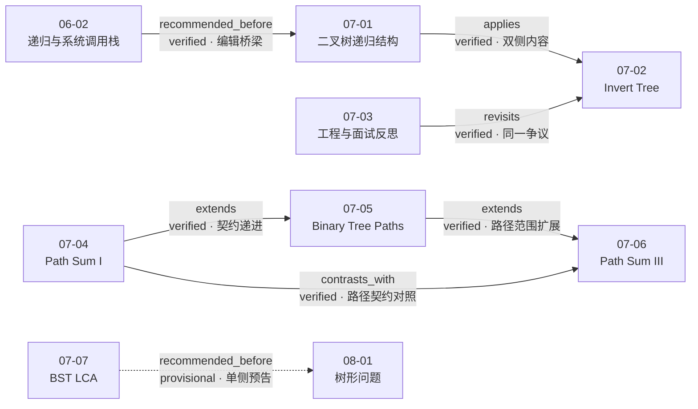

# 第 7 章 二叉树和递归

## 本章解决什么问题

本章真正训练的不是“看到二叉树就递归左右孩子”，而是先回答四个更严格的问题：

1. **函数契约是什么**：对“以当前节点为根的子树”，函数返回什么，或完成什么修改？
2. **基本情况是什么**：空树、叶节点、目标命中，哪一个才对应题目的语义终点？
3. **子问题怎样组合**：取最大值、逻辑或、拼接集合、分三类计数，还是借有序性只保留一侧？
4. **输入前提是什么**：普通二叉树还是 BST，路径从哪里开始、在哪里结束，目标节点是否保证存在？

七课把这条主线逐步展开：

- [07-01](../lessons/07-01.md) 建立“二叉树天然递归”与“先定义函数语义”的总框架；
- [07-02](../lessons/07-02.md) 用 Invert Binary Tree 展示原地修改型递归；
- [07-03](../lessons/07-03.md) 暂停算法实现，从争议故事讨论算法、工程能力、用户价值与合作体验的边界；
- [07-04](../lessons/07-04.md) 用 Path Sum 的错误基线说明终止条件必须匹配“根到叶”的语义；
- [07-05](../lessons/07-05.md) 用 Binary Tree Paths 展示返回集合并自底向上组合的递归；
- [07-06](../lessons/07-06.md) 用 Path Sum III 把递归推进到“枚举起点 + 固定起点计数”的双层结构；
- [07-07](../lessons/07-07.md) 用 BST 的整棵子树有序性剪掉一整侧搜索空间。

本章可以压缩成一条统一流程：

```text
确认输入与输出契约
→ 用一句话定义递归函数
→ 找到真正的语义终点
→ 把问题缩小到子树
→ 按题意组合子树结果
→ 用结构归纳或分类讨论解释正确性
→ 分层记录课程结论、编辑推导与验证状态
```

## 七课速览

| 课次                         | 核心问题                                | 一句话结论                                                         |         实测时长 |
| ---------------------------- | --------------------------------------- | ------------------------------------------------------------------ | ---------------: |
| [07-01](../lessons/07-01.md) | 为什么二叉树天然适合递归？              | 左右孩子仍是同类结构；先定义子树函数语义，再写基本情况和组合规则   |        16:01.240 |
| [07-02](../lessons/07-02.md) | 怎样原地翻转整棵二叉树？                | 递归翻转左右子树，交换当前节点的两个孩子指针，并返回原根指针       |        09:09.000 |
| [07-03](../lessons/07-03.md) | 一道算法题能否代表工程师的全部价值？    | 文本借争议故事讨论算法、工程、用户意识和合作体验，不提供翻转树算法 | 文本课（无时长） |
| [07-04](../lessons/07-04.md) | Path Sum 的成功终点为什么必须是叶节点？ | 空指针不等于完成根到叶路径；只有叶节点才能判定剩余目标是否命中     |        12:04.200 |
| [07-05](../lessons/07-05.md) | 怎样返回所有根到叶路径？                | 子树返回路径字符串集合，当前节点给每条子路径加前缀后汇总           |     13:34.881088 |
| [07-06](../lessons/07-06.md) | 怎样统计任意起点的向下目标和路径？      | 按起点分成当前根、左子树、右子树三类，再用辅助递归统计固定起点路径 |        14:11.160 |
| [07-07](../lessons/07-07.md) | 怎样利用 BST 有序性寻找 LCA？           | 两目标同左则左、同右则右，否则当前根就是分叉点或目标节点           |        17:50.440 |

六个视频的总实测时长为 **01:22:50.921088**。`07-03` 是本地 Markdown 文本教程，没有视频时长，不计入合计，也不为它补造时间戳。

## 代码与验证状态

本章规范化证据共登记 **9 个代码工件**：

| 课次  | 代码工件           | 内容                                   | 来源             | 完整度   | 项目验证 | 证据边界                                              |
| ----- | ------------------ | -------------------------------------- | ---------------- | -------- | -------- | ----------------------------------------------------- |
| 07-01 | `code-001/002`     | `maxDepth` 展开版与紧凑版              | `shown_in_video` | complete | compiled | 补最小包装后语法编译；未构造输入、运行断言或提交平台  |
| 07-02 | `code-001`         | `invertTree`                           | `shown_in_video` | complete | compiled | 只确认编译；未验证树结构、指针身份或二次翻转          |
| 07-03 | 无                 | 叙事文本，没有算法代码                 | 不适用           | 不适用   | 不适用   | 不从 07-02 或外部资料补造题解                         |
| 07-04 | `code-001/002/003` | 错误基线、叶子条件修正版、逻辑或重构版 | `shown_in_video` | complete | compiled | 三份都能编译；`code-001` 仍是课程刻意保留的逻辑错误版 |
| 07-05 | `code-001`         | `binaryTreePaths`                      | `shown_in_video` | complete | compiled | 未运行示例；字符串输出成本不能由编译结果推出          |
| 07-06 | `code-001`         | `pathSum` + `findPath`                 | `shown_in_video` | complete | compiled | 未运行负数、零值或倾斜树用例                          |
| 07-07 | `code-001`         | BST `lowestCommonAncestor`             | `shown_in_video` | complete | compiled | 未运行；正确性依赖 `p/q` 非空、存在于树中及 BST 语义  |

统计口径是 `2 + 1 + 0 + 3 + 1 + 1 + 1 = 9`。九个工件全部是 **compiled，均未 tested**。

必须始终区分：

1. `complete` 表示视频画面中的算法代码完整可核对；
2. `compiled` 只表示在补齐最小包装后通过语法编译；
3. `tested` 需要实际运行并登记输入与断言，本章没有任何工件达到这一层；
4. 课程口述的 Wrong Answer、题面示例或轶事，不等于本项目复现的运行结果；
5. 正确性仍需依靠契约、归纳、分类或 BST 排除逻辑，不能由“编译成功”推出。

## 递归的统一骨架

### 第一步：定义函数契约

递归函数的名字和参数不等于完整语义。一个可用契约至少要说明：

```text
输入子树是谁？
返回值或副作用是什么？
路径或目标的范围如何解释？
空树怎样处理？
调用者可以依赖什么保证？
```

本章代表契约如下：

| 课次  | 函数契约                                                                                             | 返回/副作用类型 |
| ----- | ---------------------------------------------------------------------------------------------------- | --------------- |
| 07-01 | `maxDepth(root)` 返回以 `root` 为根的树的最大深度                                                    | 单个整数        |
| 07-02 | `invertTree(root)` 原地镜像翻转整棵子树，并返回原来的根指针                                          | 原地修改 + 指针 |
| 07-04 | `hasPathSum(root, sum)` 判断当前子树中是否存在从 `root` 到叶子的路径，其和等于当前剩余目标 `sum`     | 布尔值          |
| 07-05 | `binaryTreePaths(root)` 返回当前根到其所有叶节点的路径字符串集合                                     | 集合            |
| 07-06 | `findPath(node, num)` 统计必须从 `node` 开始的目标和路径；`pathSum(root,sum)` 统计整棵子树内任意起点 | 计数            |
| 07-07 | 在目标非空且存在于当前 BST 的前提下，`lowestCommonAncestor` 返回二者的最近公共祖先                   | 节点指针        |

这些契约不是可互换模板。它们决定了：

- 空树返回 `0`、`NULL`、`false` 还是空集合；
- 叶节点是否需要提前返回；
- 子树结果用 `max`、`||`、字符串拼接、加法还是单侧递归组合；
- 当前函数是否修改输入树；
- 参数表示原目标还是沿路径更新后的剩余目标。

### 第二步：选择基本情况

常见基本情况有三类：

| 基本情况    | 何时适用                               | 本章例子                         |
| ----------- | -------------------------------------- | -------------------------------- |
| 空树        | “没有节点”本身已有明确答案             | 深度 0、翻转返回空、路径集合为空 |
| 叶节点      | 题目成功语义要求一条路径真正结束       | Path Sum、Binary Tree Paths      |
| 分叉点/命中 | 搜索性质已经足以确定答案，无需继续下降 | BST LCA                          |

最危险的错误是看见 `root == NULL` 就机械写返回值，而没有问它是否对应题目语义。`07-04` 的错误基线正是这样产生的。[07-04 | ev-004–ev-008 | 视频 02:38–09:45]

### 第三步：缩小问题

递归必须向更小结构推进：

- 普通树题进入左、右子树；
- Path Sum 更新剩余目标为 `sum - root->val`；
- Path Sum III 的外层递归更换起点区域，内层递归延续固定起点路径；
- BST LCA 依靠有序性只进入必含答案的一侧。

对有限、无环的树，每次调用严格进入孩子节点，最终会到达空树、叶节点或分叉点，因而终止。[editorial_inference | 基于 07-01、07-04–07-07 的代码结构]

### 第四步：组合子问题结果

| 目标                     | 组合规则                                               |
| ------------------------ | ------------------------------------------------------ |
| 最大深度                 | `max(leftDepth, rightDepth) + 1`                       |
| 原地镜像                 | 两侧各自翻转后交换当前 `left/right`                    |
| 是否存在根到叶目标和路径 | 左右子树结果做逻辑或                                   |
| 所有根到叶路径           | 给左右返回的每条字符串加当前根前缀，再汇总             |
| 任意起点目标和路径数     | 当前根起点数 + 左子树任意起点数 + 右子树任意起点数     |
| BST 最近公共祖先         | 同侧递归；不再同侧时直接返回当前根，不组合两个递归结果 |

“都递归左右子树”并不是统一算法；真正需要统一的是先说明子调用结果含义，再选择与输出契约一致的组合方式。

## 核心一：二叉树为什么天然递归

[07-01](../lessons/07-01.md) 从结构定义出发：

```text
Tree =
    Empty
    或 Node(value, left: Tree, right: Tree)
```

左右孩子所代表的结构仍是二叉树，空指针对应递归定义的基本情况。[07-01 | ev-002, ev-005 | 视频 01:17–02:25；05:39–05:58]

课程强调先把函数视为可以处理任意子树的黑盒，再写：

```text
函数语义
→ 终止条件
→ 左右子树递归
→ 当前节点组合
```

Maximum Depth 的契约是：

```text
maxDepth(root)
= 以 root 为根的二叉树最大深度
```

于是：

```text
maxDepth(NULL) = 0
maxDepth(root) = max(maxDepth(left), maxDepth(right)) + 1
```

[07-01 | ev-009–ev-011 | 视频 10:47–14:20]

本课幻灯片中的 `contain` 与 `destroy` 只用于讲解递归语义，不是独立代码工件；Minimum Depth 也只是未展开思考题，不能把常见解法写成本课已经完成的内容。

## 核心二：Invert Tree 是原地修改型递归

[07-02](../lessons/07-02.md) 的函数契约不是“返回一棵新树”，而是：

> 原地翻转以 `root` 为根的整棵树，并返回同一个根指针；空树返回 `NULL`。

课程代码的顺序是：

```text
递归翻转左子树
→ 递归翻转右子树
→ 交换当前节点 left/right
→ 返回 root
```

[07-02 | ev-004 | 视频 03:08–05:12]

这里有三个容易混淆的点：

1. 只交换根节点一次不会翻转子树内部；
2. 子调用的返回值虽然没有被赋给局部变量，但子树已被原地修改；
3. “原地”只说明没有创建第二棵树，不代表辅助空间为 `O(1)`；递归仍占用调用栈。[editorial_inference | 基于 07-02 `code-001`]

正确性可以按树结构归纳：空树已正确；假设左右子树都已成为各自镜像，交换当前节点的两个孩子后，整棵当前树也成为原树的镜像。[editorial_inference | 基于 07-02 `ev-004`]

课程同时转述 Max Howell 推文争议，但没有在项目中核验外部招聘因果；Same Tree、Symmetric Tree、Count Complete Tree Nodes 和 Balanced Binary Tree 也只是思考题。[07-02 | ev-003, ev-005–ev-008]

## 核心三：07-03 的工程价值与证据边界

[07-03](../lessons/07-03.md) 是文本叙事，不是算法课。标题虽然仍提到翻转二叉树，正文却没有：

- 题目输入输出定义；
- 算法步骤；
- 代码；
- 正确性证明；
- 复杂度；
- 运行或平台结果。

因此本章不能从 07-02 复制 `invertTree`，也不能用常见 LeetCode 题解填补文本。[07-03 | 完整文本证据边界]

文本讨论的主要张力是：

| 维度     | 文本实际覆盖                                                   | 不能外推成什么                         |
| -------- | -------------------------------------------------------------- | -------------------------------------- |
| 算法面试 | 答案之外，还会形成共同讨论、共同解决问题和共事体验             | “算法不重要”或“答不出也没有关系”       |
| 工程能力 | 转载回答承认依赖、边界行为、测试等不足，同时强调创造软件的能力 | 一个成功项目能证明所有技术维度都很强   |
| 用户价值 | 解释错误、寻找相似问题、降低修复门槛、减少用户痛苦             | 完整的产品或开源治理方法论             |
| 招聘因果 | 文本明确无法确认真实拒聘原因，并转述多种猜测                   | Google 的官方结论或唯一拒聘原因        |
| 人与技术 | 作者把落点放在尊重用户、交流和技术连接具体的人                 | 所有团队、岗位或公司都采用同一评价公式 |

[07-03 | ev-001–ev-013 | 本地文本第 1–91 段]

这节课的工程价值不是“用产品成功抵消算法基础”，而是提醒面试与工程评价具有多个维度：

```text
算法与基础知识
+ 分析和表达过程
+ 软件工程实践
+ 用户问题意识
+ 合作体验
+ 创造和交付能力
```

这个加法只是本章的编辑性复盘框架，不是文本给出的招聘评分公式。[editorial_inference | 基于 07-03 `ev-002, ev-005–ev-013`]

外部推文、Quora 原帖、Google 招聘记录和翻译准确性均未在本项目中独立核验，必须保持“文本叙述”“回答称”“作者评论”的措辞。

## 核心四：终止条件必须匹配语义终点

[07-04](../lessons/07-04.md) 的 Path Sum 要求路径：

```text
从整棵树的根开始
→ 沿父子边向下
→ 在叶节点结束
→ 节点和等于目标值
```

[07-04 | ev-002, ev-007 | 视频 00:21–00:51；06:13–07:41]

错误基线写成：

```cpp
if (root == NULL)
    return sum == 0;
```

它把“走进空孩子时剩余和恰好为零”误当成“已经完成根到叶路径”。课程用只有右孩子的单侧树说明：非叶节点值已经等于目标时，进入它的空左孩子会错误返回真。[07-04 | ev-004–ev-007 | 视频 02:38–07:41]

修正后的语义分层是：

```text
空树：没有路径，返回 false
叶节点：比较 root->val == sum
非叶节点：把 sum - root->val 交给左右子树
```

[07-04 | ev-008, ev-009 | 视频 07:41–10:32]

本课最重要的迁移原则是：

> 基本情况不是由数据类型机械决定，而是由函数契约中的“任务何时真正完成”决定。

课程报告错误基线提交会 Wrong Answer，但本项目只完成三份代码的语法编译，没有复现平台提交或运行反例。

## 核心五：返回值驱动的自底向上组合

[07-05](../lessons/07-05.md) 把函数定义为：

```text
binaryTreePaths(root)
= 当前根到其所有叶节点的路径字符串列表
```

于是：

```text
空树
→ 返回空列表

叶节点
→ 返回 [to_string(root->val)]

非叶节点
→ 递归取得 leftS 和 rightS
→ 为每条子路径添加 "root->" 前缀
→ 汇总返回
```

[07-05 | ev-001–ev-004 | 视频 00:00–11:34]

这是典型的：

```text
自顶向下拆分子问题
自底向上组合返回值
```

父节点不需要了解子树内部如何发现叶子，只依赖“子调用会返回全部合法子路径”的契约。[course_direct + editorial_inference | 基于 07-05 `ev-003, ev-004`]

复杂度不能只写“每个节点访问一次，所以 `O(n)`”。这份实现还会在多层递归中复制和拼接字符串；更准确的分析必须引入最终输出字符总量以及中间字符串处理成本。课程没有直接给出这项复杂度，章级表格只保留为输出敏感的编辑推导。

## 核心六：三类路径契约不能混用

`07-04`、`07-05`、`07-06` 都出现“路径”，但路径范围、返回类型和成功条件完全不同。

| 维度           | [07-04 Path Sum](../lessons/07-04.md) | [07-05 Binary Tree Paths](../lessons/07-05.md) | [07-06 Path Sum III](../lessons/07-06.md) |
| -------------- | ------------------------------------- | ---------------------------------------------- | ----------------------------------------- |
| 起点           | 整棵输入树的根                        | 当前递归子树的根                               | 任意节点                                  |
| 终点           | 必须是叶节点                          | 必须是叶节点                                   | 任意后代节点，也可在起点结束              |
| 方向           | 向下                                  | 向下                                           | 只能向下                                  |
| 输出           | 是否存在                              | 全部路径字符串                                 | 路径数量                                  |
| 主要参数       | 剩余目标 `sum`                        | 当前子树根                                     | 原目标 `sum` 与固定起点剩余目标 `num`     |
| 基本情况       | 空树 false；叶节点比较值              | 空树空集合；叶节点返回自身                     | 空树 0；命中时计数但继续                  |
| 子结果组合     | 左或右存在即可                        | 给左右路径加前缀并合并                         | 固定根 + 左子树任意起点 + 右子树任意起点  |
| 命中后能否继续 | 叶节点命中即结束                      | 叶节点产生一条完整字符串                       | 必须继续，后续零和段可能再次命中          |

### Path Sum III 的双层契约

[07-06](../lessons/07-06.md) 把职责拆成：

```text
findPath(node, num)
= 必须从 node 开始并包含 node 的向下路径中，
  和为 num 的路径数量

pathSum(root, sum)
= 完全位于 root 子树内、起点任意的目标和路径总数
```

[07-06 | ev-003–ev-005 | 视频 02:07–14:11.16]

任意合法路径按唯一首节点分为：

1. 从当前 `root` 开始；
2. 起点完全位于左子树；
3. 起点完全位于右子树。

三类互不重叠且覆盖所有路径，因此：

```text
pathSum(root, sum)
  = findPath(root, sum)
  + pathSum(root->left, sum)
  + pathSum(root->right, sum)
```

[course_direct + editorial_inference | 基于 07-06 `ev-003, ev-005`]

`findPath` 命中 `node->val == num` 时只能 `res += 1`，不能立即返回。课程明确以负数说明继续向下仍可能再次命中；同一控制流理由也覆盖零值或更一般的零和后缀。[07-06 | ev-004 | 视频 05:57–09:11] [editorial_inference | 零值情形]

## 核心七：BST 用全子树有序性剪枝

[07-07](../lessons/07-07.md) 先复习 BST 语义：

- 当前节点大于**左子树所有节点**；
- 当前节点小于**右子树所有节点**；
- 左右子树本身仍是 BST。

[07-07 | ev-001 | 视频 00:00–01:30]

这不是“只检查左孩子更小、右孩子更大”。正因为约束覆盖整棵子树，比较 `p/q` 与当前根值后才能排除一整侧。

LCA 的三分支是：

```text
p、q 都小于 root
→ 两者和 LCA 都在左子树

p、q 都大于 root
→ 两者和 LCA 都在右子树

其他情况
→ 两者分居两侧，或 root 等于 p/q
→ root 就是 LCA
```

[07-07 | ev-004, ev-005 | 视频 06:14–13:10]

代码的正确性依赖以下输入前提：

- `p`、`q` 非空，课程代码用 `assert` 表达；
- 二者确实存在于输入 BST；
- 值比较足以定位目标，重复值语义需要在面试中另行确认；
- `root` 可以为空，此时返回 `NULL`。

[07-07 | ev-005 | 视频 08:50–13:10]

若目标不保证存在，第三分支的直接返回可能不再满足 LCA 契约，因此这些前提不能藏在代码背后。

## 正确性：本章常用的三种证明抓手

### 1. 结构归纳

适用于 `maxDepth`、`invertTree`、Path Sum 和 Binary Tree Paths：

1. 证明空树或叶节点的基本情况正确；
2. 假设左右子树调用满足各自契约；
3. 证明当前节点的组合规则产生当前树的正确结果；
4. 因调用严格进入更小子树，有限树最终到达基本情况。

### 2. 互斥且完备的分类

适用于 Path Sum III：

- 按路径唯一首节点分类；
- 证明当前根、左子树、右子树三类互斥；
- 证明任意首节点必落在其中一类；
- 分别由三个递归项统计。

### 3. 有序性排除

适用于 BST LCA：

- 两目标同小于根，右侧不可能含二者；
- 两目标同大于根，左侧不可能含二者；
- 不同侧或命中目标时，当前节点是最低分叉点；
- 每层只保留仍可能含答案的一侧。

课程直接给出了递归关系、反例和分支逻辑；以上完整证明组织主要是章级 `editorial_inference`，不能写成每节都给出了形式化证明。

## 复杂度总览

本章复杂度必须分成两层：

### 课程直接结论

只有 [07-07](../lessons/07-07.md) 在回顾 BST 时明确说基本操作**通常**为 `O(log n)`，并在同段提到平衡二叉树、红黑树、`map` 和 `set`。[07-07 | ev-002 | 视频 01:30–04:38]

“通常”不能改写为任意普通 BST 的无条件最坏保证；倾斜树的高度可达 `n`。

### 根据代码得到的编辑推导

设节点数为 `n`、树高为 `h`、最终路径输出总字符量为 `L`：

| 课次  | 算法                  | 时间                                              | 辅助空间                         | 来源层级            |
| ----- | --------------------- | ------------------------------------------------- | -------------------------------- | ------------------- |
| 07-01 | Maximum Depth         | `O(n)`                                            | 递归栈 `O(h)`                    | editorial_inference |
| 07-02 | Invert Binary Tree    | `O(n)`                                            | 递归栈 `O(h)`                    | editorial_inference |
| 07-04 | Path Sum I            | 最坏 `O(n)`；短路可能提前结束                     | 递归栈 `O(h)`                    | editorial_inference |
| 07-05 | Binary Tree Paths     | 至少 `Ω(n + L)`；实际还含多层字符串构造与复制成本 | 递归栈、返回集合和中间字符串成本 | editorial_inference |
| 07-06 | Path Sum III 直接实现 | `O(nh)`；倾斜树最坏 `O(n²)`                       | 递归栈 `O(h)`                    | editorial_inference |
| 07-07 | BST LCA               | `O(h)`；平衡时 `O(log n)`，倾斜时最坏 `O(n)`      | 递归栈 `O(h)`                    | editorial_inference |

边界说明：

- `07-03` 没有算法实现，不适用复杂度分析；
- `07-05` 不能用单一 `O(n)` 隐去输出和字符串复制；
- `07-06` 的最坏 `O(n²)` 不是所有树形的固定成本，更一般的树高表达是 `O(nh)`；
- `07-07` 的 LCA `O(h)` 是代码推导，不是课程直接给出的 LCA 公式；
- 复杂度结论与 `compiled` 验证互不替代。

## 本章常见错误清单

1. 没定义函数语义就直接写两个递归调用。
2. 把空指针机械当成所有树题的成功终点。
3. 混淆空树与叶节点。
4. 忘记 Path Sum I 的路径必须从根开始并在叶子结束。
5. 把 Binary Tree Paths 的返回集合误写成共享全局字符串，却没有定义回退规则。
6. 把 Path Sum III 限制成根到叶路径，或允许路径向上。
7. Path Sum III 命中目标后立即返回，漏掉含负数或零和后缀的更长路径。
8. 外层 `pathSum` 进入子树时错误传递剩余目标，而不是原目标。
9. 只用直接孩子比较判断 BST，忽略整棵子树范围。
10. 对任意 BST 无条件声称 `O(log n)`。
11. 忽略 BST LCA 对 `p/q` 非空且存在的前提。
12. 把原地 Invert Tree 误称为 `O(1)` 辅助空间。
13. 把 07-03 的叙事观点改写成招聘因果或“算法无用论”。
14. 把 `compiled` 写成 `tested` 或 Accepted。
15. 把片尾练习补造成课程已经提供的完整题解。

## 面试中的统一表达框架

### 第一步：澄清题目

先问：

- 空树怎样处理？
- 路径从哪里开始、必须在哪里结束、能否向上？
- 返回存在性、数量、节点、字符串还是完整路径？
- BST 是否允许重复值？
- `p/q` 是否非空并保证在树中？
- 是否允许原地修改输入？
- 输出顺序是否属于契约？
- 数值和、路径长度、字符串总量可能有多大？

### 第二步：写一句函数契约

例如：

```text
这个函数对以 root 为根的子树，返回……
```

若一句话里没有写清“当前根”“叶节点”“任意起点”或“剩余目标”，先不要编码。

### 第三步：选择语义终点

依次检查：

```text
空树是否足以回答？
叶节点是否才是完整答案？
当前节点命中后是否仍可能有更长答案？
BST 比较是否已经确定分叉点？
```

### 第四步：依赖子调用契约

不要从头模拟所有调用栈。假设子调用已经完成其契约，说明当前节点只需：

- 取最大值；
- 交换指针；
- 做逻辑或；
- 拼接返回集合；
- 相加互斥分类；
- 或借有序性选择唯一分支。

### 第五步：证明与终止

明确使用哪一种：

- 树结构归纳；
- 互斥完备分类；
- BST 有序性排除。

再说明每次递归严格下降一层，有限树必达基本情况。

### 第六步：复杂度与验证

最后主动区分：

```text
课程直接给出的复杂度
根据代码推导的复杂度
屏幕代码是否完整
项目只编译还是实际测试
课程现场结果与项目复现是否相同
```

## 练习题地图

| 来源课次 | 练习题                                         | 课程覆盖深度                      | 推荐复习问题                                    |
| -------- | ---------------------------------------------- | --------------------------------- | ----------------------------------------------- |
| 07-01    | 111 Minimum Depth of Binary Tree               | 只提示不能机械把 `max` 换成 `min` | 空孩子为什么不能参与普通 `min`？                |
| 07-02    | 100 Same Tree                                  | 只列题目                          | 契约如何同时约束两棵子树？                      |
| 07-02    | 101 Symmetric Tree                             | 只列题目                          | 镜像比较与同位置比较有何不同？                  |
| 07-02    | 222 Count Complete Tree Nodes                  | 题目与树概念入口                  | 完全二叉树性质能否减少搜索？                    |
| 07-02    | 110 Balanced Binary Tree                       | 定义入口；无完整解法              | 返回布尔值是否足以避免重复求高度？              |
| 07-04    | 111 Minimum Depth of Binary Tree               | 叶节点终止条件练习                | 单侧树怎样暴露错误终止条件？                    |
| 07-04    | 404 Sum of Left Leaves                         | 题意与左叶定义入口                | “左孩子”与“左叶子”有什么区别？                  |
| 07-05    | 113 Path Sum II                                | 题目入口；无完整解法              | 返回路径集合时契约如何加入目标和？              |
| 07-05    | 129 Sum Root to Leaf Numbers                   | 题目入口；无完整解法              | 路径前缀如何转化为数值状态？                    |
| 07-07    | 98 Validate Binary Search Tree                 | 只列题目                          | 为什么只比较直接孩子不够？                      |
| 07-07    | 450 Delete Node in a BST                       | 只列题目                          | 删除后如何保持整棵子树有序性？                  |
| 07-07    | 108 Convert Sorted Array to Binary Search Tree | 只列题目                          | 有序数组怎样对应平衡 BST 的递归区间？           |
| 07-07    | 230 Kth Smallest Element in a BST              | 只列题目                          | 哪一种遍历把 BST 顺序性变成有序序列？           |
| 07-07    | 236 Lowest Common Ancestor of a Binary Tree    | 只列题目                          | 去掉 BST 有序性后，哪两个单侧剪枝分支不再成立？ |

所有练习都应独立完成；表中问题是章级复习提示，不是课程已经给出的答案。

## 复习路线

### 路线 A：递归契约入门

```text
07-01 Maximum Depth
→ 07-02 Invert Binary Tree
```

完成标准：

- 能区分“返回值型递归”和“原地修改型递归”；
- 能写出空树基本情况；
- 能用结构归纳说明当前节点如何组合子树结果；
- 能区分原地修改与递归栈空间。

### 路线 B：终止条件与返回值

```text
07-04 Path Sum
→ 07-05 Binary Tree Paths
```

完成标准：

- 能用单侧树反例解释空指针不等于叶节点；
- 能写清剩余目标的语义；
- 能把子树返回的路径集合自底向上拼接；
- 能说明为什么字符串输出成本不能只看节点访问数。

### 路线 C：复杂路径契约

```text
07-04 根到叶存在性
→ 07-05 根到叶全部路径
→ 07-06 任意起点向下路径计数
```

完成标准：

- 能逐项比较三题的起点、终点、方向和返回类型；
- 能证明 Path Sum III 的三类起点互斥且完备；
- 能解释命中后为何继续；
- 能独立推导 `O(nh)` 与倾斜树 `O(n²)`。

### 路线 D：结构信息带来的剪枝

```text
普通二叉树递归
→ 07-07 BST LCA
```

完成标准：

- 能说出 BST 的整棵子树有序性；
- 能从比较结果推出三个分支；
- 能主动声明 `p/q` 的存在性前提；
- 能把复杂度写成 `O(h)`，而不是无条件 `O(log n)`。

### 路线 E：工程与面试复盘

```text
07-02 算法题与争议入口
→ 07-03 工程、用户与合作体验
```

完成标准：

- 不把叙事文本误当算法课；
- 不把未核验故事写成确定招聘因果；
- 既不否定算法基础，也不把单题表现当成工程师全部价值；
- 能把用户体验落实到错误解释、诊断和恢复路径。

## 章级闪卡

### 契约卡

1. `maxDepth(root)` 的返回值精确定义是什么？
2. `invertTree(root)` 的副作用和返回值分别是什么？
3. Path Sum I 的 `sum` 在递归层中代表原目标还是剩余目标？
4. Binary Tree Paths 的子调用返回哪一段路径？
5. `pathSum` 与 `findPath` 的起点范围有什么不同？
6. BST LCA 的契约依赖哪些输入假设？

### 终止条件卡

1. 空树和叶节点为什么不是同一状态？
2. Path Sum 的错误基线为什么会在单侧树上误判？
3. Binary Tree Paths 到叶节点时为什么直接返回？
4. Path Sum III 命中后为什么不能返回？
5. BST LCA 何时可以在非叶节点直接返回？

### 证明卡

1. 如何用结构归纳证明 Invert Tree？
2. 如何证明 Path Sum III 三类路径不重不漏？
3. 为什么 BST 两目标同小于根时可以剪掉右子树？
4. 为什么有限无环树上的递归一定会终止？

### 复杂度卡

1. 哪一条 `O(log n)` 是课程直接表述？
2. 为什么 BST LCA 更稳妥地写成 `O(h)`？
3. 为什么 Binary Tree Paths 不能简单写成 `O(n)`？
4. Path Sum III 为什么在倾斜树上达到 `O(n²)`？
5. 原地翻转为何仍有 `O(h)` 调用栈？

### 证据卡

1. 本章共有多少个代码工件？
2. 哪一课没有代码和视频时长？
3. `compiled` 与 `tested` 的区别是什么？
4. 07-04 的 Wrong Answer 属于课程现场还是项目复现？
5. 07-03 的哪些外部材料没有独立核验？
6. 哪些复杂度是课程直接结论，哪些是编辑推导？

## 自主练习

1. 为六个算法函数各写一句不超过两行、但无歧义的递归契约。
2. 对同一棵单侧树分别手推 Maximum Depth、Path Sum I 和 Binary Tree Paths。
3. 构造一个 Path Sum I 错误基线返回真、修正版返回假的最小反例。
4. 画出 Invert Tree 在三层树上的返回顺序，并标出每次 `swap` 发生时两棵子树的状态。
5. 对课程 Path Sum III 示例列出每个节点作为起点时 `findPath(node, 8)` 的返回值。
6. 构造一个含负数或零值的例子，使 Path Sum III 同一起点有两个合法终点。
7. 证明 Path Sum III 的三类起点互斥且完备。
8. 用最终输出字符总量 `L` 解释 Binary Tree Paths 的输出成本下界。
9. 构造平衡 BST 和倾斜 BST，比较同一 LCA 查询的递归层数。
10. 构造一个目标节点不在树中的例子，说明课程 LCA 代码为何依赖存在性前提。
11. 把 07-03 的叙述拆成“文本事实、转载观点、作者评论、编辑推导”四列。
12. 从片尾练习中选两题，只先写契约和基本情况，再开始编码。

## 推荐学习顺序与课程关系

以下状态来自本章定稿时对 `notes/relationships.json` 的最终读取：关系文件共有 80 条边，其中 62 条 `verified`、18 条 `provisional`；涉及第七章课次的 11 条边中，10 条已双侧核验，只有 `07-07→08-01` 仍为 `provisional`。



关系状态的含义要与“课程是否明确互指”分开：

- `verified` 表示关系已用起点、终点两侧材料复核，不表示讲师逐条说出了课次 ID；
- `06-02→07-01`、`07-01→07-02`、`07-04→07-05`、`07-05→07-06` 都是内容证据支持的编辑性学习桥梁；
- `07-03→07-02` 有同一人物与翻转二叉树争议的双侧证据，但箭头表示“07-03 回访 07-02”，不是算法依赖；
- `07-04→07-06` 是两类 Path Sum 路径契约的验证对照，不取代经过 07-05 的递进路线；
- `07-07→08-01` 只有 07-07 片尾预告，08-01 尚未完成双侧复核，所以保留为虚线 `provisional`，不进入已验证主知识链。[07-07 | ev-007 | 视频 17:12–17:50.44]

### 跨章节复习关系

| 关系          | 类型              | 状态     | 证据性质                                                               |
| ------------- | ----------------- | -------- | ---------------------------------------------------------------------- |
| `07-03→01-01` | `revisits`        | verified | 两课都反对只看最终答案；01-01 聚焦算法作答，07-03 扩展到协作与工程价值 |
| `07-03→01-02` | `revisits`        | verified | 双侧支持“算法只是多维面试评价的一部分”                                 |
| `03-02→07-05` | `same_pattern_as` | verified | 循环区间与递归返回值都体现“先定义语义契约，再组织控制逻辑”             |
| `07-07→04-03` | `revisits`        | verified | 重访有序树思想；普通 BST 不等同于标准库平衡容器                        |

章内与跨章关系的精确类型、强度、置信度和证据定位以 `relationships.json` 为准。章级综述只展示最有助于复习的结构，不另造隐含先修。

## 证据与质量说明

### 媒介与时长

- `07-01`、`07-02`、`07-04`、`07-05`、`07-06`、`07-07` 是六个视频；
- 六个视频总实测时长为 **01:22:50.921088**；
- `07-03` 是本地 Markdown 文本，没有时长、音轨、画面或视频时间戳；
- 章级引用优先回链到七篇 reviewed 课次笔记及其规范化证据。

### 人工 QA 的关键边界

1. `07-01`：只把两版 `maxDepth` 登记为代码工件；`contain/destroy` 是幻灯片片段；Minimum Depth 未展开。
2. `07-02`：`invertTree` 是原地修改；Max Howell 因果未外部核验；四道练习未展开。
3. `07-03`：保持文本叙事属性，不补算法、代码和复杂度；外部推文、Quora 与招聘事实未核验。
4. `07-04`：区分错误基线、课程报告 Wrong Answer、修正版和项目只编译未测试。
5. `07-05`：函数返回子树根到叶路径集合；复杂度必须考虑字符串与输出成本。
6. `07-06`：路径起终点任意但只能向下；三类起点互斥完备；命中后继续；不补课程未讲的其他优化。
7. `07-07`：BST 性质约束整棵子树；分离基本操作“通常 `O(log n)`”与 LCA 的编辑推导 `O(h)`。

### 仍需保留的不确定项

- 九个代码工件都只到 `compiled`，没有运行测试；
- 除 BST 基本操作“通常 `O(log n)`”外，本章 Big O 均为编辑推导；
- 07-05 的字符串复制成本依赖实现与路径分布，不压缩成未经证明的单一紧确式；
- 07-03 的外部故事、原帖和翻译没有独立核验；
- 片尾练习均未被课程完整求解；
- 指向第八章的关系在目标课程完成双侧复核前必须保持 `provisional`。

## 本章最终检查清单

- [ ] 我能在编码前写出递归函数契约。
- [ ] 我能区分返回值型、原地修改型、集合型和计数型递归。
- [ ] 我能解释空树、叶节点和分叉点分别何时成为终止条件。
- [ ] 我能用结构归纳说明 Maximum Depth 与 Invert Tree。
- [ ] 我不会把 Invert Tree 的原地修改误写成 `O(1)` 辅助空间。
- [ ] 我能用单侧树反例解释 Path Sum 错误基线。
- [ ] 我能比较 Path Sum I、Binary Tree Paths 和 Path Sum III 的完整契约。
- [ ] 我能证明 Path Sum III 三类起点互斥且完备。
- [ ] 我知道 Path Sum III 命中后仍需递归。
- [ ] 我能说出 BST 整棵子树有序性，而不只比较直接孩子。
- [ ] 我能写出 BST LCA 的三个分支和输入前提。
- [ ] 我会把 LCA 复杂度写成 `O(h)` 并说明平衡与倾斜情况。
- [ ] 我能区分课程直接复杂度与编辑推导。
- [ ] 我知道本章 9 个代码工件全部 compiled、没有 tested。
- [ ] 我不会把 07-04 课程报告的 Wrong Answer 写成本项目测试结果。
- [ ] 我不会把 07-03 扩写成算法题解或确定招聘因果。
- [ ] 我知道 07-03 是无时长文本课。
- [ ] 我不会把练习题写成课程已经讲解的答案。
- [ ] 我能说明哪些跨课关系已验证、哪些仍是 provisional。
