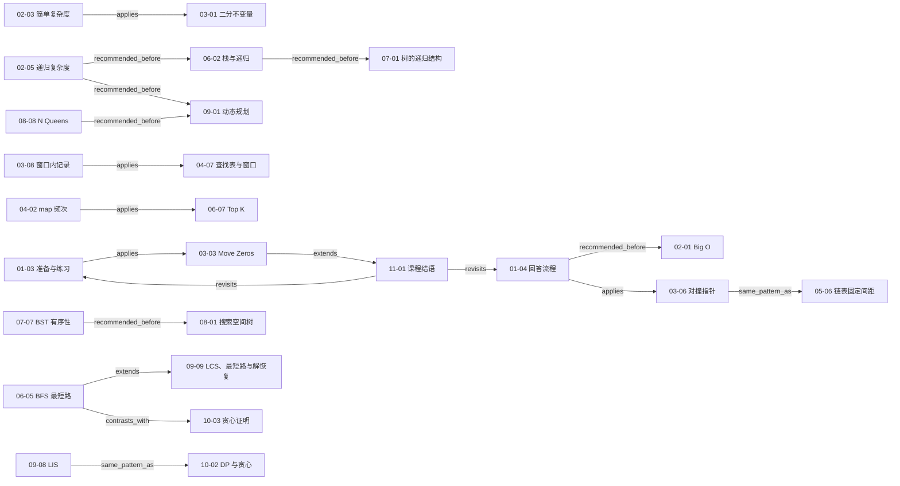

# 算法面试课程综合：知识地图、算法模板与复习路线

> **阅读边界**
>
> 本文是基于已审阅单课笔记、章节综述、规范概念词表与关系图形成的**编辑综合**，不是第 11 章视频的逐字内容。尤其是“六层能力模型”“题型簇”“四条复习路线”和统一答题框架，都是对全课程的二次组织。第 [11-01](lessons/11-01.md) 节直接支持的结论仅包括：基础知识的重要性、讲师在录制时推荐用 LeetCode 继续练习、不能停在 Accepted，以及形成对问题分类和基本思考模式的认识；课程持续维护只是讲师在录制时表达的计划。
>
> 文中的相对链接按最终文件位于 notes/course-synthesis.md 设计。

## 1. 课程总览

这套课程共覆盖 **11 章、70 课**，其中有 **67 个视频素材、3 个文本素材**；67 个视频的实测总时长约为 **18 小时 31 分 06 秒**。课程不是一份孤立题解合集，而是在反复训练同一条主线：

> **澄清约束 → 建立模型 → 给出基线 → 定义状态与不变量 → 实现 → 证明正确 → 分析复杂度 → 测试边界 → 比较优化 → 迁移到新题。**

这条主线从第 1 章的“把思考过程说出来”开始，在第 2 章获得复杂度语言，在第 3—8 章通过不同数据结构和搜索空间反复练习，在第 9—10 章上升到全局优化与证明，最后由第 11 章收束为长期学习闭环。它也解释了为什么“写出一个能通过的程序”只是中间节点，而不是学习终点：[01-01](lessons/01-01.md)、[01-04](lessons/01-04.md)、[03-03](lessons/03-03.md)、[11-01](lessons/11-01.md)。

| 章节                       | 核心任务               | 学完后应能回答的问题                                         |
| -------------------------- | ---------------------- | ------------------------------------------------------------ |
| [第 1 章](chapters/01.md)  | 面试方法论             | 我怎样让面试官看见澄清、推导、权衡和验证过程？               |
| [第 2 章](chapters/02.md)  | 复杂度分析             | 输入规模增大时，时间和空间成本怎样增长，结论适用于哪种情况？ |
| [第 3 章](chapters/03.md)  | 数组、双指针、滑动窗口 | 每个变量代表哪个区间或区域，更新后不变量是否仍成立？         |
| [第 4 章](chapters/04.md)  | 查找表                 | 查询谓词应编码成什么键和值，是否需要顺序性？                 |
| [第 5 章](chapters/05.md)  | 链表                   | 指针改写前要保存什么，改写顺序依赖什么，头尾如何统一处理？   |
| [第 6 章](chapters/06.md)  | 栈、队列、优先队列     | 下一步应该处理谁，哪种容器能直接表达这种顺序？               |
| [第 7 章](chapters/07.md)  | 二叉树与递归           | 子问题契约是什么，终止条件是什么，子答案怎样组合？           |
| [第 8 章](chapters/08.md)  | 回溯与状态空间搜索     | 当前部分解、候选集合、约束和撤销语义分别是什么？             |
| [第 9 章](chapters/09.md)  | 动态规划               | 状态含义、转移、初始化、计算顺序和最终答案位置是什么？       |
| [第 10 章](chapters/10.md) | 贪心                   | 局部选择为什么安全，怎样用反例和交换论证检验它？             |
| [第 11 章](chapters/11.md) | 学习闭环               | 怎样把做题反馈沉淀成分类、模板、边界和可迁移能力？           |

课程的整体脉络可以压缩为三次升级：

1. **从答案升级到可观察推理。** 第 [01-01](lessons/01-01.md) 节强调面试评价不只看最后结果，第 [01-02](lessons/01-02.md) 节把算法面试放回完整招聘评价中，第 [01-04](lessons/01-04.md) 节给出完整回答过程。
2. **从具体代码升级到状态、不变量与证明。** 二分边界 [03-01](lessons/03-01.md)、递归契约 [07-05](lessons/07-05.md)、回溯覆盖性 [08-05](lessons/08-05.md)、动态规划状态 [09-04](lessons/09-04.md) 和贪心交换论证 [10-03](lessons/10-03.md)，都在回答“为什么不会漏、不会错”。
3. **从单题升级到模式库与学习系统。** 基于第 [11-01](lessons/11-01.md) 节对录制时平台推荐、超越 Accepted 和分类认知的直接内容，本文将其编辑整理为长期反馈回路；“持续维护课程”只保留为讲师在录制时表达的计划。

## 2. 六层能力模型

六层不是课程原有分章名称，而是依据全课程材料形成的编辑模型。学习时可以逐层建立，但面试答题时六层通常同时出现。

| 层级 | 能力                 | 关键动作                                             | 课程锚点                                                                                                   | 自检问题                                                   |
| ---- | -------------------- | ---------------------------------------------------- | ---------------------------------------------------------------------------------------------------------- | ---------------------------------------------------------- |
| 1    | 面试元能力与学习闭环 | 澄清、举例、沟通权衡；把做题反馈归档                 | [01-01](lessons/01-01.md)、[01-03](lessons/01-03.md)、[01-04](lessons/01-04.md)、[11-01](lessons/11-01.md) | 我是否说清了目标、约束、假设与验证方式？做完后沉淀了什么？ |
| 2    | 成本与正确性分析     | 选规模变量、数基本操作、陈述情况；写不变量或证明骨架 | [02-01](lessons/02-01.md)—[02-07](lessons/02-07.md)、[03-01](lessons/03-01.md)、[05-02](lessons/05-02.md)  | 复杂度的变量和情况是什么？正确性靠什么成立？               |
| 3    | 线性结构与局部模式   | 区间划分、双指针、窗口、查找表、指针改写             | [03-01](lessons/03-01.md)—[05-06](lessons/05-06.md)                                                        | 状态代表哪段数据？一次更新排除了什么或维护了什么？         |
| 4    | 非线性结构与遍历顺序 | 用栈、队列、堆、递归表达处理次序；利用树结构和有序性 | [06-01](lessons/06-01.md)—[07-07](lessons/07-07.md)                                                        | 下一步处理谁？递归子问题是什么？结构性质能剪掉哪一支？     |
| 5    | 状态空间搜索         | 枚举选择、维护路径约束、剪枝、撤销或永久标记         | [08-01](lessons/08-01.md)—[08-08](lessons/08-08.md)                                                        | 搜索树的节点、分支、终点和去重规则是什么？                 |
| 6    | 全局优化             | 识别重叠子问题、定义 DP；检验贪心选择并给出证明      | [09-01](lessons/09-01.md)—[10-03](lessons/10-03.md)                                                        | 当前状态依赖谁？局部选择是否保持某个最优解可达？           |

贯穿六层的三个支柱是：

- **状态语义。** 二分的区间、滑动窗口的有效区间、递归函数的返回值、回溯的部分解、DP 数组的下标含义，本质上都要求“变量先有精确定义，再写更新”。参见 [03-02](lessons/03-02.md)、[03-08](lessons/03-08.md)、[07-05](lessons/07-05.md)、[08-02](lessons/08-02.md)、[09-04](lessons/09-04.md)。
- **候选消除。** 对撞指针一次排除一批不可能组合，BST 利用顺序性舍弃子树，剪枝排除不可能完成的分支，贪心论证证明某次选择不损失最优性。参见 [03-06](lessons/03-06.md)、[07-07](lessons/07-07.md)、[08-05](lessons/08-05.md)、[10-03](lessons/10-03.md)。
- **证据与验证。** 示例和测试帮助发现错误，复杂度实验帮助验证增长趋势，但它们不能替代普遍性的正确性论证；线上 Accepted 也不自动等于边界、复杂度和迁移能力都已掌握。参见 [02-04](lessons/02-04.md)、[05-02](lessons/05-02.md)、[11-01](lessons/11-01.md)。

## 3. 全课程知识地图

下面是**跨章节主干的代表性子图**，并非 97 条关系的完整可视化。图中每条边都来自 relationships.json 中当前状态为 verified 的关系；箭头方向、关系名均保持数据文件定义。

### 3.1 三条读图主线

**方法闭环：** [01-03](lessons/01-03.md) 的学习与练习原则落到第一道平台题 [03-03](lessons/03-03.md)，再由 [11-01](lessons/11-01.md) 回看准备和回答方法。它说明课程的结尾不是“学完”，而是回到新一轮基础、练习、复盘和分类。

**表示与候选消除：** [03-08](lessons/03-08.md) 把窗口中的字符状态交给查找结构，[04-07](lessons/04-07.md) 进一步把查找表和窗口组合；[03-06](lessons/03-06.md) 与 [05-06](lessons/05-06.md) 虽然操作对象不同，却都利用相对位置维护双指针关系。

**从搜索到优化与证明：** [02-05](lessons/02-05.md) 为递归调用树提供成本视角；[08-08](lessons/08-08.md) 展示约束搜索，再进入 [09-01](lessons/09-01.md) 的记忆化与动态规划；[09-08](lessons/09-08.md) 和 [10-02](lessons/10-02.md) 共享“以当前位置结尾、枚举兼容前驱、从全表取最大值”的 DP 状态模式。[10-02](lessons/10-02.md) 课内另以区间问题比较 DP 与贪心，[10-03](lessons/10-03.md) 再把重点转向贪心选择的安全性证明。

### 3.2 各章内部的“递进链”

| 主干       | 已验证关系所表达的递进                                                                                                                                                                                                                                                           |
| ---------- | -------------------------------------------------------------------------------------------------------------------------------------------------------------------------------------------------------------------------------------------------------------------------------- |
| 复杂度     | [02-01](lessons/02-01.md) → [02-02](lessons/02-02.md) → [02-03](lessons/02-03.md) → [02-04](lessons/02-04.md)：从渐进语言、数据规模到代码计数与实验验证；[02-03](lessons/02-03.md) 还扩展到递归与均摊分析。                                                                      |
| 数组模式   | [03-03](lessons/03-03.md) → [03-04](lessons/03-04.md) → [03-05](lessons/03-05.md)：从原地压缩到分区；[03-06](lessons/03-06.md) → [03-07](lessons/03-07.md) → [03-08](lessons/03-08.md)：从相向移动到可变窗口及窗口内状态。                                                       |
| 查找表     | [04-01](lessons/04-01.md) → [04-02](lessons/04-02.md) → [04-03](lessons/04-03.md)：集合、映射、底层有序性；[04-04](lessons/04-04.md) → [04-05](lessons/04-05.md) → [04-06](lessons/04-06.md)：从补数查询到灵活设计聚合键，后两课为同模式关系。                                   |
| 链表       | [05-01](lessons/05-01.md) → [05-03](lessons/05-03.md) → [05-04](lessons/05-04.md)：基础改链、虚拟头、成组改链；[05-03](lessons/05-03.md) 与 [05-05](lessons/05-05.md) 对照不同删除契约。                                                                                         |
| 处理顺序   | [06-02](lessons/06-02.md) → [06-03](lessons/06-03.md)：系统调用栈到显式指令栈；[06-04](lessons/06-04.md) → [06-05](lessons/06-05.md)：层序遍历到无权状态图最短路；[06-06](lessons/06-06.md) → [06-07](lessons/06-07.md) → [06-08](lessons/06-08.md)：优先队列到两类 Top K 套路。 |
| 递归与回溯 | [07-04](lessons/07-04.md) → [07-05](lessons/07-05.md) → [07-06](lessons/07-06.md)：终止条件、递归定义、双层递归；[08-01](lessons/08-01.md) → [08-02](lessons/08-02.md) → [08-03](lessons/08-03.md)：搜索树、回溯定义、排列实例。                                                 |
| 动态规划   | [09-01](lessons/09-01.md) → [09-02](lessons/09-02.md) → [09-03](lessons/09-03.md) → [09-04](lessons/09-04.md)：方法、入门、重叠子问题、状态定义；[09-05](lessons/09-05.md) → [09-06](lessons/09-06.md) → [09-07](lessons/09-07.md)：0-1 背包、压缩与变种、子集和。               |
| 贪心       | [10-01](lessons/10-01.md) → [10-02](lessons/10-02.md) → [10-03](lessons/10-03.md)：可执行规则、与 DP 的关系、反例和证明。                                                                                                                                                        |

## 4. 题型簇索引

看到题目时，先识别“状态和约束的形状”，再匹配题名。下表把课程按可迁移题型重新分组。

| 题型簇             | 识别信号                                               | 首选检查                                                   | 课程锚点                                                                                                   | 适用边界与常见误判                                                        |
| ------------------ | ------------------------------------------------------ | ---------------------------------------------------------- | ---------------------------------------------------------------------------------------------------------- | ------------------------------------------------------------------------- |
| 区间与不变量       | 有序数组、边界定位、循环退出后区间含义重要             | 闭区间还是半开区间？每轮排除哪一段？                       | [03-01](lessons/03-01.md)、[03-02](lessons/03-02.md)                                                       | 不要混用两套边界定义；“写法相似”不代表更新规则可互换。                    |
| 原地分区与双指针   | 原地移动、删除、分类；左右端有单调排除能力             | 指针之间的区域分别表示什么？                               | [03-03](lessons/03-03.md)—[03-06](lessons/03-06.md)、[05-06](lessons/05-06.md)                             | 若左右移动不具备可证明的排除性，双指针可能漏解。                          |
| 滑动窗口           | 连续子数组/子串；右端扩张、左端收缩                    | 有效性是否随移动方向呈单调变化？窗口内需记录什么？         | [03-07](lessons/03-07.md)、[03-08](lessons/03-08.md)、[04-07](lessons/04-07.md)、[04-08](lessons/04-08.md) | 负数等条件可能破坏单调收缩；需要范围查询时普通哈希表不够。                |
| 查找与键设计       | 频次、补数、去重、按某种等价关系聚合                   | 查询谓词如何变成 key？value 保存存在性、次数还是位置？     | [04-01](lessons/04-01.md)—[04-06](lessons/04-06.md)                                                        | 哈希结构擅长精确查询；有序结构才直接支持邻近与范围。                      |
| 链表穿针引线       | 只有节点引用，需反转、删除、交换或倒数定位             | 先保存哪个后继？谁指向谁？头结点是否特殊？                 | [05-01](lessons/05-01.md)—[05-06](lessons/05-06.md)                                                        | “复制后继值删除”有严格前置条件，不能替代一般删除。                        |
| 括号、遍历与显式栈 | 后进先出配对；需模拟递归或保存待办指令                 | 栈元素是数据节点、状态还是动作？                           | [06-01](lessons/06-01.md)—[06-03](lessons/06-03.md)                                                        | 仅压入节点常不足以复现递归；还要编码进入/退出等阶段。                     |
| 分层搜索与最短步数 | 无权图、状态转换、要求最少步数或逐层输出               | 邻居如何生成？何时标记 visited？                           | [06-04](lessons/06-04.md)、[06-05](lessons/06-05.md)                                                       | BFS 的最短路结论依赖等权边；入队时标记通常避免重复入队。                  |
| 网格路径与连通块   | 二维网格中沿四邻域/给定方向搜索路径，或统计连通分量    | visited 是当前路径局部约束，还是节点已归属分量的永久标记？ | [08-06](lessons/08-06.md)、[08-07](lessons/08-07.md)                                                       | Word Search 返回后要恢复路径标记；Island 的已访问格归属确定后不应恢复。   |
| Top K 与动态优先级 | 只要最大/最小 K 个；下一项由优先级决定                 | 保存全部还是维护大小为 K 的边界？比较器方向是什么？        | [06-06](lessons/06-06.md)—[06-08](lessons/06-08.md)                                                        | “求最大 K 个”不必使用最大堆；维护 K 个最大值常用小顶堆。                  |
| 树递归与结构剪枝   | 树天然分解为左右子树；答案可由子答案组合               | 函数契约、空树语义、组合式是什么？                         | [07-01](lessons/07-01.md)、[07-02](lessons/07-02.md)、[07-04](lessons/07-04.md)—[07-07](lessons/07-07.md)  | BST 的顺序剪枝不能套到普通二叉树；终止条件要服从契约。                    |
| 回溯与约束满足     | 要列举排列、组合、路径或布局；选择会影响后续候选       | 部分解、候选域、约束、终点、撤销分别是什么？               | [08-01](lessons/08-01.md)—[08-03](lessons/08-03.md)、[08-04](lessons/08-04.md)—[08-08](lessons/08-08.md)   | Word Search 的 visited 是路径局部状态；Island 的 visited 是全局永久归属。 |
| 动态规划           | 最优值/计数/可行性；重叠子问题；状态图可按依赖顺序计算 | 状态含义、选择、转移、初始化、顺序、答案位置               | [09-01](lessons/09-01.md)—[09-09](lessons/09-09.md)                                                        | 只写转移式不等于定义了状态；空间压缩后遍历方向可能改变问题语义。          |
| 贪心与全局优化     | 排序后可逐项承诺选择；希望局部决策构成全局最优         | 能否构造反例？能否交换为包含该选择的最优解？               | [10-01](lessons/10-01.md)—[10-03](lessons/10-03.md)                                                        | “看起来最划算”不是证明；失败时回到 DP 或搜索建模。                        |
| 工程验证与学习反馈 | 代码貌似正确但边界脆弱；平台已通过却不会迁移           | 最小、空、单元素、重复、极端规模是否覆盖？复盘了什么？     | [05-02](lessons/05-02.md)、[07-03](lessons/07-03.md)、[11-01](lessons/11-01.md)                            | 测试与 Accepted 提供反例证据，不替代普遍性证明。                          |

## 5. 高频算法模板目录

这里的“模板”指可复用的状态骨架，不是要求死记代码。面试中应先说明适用条件，再落到语言实现。

| 模板                 | 核心状态/不变量                                                | 典型成本                                              | 课程锚点                                                                        | 高频陷阱                                                   |
| -------------------- | -------------------------------------------------------------- | ----------------------------------------------------- | ------------------------------------------------------------------------------- | ---------------------------------------------------------- |
| 二分搜索             | 目标若存在，始终位于当前候选区间；循环退出时区间为空或定位完成 | 时间 O(log n)，额外空间通常 O(1)                      | [03-01](lessons/03-01.md)、[03-02](lessons/03-02.md)                            | 区间定义与 while 条件、mid 更新不一致。                    |
| 原地压缩/分区        | 已处理区间被划分为满足不同谓词的区域；慢指针指向下一写入位     | 通常时间 O(n)、空间 O(1)                              | [03-03](lessons/03-03.md)—[03-05](lessons/03-05.md)                             | 覆盖尚未读取的数据；交换后忘记重新判断未知区。             |
| 对撞指针             | 在有序性支持下，一次移动可排除一整批组合                       | 常见时间 O(n)、空间 O(1)                              | [03-06](lessons/03-06.md)                                                       | 没有证明移动方向的排除性；把“索引”和“答案编号”混淆。       |
| 滑动窗口             | 窗口表示当前连续候选；右端扩张获取信息，左端在条件允许时收缩   | 每个元素至多进出一次时为 O(n)；状态空间另计           | [03-07](lessons/03-07.md)、[03-08](lessons/03-08.md)                            | 有效性不单调仍强行套窗口；更新答案的时机错误。             |
| 哈希补数/频次        | 已扫描元素的存在性、次数或索引足以回答当前查询                 | 平均时间常为 O(n)，额外空间 O(n)；最坏情况依实现      | [04-02](lessons/04-02.md)、[04-04](lessons/04-04.md)—[04-06](lessons/04-06.md)  | 先插入还是先查询影响“能否使用自身”；忽略重复次数。         |
| 链表改链             | 保存将丢失的后继；按依赖顺序更新引用；虚拟头统一头部情况       | 单次遍历 O(n)，额外空间常为 O(1)                      | [05-01](lessons/05-01.md)、[05-03](lessons/05-03.md)、[05-04](lessons/05-04.md) | 指针改写顺序造成断链或环；返回旧头。                       |
| 固定间距双指针       | 快慢指针始终相隔固定节点数；快指针到终点时慢指针落在目标前驱   | 时间 O(n)、空间 O(1)                                  | [05-06](lessons/05-06.md)                                                       | 间距的节点数/边数差一；删除头结点时无前驱。                |
| 递归 DFS             | 明确函数对一棵子树/一个状态返回什么；基例与组合式服从契约      | 时间与访问状态数相关；空间含递归深度                  | [07-01](lessons/07-01.md)、[07-04](lessons/07-04.md)—[07-07](lessons/07-07.md)  | 基例返回值凭直觉写；只算节点访问而漏算输出复制成本。       |
| BFS 分层/最短步      | 队列保存下一层边界；无权图中首次到达给出最少边数               | 时间 O(V+E)，空间 O(V)，前提是显式/隐式图规模如此定义 | [06-04](lessons/06-04.md)、[06-05](lessons/06-05.md)                            | 出队才标记造成重复；把有权最短路误当普通 BFS。             |
| 回溯：选择—递归—撤销 | 路径是部分解；候选只含合法选择；返回后恢复路径局部状态         | 通常与搜索树节点数/输出规模相关                       | [08-02](lessons/08-02.md)—[08-06](lessons/08-06.md)、[08-08](lessons/08-08.md)  | 该撤销的状态未撤销，或该永久标记的状态被撤销；剪枝不安全。 |
| 动态规划六问         | 状态含义、选择、转移、初值、依赖顺序、答案位置                 | 时间约为状态数 × 每状态转移数；空间为保存状态量       | [09-01](lessons/09-01.md)—[09-05](lessons/09-05.md)、[09-08](lessons/09-08.md)  | 状态语义含糊；初始化不可达状态错误；遍历顺序覆盖依赖。     |
| 0-1 背包压缩         | dp[c] 只使用上一轮物品状态；一维实现容量需逆序                 | 常见 O(nC) 时间、O(C) 空间                            | [09-05](lessons/09-05.md)—[09-07](lessons/09-07.md)                             | 正序容量会让同一物品被重复使用，变成完全背包语义。         |
| 贪心：排序—扫描—承诺 | 每次选择可通过交换论证嵌入某个最优解，剩余部分保持同类结构     | 常见由排序主导为 O(n log n)，具体题目另算             | [10-01](lessons/10-01.md)—[10-03](lessons/10-03.md)                             | 只有规则没有证明；比较器或端点相交定义写错。               |
| Top K 有界堆         | 堆顶保存当前 K 个候选中的淘汰边界                              | n 个元素时常为 O(n log K)，空间 O(K)                  | [06-06](lessons/06-06.md)—[06-08](lessons/06-08.md)                             | 堆方向反了；频次统计与堆维护的成本混在一起。               |

复杂度列只描述课程中对应实现的典型形态，不是对所有同名算法的无条件承诺。若输入含多个独立规模、输出本身很大、哈希碰撞模型不同，必须重新建模，参见 [02-01](lessons/02-01.md)—[02-05](lessons/02-05.md)。

## 6. 正确性与复杂度分析框架

### 6.1 正确性：先选证明骨架

| 程序形态           | 合适的证明骨架                       | 回答要点                                                   | 课程锚点                                                                        |
| ------------------ | ------------------------------------ | ---------------------------------------------------------- | ------------------------------------------------------------------------------- |
| 循环、区间、双指针 | 循环不变量                           | 初始化成立；一次迭代保持；退出条件推出目标                 | [03-01](lessons/03-01.md)、[03-02](lessons/03-02.md)、[03-06](lessons/03-06.md) |
| 链表局部改写       | 局部结构不变量 + 依赖顺序            | 已处理前缀正确；未处理后缀可达；关键后继未丢失             | [05-01](lessons/05-01.md)、[05-04](lessons/05-04.md)                            |
| 递归/树算法        | 递归契约 + 结构归纳                  | 基例正确；假设子问题正确；组合得到当前问题答案             | [07-01](lessons/07-01.md)、[07-05](lessons/07-05.md)—[07-07](lessons/07-07.md)  |
| BFS 最短路         | 分层不变量                           | 队列按距离层处理；首次到达前不存在更短路径                 | [06-04](lessons/06-04.md)、[06-05](lessons/06-05.md)                            |
| 回溯               | 完备性 + 唯一性 + 剪枝安全           | 每个合法解有一条生成路径；无重复生成；被剪分支不可能完成   | [08-03](lessons/08-03.md)—[08-05](lessons/08-05.md)、[08-08](lessons/08-08.md)  |
| 动态规划           | 状态归纳 + 转移完备性                | 状态覆盖所需子问题；枚举所有最后选择；依赖已计算           | [09-03](lessons/09-03.md)—[09-05](lessons/09-05.md)、[09-08](lessons/09-08.md)  |
| 贪心               | 反例压力测试 + 交换论证/贪心选择性质 | 任取最优解，可交换成包含当前选择且不变差；剩余仍为同类问题 | [10-02](lessons/10-02.md)、[10-03](lessons/10-03.md)                            |

一个可复用的正确性陈述顺序是：

1. **定义。** 变量、区间、状态或函数返回值精确代表什么。
2. **初始化。** 第一次循环/递归前为什么满足定义。
3. **保持。** 每种分支为何不会丢掉合法解，并继续满足定义。
4. **终止。** 度量如何严格缩小，为什么一定结束。
5. **推出。** 终止状态为什么正好等于题目答案。

> **贪心证明的证据边界：** 第 [10-01](lessons/10-01.md) 节的匹配正确性与第 [10-03](lessons/10-03.md) 节的区间正确性在规范化笔记中都保持 completeness = partial。10-03 确实给出了有实质内容的一步交换引理，但没有形式化补齐任意步骤的量词、并列与端点语义、剩余子问题闭包以及重复交换/归纳。上表列出的是完整证明应检查的义务；其中闭包、重复交换与归纳属于编辑补全，不能表述成视频已经完成的证明。

测试可以帮助找到上述论证中的漏洞，却不能证明所有输入都正确。建议至少覆盖：空或最小输入、单元素、重复值、已排序/逆序、答案在头尾、不存在答案、极端规模。链表测试方法见 [05-02](lessons/05-02.md)，对“通过平台之后仍需复盘”的边界见 [03-03](lessons/03-03.md) 与 [11-01](lessons/11-01.md)。

### 6.2 复杂度：八步分析法

1. **命名规模变量。** 是 n、m、树高 h、容量 C、字符集大小，还是多个变量？参见 [02-01](lessons/02-01.md)。
2. **选基本操作。** 比较、赋值、哈希查询、边遍历或状态转移，哪一种随规模主导增长？参见 [02-03](lessons/02-03.md)。
3. **分阶段计数。** 排序、预处理、主循环、结果构造分别计数，再取主导项；不要只看到嵌套就机械相乘。
4. **说明情况。** 最好、平均、最坏，还是摊还？哈希平均 O(1) 与最坏情况不能混写；动态数组扩容要用摊还分析。参见 [02-06](lessons/02-06.md)。
5. **处理递归。** 写出调用规模与每层工作；必要时画递归树，不能只数函数体的一层。参见 [02-05](lessons/02-05.md)。
6. **计算空间。** 显式容器、递归栈、备忘录、输出结果分别说明；原地通常仍可能使用递归栈。
7. **核对实现细节。** 字符串拼接、路径复制、比较器、语言容器操作是否改变成本；输出所有解至少需要与输出规模相称的时间。
8. **用实验验证趋势。** 按倍增规模观察时间比值，用来检验推导和实现常数，但不把实验替代理论。参见 [02-04](lessons/02-04.md)。

数据规模是复杂度与工程可行性之间的桥梁：先用 [02-02](lessons/02-02.md) 建立数量级预算，再决定 O(n²)、O(n log n) 或指数搜索是否可接受；需要时可用安全剪枝 [08-05](lessons/08-05.md) 减少搜索、用记忆化/DP [09-01](lessons/09-01.md) 合并重复状态。若能证明贪心选择性质 [10-03](lessons/10-03.md)，才可采用相应贪心算法，并按新实现重新计算成本；证明本身不会改变复杂度。

### 6.3 证据强度阶梯

从弱到强可以这样理解实现证据：

> 看起来合理 → 手工走例 → 边界测试 → 本地编译/运行 → 自动化测试 → 在线评测通过 → 正确性论证与复杂度说明完整。

这不是说右侧每一项都严格包含左侧，也不是课程原话排序；它是用于复盘笔记证据的编辑框架。尤其在线评测通过只证明通过了该平台当次测试集合，不足以单独证明通用正确性或掌握迁移模式，[11-01](lessons/11-01.md) 对“不要停在 Accepted”的提醒正对应这一点。

## 7. 易混淆概念对照

### 7.1 策略与数据结构

| 容易混淆的两侧               | 关键差异                                                                  | 选择判据                                                | 课程锚点                                                                        |
| ---------------------------- | ------------------------------------------------------------------------- | ------------------------------------------------------- | ------------------------------------------------------------------------------- |
| 闭区间二分 vs 半开区间二分   | 候选区间是否包含右端点                                                    | 先写区间语义，再配套循环条件与边界更新；两套都可正确    | [03-01](lessons/03-01.md)、[03-02](lessons/03-02.md)                            |
| 双指针 vs 滑动窗口           | 双指针强调两个位置的协同与候选消除；窗口强调连续区间的扩张/收缩和窗口状态 | 是否存在连续区间，以及合法性是否支持单调收缩            | [03-06](lessons/03-06.md)—[03-08](lessons/03-08.md)                             |
| 哈希 set/map vs 有序 set/map | 前者偏精确查询的平均常数时间；后者维护顺序并支持范围/邻近查询             | 谓词是“等于某键”还是“落在某范围”                        | [04-01](lessons/04-01.md)—[04-03](lessons/04-03.md)、[04-08](lessons/04-08.md)  |
| 系统递归栈 vs 显式栈         | 前者由调用帧隐式保存执行阶段；后者必须把节点、动作和阶段显式编码          | 是否需要控制遍历过程、避免递归深度或复现递归指令        | [06-02](lessons/06-02.md)、[06-03](lessons/06-03.md)                            |
| 队列 BFS vs 栈/递归 DFS      | BFS 按层扩张，适合无权最短步；DFS 深入一支，适合结构递归与搜索枚举        | 目标是首次最短到达、逐层信息，还是遍历/枚举完整结构     | [06-04](lessons/06-04.md)、[06-05](lessons/06-05.md)、[07-01](lessons/07-01.md) |
| 最大堆 vs 最小堆用于 Top K   | 堆名描述堆顶，不描述最终目标                                              | 让堆顶成为“下一淘汰者”；保留 K 个最大值时常让最小值在顶 | [06-06](lessons/06-06.md)—[06-08](lessons/06-08.md)                             |

### 7.2 搜索与优化

| 容易混淆的两侧                      | 关键差异                                                                          | 选择判据                                           | 课程锚点                                                                        |
| ----------------------------------- | --------------------------------------------------------------------------------- | -------------------------------------------------- | ------------------------------------------------------------------------------- |
| 回溯路径标记 vs Flood Fill 永久标记 | 前者表示“当前路径已用”，返回后可能恢复；后者表示“该节点已归属/处理”，通常永久保留 | 同一节点能否出现在另一条独立候选路径中             | [08-06](lessons/08-06.md)、[08-07](lessons/08-07.md)                            |
| 普通递归 vs 记忆化 vs 自底向上 DP   | 普通递归可能重复求解；记忆化按需缓存；表格法按依赖顺序主动计算                    | 是否有重叠子问题，状态图是否无环且顺序可定         | [09-01](lessons/09-01.md)—[09-03](lessons/09-03.md)                             |
| 回溯 vs 动态规划                    | 回溯区分路径历史并枚举解；DP 合并“未来等价”的状态并复用结果                       | 不同历史若压缩成同一状态，后续答案是否完全相同     | [08-02](lessons/08-02.md)、[09-01](lessons/09-01.md)、[09-04](lessons/09-04.md) |
| 动态规划 vs 贪心                    | DP 保留多个状态/选择结果；贪心每步承诺一个选择并丢弃其他可能                      | 是否能证明安全选择性质；不能证明时不要只凭直觉贪心 | [10-02](lessons/10-02.md)、[10-03](lessons/10-03.md)                            |
| 值最优 vs 构造具体解                | 前者只保存最优数值；后者还需保存前驱/选择并回溯恢复                               | 题目要求分数、可行性，还是完整路径/方案            | [09-09](lessons/09-09.md)                                                       |

### 7.3 正确、通过与会做

| 概念          | 能说明什么                                   | 不能单独说明什么                 | 课程锚点                                             |
| ------------- | -------------------------------------------- | -------------------------------- | ---------------------------------------------------- |
| 样例通过      | 当前输入与执行路径未暴露错误                 | 所有边界、所有输入都正确         | [05-02](lessons/05-02.md)                            |
| 在线 Accepted | 通过了平台当次测试与资源限制                 | 证明完整、实现最优、能解释或迁移 | [03-03](lessons/03-03.md)、[11-01](lessons/11-01.md) |
| 正确性证明    | 在明确前提下说明算法为何覆盖并只产生正确答案 | 代码没有实现错误、常数可接受     | [03-01](lessons/03-01.md)、[10-03](lessons/10-03.md) |
| 复杂度分析    | 成本如何随规模增长                           | 在具体机器和数据上一定更快       | [02-01](lessons/02-01.md)、[02-04](lessons/02-04.md) |
| 可迁移掌握    | 能从约束识别模式、重建状态与证明并比较方案   | 靠背诵某一道题的代码获得         | [01-04](lessons/01-04.md)、[11-01](lessons/11-01.md) |

## 8. 四条复习路线

以下路线均为编辑建议，不是课程逐字安排。每条路线都应保留“做题—验证—复盘—分类”的反馈环，[01-03](lessons/01-03.md) 与 [11-01](lessons/11-01.md) 是共同起点和终点。

### 路线 A：按章节建立完整地基（6—8 周）

适合第一次系统学习或知识断层较多的人。

1. **第 1 周：方法与成本。** 完成 [第 1 章](chapters/01.md) 和 [第 2 章](chapters/02.md)。每道题强制口述约束、基线、复杂度与测试。
2. **第 2—3 周：线性结构模式。** 学 [第 3 章](chapters/03.md)—[第 5 章](chapters/05.md)，为二分、窗口、查找表、链表各写一份“不变量卡片”。
3. **第 4 周：处理顺序与递归。** 学 [第 6 章](chapters/06.md)—[第 7 章](chapters/07.md)，把同一棵树分别用递归、显式栈、队列描述。
4. **第 5 周：搜索空间。** 学 [第 8 章](chapters/08.md)，每题先画搜索树，标出选择、约束、终点、撤销与剪枝。
5. **第 6—7 周：全局优化。** 学 [第 9 章](chapters/09.md)—[第 10 章](chapters/10.md)，每题先写状态六问或贪心交换论证，再编码。
6. **第 8 周：混合模拟面试。** 用 [01-04](lessons/01-04.md) 的回答过程串联陌生题，并按 [11-01](lessons/11-01.md) 分类复盘。

完成标准不是“视频看完”，而是每个章节至少能从空白重建一个模板、说明适用条件、给出正确性骨架并分析复杂度。

### 路线 B：按题型簇强化模式识别（3—4 周）

适合已经看完课程、但遇到新题无法快速归类的人。

| 训练日 | 题型组合                                                                                                                   | 刻意对照                                   |
| ------ | -------------------------------------------------------------------------------------------------------------------------- | ------------------------------------------ |
| 1—3    | 二分 [03-01](lessons/03-01.md)、[03-02](lessons/03-02.md) + 双指针 [03-03](lessons/03-03.md)—[03-06](lessons/03-06.md)     | 区间不变量 vs 候选排除                     |
| 4—6    | 滑动窗口 [03-07](lessons/03-07.md)、[03-08](lessons/03-08.md) + 查找表 [04-01](lessons/04-01.md)—[04-08](lessons/04-08.md) | 精确查询 vs 范围查询；窗口状态生命周期     |
| 7—8    | 链表 [05-01](lessons/05-01.md)—[05-06](lessons/05-06.md)                                                                   | 虚拟头、保存后继、固定间距                 |
| 9—11   | 栈/队列/堆 [06-01](lessons/06-01.md)—[06-08](lessons/06-08.md)                                                             | LIFO、FIFO、priority：谁先处理             |
| 12—14  | 树与递归 [07-01](lessons/07-01.md)—[07-07](lessons/07-07.md)                                                               | 返回值递归、路径递归、双层递归、顺序剪枝   |
| 15—18  | 回溯 [08-01](lessons/08-01.md)—[08-08](lessons/08-08.md)                                                                   | 排列 vs 组合；路径 visited vs 永久 visited |
| 19—23  | DP [09-01](lessons/09-01.md)—[09-09](lessons/09-09.md)                                                                     | 线性、背包、序列、解恢复                   |
| 24—25  | 贪心 [10-01](lessons/10-01.md)—[10-03](lessons/10-03.md)                                                                   | 能证明的局部选择 vs 反例击穿的直觉         |

每个训练日只记录四项：**识别信号、状态定义、证明骨架、一个反例/边界**。第 [09-10](lessons/09-10.md) 节可作为后续 DP 题单入口，但它是文本标题列表，不应被当成已讲解题解。

### 路线 C：按薄弱能力补洞（1—3 周，可循环）

先做一次限时陌生题，根据卡点进入对应支线：

- **听懂题但不会开始：** 重练约束→样例→基线→瓶颈，[01-04](lessons/01-04.md)；每次先写最直接方案。
- **会写但边界常错：** 重练区间和变量定义 [03-01](lessons/03-01.md)、[03-02](lessons/03-02.md)，以及链表测试 [05-02](lessons/05-02.md)。
- **复杂度说不清：** 按 [02-01](lessons/02-01.md)—[02-05](lessons/02-05.md) 做“规模变量—基本操作—求和—情况—空间”五栏分析，再用 [02-04](lessons/02-04.md) 做倍增实验。
- **递归容易乱：** 只写契约、基例、缩小、组合四行，再做 [07-04](lessons/07-04.md)—[07-06](lessons/07-06.md)。
- **回溯超时或重复：** 画候选树，检查 start/used/visited 语义与剪枝上界，[08-03](lessons/08-03.md)—[08-08](lessons/08-08.md)。
- **DP 靠猜公式：** 禁止先写数组，先回答状态六问，[09-03](lessons/09-03.md)—[09-05](lessons/09-05.md)；再检查压缩方向 [09-06](lessons/09-06.md)。
- **贪心凭感觉：** 先找小规模反例，再尝试交换论证；无法证明就回退到 DP/搜索，[10-02](lessons/10-02.md)、[10-03](lessons/10-03.md)。
- **代码能过但讲不清：** 用第 9 节答题框架录制 10 分钟口述，复听时标注未定义术语和未解释跳步；参考 [01-01](lessons/01-01.md)、[07-03](lessons/07-03.md)。

### 路线 D：面试冲刺（14 天）

适合基础已具备、近期要面试的人。每天至少做一次 35—45 分钟模拟：5 分钟澄清与基线、20—25 分钟实现、5 分钟测试、5 分钟复杂度与优化。

| 天数  | 主题                                                                                             | 必做复盘                             |
| ----- | ------------------------------------------------------------------------------------------------ | ------------------------------------ |
| 1     | 回答流程 + Big O：[01-04](lessons/01-04.md)、[02-01](lessons/02-01.md)—[02-03](lessons/02-03.md) | 一页答题检查表                       |
| 2—3   | 数组、二分、双指针、窗口：[第 3 章](chapters/03.md)                                              | 两套二分区间；窗口失效条件           |
| 4     | 查找表：[第 4 章](chapters/04.md)                                                                | key/value 与有序性选择               |
| 5     | 链表：[第 5 章](chapters/05.md)                                                                  | 画指针图并覆盖删除头尾               |
| 6     | 栈、队列、Top K：[第 6 章](chapters/06.md)                                                       | 三种容器的“下一处理者”               |
| 7—8   | 树递归：[第 7 章](chapters/07.md)                                                                | 契约、基例、组合、复杂度             |
| 9—10  | 回溯：[第 8 章](chapters/08.md)                                                                  | 搜索树、去重、剪枝安全               |
| 11—12 | DP：[09-01](lessons/09-01.md)—[09-09](lessons/09-09.md)                                          | 状态六问 + 一维压缩方向              |
| 13    | 贪心与 DP 对照：[第 10 章](chapters/10.md)                                                       | 一个成功交换论证 + 一个反例          |
| 14    | 全流程混合模拟 + [11-01](lessons/11-01.md) 复盘                                                  | 错题按“识别/状态/证明/实现/测试”归因 |

## 9. 面试答题框架总表

### 9.1 从听题到收尾

| 阶段              | 应说/应做什么                                          | 产出               | 课程锚点                                                                        |
| ----------------- | ------------------------------------------------------ | ------------------ | ------------------------------------------------------------------------------- |
| 1. 复述目标       | 用自己的话重述输入、输出和优化目标                     | 双方一致的问题定义 | [01-04](lessons/01-04.md)                                                       |
| 2. 澄清约束       | 规模、值域、重复、顺序、可否修改、空输入、资源限制     | 明确假设清单       | [01-01](lessons/01-01.md)、[02-02](lessons/02-02.md)                            |
| 3. 走小例         | 正常例、最小例、反例；手工模拟预期结果                 | 可验证的行为样本   | [01-04](lessons/01-04.md)、[05-02](lessons/05-02.md)                            |
| 4. 给基线         | 先说最直接的暴力/枚举方案                              | 正确参照与成本上界 | [01-04](lessons/01-04.md)、[03-04](lessons/03-04.md)                            |
| 5. 用规模找瓶颈   | 给出基线时间/空间，定位重复计算、无效枚举或昂贵查询    | 优化目标           | [02-01](lessons/02-01.md)—[02-03](lessons/02-03.md)                             |
| 6. 定义模型与状态 | 说明区间、窗口、节点、搜索状态、DP 下标或贪心候选      | 一句精确定义       | [03-02](lessons/03-02.md)、[07-05](lessons/07-05.md)、[09-04](lessons/09-04.md) |
| 7. 选择结构/算法  | 解释为何是双指针、哈希、队列、回溯、DP 或贪心          | 方案与适用前提     | [04-03](lessons/04-03.md)、[06-04](lessons/06-04.md)、[10-02](lessons/10-02.md) |
| 8. 先讲正确性骨架 | 给出不变量、递归契约、覆盖性、状态归纳或交换论证       | 可审查的推导       | [03-01](lessons/03-01.md)、[08-05](lessons/08-05.md)、[10-03](lessons/10-03.md) |
| 9. 分块实现       | 变量名对应状态语义；关键更新前说明依赖                 | 可读代码           | [05-01](lessons/05-01.md)、[06-03](lessons/06-03.md)                            |
| 10. 手工测试      | 正常、边界、无解、重复、头尾、极端规模；逐步走关键状态 | 错误定位证据       | [05-02](lessons/05-02.md)                                                       |
| 11. 汇报复杂度    | 说明变量、情况、阶段、时间、额外空间和输出成本         | 完整成本结论       | [02-03](lessons/02-03.md)—[02-06](lessons/02-06.md)                             |
| 12. 比较与收尾    | 说明替代方案、适用边界、为何选择当前方案；回应追问     | 权衡与扩展方向     | [01-01](lessons/01-01.md)、[06-08](lessons/06-08.md)、[10-02](lessons/10-02.md) |

### 9.2 90 秒方案陈述骨架

> 我先确认：输入的规模是 **\___**，数据具有 **\___** 性质，允许/不允许 **\___**。直接做可以用 **\___**，时间为 **\___**，瓶颈是 **\___**。
>
> 我准备改用 **\___**。其中状态/不变量定义为 **\___**；每一步根据 **\___** 更新，因此不会漏掉 **\___**。初始化时它成立，更新后仍成立，终止时能推出 **\___**。
>
> 实现后我会用 **\_**、**_、___** 三类边界测试。最终时间复杂度是 **\___**，额外空间是 **\___**；若约束改成 **\___**，我会考虑 **\___**。

这段骨架的目的不是背台词，而是避免只报算法名。面试官能观察到的应是约束、基线、状态、正确性、实现、测试和权衡的完整链条，[01-01](lessons/01-01.md) 与 [01-04](lessons/01-04.md) 是其方法论来源。

### 9.3 追问快速索引

| 面试官追问                    | 回答入口                                                                                                  |
| ----------------------------- | --------------------------------------------------------------------------------------------------------- |
| “为什么这样移动指针？”        | 说区间/区域不变量和被排除候选，[03-01](lessons/03-01.md)、[03-06](lessons/03-06.md)。                     |
| “为什么不会超时？”            | 说规模变量、每元素处理次数、容器操作成本，[02-02](lessons/02-02.md)、[03-07](lessons/03-07.md)。          |
| “为什么用这个容器？”          | 说查询谓词或下一处理者，[04-03](lessons/04-03.md)、[06-04](lessons/06-04.md)、[06-06](lessons/06-06.md)。 |
| “递归一定结束吗？”            | 给终止条件和严格缩小的度量，[07-04](lessons/07-04.md)。                                                   |
| “剪枝会漏答案吗？”            | 证明被剪分支已不可能形成合法完整解，[08-05](lessons/08-05.md)。                                           |
| “这个 DP 状态为什么够？”      | 说明不同历史在该状态下拥有相同未来，并列出所有最后选择，[09-04](lessons/09-04.md)。                       |
| “贪心凭什么最优？”            | 先做反例检验，再给交换论证和剩余子问题闭包，[10-03](lessons/10-03.md)。                                   |
| “已经 Accepted，还能做什么？” | 检查边界、复杂度、替代方案、证明和模式归档，[11-01](lessons/11-01.md)。                                   |

## 10. 待确认项与覆盖范围

### 10.1 唯一未进入主图的 provisional 关系

截至本稿生成时，relationships.json 共含 **97 条关系**：**96 条 verified，1 条 provisional**。唯一待确认项为：

| 关系 ID                  | 关系                                                                      | 当前状态    | 未进入主图的原因                                                             |
| ------------------------ | ------------------------------------------------------------------------- | ----------- | ---------------------------------------------------------------------------- |
| edge:outline:01-03:01-04 | [01-03](lessons/01-03.md) → [01-04](lessons/01-04.md)，recommended_before | provisional | 关系记录没有证据定位；虽然课程顺序和主题上合理，但不能据此升级为已验证关系。 |

它只在本节登记，不用于第 3 节主知识地图的推导。主图也只展示 verified 关系的代表性子集；“课程先后顺序”本身不自动等于知识关系。

### 10.2 来源覆盖与解释边界

- **素材覆盖。** 课程目录有 70 个课次资产：67 个视频、3 个文本。第 [06-08](lessons/06-08.md)、[07-03](lessons/07-03.md)、[09-10](lessons/09-10.md) 的文本属性或内容形态应按各自单课笔记理解，不能假装存在未提供的视频讲解。
- **第 09-10 节边界。** 它主要提供经典 DP 问题标题/练习入口，不能支持本文虚构这些题的完整状态转移或解法。
- **第 11 章边界。** [11-01](lessons/11-01.md) 是约 2 分 50 秒的结语，没有新增算法。它直接覆盖基础、录制时的平台推荐、超越 Accepted 与分类认知；课程持续维护只是录制时计划。本文的六层模型、知识图、复习路线和“基础→分类→设计→实现→反馈→复盘→迁移”闭环属于编辑综合，不能冒充讲师原话。
- **算法范围。** 课程重点是数组、查找表、链表、基础树图遍历、回溯、基础 DP 和贪心；不应据本文推断课程系统讲授了并查集、线段树、高级图算法、字符串高级算法或计算几何。
- **最短路边界。** [06-05](lessons/06-05.md) 的 BFS 最短路依赖无权/等权状态图；[09-09](lessons/09-09.md) 对“最短路及更多”的讨论不能被扩张成完整的加权图最短路教程。
- **复杂度边界。** 哈希平均 O(1)、递归深度、输出复制、语言容器常数和摊还假设需结合具体实现；模板表中的复杂度是有前提的典型结论。
- **正确性边界。** 课程素材中的代码展示、手工演示、本地运行和在线评测证据强度可能不同。本文保留“测试不等于证明、Accepted 不等于迁移掌握”的区别。
- **外部时效性。** LeetCode、HackerRank 等平台的当前界面、题库、定价或规则不在本综合的核验范围；本文只记录课程材料中的学习用途。

### 10.3 图谱与文稿状态

- concepts.json 当前含 **150 个规范概念节点，全部为 verified**。
- relationships.json 当前含 **97 条关系：96 verified、1 provisional**。
- 第 11 章的课程闭环使用当前已验证的三条视频关系：[03-03](lessons/03-03.md) extends [11-01](lessons/11-01.md)，[11-01](lessons/11-01.md) revisits [01-03](lessons/01-03.md) 与 [01-04](lessons/01-04.md)。
- 本稿已基于第 11 章正式 reviewed 单课笔记与章节综述完成复核；第 11 章直接证据与全课程编辑综合的边界已按正式笔记校准。

---

**一句话收束：** 这门课真正反复训练的，不是“记住 70 道题”，而是把陌生问题转化为可定义的状态、可验证的更新、可解释的成本和可复用的模式；然后通过持续练习与分类复盘，让这条推理链越来越稳定。
