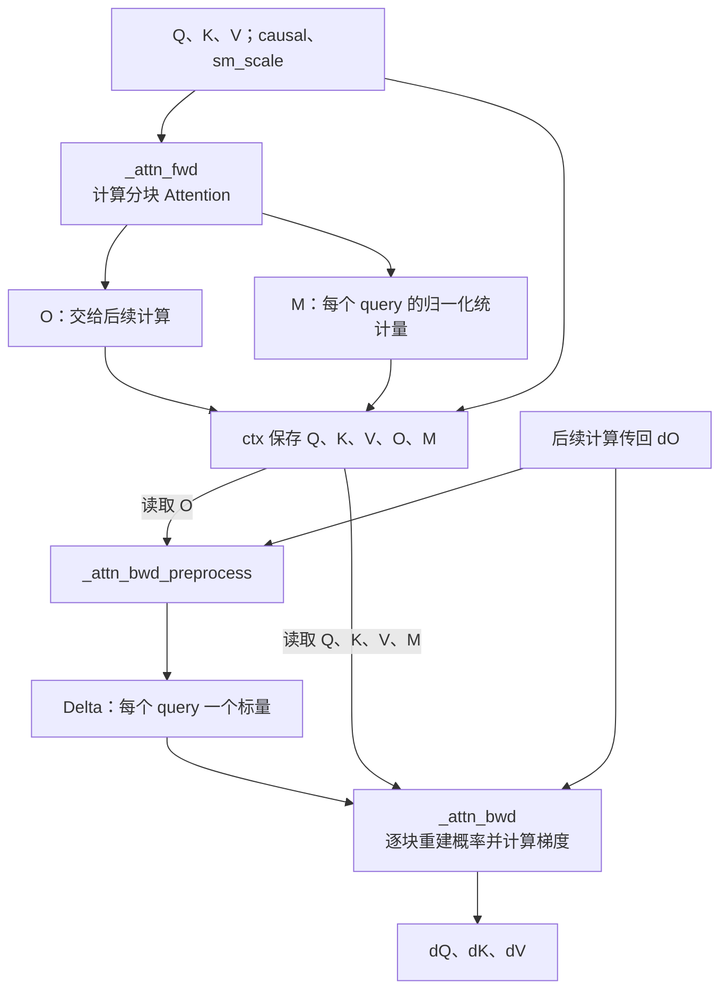

# Fused Attention 全貌补充与 FP16 前向实践 · 可追溯可见文本对话

> 此文件是规则化提取的“可追溯可见文本对话”，不是完整客户端 Session，也不代表已经匿名化。
> system、developer、reasoning、工具事件、客户端注入和附件正文默认不包含在内。

结构化学习记录：[查看记录](<../logs/2026-09-24-fused-attention.md>)

---

**001 · 用户** · `2026-09-20T05:31:44.218Z` · `msg-a104eec606d45cc6091c`

是的，但在编写kernel前，我还有一些学习上的问题。我觉得对于课程整体全貌的讲解过少，且不清晰。我虽然跟着学完了，但依旧对算子整体全流程依旧比较模糊。我认为，对于一个新算子教学，对整体的讲解应该至少包括：
1. 输入输出参数的情况：每一个输入参数的数据类型、shape、含义；
2. 未分tile时的整体数学计算逻辑，其中中间计算过程采用什么数据类型精度？为什么要采用这样的精度；
3. 分块情况：1. 如何对输入数据分块？2. 每一个并行的program对应到数据哪些分块，对应到最终哪个分块结果？3. 分块下的数学计算逻辑。
4. 如果需要多个子kernel，还要讲解kernel之间的参数传递。
5. 前向保存统计量时应该要告知：反向计算时如何使用统计量。

而且在整体讲解中，导师应该要完整描述整个课程的脉络，告诉学员后续有哪些学习点，这样让学员也对自己的学习进度有一个估计。然后再逐点展开。先前attention讲解中就上来就直接讲细节点，讲到最后也没能展示出全流程。反而在最后直接给了串联知识点的检查题，这对学员压力很大。
此外，先前课程中对于细节部分的讲解也不充足。教学代码中用了大量的TensorDescriptor，但没有充分解释其该怎么用，什么时候用，为什么这样用是好的。还有对float8e5也是缺少足够的解释。

我们接下来先做一下对attention课程的补充，直到我彻底理解原始官方教学代码、完成实践练习后，再针对学习过程中发现的问题对我们的guide-learning skill进行优化调整。

---

**002 · 助手 / 过程更新** · `2026-09-20T05:31:49.165Z` · `msg-c9b7355499aa65842424`

我们先补齐 Attention 的整体模型，再读官方代码和完成实践，最后根据这次学习暴露的问题调整 `guide-learning`。接下来会先讲清输入输出、完整计算和 kernel 之间的数据传递，再展开分块、TensorDescriptor 与精度选择；综合检查放在这些关系讲清之后。

---

**003 · 助手 / 过程更新** · `2026-09-20T05:32:38.708Z` · `msg-f59e34007bbb0c352293`

源码里有一个需要在全貌中先讲清的区别：`_attn_fwd_inner` 虽然带有 `@triton.jit`，却是前向 kernel 内部调用的辅助函数，不是另一次 kernel launch。反向则有两个显式启动的 Triton kernel，并通过 `Delta` 传递数据。我会把这些调用关系和张量流向放在同一张图里。

我也会把学习断点调整为“实践前补充全流程讲解”，保留已有练习契约；技能修改留到你完成这轮补充学习和实践之后。

---

**004 · 助手 / 正式回答** · `2026-09-20T05:34:59.307Z` · `msg-b75e660c017772b11ec2`

你指出的是教学组织上的缺口。**我应该先把算子的完整流程讲清楚，再用检查题了解你的理解情况。** 局部题答对了，不能直接推出整体模型已经建立；我上一条对“概念验收已通过”的表述，也需要加上这个边界。

我们按你提出的顺序推进：补充 Attention 全貌与源码理解 → 你完成实践 → 根据实际学习过程调整 `guide-learning`。我已将[学习断点](/root/workspace/learning/programming-lab/docs/triton-learning/README.md:137)调整为实践前补充讲解，保留原来的练习契约。

先把后续路线摆出来。我们会用同一个例子贯穿这些环节，每次深入时都说明它在全流程中的位置：

| 环节 | 要建立的认识 |
|---|---|
| ① 算子全貌 | 输入输出、完整数学计算、精度、前后向连接 |
| ② 分块执行 | 数据怎样切块，每个 program 负责什么，在线状态怎样更新 |
| ③ TensorDescriptor | shape、stride、block_shape、load/store 的含义，host/device 两种构造方式及适用条件 |
| ④ 前向源码 | wrapper → grid → `_attn_fwd` → `_attn_fwd_inner` → 写回 |
| ⑤ 反向源码 | 保存量、`Delta`、概率重算、梯度分块、kernel 之间的数据传递 |
| ⑥ 其余源码分支 | FP8、V 的特殊布局、warp specialization、autotune、测试与 benchmark |
| ⑦ 独立实践 | 按已接受的 FP16 前向契约实现、验证并解释结果 |

**这一轮先建立全流程，不安排综合检查题。** 下面的公式先说明每一步在做什么，推导和源码细节会沿上述路线展开。

---

先确定这个算子的边界：它接收已经准备好的 Q、K、V，输出每个 attention head 的结果 O。生成 Q/K/V 的线性投影，以及后面的多头拼接、输出投影，都在这个算子之外。

先看官方代码的 **FP16 路径**。统一使用：

- `B`：batch 数量，源码部分位置叫 `Z`；
- `H`：每个样本的 head 数量；
- `N`：序列长度，源码叫 `N_CTX`；
- `D`：每个 head 的特征维度，源码叫 `HEAD_DIM`。

| 参数或结果 | 类型与 shape | 含义 |
|---|---|---|
| `q` | FP16，`[B,H,N,D]` | 每个 query 位置用来与 key 匹配的向量 |
| `k` | FP16，`[B,H,N,D]` | 每个 key 位置提供的匹配向量 |
| `v` | FP16，`[B,H,N,D]` | 每个位置被加权汇总的内容向量 |
| `causal` | Python `bool` | 为真时，query 位置 `i` 只能使用 `j≤i` 的 key |
| `sm_scale` | 浮点标量 | 点积分数的缩放系数；常见选择是 `1/√D`，本代码由调用者传入 |
| `warp_specialize` | Python `bool` | 影响 kernel 内部执行组织的优化选项，数学目标保持一致 |
| `o` | FP16，`[B,H,N,D]` | 每个 query 对有效 V 向量加权求和的结果 |
| `M` | FP32，`[B,H,N]` | 每个 query 行的 base-2 log-sum-exp，供反向重建概率 |

这里有个接口区别：官方 `attention(...)` **只返回 `o`**，通过 PyTorch 的 `ctx` 保存 `q/k/v/o/M`。你的练习接口返回 `(o, M)`，方便分别验收。`ctx` 是自动求导提供的保存上下文，不是调用者传入的数据张量。[官方 wrapper](/root/workspace/learning/programming-lab/docs/triton-tutorials/official/06-fused-attention.py:508)

接着暂时拿掉 tile，只看一个 batch、一个 head。此时 Q、K、V 都是 `[N,D]`，完整前向只有三步：

\[
S=sQK^\mathsf{T},\qquad
P=\operatorname{softmax}_{\text{key}}(S),\qquad
O=PV
\]

其中 `s=sm_scale`。

| 步骤 | 结果 shape | 每个元素的意义 |
|---|---|---|
| `S=sQKᵀ` | `[N,N]` | `S[i,j]` 表示 query `i` 与 key `j` 的匹配分数 |
| 沿每行做 softmax | `[N,N]` | `P[i,j]` 表示 query `i` 给 value `j` 的权重 |
| `O=PV` | `[N,D]` | `O[i,:]` 是所有有效 value 向量的加权和 |

causal 情况下，数学上先把 `j>i` 的分数设为负无穷，使这些位置的概率为零。

对一行来说，稳定 softmax 可以写成：

\[
a_i=\max_j S_{ij},\qquad
L_i=\sum_j e^{S_{ij}-a_i}
\]

\[
O_i=\frac{\sum_j e^{S_{ij}-a_i}V_j}{L_i}
\]

这已经把最终输出的依赖说完整了：**一个 query 的输出，取决于它与所有有效 key 的分数，以及对应的 value。**

数学公式本身不规定浮点精度。落实到教程的 Triton FP16 路径，精度安排是：

| 位置 | 精度安排 | 原因 |
|---|---|---|
| Q/K/V 的存储与矩阵乘输入 | FP16 | 降低存储、访存成本，并使用硬件支持的低精度矩阵运算 |
| `QKᵀ` 的累加与 score 块 | FP32 | 点积包含多项求和，提高累加精度 |
| 最大值、指数、分母、在线重标定 | FP32 | 归一化涉及指数和跨块求和，需要控制数值误差 |
| 与 V 相乘前的指数权重块 | 从 FP32 转为 FP16 | 与 FP16 的 V 进行矩阵乘 |
| 输出累加器 `acc` | FP32 | 汇总多个 K/V 块的贡献 |
| 最终 O / 保存的 M | FP16 / FP32 | O 接回低精度数据流；M 保留归一化统计精度 |

因此，“用了 FP32 累加”不代表所有中间量始终都是 FP32。源码中的 `p.to(dtype)` 就是需要专门解释的精度转换点。[前向计算与转换](/root/workspace/learning/programming-lab/docs/triton-tutorials/official/06-fused-attention.py:71)

---

现在把这套完整计算放进分块执行。

我们贯穿后续讲解的例子取：

```text
B=2, H=2, N=256, D=64
BLOCK_M=64：每个 program 负责 64 个 query
BLOCK_N=32：每轮读取 32 个 key/value
```

每个 head 有四个 Q 块，总共四个 `(batch, head)`，所以前向 grid 是：

```text
(4, 4, 1)
 ↑  ↑
Q块  batch/head组合
```

总共有 16 个前向 program 实例。每个实例的职责是：**固定一个 Q 块，扫描它需要的 K/V 块，算完这一块完整的 O 和 M。**

例如 `program_id(0)=2`、`program_id(1)=3`：

| 项目 | 负责的数据 |
|---|---|
| batch、head | `batch=1, head=1` |
| 固定的 Q | `q[1,1,128:192,:]`，shape `[64,64]` |
| 每轮 K、V | 同一个 batch/head 内的 32 行，shape `[32,64]` |
| 每轮 score | `[64,32]` |
| 最终写回 | `o[1,1,128:192,:]` 与 `M[1,1,128:192]` |

non-causal 时，它扫描全部 256 个 key，共 8 轮。

causal 时，它扫描：

- 过去区域 `[0,128)`：所有位置都允许使用；
- 对角区域 `[128,192)`：逐元素判断 `key位置≤query位置`；
- `[192,256)`：全部位于这些 query 的未来，跳过。

这里的并行分工以 **输出 query 行块** 为单位。每个 program 内部完成该输出所需的 K/V 归约，因此这些前向 program 可以独立写回各自的结果。

分块后，困难在于：第一块到达时，还不知道整行最终的 softmax 分母。于是，每个 program 保留：

| 状态 | shape | 含义 |
|---|---|---|
| `m` | `[64]` | 每个 query 已扫描分数的运行最大值 |
| `l` | `[64]` | 以当前最大值为基准的指数和 |
| `acc` | `[64,64]` | 同一基准下，尚未除以分母的加权 V 累加结果 |

为了对应源码，令：

\[
X=S/\ln2,\qquad e^S=2^X
\]

每来一个新 score 块 \(X_t\)，就更新：

\[
m'=\max(m,\operatorname{rowmax}(X_t)),\qquad
\alpha=2^{m-m'}
\]

\[
W_t=2^{X_t-m'},\qquad
l'=\alpha l+\operatorname{rowsum}(W_t)
\]

\[
acc'=\alpha\,acc+W_tV_t
\]

减最大值和乘 `α` 都按 query 行广播。`α` 的作用，是让旧块贡献与新块贡献使用相同的最大值基准。

扫描结束后：

\[
O=acc/l,\qquad M=m+\log_2 l
\]

这就把完整数学式和分块式连接起来了：完整 `[N,N]` 的 S/P 被逐块计算、消费；跨块只延续 `m/l/acc`。数学目标保持一致，但浮点计算顺序与低精度转换会带来数值差异。

还要注意：**源码里的局部变量 `p`，在内循环中表示上述未归一化的 \(W_t\)，不是完整数学式里已经归一化的 P。** 最后的 `acc/l` 才完成输出归一化。

---

沿这个执行过程看，TensorDescriptor 就有了明确的位置：它负责描述“到哪里读取或写入一个数据块”。

它包含基址、整体 shape、stride 和每次读写的 `block_shape`；创建 descriptor 本身不会把整张量读进 kernel。真正取块发生在 `desc.load(...)`。

在上述 FP16 例子中，Q 的连续存储可以被描述为一个 `[BHN,D]=[1024,64]` 的二维视图，Q 的块形状是 `[64,64]`。刚才那个 program 的 head 基址是 `3×256=768`，再加 query 起点 `128`，所以：

```text
desc_q.load([896, 0])
```

读取的就是 `q[1,1,128:192,:]`。这里是对已有存储的描述，无须为了这个二维视图复制 Q。

这种表达适合规则的块式访问；在支持 TMA 的 NVIDIA GPU 上，descriptor 的 load/store 可以由 TMA 硬件执行。它也有布局和对齐约束，性能收益需要结合设备与访问方式判断。[官方 descriptor 文档](https://triton-lang.org/main/python-api/generated/triton.language.make_tensor_descriptor.html)

后续专门讲这一环节时，我们会把这个例子扩展到 K/V/O，再解释 `dummy_block`、autotune pre-hook、host/device descriptor，以及为什么 FP8 的 V 需要不同描述。

---

最后把前向与反向连接起来。官方代码的主要张量流向如下：



`dO` 表示损失对 O 的梯度；在这里的 FP16 路径中，它与 O 一样是 `[B,H,N,D]`。返回的 `dQ/dK/dV` 分别与原输入同形、同 dtype。

保存 M 的用途可以直接从公式看到：

\[
M_i=\log_2\sum_{\text{有效 }j}e^{S_{ij}}
\]

反向重新计算一个 score 块后，对有效位置就能得到：

\[
P_{ij}=2^{S_{ij}/\ln2-M_i}
\]

**所以 M 让反向能用一个行统计量恢复该行任意一块的归一化概率，而不必在前向保存整张 P。**

O 则用于预处理：

\[
\Delta_i=\sum_d O_{i,d}\,dO_{i,d}
\]

`Delta` 是 FP32，shape 为 `[B,H,N]`。它参与 softmax 的反向计算：

\[
dP=dO\,V^\mathsf{T},\qquad
dS_{ij}=P_{ij}(dP_{ij}-\Delta_i)
\]

随后得到：

\[
dV=P^\mathsf{T}dO,\qquad
dQ=s\,dS\,K,\qquad
dK=s\,dS^\mathsf{T}Q
\]

这些是完整数学关系；实际反向同样按块重算和累加。`dQ` 固定 query 块扫描 key，`dK/dV` 固定 key 块扫描 query。详细阅读时会把两种输出所有权分别画出来。

调用层面还有两个容易混淆的地方：

- `_attn_fwd_inner` 是 `_attn_fwd` 内部调用的 JIT 辅助函数，共享这次前向计算中的在线状态；它不构成独立 kernel launch。
- 反向显式启动 `_attn_bwd_preprocess` 和 `_attn_bwd` 两个 Triton kernel，前者把 `Delta` 写入 GPU 内存，后者读取。wrapper 还用 PyTorch 计算缩放后的 K，因此“两个 Triton kernel”不等于整个反向只有两次 GPU 操作。[反向 wrapper](/root/workspace/learning/programming-lab/docs/triton-tutorials/official/06-fused-attention.py:578)

至于你提到的 `float8e5`，它也会进入后续源码阅读。先明确它的身份：这是 **E5M2 格式的 FP8**，包含 1 位符号、5 位指数、2 位小数部分；PyTorch 对应名称是 `torch.float8_e5m2`。它用更少的存储位数换取更粗的数值表示。[FP8 格式说明](https://arxiv.org/abs/2209.05433)

在这份教程里，FP8 会影响输入、局部矩阵乘操作数、输出精度，以及 V 的物理布局；测试明确排除了 FP8 反向。我们会沿这些实际影响解释它，而不是只解释名称后就跳过。阅读这条分支，与要求你额外实现 FP8，是两件需要分别安排的事；你的实践仍按原 FP16 契约进行。

你可以先围绕这张全流程追问，尤其是张量从哪里来、流向哪里，以及哪些量只在 program 内存在。接下来我们就从这些连接中仍然模糊的地方展开。

---

**005 · 用户** · `2026-09-20T06:27:31.216Z` · `msg-1f6d846f1d21a27442fa`

在算子内部，只有矩阵乘部分采用了fp16进，fp32出的结构，其他内部计算都采用了fp32的计算，最后再为了接回低精度数据流，才将O转回fp16.是这样吗？那扩展一些，对于其他大多数深度学习算子也都是这样吗？在没有提及使用特殊低精度时，都以fp32为基础是吗？

---

**006 · 助手 / 过程更新** · `2026-09-20T06:27:52.384Z` · `msg-0b2f40d7237929d5ab87`

我会把两个层面分开核对：这份 Triton 前向代码的精度安排，以及 PyTorch 等框架中其他算子的默认行为。尤其要区分张量 dtype、内部计算或累加精度、输出 dtype。

---

**007 · 助手 / 正式回答** · `2026-09-20T06:28:28.024Z` · `msg-cdbe6b60d1b566c84719`

**对于这份 Attention 的 FP16 前向，你的理解基本正确；但它不能直接推广为所有深度学习算子的默认规则。**

先把这份代码说准确：它采用“**低精度矩阵乘操作数 + FP32 累加和归一化状态**”的安排。

| 计算位置 | 输入与计算精度 | 结果精度 |
|---|---|---|
| `QKᵀ` | FP16 操作数，FP32 累加 | FP32 score |
| 缩放、减最大值、指数、求和、重标定 | FP32 浮点计算 | FP32 |
| 局部权重块与 V 相乘 | 权重先转成 FP16，V 为 FP16，累加器为 FP32 | FP32 `acc` |
| 最后 `acc/l` | FP32 | FP32 |
| 写回 O | 转换为 FP16 | FP16 |
| 写回统计量 M | 保留 FP32 | FP32 |

所以需要补充一点：**中途也有一次 FP32 → FP16 转换，就是第二次矩阵乘之前的 `p.to(dtype)`；并非只在最终写回 O 时才降低精度。** 你把它归入“矩阵乘采用 FP16 输入”，这个理解是对的。[对应源码](/root/workspace/learning/programming-lab/docs/triton-tutorials/official/06-fused-attention.py:96)

另外，“FP16 输入、FP32 累加”不等于先恢复成原本的高精度数据再计算。输入存成 FP16 时丢失的信息已经无法恢复；FP32 累加主要减少后续求和引入的误差。

---

推广到其他算子时，需要分开三个问题：

1. **输入和输出以什么 dtype 存储？**
2. **内部乘法、指数等运算采用什么精度？**
3. **内部求和或统计量采用什么累加精度？**

这三个答案可以不同。比如，一个矩阵乘算子完全可以接收 FP16 输入、内部使用 FP32 累加，最后直接返回 FP16 张量。调用者看到的输出 dtype，并不揭示全部内部精度安排。

在深度学习中，确实常见下面这些选择，但具体实现会有差异：

| 计算特点 | 常见精度安排及理由 |
|---|---|
| 大量矩阵乘、卷积 | 使用 FP16/BF16 操作数以提高吞吐量，搭配更高精度累加 |
| Softmax、归一化统计、较长的归约 | 经常采用 FP32 中间计算或累加，以控制溢出和累计误差 |
| 简单逐元素计算，如加法、乘法、ReLU | 可以沿用低精度数据流，没有统一的“全部提升到 FP32”要求 |

PyTorch 的自动混合精度就是按算子选择策略：例如 CUDA autocast 将矩阵乘、卷积列入低精度策略，将 softmax、layer norm 等列入 FP32 策略。这些规则有明确的适用条件，并非所有操作统一转换。[PyTorch AMP 规则](https://github.com/pytorch/pytorch/blob/main/docs/source/amp.md)

**写自定义 Triton kernel 时，也不能指望它自动替你安排全部精度。** 例如两个 FP16 张量相加，不会因为你没有声明“采用低精度”，就自动变成 FP32 结果；类型转换、类型提升规则以及各个操作的语义共同决定结果。[Triton 类型规则](https://triton-lang.org/main/python-api/triton-semantics.html)

---

你最后问的“没有提及特殊低精度时，是否以 FP32 为基础”，要看语境：

- **创建 PyTorch 浮点张量时**：在没有修改默认设置、也没有其他 dtype 推断依据的情况下，初始默认浮点类型是 FP32。[默认 dtype](https://docs.pytorch.org/docs/2.12/generated/torch.get_default_dtype.html)
- **阅读数学公式时**：公式通常描述实数运算，本身没有规定 FP32。
- **阅读实际算子代码时**：没有说明精度，就属于信息尚不充分，不能据此判断内部全是 FP32。要检查输入 dtype、转换语句、累加器及后端配置。

因此，在后续课程里，我会明确区分“数学计算关系”和“这份实现的精度安排”。例如这里会明确说：**先用实数公式解释 Attention，再沿源码标出 FP16 操作数、FP32 状态和每个转换位置。** 这样就不需要你从公式或变量名猜测精度。

---

**008 · 用户** · `2026-09-20T06:33:19.988Z` · `msg-44b5696cf4d8152c1059`

明白，所以对于精度设置，还是需要视具体情况具体而定，没有一个相对通用的设置逻辑？

---

**009 · 助手 / 正式回答** · `2026-09-20T06:33:46.027Z` · `msg-01f37a08847a0f041ff1`

**有相对通用的判断逻辑，只是没有一套适用于所有算子的固定配置。** 我上一条需要把这一点补充清楚。

通常围绕一个原则决定：

> 在满足数值误差和稳定性要求的前提下，降低存储与计算成本；把较高精度用在误差容易累积或放大的环节。

可以按下面的顺序考虑：

1. **先确定数值要求。** 输入可能有多大、多小？允许多大输出误差？是否需要保留很小的梯度？
2. **识别敏感计算。** 长序列求和、均值与方差、指数及归一化等，需要重点考虑溢出、舍入误差和误差传播，往往采用 FP32 中间计算或累加。
3. **识别低精度能带来收益的部分。** 大张量存储与传输、大规模矩阵乘，常适合 FP16/BF16；收益还取决于硬件支持。
4. **明确转换位置。** 哪些数据可以降低精度，哪些统计量需要保留高精度，输出需要满足什么 dtype 接口。
5. **用测试验证选择。** 对照可信参考，覆盖典型输入和数值极端情况；再测量性能，确认降低精度确实值得。混合精度的目的就是按不同计算的需要分配精度。[PyTorch 官方说明](https://docs.pytorch.org/tutorials/recipes/recipes/amp_recipe.html)

我们这份 Attention 正好体现了这个逻辑：

- Q/K/V 数据量大、参与矩阵乘 → 使用 FP16。
- `m/l/acc` 跨多个块维持归一化和累计结果 → 使用 FP32。
- 局部权重参与下一次矩阵乘 → 转成 FP16。
- O 接入后续数据流 → 写成 FP16。
- M 要供反向重建概率 → 保留 FP32。

所以，你以后读新算子时可以先问：**“这里降低精度能节省什么？可能损失什么？哪些地方必须用更高精度保护结果？”** 这套问题是通用的，具体 dtype 是据此作出的选择。

---

**010 · 用户** · `2026-09-20T07:11:50.027Z` · `msg-335ddeaa1dc243ea2411`

在分块执行的例子中，给到的前向grid是（4，4，1）。其中第一个4是处理Q tile的数量，第二个4是batch/head组合数量，最后一个1是什么？为什么要多出一个1来？

---

**011 · 助手 / 过程更新** · `2026-09-20T07:12:05.796Z` · `msg-e15bf4872af443f182bc`

我核对一下 Triton 的 grid 维度规则，以及这份前向代码实际读取了哪些 `program_id`。

---

**012 · 助手 / 正式回答** · `2026-09-20T07:12:18.276Z` · `msg-6733776e878f0b81bdbc`

**最后的 `1` 表示第三个 grid 维度只有一个位置，所以没有增加额外的并行工作。这里可以省略它，写成 `(4, 4)`。**

Triton 的 launch grid 最多有三个维度，对应 `program_id(0)`、`program_id(1)`、`program_id(2)`；未提供的维度按大小 `1` 处理。[官方说明](https://triton-lang.org/main/python-api/generated/triton.language.program_id.html)

在这个例子里：

| grid 维度 | 大小 | program ID 的取值 | 本前向中的用途 |
|---|---:|---|---|
| axis 0 | 4 | `0、1、2、3` | 选择 Q tile |
| axis 1 | 4 | `0、1、2、3` | 选择 batch/head 组合 |
| axis 2 | 1 | 只能是 `0` | 未使用 |

因此，两种写法启动的 program 数量和编号关系相同：

```python
grid = (4, 4)       # 隐含第三维为 1
grid = (4, 4, 1)    # 显式写出第三维
```

总数都是 `4 × 4 × 1 = 16`。官方前向也确实只读取了 `program_id(0)` 和 `program_id(1)`。[对应源码](/root/workspace/learning/programming-lab/docs/triton-tutorials/official/06-fused-attention.py:191)

还有一点值得建立：**grid 各轴没有预设的“Q、batch、head”含义。** 是这份 kernel 如何使用对应的 `program_id`，赋予了它们这些含义。

---

**013 · 用户** · `2026-09-20T08:02:27.219Z` · `msg-6c5d822c69ff241119f1`

好的，还有在分块执行的讲解中，我建议直接先用符号来推导完整通用公式，而后再引入数字例子讲解。常规情况下，我有能力理解通用公式。理解不了时再用例子具体解释。有时，先用符号公式的做法可能还更清晰。比如在说明前向acc中的shape为[64，64]时，不清楚的学员可能会理解成[BLOCK\_M,BLOCK\_M],实际应该是[BLOCK\_M, D].

---

**014 · 助手 / 正式回答** · `2026-09-20T08:03:05.287Z` · `msg-fdcc4b0b7595e2a475e5`

这个提醒很准确。之前选了 `BLOCK_M=D=64`，两个不同维度恰好数值相同，确实掩盖了它们的含义。

**后续默认先定义符号、推导通用公式并标注 shape，再映射到源码；数字例子用于辅助解释或验证。** 这也会作为实践完成后改进 skill 的依据。

以当前前向为例，定义：

- `BLOCK_M`：一个 program 负责的 query 数量；
- `BLOCK_N`：一轮扫描的 key/value 数量；
- `D`：每个 head 的特征维度。

那么各块的 shape 应当这样讲：

| 数据块 | Shape | 两个轴的含义 |
|---|---|---|
| \(Q_I\) | `[BLOCK_M, D]` | query、特征 |
| \(K_J\)、\(V_J\) | `[BLOCK_N, D]` | key/value 位置、特征 |
| \(Q_IK_J^\mathsf T\) | `[BLOCK_M, BLOCK_N]` | query、key |
| 未归一化权重 \(W_{IJ}\) | `[BLOCK_M, BLOCK_N]` | query、key |
| \(W_{IJ}V_J\) | `[BLOCK_M, D]` | query、输出特征 |
| `acc`、最终输出块 \(O_I\) | `[BLOCK_M, D]` | query、输出特征 |
| `m`、`l`、统计量 \(M_I\) | `[BLOCK_M]` | 每个 query 一个标量 |

`acc` 的 shape 可以直接从矩阵乘推导：

\[
\underbrace{W_{IJ}}_{[BLOCK_M,\ BLOCK_N]}
\underbrace{V_J}_{[BLOCK_N,\ D]}
=
\underbrace{\text{本轮输出分子贡献}}_{[BLOCK_M,\ D]}
\]

**归约掉的是 key/value 位置轴 `BLOCK_N`，保留下来的是 query 轴 `BLOCK_M` 和特征轴 `D`。**

因此，在线更新写成：

\[
acc_{\text{new}}
=
\underbrace{\alpha[:,None]}_{[BLOCK_M,1]}
\odot
\underbrace{acc_{\text{old}}}_{[BLOCK_M,D]}
+
\underbrace{W_{IJ}V_J}_{[BLOCK_M,D]}
\]

这里 `α` 对每个 query 行提供一个重标定系数，广播到该行全部 `D` 个特征上。这样不仅能看出 `acc` 为什么是 `[BLOCK_M,D]`，也能看出为什么代码需要 `alpha[:, None]`。

---

**015 · 用户** · `2026-09-20T08:04:29.357Z` · `msg-2d54c0e8c6483ded56bb`

在前向保存M和反向使用M中，我有一个问题。在使用M恢复归一化概率中这个等价softmax中，指数部分就没有减去最大值的操作了，那么计算中会不会出现溢出呢？我记得softmax计算中引入减去max是为了防止溢出的。

---

**016 · 助手 / 过程更新** · `2026-09-20T08:04:34.714Z` · `msg-85f6ad6317e9cb198237`

我会对照源码里恢复概率的表达式，说明 M 怎样包含减最大值后的归一化信息，以及指数是否可能溢出。

---

**017 · 助手 / 正式回答** · `2026-09-20T08:05:16.256Z` · `msg-66c364988a3eecd24aa0`

**对于有效的 key 位置，恢复概率时仍然保留了减最大值的效果：它已经包含在 M 里面了。** 因此，在有限 score 的精确数学运算下，恢复概率的指数不会大于 0，也就不会发生指数上溢。

我们直接用与源码一致的 base-2 形式推导。固定一个 query 行 \(i\)，定义：

\[
x_{ij}=\frac{s\,Q_iK_j^\mathsf T}{\ln2}
\]

令 \(\mathcal J_i\) 表示这一行允许访问的 key 集合。前向扫描完成时：

\[
m_i=\max_{j\in\mathcal J_i}x_{ij}
\]

\[
l_i=\sum_{j\in\mathcal J_i}2^{x_{ij}-m_i}
\]

这里已经执行了你熟悉的稳定化：**先减最大值，再取指数。**

前向保存的是：

\[
M_i=m_i+\log_2 l_i
\]

反向恢复概率时，展开 M：

\[
\begin{aligned}
P_{ij}
&=2^{x_{ij}-M_i}\\
&=2^{x_{ij}-m_i-\log_2 l_i}\\
&=\frac{2^{x_{ij}-m_i}}{l_i}
\end{aligned}
\]

最后一行正是减最大值后的 stable softmax。**减去 M 这一步，同时完成了“减最大值”和“除以归一化分母”。**

再从数值范围验证一下：

- 对有效位置，\(x_{ij}\le m_i\)；
- 最大值对应的指数项为 \(2^0=1\)，所以 \(l_i\ge1\)；
- 因此 \(\log_2 l_i\ge0\)，从而 \(M_i\ge m_i\)。

于是：

\[
\boxed{x_{ij}-M_i\le0}
\qquad\Longrightarrow\qquad
\boxed{0<P_{ij}\le1}
\]

这就是它能够避免指数上溢的原因。

还有一个实现细节很关键：虽然数学上可以写成

\[
M_i=\log_2\sum_j2^{x_{ij}},
\]

**前向并没有先计算可能溢出的 \(2^{x_{ij}}\)，再求和取对数。** 它通过稳定的在线状态得到 `m_i`、`l_i`，最后才计算 `m_i + log2(l_i)`。[前向保存位置](/root/workspace/learning/programming-lab/docs/triton-tutorials/official/06-fused-attention.py:242)

反向源码把从 M 读出的值命名为小写 `m`，容易造成误解：

```python
m = tl.load(M + offs_m)
pT = tl.math.exp2(qkT - m[None, :])
```

这里的 `m` **已经是 log-sum-exp，不再只是行最大值**。[官方教程](https://triton-lang.org/main/getting-started/tutorials/06-fused-attention.html)

需要限定一下上述结论：它针对有效位置及一致、有限的 score。实际浮点计算仍有舍入误差，极小概率也可能下溢为零。另外，这份源码在 causal 对角块中先计算指数、再把无效位置置零；无效位置不满足上述范围保证，极端输入下其临时指数可能上溢，随后被 mask 清除。这与有效概率通过 M 保持稳定，是两个需要分别看待的问题。

---

**018 · 用户** · `2026-09-20T08:16:02.876Z` · `msg-10d4f7cf62c78c34b453`

好的，现在我对于流程全貌了解清楚了。

---

**019 · 助手 / 正式回答** · `2026-09-20T08:17:08.415Z` · `msg-b0bc4271a0557eb2f470`

好，接下来进入你指出的一个重要缺口：**TensorDescriptor。** 它位于前向流程的“按块读取 Q/K/V、写回 O”这一环节。

我们先讲清它描述什么、怎样定位数据块，再展开 host/device 两种构造方式、硬件用途和使用约束。

TensorDescriptor 可以理解为：**一份供块式读写使用的张量存储描述。** 它告诉系统：

| 信息 | 回答的问题 |
|---|---|
| `base` | 数据从哪个内存地址开始？ |
| `shape` | 按照这个描述，整个张量有多大？ |
| `strides` | 各维索引增加 1，需要移动多少个元素？ |
| `block_shape` | 每次 load/store 处理多大的块？ |

**创建 descriptor 只建立这份描述；调用 `load` 时才读取数据。** 它不会因为声明了 `block_shape`，就提前把整个张量切成一批独立的小张量。

我们直接把它对应到前向 Q 的访问。假设 Q 连续存储：

\[
Q:\ [B,H,N,D]
\]

其元素地址偏移为：

\[
\operatorname{offset}(b,h,i,d)
=
((bH+h)N+i)D+d
\]

把前三个索引合成一个行索引：

\[
r=(bH+h)N+i
\]

地址公式就变成：

\[
\operatorname{offset}(r,d)=rD+d
\]

因此，同一块连续内存可以用下面的二维描述访问：

\[
\text{shape}=[BHN,D],\qquad
\text{strides}=[D,1]
\]

这里的 stride 以**元素数量**为单位：行索引增加 1，跳过 D 个元素；列索引增加 1，跳过一个元素。实际字节偏移再乘以每个元素的字节数。

这只是改变了访问时的坐标表达，Q 的数据没有被复制或重新排列。

对于一次读取一个 Q tile，我们再指定：

\[
\text{block\_shape}=[BLOCK_M,D]
\]

假设 tile 配置已经确定，host 侧描述可以写成：

```python
desc_q = TensorDescriptor(
    q,
    shape=[B * H * N, D],
    strides=[D, 1],
    block_shape=[BLOCK_M, D],
)
```

注意两个不同的 shape：

- `shape` 描述**整个访问视图**；
- `block_shape` 描述**一次读写的数据块**。

接下来，一个前向 program 怎样用它？

令：

\[
p_m=\operatorname{program\_id}(0),\qquad
p_{bh}=\operatorname{program\_id}(1)
\]

这个 program 负责的 Q tile 起点，在二维视图中是：

\[
r_0=p_{bh}N+p_mBLOCK_M
\]

于是：

```python
q_tile = desc_q.load([r0, 0])
```

在合法整块范围内，它的含义是：

\[
q_{\text{tile}}[u,d]
=
Q_{\text{二维视图}}[r_0+u,d]
\]

其中：

\[
0\le u<BLOCK_M,\qquad 0\le d<D
\]

返回结果的 shape 是：

\[
q_{\text{tile}}:\ [BLOCK_M,D]
\]

**`load([r0, 0])` 提供的是块的起点坐标，块的大小已经由 descriptor 的 `block_shape` 确定。**

这对应官方前向里的三行关系：

```python
offset_y = off_z * (N_CTX * H) + off_h * N_CTX
qo_offset_y = offset_y + start_m * BLOCK_M
q = desc_q.load([qo_offset_y, 0])
```

其中 `offset_y` 定位 batch/head，`start_m * BLOCK_M` 定位该 head 内的 Q tile。[对应源码](/root/workspace/learning/programming-lab/docs/triton-tutorials/official/06-fused-attention.py:210)

先只确认这个局部关系：**保持 descriptor 不变，把读取起点从 `[r0, 0]` 改成 `[r0 + BLOCK_M, 0]`，在没有越界时，读取内容与返回 shape 分别会发生什么变化？**

---

**020 · 用户** · `2026-09-20T08:40:30.237Z` · `msg-0083a4e279efbfd78420`

读取内容就会变成从`[r0 + BLOCK_M, 0]`为起点坐标，[BLOCK\_M, D]为形状大小的一个tile块。也就是原本的下面一个block块，第0维度往后平移BLOCK\_M。返回shape保持不变，依旧是[BLOCK\_M, D]。我有一个问题，这种TensorDescriptor.load的读取方式，会自动处理越界整个访问视图时的mask吗？

---

**021 · 助手 / 过程更新** · `2026-09-20T08:40:33.584Z` · `msg-cae21c56411ff6c91d01`

你的理解正确：读取起点沿第 0 维移动了 `BLOCK_M`，块形状不变。我会核对 descriptor load 的越界规则，尤其是它能识别的视图边界与单个 head 的逻辑边界是否相同。

---

**022 · 助手 / 正式回答** · `2026-09-20T08:41:23.434Z` · `msg-72dffca88fa5fea6f95a`

你的回答正确。**会：对于 descriptor 声明的整个访问视图，`load` 会处理越界位置；默认行为是补零，返回的 tile shape 保持不变。** 前提是 descriptor 构造和访问满足相关布局、对齐约束。[Triton 默认 padding](https://github.com/triton-lang/triton/blob/main/python/triton/tools/tensor_descriptor.py)、[NVIDIA TMA 越界规则](https://docs.nvidia.com/cuda/archive/12.5.1/cuda-c-programming-guide/index.html#asynchronous-data-copies-using-tensor-memory-access-tma)

沿用我们的 Q descriptor：

\[
\text{shape}=[BHN,D],\qquad
\text{block\_shape}=[BLOCK_M,D]
\]

执行：

```python
q_tile = desc_q.load([r0, 0])
```

在默认补零设置下，可以把读取结果理解为：

\[
q_{\text{tile}}[u,d]=
\begin{cases}
Q_{\text{二维视图}}[r_0+u,d],
&0\le r_0+u<BHN\\
0,
&\text{否则}
\end{cases}
\]

其中 \(0\le u<BLOCK_M,\ 0\le d<D\)。

即使最后只剩不足 `BLOCK_M` 行有效数据，返回结果仍然是 `[BLOCK_M,D]`，剩余行填零。你无须在这次 `load` 上再传入逐元素的边界 mask；padding 行为由 descriptor 决定。

不过，在 Attention 里还需要分清另外两种边界。

**第一，整个视图的边界与单个 head 的边界不同。**

对于编号为 \(p_{bh}\) 的 batch/head，其行范围是：

\[
[p_{bh}N,\ (p_{bh}+1)N)
\]

但 descriptor 知道的整体行范围是：

\[
[0,\ BHN)
\]

如果一个 tile 跨过当前 head 的末尾，却仍处于整体视图内，descriptor 就会继续读取下一个 head 的数据，**不会自动补零**。因为你在 descriptor 中声明的是合并后的二维视图，它没有“每 N 行属于一个 head”的语义。

因此，之前说“起点加 `BLOCK_M` 就读取下面一个块”，更准确地说，是读取**二维访问视图中下面的块**；它是否仍属于同一个 head，要由索引范围保证。

**第二，causal mask 是计算规则，descriptor 不会自动处理。**

未来 token 的 K/V 地址通常完全合法，只是当前 query 不允许使用它们。因此仍需要在 score 或概率上处理：

\[
j\le i
\]

类似地，即使越界 K/V 被自动补成零，也不意味着 softmax 可以忽略这些位置。零 K 得到的点积分数为零，而：

\[
e^0=1
\]

它仍可能进入 softmax 分母。若要支持这样的尾块，还需要把无效 key 的 score 屏蔽掉；只把 V 补零，无法消除它对归一化分母的影响。

---

**023 · 用户** · `2026-09-20T08:46:52.260Z` · `msg-516f563c941e8cbce5c6`

明白，那对于descriptor，我可以指定越界补什么值吗？类似于tl.load里的other参数。

---

**024 · 助手 / 正式回答** · `2026-09-20T08:47:19.242Z` · `msg-836c6aace3ce9491216f`

**可以选择预设的填充值，但不能像 `tl.load(..., other=...)` 那样指定任意值。**

当前官方接口支持：

| 设置 | 越界位置的值 |
|---|---|
| `"zero"` | `0`，默认值 |
| `"nan"` | `NaN`，仅适用于浮点类型 |

两种构造方式的参数名略有不同：

| 构造方式 | 参数 |
|---|---|
| host 侧 `TensorDescriptor(...)` | `padding="zero"` 或 `"nan"` |
| kernel 内 `tl.make_tensor_descriptor(...)` | `padding_option="zero"` 或 `"nan"` |

例如，host 侧可以写：

```python
desc_q = TensorDescriptor(
    q,
    shape=[B * H * N, D],
    strides=[D, 1],
    block_shape=[BLOCK_M, D],
    padding="nan",
)
```

后续仍然调用：

```python
q_tile = desc_q.load([r0, 0])
```

填充策略在构造 descriptor 时指定；`load` 本身没有 `other` 参数。[官方构造实现](https://github.com/triton-lang/triton/blob/main/python/triton/tools/tensor_descriptor.py)、[设备侧接口](https://triton-lang.org/main/python-api/generated/triton.language.make_tensor_descriptor.html)

如果需要 `-inf` 或其他常数，可以在加载后，根据有效位置条件，用 `tl.where` 替换对应元素；也可以使用普通的带 mask 的 `tl.load`。

结合 Attention，通常应当把**无效 key 对应的 score 设为 `-inf`**，让其 softmax 权重为零。不要直接把 K/V 的越界元素填成 `-inf`：K/V 是矩阵乘的输入，填入无穷值会改变点积计算，不能直接表达“忽略这个 key”。

---

**025 · 用户** · `2026-09-20T08:49:07.558Z` · `msg-236f8a470448743dcf0d`

明白。我们继续吧。

---

**026 · 助手 / 过程更新** · `2026-09-20T08:49:10.330Z` · `msg-f3a1fb29a61887791db4`

接下来把 host 侧 `TensorDescriptor` 和 kernel 内 `tl.make_tensor_descriptor` 两条构造路径连起来，再解释这份教程为什么要配合 autotune 使用 `dummy_block` 和 pre-hook。

---

**027 · 助手 / 正式回答** · `2026-09-20T08:50:20.334Z` · `msg-2b19365f64e94d8b03f5`

接下来把 descriptor 的两条构造路径接回官方源码。**这一段要弄清楚：descriptor 在哪里建立，以及它的块大小怎样与本次 kernel 配置保持一致。**

仍以 FP16 路径为主，令：

\[
T=BHN
\]

Q/K/V/O 都采用整体视图 `[T,D]`，但每次读写的块形状不同：

| Descriptor | 整体 `shape` | `strides` | 实际 `block_shape` |
|---|---|---|---|
| `desc_q` | `[T,D]` | `[D,1]` | `[BLOCK_M,D]` |
| `desc_k` | `[T,D]` | `[D,1]` | `[BLOCK_N,D]` |
| `desc_v` | `[T,D]` | `[D,1]` | `[BLOCK_N,D]` |
| `desc_o` | `[T,D]` | `[D,1]` | `[BLOCK_M,D]` |

这个表来自前向的数据分工：一个 program 固定 `BLOCK_M` 个 query，每轮读取 `BLOCK_N` 个 key/value，最终写回 `BLOCK_M` 行输出。

---

官方代码提供了两种构造方式：

| 环节 | host 侧构造 | kernel 内构造 |
|---|---|---|
| Python wrapper 准备什么 | `TensorDescriptor` 对象 | 原始 Q/K/V/O 张量 |
| kernel 接收到什么 | Triton 能识别的 descriptor 参数 | 指向张量数据的指针 |
| kernel 内是否还要构造 | 直接使用已有 descriptor | 调用 `tl.make_tensor_descriptor` |
| 后续访问方式 | `desc.load/store` | `desc.load/store` |

这里 host 指运行 Python wrapper 的 CPU 一侧，device 指执行 Triton kernel 的 GPU 一侧。**host 构造 descriptor 时，被描述的 Q/K/V/O 数据仍然在 GPU 上。**

启动 kernel 时，Triton 会处理 host 对象到 kernel 参数的转换；kernel 中不会执行 Python 的 `TensorDescriptor` 类。

两条路径通过这个辅助函数汇合：

```python
@triton.jit
def _maybe_make_tensor_desc(desc_or_ptr, shape, strides, block_shape):
    if isinstance(desc_or_ptr, tl.tensor_descriptor):
        return desc_or_ptr
    else:
        return tl.make_tensor_descriptor(
            desc_or_ptr, shape, strides, block_shape
        )
```

它表达的规则很直接：

- 如果传入的已经是 descriptor，就原样返回。
- 如果传入的是指针，就用提供的 shape、stride 和块大小构造 descriptor。

这是 JIT 编译处理的类型分支。它也只是 kernel 内部的辅助函数，不会另外启动一个 kernel。[对应源码](/root/workspace/learning/programming-lab/docs/triton-tutorials/official/06-fused-attention.py:168)

例如 Q 在前向入口处统一经过：

```python
desc_q = _maybe_make_tensor_desc(
    desc_q,
    shape=[T, D],
    strides=[D, 1],
    block_shape=[BLOCK_M, D],
)
```

执行完后，后续代码就可以统一使用 `desc_q.load(...)`。

---

接着解释源码中容易让人困惑的部分：**为什么 host 构造时写的是 `dummy_block=[1,1]`？**

原因是这份教程使用了 **autotune**：为同一个计算准备多组候选配置，通过测量选择配置。其中包含不同的 `BLOCK_M`、`BLOCK_N`。

因此：

- Q/K/V/O 的整体 shape 和 stride 已经确定；
- 一次读取或写回多大的块，要与当前尝试或选中的配置一致。

wrapper 先建立 descriptor 对象：

```python
dummy_block = [1, 1]

desc_q = TensorDescriptor(
    q,
    shape=[T, D],
    strides=[D, 1],
    block_shape=dummy_block,
)
```

这里的 `[1,1]` 是待替换的初始值。**真正用于 kernel 访问的块大小，会在调用前被 pre-hook 更新。**

`pre-hook` 就是“在 kernel 调用前执行的准备函数”。每个候选配置都登记了它：

```python
triton.Config(
    {"BLOCK_M": BM, "BLOCK_N": BN},
    num_stages=s,
    num_warps=w,
    pre_hook=_host_descriptor_pre_hook,
)
```

其中 `BM/BN` 是该候选配置的取值；配置选定后，对应 kernel 中的 `BLOCK_M/BLOCK_N`。[`triton.Config` 官方说明](https://triton-lang.org/main/python-api/generated/triton.Config.html)

对于 FP16 路径，pre-hook 的核心工作可以整理为：

```python
desc_q.block_shape = [BLOCK_M, D]
desc_k.block_shape = [BLOCK_N, D]
desc_v.block_shape = [BLOCK_N, D]
desc_o.block_shape = [BLOCK_M, D]
```

它修改 descriptor 元数据，让块形状匹配当前配置；Q/K/V/O 的实际内容和整体 shape 都不因此改变。[完整 pre-hook](/root/workspace/learning/programming-lab/docs/triton-tutorials/official/06-fused-attention.py:113)

于是，一组配置需要同时决定三个相互配合的部分：

| 配置影响的位置 | 对应关系 |
|---|---|
| 启动多少个 program | `grid=(ceil(N/BLOCK_M), B*H, 1)` |
| 每次 load/store 多大的块 | descriptor 的 `block_shape` |
| kernel 内部怎样计算 | `BLOCK_M/BLOCK_N` 决定 score、状态和累加器的形状 |

**它们必须使用同一组配置。** 否则，program 负责的数据范围、实际加载的块、内部运算所要求的 shape 就可能不一致。

kernel 内构造的路径则更直接：调用 `tl.make_tensor_descriptor` 时，已经能使用本次配置的 `BLOCK_M/BLOCK_N`，所以不需要先建立 `[1,1]` 再通过 host pre-hook 修改。

---

这份固定源码根据下面的条件选择 host 构造：

```python
supports_host_descriptor() and not (is_hopper() and warp_specialize)
```

其中源码把 `supports_host_descriptor()` 定义为 CUDA 后端且 compute capability 的 major 至少为 9；对它识别的 Hopper，如果启用 `warp_specialize`，则走 kernel 内构造路径。[选择位置](/root/workspace/learning/programming-lab/docs/triton-tutorials/official/06-fused-attention.py:524)

这是这份实现的路径选择。`warp_specialize` 的执行机制稍后单独讲；这里先把它看作影响路径选择的配置开关。两条路径最终都使用 descriptor 访问数据。在支持 TMA 的 NVIDIA GPU 上，这些访问可由 TMA 硬件完成；构造位置的差异不会改变 Attention 的数学公式。[官方接口说明](https://triton-lang.org/main/python-api/generated/triton.language.make_tensor_descriptor.html)

这里留一个基于刚才代码的小检查：**host 路径已经创建了 `block_shape=[1,1]` 的 descriptor。如果没有 pre-hook 更新它，kernel 再调用 `_maybe_make_tensor_desc(..., block_shape=[BLOCK_M,D])`，这个辅助函数会自动把已有 descriptor 的块大小改正确吗？为什么？**

---

**028 · 用户** · `2026-09-20T09:02:09.244Z` · `msg-27e48242434a6a99b757`

不会，因为到kernel内，这个参数已经是tensor\_descriptor类型，就不会再真正将其转化成`block_shape=[BLOCK_M,D]`的tensor\_descriptor了。所以依旧不会改正确。

---

**029 · 助手 / 过程更新** · `2026-09-20T09:02:26.968Z` · `msg-e4b019d4b1132fb030af`

判断正确：已有 descriptor 会被原样返回，传给辅助函数的 `block_shape` 不会覆盖它。接下来讲 descriptor 为什么适合这里的块式访存，以及使用它需要满足哪些布局条件。

---

**030 · 助手 / 正式回答** · `2026-09-20T09:03:10.511Z` · `msg-bf0bff668be426aaca39`

正确。`_maybe_make_tensor_desc` 对已有 descriptor 直接返回，所以 **host descriptor 的块大小必须在进入 kernel 前准备正确**；这正是 pre-hook 在这里承担的工作。

接下来解释为什么要使用 descriptor，以及它对布局有什么要求。下面先限定在本课涉及的 NVIDIA TMA 路径。

普通指针方式读取二维块时，我们通常会写：

```python
ptrs = base + rows[:, None] * stride_row + cols[None, :] * stride_col
tile = tl.load(ptrs, mask=valid, other=0)
```

它显式表达每个元素的地址与有效性。编译器再把这些访问组织成 GPU 指令。

descriptor 方式则提前描述整体布局和块形状，访问时提供块起点：

```python
tile = desc.load([row_start, col_start])
```

在支持的 NVIDIA GPU 上，这可以使用 **TMA，Tensor Memory Accelerator**。TMA 提供硬件支持的多维块搬运，例如将全局内存中的 tile 搬入共享内存，并处理相应的寻址与越界填充。这样可以减少由计算线程承担的地址计算和搬运工作，也为搬运与计算的重叠提供条件。[NVIDIA TMA 说明](https://docs.nvidia.com/cuda/archive/12.5.1/cuda-c-programming-guide/index.html#asynchronous-data-copies-using-tensor-memory-access-tma)

对 Attention 而言，这与它的访问方式比较契合：

- Q 按 `[BLOCK_M,D]` 读取；
- K/V 反复按 `[BLOCK_N,D]` 扫描；
- O 按 `[BLOCK_M,D]` 写回。

这些都是有规律的矩形块访问。

但 **descriptor 并不保证一定比 `tl.load` 快**。普通 load 也能形成高效的合并访存；descriptor 的构造成本、块大小、共享内存使用和计算流水安排都会影响收益。这里先理解它提供的能力，性能结论需要实际测量。

另外，`desc.load` 返回给 Triton 程序的是可以参与计算的 `tl.tensor`。底层的共享内存、寄存器及同步如何安排，由编译器和目标硬件共同决定；不能仅根据这行代码判断返回值始终存放在哪一种片上存储中。

---

硬件块搬运需要满足布局约束。官方接口列出的基础条件包括：

| 条件 | 含义 |
|---|---|
| 基址 16 字节对齐 | `base_address % 16 == 0` |
| 最后一维连续 | 最后一维的 stride 为 `1` 个元素 |
| 其他维度的字节 stride 为 16 的倍数 | `stride_in_elements × element_bytes` 能被 16 整除 |

这里要分清：**Triton descriptor 的 stride 参数以元素为单位，而对齐要求以字节为单位。** [官方接口约束](https://triton-lang.org/main/python-api/generated/triton.language.make_tensor_descriptor.html)

仍然用 Q 的描述来推导：

\[
\text{shape}=[T,D],\qquad
\text{strides}=[D,1],\qquad T=BHN
\]

对于 FP16，每个元素占 2 字节，因此：

\[
\text{行跨度}=2D\text{ 字节}
\]

行跨度对齐要求就是：

\[
2D\equiv0\pmod{16}
\quad\Longrightarrow\quad
D\equiv0\pmod8
\]

最后一维的 stride 为 1，也满足连续性要求。

这只是 descriptor 布局的基础条件。具体块形状、访问偏移和后续 `tl.dot` 还有各自的约束，不能仅凭 `D` 是 8 的倍数就断定整个 Attention kernel 合法。

这也说明，**descriptor 不是用来任意描述所有张量布局的通用索引器**。当数据具有规则、符合约束的块布局时，它很合适；面对不满足这些条件的视图，需要调整布局或选择其他访问方式。

用一个布局变式确认这个边界：原二维视图为 `[T,D]`、stride 为 `[D,1]`。如果只做转置视图、不搬动数据，得到 `[D,T]`、stride 为 `[1,D]`，假设 `D>1`，它还满足这里“最后一维连续”的要求吗？

---

**031 · 用户** · `2026-09-20T09:46:47.011Z` · `msg-04ca23e84e37a19b752e`

不满足了，最后一维stride不为1，不连续。最后一维连续和stride字节长度是16的倍数都可以预先判断，但基址 16 字节对齐这一项该怎么判断呢？而且实际大模型应用时，没办法时刻保证基址是16字节对齐吧？

---

**032 · 助手 / 过程更新** · `2026-09-20T09:47:08.263Z` · `msg-680f18f0ca703f4cdc01`

你的判断正确。基址对齐可以用张量第一个元素的地址直接检查。我会核对 CUDA 的分配保证，并区分新分配的张量与切片视图——视图的偏移可能改变对齐情况。

---

**033 · 助手 / 正式回答** · `2026-09-20T09:48:06.291Z` · `msg-33837eb447872551cd17`

你的判断正确。**基址对齐可以直接检查，而且在实际工程中，通常由内存分配器提供对齐保证，再由算子入口检查视图是否仍然满足要求。**

在 PyTorch 中，检查传给 descriptor 的张量：

```python
is_aligned = q.data_ptr() % 16 == 0
```

`data_ptr()` 返回的是**这个张量第一个元素的地址**。地址以字节计，因此对 16 取模即可；不需要读取张量内容。[PyTorch 文档](https://docs.pytorch.org/docs/2.14/generated/torch.Tensor.data_ptr.html)

当前官方 host `TensorDescriptor` 的构造代码，也直接检查：

```python
assert self.base.data_ptr() % 16 == 0
```

所以它不会自动把不对齐的输入修正成对齐输入。[官方实现](https://github.com/triton-lang/triton/blob/main/python/triton/tools/tensor_descriptor.py)

---

实际模型中，这个要求能够管理，关键是区分**原始分配地址**和**张量视图的起始地址**。

CUDA Runtime 的内存分配，例如 `cudaMalloc`，保证返回的地址至少按 **256 字节对齐**，自然也满足 16 字节对齐。因此，新分配的底层 CUDA 内存通常不是困难所在。[CUDA 分配保证](https://docs.nvidia.com/cuda/cuda-c-best-practices-guide/index.html#misaligned-sequential-access-pattern)

更容易破坏对齐的是切片偏移。设：

- 原始存储地址为 \(A\)，已经满足 \(A\bmod16=0\)；
- 视图从第 \(s\) 个元素开始；
- 每个元素占 \(e\) 字节。

那么视图第一个元素的地址是：

\[
A_{\text{view}}=A+se
\]

它仍然对齐的条件是：

\[
\boxed{se\bmod16=0}
\]

对于 FP16，\(e=2\)，所以：

\[
s\bmod8=0
\]

也就是：从对齐地址开始，偏移 8 的整数倍个 FP16 元素，仍然满足 16 字节对齐；偏移一个 FP16 元素，则不满足。

这也解释了一个容易混淆的地方：**连续存储与基址对齐是两个独立条件。**

假设 `x` 是一个基址对齐的连续 FP16 一维张量：

```python
y = x[1:]
```

`y` 仍然连续，相邻元素之间没有空隙，但它的第一个元素位于原地址之后 2 字节，所以基址不再按 16 字节对齐。

---

回到我们的 Attention，规则布局其实有助于保持对齐。连续 FP16 张量 `[B,H,N,D]` 中，第 \((b,h,i)\) 行的起始地址为：

\[
A_{\text{row}}
=
A+((bH+h)N+i)\cdot D\cdot2
\]

如果：

\[
A\bmod16=0,\qquad 2D\bmod16=0
\]

那么**每一行的起点都自动满足 16 字节对齐**。按整行划分 Q/K/V tile，就能持续保持这种性质。

因此，大模型系统可以通过以下方式处理：

- 分配器保证新缓冲区的对齐；
- 布局设计让常用行、head 或块的偏移保持对齐；
- 算子入口检查实际传入张量的地址；
- 不满足时，根据接口选择其他访存实现、显式复制到合适的缓冲区，或拒绝该输入。

还有一个实用细节：**`.contiguous()` 不能保证修复基址不对齐。** 如果上述 `y` 已经连续，它会直接返回 `y`，不会重新分配内存。因此，需要复制来修复时，必须确保确实建立了新的、符合要求的存储。[`contiguous()` 文档](https://docs.pytorch.org/docs/2.14/generated/torch.Tensor.contiguous.html)

---

**034 · 用户** · `2026-09-20T09:54:37.946Z` · `msg-f8ed89697d3db45d638f`

明白了。我们继续吧。

---

**035 · 助手 / 过程更新** · `2026-09-20T09:54:58.016Z` · `msg-ff3c0fc8e24f582745c7`

接下来补上 descriptor 相关的最后一段准备代码：`alloc_fn` 和 `triton.set_allocator`。它与刚才的内存对齐问题直接相关，读懂它后，我们再进入前向 kernel 的计算主体。

---

**036 · 助手 / 正式回答** · `2026-09-20T09:55:42.664Z` · `msg-f523e3590829df0fe2d4`

我们现在看 wrapper 中这几行：

```python
def alloc_fn(size: int, align: int, _):
    return torch.empty(size, dtype=torch.int8, device="cuda")

triton.set_allocator(alloc_fn)
```

**它为 Triton 提供一个申请额外 GPU 工作区的方法。** 在本课中，设备侧构造 TMA descriptor 会涉及这种全局内存工作区。[官方 descriptor 示例](https://triton-lang.org/main/python-api/generated/triton.language.make_tensor_descriptor.html)

先把几个不同对象分开：

| 对象 | 用途 |
|---|---|
| Q/K/V/O 张量存储 | 保存 Attention 的输入输出数据 |
| descriptor | 描述如何访问这些数据 |
| 这里申请的工作区 | 供生成的 kernel 存放 descriptor 等内部信息 |

因此，这个 allocator 并不负责创建 Q/K/V，也没有把它们复制一遍。

`alloc_fn` 是一个由 Triton 调用的 **host 侧回调函数**，三个参数的含义是：

| 参数 | 含义 |
|---|---|
| `size` | 需要申请的字节数 |
| `align` | 返回地址需要满足的字节对齐要求 |
| 第三个参数，源码写成 `_` | 相关的 CUDA stream；源码没有使用它 |

CUDA stream 可以先理解为 GPU 操作的执行队列。这里暂时只需要知道，分配器接口把这个上下文也传了进来。[Triton allocator 接口](https://github.com/triton-lang/triton/blob/main/python/triton/runtime/_allocation.py)

注意，`align` 描述的是**这块内部工作区的地址要求**。它与刚才讨论的 Q/K/V 数据基址对齐属于不同对象，不能直接认为这里的 `align` 一定等于 16。

---

再看返回语句：

```python
torch.empty(size, dtype=torch.int8, device="cuda")
```

为什么是 `int8`？

因为这里把张量当作**字节缓冲区**使用。一个 `int8` 元素占一个字节，所以：

\[
\text{申请字节数}
=
\text{元素数量}\times\text{每元素字节数}
=
size\times1
\]

`dtype=torch.int8` 表达的是工作区的容量单位。**它没有改变 Attention 的 FP16 运算，也不表示采用 INT8 量化。**

`torch.empty` 只提供未初始化的存储；里面具体写入什么，由随后使用这块工作区的生成代码负责。`device="cuda"` 表示在当前 CUDA 设备上申请全局内存，而不是申请 kernel 的共享内存。

结合上一轮的对齐讨论，你还会发现：这个示例接收了 `align`，却没有显式使用它。

这意味着，示例依赖底层分配器返回的地址已经满足所需对齐。分配器接口要求的条件仍然是：

\[
\operatorname{address}(\text{buffer})\bmod align=0
\]

因此，不能从这几行示例推导出“任何情况下都可以忽略 `align`”。同样，第三个参数写成 `_`，只表示这个示例没有使用传入的 stream 信息。

---

最后区分**注册回调**与**实际分配**：

```python
triton.set_allocator(alloc_fn)
```

这行把函数登记到 Triton 运行时。它本身不会立即执行 `torch.empty`。

后续流程是：

1. Python wrapper 登记 allocator。
2. wrapper 请求启动 `_attn_fwd`。
3. 如果该编译版本需要额外的全局内存工作区，Triton 在启动过程中调用 allocator。
4. allocator 返回 GPU 缓冲区，运行时将其交给生成的 kernel 使用。

工作区需要多大，由 Triton 根据生成的 kernel 确定，而不是由我们根据 Q 的 shape 手动猜测。官方运行时代码明确将这个回调定义为：在需要额外全局内存工作区的 kernel 启动过程中调用。[运行时实现](https://github.com/triton-lang/triton/blob/main/python/triton/runtime/_allocation.py)

到这里，descriptor 从布局描述、构造、配置更新，到所需工作区的准备，就与 wrapper 的启动流程接上了。

这里仅确认一个调用关系：**执行 `triton.set_allocator(alloc_fn)` 时，是否已经申请了那块 `int8` GPU 缓冲区？实际申请发生在什么时候？**

---

**037 · 用户** · `2026-09-20T10:02:50.324Z` · `msg-cce601dde28a72fb2f00`

还未申请缓冲区，实际申请发生在启动一个需要额外工作缓冲区的kernel时。

---

**038 · 助手 / 正式回答** · `2026-09-20T10:03:57.176Z` · `msg-00c7a7ac7f8a8c33011c`

正确：注册时只是告诉 Triton“需要工作区时用这个函数申请”，实际申请发生在相应 kernel 的启动过程中。

接下来进入 `_attn_fwd` 的计算主体。descriptor 和 program 的定位关系已经讲过，我们现在看：**一个 program 在扫描 K/V 前，怎样准备在线 Softmax 状态。**

源码是：

```python
m_i = tl.zeros([BLOCK_M], dtype=tl.float32) - float("inf")
l_i = tl.zeros([BLOCK_M], dtype=tl.float32) + 1.0
acc = tl.zeros([BLOCK_M, HEAD_DIM], dtype=tl.float32)

qk_scale = sm_scale
qk_scale *= 1.44269504  # 1 / ln(2)

q = desc_q.load([qo_offset_y, 0])
```

这里有三个需要连接起来的部分。[对应源码](/root/workspace/learning/programming-lab/docs/triton-tutorials/official/06-fused-attention.py:215)

首先，状态的维度由这个 program 负责的输出决定：

| 变量 | Shape | 每个 query 行维护什么 |
|---|---|---|
| `m_i` | `[BLOCK_M]` | 一个运行最大值 |
| `l_i` | `[BLOCK_M]` | 一个指数和，即未归一化分母 |
| `acc` | `[BLOCK_M,D]` | 一个 D 维的加权 V 分子 |

虽然变量名叫 `m_i`、`l_i`，**它们在代码中都是向量**，同时为 `BLOCK_M` 个 query 维护状态。之后计算行最大值、行求和，得到的也都是 `[BLOCK_M]`。

---

最值得解释的是：**为什么 `l_i` 初始化为 1，而不是 0？**

先看已经处理过一些 K/V 块时的数学状态。对其中一个 query 行 \(i\)，设已经扫描的 key 集合为 \(\mathcal J\)：

\[
m_i=\max_{j\in\mathcal J}x_{ij}
\]

\[
l_i=\sum_{j\in\mathcal J}2^{x_{ij}-m_i}
\]

\[
acc_i=\sum_{j\in\mathcal J}2^{x_{ij}-m_i}V_j
\]

其中：

\[
x_{ij}=\frac{sm\_scale}{\ln2}Q_iK_j^\mathsf T
\]

新块到达后，先确定新的最大值 \(m_i'\)，再用：

\[
\alpha_i=2^{m_i-m_i'}
\]

重标定旧状态：

\[
l_i'=\alpha_i l_i+\sum_j2^{x_{ij}-m_i'}
\]

\[
acc_i'=\alpha_i acc_i+\sum_j2^{x_{ij}-m_i'}V_j
\]

现在回到**第一块**。源码初始状态是：

\[
m_i=-\infty,\qquad l_i=1,\qquad acc_i=0
\]

只要这一行首个处理块的新最大值 \(m_i'\) 有限：

\[
\alpha_i=2^{-\infty-m_i'}=0
\]

于是：

\[
l_i'=0\times1+\sum_j2^{x_{ij}-m_i'}
\]

\[
acc_i'=0\times0+\sum_j2^{x_{ij}-m_i'}V_j
\]

**初始的 1 被首次重标定系数 0 消去了，不会给最终分母额外增加 1。**

所以，这里的初始化是一组配合使用的状态。`l_i=1` 在扫描开始前还不是实际数据的指数和；处理完首个有效块后，它才具有上面定义的分母含义。

---

接着看缩放：

```python
qk_scale = sm_scale * (1 / ln(2))
```

原始 Attention 使用：

\[
e^{sm\_scale\cdot Q_iK_j^\mathsf T}
\]

教程使用 `exp2`，所以把分数转换成：

\[
x_{ij}=\frac{sm\_scale\cdot Q_iK_j^\mathsf T}{\ln2}
\]

从而：

\[
2^{x_{ij}}
=
e^{sm\_scale\cdot Q_iK_j^\mathsf T}
\]

这个额外的 `1/ln(2)` 用于换底。后续的运行最大值 `m_i`、指数重标定和保存的 M，都必须与这个 base-2 分数体系保持一致。

最后，Q tile 在扫描 K/V **之前**加载：

```python
q = desc_q.load([qo_offset_y, 0])
```

它的 shape 是 `[BLOCK_M,D]`。每轮变化的是 K/V 块，Q 始终是这个 program 所负责的同一组 query，所以 Q 的加载放在循环外；`m_i/l_i/acc` 则随每轮扫描更新。

用一个符号条件检查初始化的关系：**如果把初始 `m_i` 从 `-inf` 改成 `0`，其他初始化不变，而且首块所有 score 都小于 0，那么初始 `l_i=1` 还能在第一次更新时被消去吗？**

---

**039 · 用户** · `2026-09-20T10:30:35.046Z` · `msg-e46c2cf99f4e5d53804e`

那么此时重标定系数就会变成1，那么初始的l就无法被消去了。但我有个问题：既然l的初始1会被重标定系数0消去，那么还为什么要设置初始为1呢？直接设置初始0不行吗？

---

**040 · 助手 / 正式回答** · `2026-09-20T10:31:13.490Z` · `msg-f2c2239b8dd418ae124b`

你的判断正确：那个条件下 \(\alpha=1\)，初始的 `l=1` 会残留在分母里。

**而在原来的 `m=-∞` 初始化下，`l` 直接设置为 0 完全可以。对于本课合法输入，设置为 0 和设置为 1 会得到相同的首块更新结果。**

我们把初始分母统一写成一个有限常数 \(c\)：

\[
m_0=-\infty,\qquad l_0=c,\qquad acc_0=0
\]

首块存在有效且有限的 score，因此新的最大值 \(m_1\) 有限：

\[
\alpha_1=2^{m_0-m_1}=0
\]

首块更新得到：

\[
l_1
=
\underbrace{0\cdot c}_{=0}
+
\sum_{j\in\mathcal J_1}2^{x_j-m_1}
\]

无论 \(c=0\) 还是 \(c=1\)，结果都一样。首块之后状态相同，后续更新自然也相同。

而且，首块中至少有一个有效 score 等于 \(m_1\)，对应：

\[
2^{x_j-m_1}=2^0=1
\]

所以首块处理完成后，分母已经由真实数据建立起来，数学上 \(l_1\ge1\)。**并不需要依靠初始的 1 来保证分母非零。**

从“尚未累计任何元素”的意义来看，下面这组初始化也很自然：

```python
m_i = tl.full([BLOCK_M], -float("inf"), tl.float32)
l_i = tl.zeros([BLOCK_M], tl.float32)
acc = tl.zeros([BLOCK_M, D], tl.float32)
```

至于原教程**为什么选择 1**，[这段源码](/root/workspace/learning/programming-lab/docs/triton-tutorials/official/06-fused-attention.py:215)没有说明作者的具体理由。我们能从计算关系确认的是：它是一个会在首次有效更新中被消去的初始值，并非算法要求。不能仅凭它写了 1，就进一步解释成“为了防止除零”或“必须这样设置”。

上述等价性有一个条件：会处理到至少一个有效、有限的 score。全被 mask 的行或完全没有执行扫描的情况，需要另外定义行为，不能直接沿用这个推导。

---

**041 · 用户** · `2026-09-20T10:37:55.848Z` · `msg-418706f2766ba7ffb94c`

那可能写成1就是为了处理出现异常inf值的score的情况？

---

**042 · 助手 / 正式回答** · `2026-09-20T10:38:18.304Z` · `msg-7892d9c482fc31819e0a`

**从这段代码的行为看，`l=1` 并不能处理 score 中的异常 `inf`，所以没有依据把它解释成这种保护措施。**

如果首块包含 `+∞`，那么新最大值也是 `+∞`。计算指数权重时，对应位置会出现：

\[
x_j-m_1=+\infty-(+\infty)=\mathrm{NaN}
\]

于是：

\[
2^{x_j-m_1}=\mathrm{NaN}
\]

这个 NaN 会进入分母求和。初始 `l` 是 0 还是 1，都无法修复它。

如果整行全是 `-∞`，则会出现：

\[
m_1=-\infty,\qquad
\alpha=2^{-\infty-(-\infty)}=\mathrm{NaN}
\]

此时同样无法通过 `l=1` 解决，而且 **`NaN × 0` 也仍然是 NaN**，因此换成 `l=0` 也不会自动修复。

不过，要区分一种正常情况：**部分位置因 mask 被设为 `-∞`，同时仍有有限的有效 score。** 此时最大值有限，被屏蔽位置的权重是：

\[
2^{-\infty-m_1}=0
\]

这正是我们希望得到的行为，`l=0` 和 `l=1` 都能正常工作。

因此，减最大值解决的是“有限但很大的 score 直接取指数容易溢出”的问题；如果 score 本身已经成为异常的 `+∞`，或者整行没有任何有限有效值，就需要另外定义和处理。原教程没有说明选择初始 `l=1` 的原因，我们先保留这个事实边界。

---

**043 · 用户** · `2026-09-20T10:41:25.805Z` · `msg-b3fccead47c16d0617ca`

明白了，我们继续。

---

**044 · 助手 / 过程更新** · `2026-09-20T10:41:28.946Z` · `msg-f7fb731c2a08ff5de434`

接下来进入 K/V 扫描：先用符号确定 non-causal 和 causal 各自需要处理的区域，再对应源码中的外层 `STAGE` 与内层 `STAGE`。这两个同名参数的含义不同，需要分开看。

---

**045 · 助手 / 正式回答** · `2026-09-20T10:42:24.946Z` · `msg-34cb71f9164a10032eb4`

接下来我们进入前向的 **K/V 扫描范围**。当前 program 已经加载固定的 Q tile，并准备好 `m_i/l_i/acc`；现在要决定哪些 K/V 块参与计算。

先用符号描述。设这个 program 的 Q tile 编号为 \(p\)，负责：

\[
I=[a,b),\qquad
a=p\cdot BLOCK_M,\quad b=a+BLOCK_M
\]

这里先考虑 \(b\le N\) 的完整 tile。`a、b` 都是当前 head 内的 token 位置。

对于 **non-causal**，每个 query 都使用全部 key：

\[
J=[0,N)
\]

因此，扫描整个 K/V 序列即可，每轮前进 `BLOCK_N`。

对于 **causal**，query \(i\) 只能使用 \(j\le i\) 的 key。对整个 Q tile，可以把 key 轴分成三段：

| key 区域 | 对这个 Q tile 的意义 | 处理方式 |
|---|---|---|
| \([0,a)\) | 位于所有 query 之前 | 全部有效，直接计算 |
| \([a,b)\) | 与 Q tile 位于同一 token 区间 | 逐元素判断 \(j\le i\) |
| \([b,N)\) | 位于所有 query 之后 | 跳过 |

为什么第一段不需要 causal mask？因为其中任意位置都满足：

\[
j<a\le i
\]

为什么第三段可以直接跳过？因为：

\[
j\ge b>i
\]

只有中间的“对角区域”，有效性随 query 行变化，必须逐元素判断。

---

源码中的 `_attn_fwd_inner` 用一个 `STAGE` 参数表示以上扫描模式：

| 内层 `STAGE` | `lo, hi` | 含义 |
|---:|---|---|
| `1` | `0, a` | causal 的过去区域 |
| `2` | `a, b` | causal 的对角区域 |
| `3` | `0, N` | non-causal 的完整区域 |

对应代码是：

```python
if STAGE == 1:
    lo, hi = 0, start_m * BLOCK_M
elif STAGE == 2:
    lo, hi = start_m * BLOCK_M, (start_m + 1) * BLOCK_M
else:
    lo, hi = 0, N_CTX
```

随后执行：

```python
for start_n in tl.range(lo, hi, BLOCK_N, ...):
    ...
```

这里 `start_m` 是 Q tile 编号，`start_n` 则是当前 K/V 块的 token 起点。虽然名字都有 `start`，**一个按块计数，一个按 token 位置计数**。[内层源码](/root/workspace/learning/programming-lab/docs/triton-tutorials/official/06-fused-attention.py:48)

---

现在看外层 `_attn_fwd`。它也有一个叫 `STAGE` 的参数，但含义是**控制哪些调用分支启用的位掩码**。

wrapper 设置：

```python
stage = 3 if causal else 1
```

外层根据两个二进制位决定是否执行对应调用：

```python
if STAGE & 1:
    # 调用 inner，传入内层 STAGE = 4 - STAGE

if STAGE & 2:
    # 调用 inner，传入内层 STAGE = 2
```

把实际取值展开，就容易看清了：

| 模式 | 外层 `STAGE` | 第一次 inner 调用 | 第二次 inner 调用 |
|---|---|---|---|
| non-causal | `1 = 0b01` | 内层模式 `4−1=3`，扫描 `[0,N)` | 不执行 |
| causal | `3 = 0b11` | 内层模式 `4−3=1`，扫描 `[0,a)` | 内层模式 `2`，扫描 `[a,b)` |

这里的 `&` 是按位与：

- `1 & 1 = 1`，第一分支启用；
- `1 & 2 = 0`，第二分支关闭；
- `3 & 1 = 1`、`3 & 2 = 2`，两个结果都非零，所以两个分支都启用。

**外层的“3”表示启用两个分支，内层的“3”表示扫描整个序列。** 同名参数容易造成混淆；阅读时可以在心里分别叫它们“外层分支开关”和“内层扫描模式”。这些参数是 `tl.constexpr`，可在编译时确定分支。[外层调用](/root/workspace/learning/programming-lab/docs/triton-tutorials/official/06-fused-attention.py:224)

causal 的两次调用还共享一条连续的状态链：

\[
(m,l,acc)_{\text{初始}}
\rightarrow
(m,l,acc)_{\text{过去区域处理后}}
\rightarrow
(m,l,acc)_{\text{对角区域处理后}}
\]

第二次调用接着更新第一次返回的状态，最后才统一计算：

\[
O=acc/l
\]

这两次调用都在同一个前向 kernel 的 program 内完成。

---

在对角区域，每轮 score tile 的 shape 是：

\[
[BLOCK_M,BLOCK_N]
\]

其行、列对应的位置分别为：

\[
i_u=a+u,\qquad j_v=start_n+v
\]

因此 causal mask 是：

\[
mask[u,v]=(i_u\ge j_v)
\]

源码用广播表达这个比较：

```python
mask = offs_m[:, None] >= (start_n + offs_n[None, :])
```

其中：

- `offs_m` 为 `[BLOCK_M]`，保存 query 位置；
- `offs_n` 为 `[BLOCK_N]`，保存块内 key 偏移；
- 比较结果为 `[BLOCK_M,BLOCK_N]`，与 score 一一对应。

这里处理的是当前 head 内的位置关系，不需要加 descriptor 使用的 batch/head 全局行偏移。

先检查一个边界：**第一个 Q tile 满足 \(a=0\)。在 causal 模式的两次 inner 调用中，哪一次不会执行任何 K/V 循环？真正的数据处理从哪一段开始？**

---

**046 · 用户** · `2026-09-20T10:50:58.988Z` · `msg-acf699b52fca2d72c451`

第一次调用不会执行任何kv循环，因为没有直接无mask的区域。真正的数据处理从第二段开始。

---

**047 · 助手 / 过程更新** · `2026-09-20T10:51:37.062Z` · `msg-5779fc5cc2859b836d0d`

正确。第一个 Q tile 的过去区域是空的，在线状态会原样传入对角区域。接下来读内循环的一轮计算，先讲清 K 块的加载与转置、score 的生成，以及两条分支怎样减去运行最大值。

---

**048 · 助手 / 正式回答** · `2026-09-20T10:52:32.145Z` · `msg-14692456ca81a7c214b2`

正确。第一次调用的区间是 `[0,0)`，状态不变；第二次调用从对角区域开始处理真实数据。

现在看内循环的一轮。它完成的事情是：

**加载 K 块 → 计算 score → 必要时加入 causal mask → 减去新的运行最大值 → 计算指数权重。**

本轮仍限定在 FP16 路径。

设固定的 query 集合为 \(I\)，当前扫描的 key 集合为 \(J\)：

\[
|I|=BLOCK_M,\qquad |J|=BLOCK_N
\]

对应的数据块是：

\[
Q_I:[BLOCK_M,D],\qquad K_J:[BLOCK_N,D]
\]

源码首先执行：

```python
k = desc_k.load([offsetk_y, 0]).T
qk = tl.dot(q, k)
```

这里的 shape 变化是：

\[
\underbrace{K_J}_{[BLOCK_N,D]}
\xrightarrow{\mathsf T}
\underbrace{K_J^\mathsf T}_{[D,BLOCK_N]}
\]

\[
\underbrace{Q_I}_{[BLOCK_M,D]}
\underbrace{K_J^\mathsf T}_{[D,BLOCK_N]}
=
\underbrace{R}_{[BLOCK_M,BLOCK_N]}
\]

此时 `qk` 保存的是**尚未乘 `sm_scale` 的点积结果 \(R\)**，采用 FP32 累加和结果。

注意，`.T` 作用于**加载后得到的 tile**。全局内存中的 K 仍使用原来的 `[BHN,D]` 描述、`[D,1]` stride。我们之前讨论的“把全局张量视图转置后，最后一维不连续”，与这里属于不同层次。

`offsetk_y` 则是 descriptor 使用的全局行位置：

\[
offsetk_y=p_{bh}N+start_n
\]

其中 `start_n` 是当前 head 内的 key 起点，\(p_{bh}N\) 是这个 batch/head 的行基址。

循环里的另一行：

```python
start_n = tl.multiple_of(start_n, BLOCK_N)
```

用于告诉编译器：这个位置是 `BLOCK_N` 的整数倍，便于相关优化。**它不会把一个不整除的值取整成整除值，也不会自动修复错误索引。** 这个条件需要由循环起点和步长保证。[官方说明](https://triton-lang.org/main/python-api/generated/triton.language.multiple_of.html)

---

接下来，把原始点积转换为 base-2 score。记：

\[
c=qk\_scale=\frac{sm\_scale}{\ln2},\qquad X=cR
\]

我们需要为每个 query 行计算：

\[
m_i'=\max\left(m_i,\ \max_{j\in J}X_{ij}\right)
\]

这里：

- \(m_i\)：此前扫描过的所有块的运行最大值；
- \(m_i'\)：把当前块也包含进来后的最大值。

源码中的 `m_ij` 就是这个 \(m_i'\)。**虽然名字包含 `ij`，它的 shape 仍然是 `[BLOCK_M]`，每个 query 行只有一个值。**

不需要 causal mask 的区域，源码写成：

```python
m_ij = tl.maximum(m_i, tl.max(qk, 1) * qk_scale)
qk = qk * qk_scale - m_ij[:, None]
```

其中 `tl.max(qk, 1)` 沿 key 轴归约：

\[
[BLOCK_M,BLOCK_N]\longrightarrow[BLOCK_M]
\]

本课的 `sm_scale` 为正，所以 \(c>0\)，有：

\[
\max_j(cR_{ij})=c\max_jR_{ij}
\]

因此，代码可以先求原始点积的行最大值，再乘缩放系数。

随后减去 `m_ij[:, None]`，把每一行统一到新的最大值基准：

\[
qk_{ij}\leftarrow X_{ij}-m_i'
\]

这里 `[:, None]` 将 `[BLOCK_M]` 变成 `[BLOCK_M,1]`，再广播到所有 key 列。

---

对角区域需要先处理 causal mask：

```python
mask = offs_m[:, None] >= (start_n + offs_n[None, :])
qk = qk * qk_scale + tl.where(mask, 0, -1.0e6)

m_ij = tl.maximum(m_i, tl.max(qk, 1))
qk -= m_ij[:, None]
```

顺序是：

1. 把点积转换为 base-2 score。
2. 对未来 key 对应的 score 加上很大的负数。
3. 从处理后的 score 中求行最大值。
4. 与旧的 `m_i` 合并，再逐行减去新最大值。

这里要准确区分数学表达与实际源码：**源码对无效位置加的是 `-1e6`，没有直接将它替换成 `-∞`。** 在常规 score 量级下，这会让无效位置的指数趋近并下溢为零；但对任意极端输入，它并不严格等价于负无穷 mask。[对应源码](/root/workspace/learning/programming-lab/docs/triton-tutorials/official/06-fused-attention.py:74)

两条分支处理完成后，`qk` 的含义就统一了：它保存的是**经过缩放、必要的 mask 处理，并减去新运行最大值的 score 块**。

然后执行：

```python
p = tl.math.exp2(qk)
```

对有效位置来说：

\[
p_{ij}=2^{X_{ij}-m_i'}
\]

此时 `p` 是 FP32，shape 为 `[BLOCK_M,BLOCK_N]`。它仍是**未除以整行分母的局部指数权重**，下一段才会用它更新 `l_i` 和 `acc`。

先检查一个在线更新中的情况：**如果当前块的行最大值小于此前保存的 `m_i`，那么 `m_ij` 会取什么值？对应的重标定系数 \(\alpha=2^{m_i-m_{ij}}\) 是多少？**

---

**049 · 用户** · `2026-09-20T11:15:46.644Z` · `msg-f577814dcdb570e2a8fe`

会取此前保存的 `m_i`  ，对应的重标定系数就变成了2^0=1，相当于不需要重标定，直接进行与新块结果的相加。

---

**050 · 助手 / 正式回答** · `2026-09-20T11:16:46.206Z` · `msg-c6ea4ed9da8962a4ba66`

正确。**旧状态不需要缩放，新块的指数权重也已经减去了同一个 `m_i`，所以两者可以直接相加。** 相加的是未归一化的分母和加权 V 分子。

现在把内循环后半段接上。先展开 FP16、普通累加器重标定分支：

```python
alpha = tl.math.exp2(m_i - m_ij)
l_ij = tl.sum(p, 1)

acc = acc * alpha[:, None]

v = desc_v.load([offsetv_y, 0])
p = p.to(dtype)
acc = tl.dot(p, v, acc)

l_i = l_i * alpha + l_ij
m_i = m_ij

offsetk_y += BLOCK_N
offsetv_y += BLOCK_N
```

源码中那段特殊的 `reshape/permute/split` 重标定，以及 FP8 的 V 加载，会在对应分支中单独展开。[当前代码位置](/root/workspace/learning/programming-lab/docs/triton-tutorials/official/06-fused-attention.py:82)

这段代码对应的数学更新是：

\[
\alpha_i=2^{m_i-m_i'}
\]

\[
l_i'
=
\alpha_i l_i
+
\underbrace{\sum_{j\in J}p_{ij}}_{\text{当前块分母贡献}}
\]

\[
acc_i'
=
\alpha_i acc_i
+
\underbrace{\sum_{j\in J}p_{ij}V_j}_{\text{当前块分子贡献}}
\]

其中：

\[
p_{ij}=2^{X_{ij}-m_i'}
\]

`l_ij` 只是当前块的分母贡献，shape 为 `[BLOCK_M]`；`l_i` 才是扫描到目前为止的累计分母。

对于分子，源码分成两步：

```python
acc = acc * alpha[:, None]
acc = tl.dot(p, v, acc)
```

第二行的第三个参数是累加器，因此它表达的是：

\[
acc\leftarrow pV+acc
\]

shape 对应为：

\[
\underbrace{p}_{[BLOCK_M,BLOCK_N]}
\underbrace{V_J}_{[BLOCK_N,D]}
+
\underbrace{\alpha[:,None]\odot acc_{\text{old}}}_{[BLOCK_M,D]}
\longrightarrow
[BLOCK_M,D]
\]

所以一个 program 始终维护的是自己负责的 query 输出块。

---

这里还有一个值得留意的**精度与执行顺序关系**：

```python
l_ij = tl.sum(p, 1)   # 此时 p 是 FP32
...
p = p.to(dtype)       # 本路径转为 FP16
acc = tl.dot(p, v, acc)
```

同一个指数权重块有两种用途：

| 用途 | 使用哪个版本的 `p` |
|---|---|
| 计算当前块的分母贡献 | FP32 版本 |
| 与 FP16 的 V 做矩阵乘 | 转换后的 FP16 版本，使用 FP32 累加器 |

因此，在实际浮点实现中，分子矩阵乘使用的权重经过了 FP16 舍入，而分母归约使用转换前的 FP32 权重。之前的公式描述数学上的在线合并关系；这段转换决定了实际实现的数值误差边界。

`alpha` 的计算顺序同样有含义：

```python
alpha = tl.math.exp2(m_i - m_ij)
...
m_i = m_ij
```

计算 `alpha` 时，必须还能取得**旧最大值**与**新最大值**。如果提前把 `m_i` 覆盖成 `m_ij`，再用这两个变量计算 `alpha`，就会错误地始终得到 1。

最后，两条 descriptor 行坐标各前进 `BLOCK_N`，下一轮便读取下一组 K/V；固定的 Q tile 和已经更新的在线状态继续保留。

---

扫描全部所需区域后，才回到 `_attn_fwd` 做最终处理。causal 模式下，这是过去区域和对角区域**都处理完成之后**：

```python
m_i += tl.math.log2(l_i)
acc = acc / l_i[:, None]

tl.store(m_ptrs, m_i)
desc_o.store([qo_offset_y, 0], acc.to(dtype))
```

对应：

\[
O_i=\frac{acc_i}{l_i}
\]

\[
M_i=m_i+\log_2l_i
\]

这里发生了两次变量含义变化：

- `acc` 从未归一化分子，变成最终输出 O；
- `m_i` 从运行最大值，变成要保存的 base-2 log-sum-exp M。

M 按 `[BLOCK_M]` 写回 FP32 数组；O 按 `[BLOCK_M,D]` 转为 FP16，通过 descriptor 写回。[最终处理位置](/root/workspace/learning/programming-lab/docs/triton-tutorials/official/06-fused-attention.py:242)

这样，一个前向 program 就完成了从 Q tile 定位、K/V 扫描、在线状态合并，到 O/M 写回的完整生命周期。

这里检查一个与精度有关的小变式：**如果把 `l_ij = tl.sum(p, 1)` 移到 `p = p.to(dtype)` 之后，即使求和仍采用 FP32 累加，两种写法也必然得到相同结果吗？为什么？**

---

**051 · 用户** · `2026-09-20T12:05:42.043Z` · `msg-472b950867449a4b8e53`

如果移到`p = p.to(dtype)`  之后，那么就算sum求和仍采用fp32累加，前一步转fp16导致的精度损失已经产生了，后续fp32累加无法弥补先前转fp16的精度损失，两种写法不一定得到相同结果。

---

**052 · 助手 / 过程更新** · `2026-09-20T12:06:22.654Z` · `msg-a2e18d9c367d3769d9e5`

判断正确：FP32 累加无法恢复转换为 FP16 时已经丢失的信息。普通 FP16 前向已经串通，接下来进入反向：先把 `_attn_bwd_preprocess` 的输入输出、分块方式和 `Delta` 的用途对应起来，再读主反向 kernel。

---

**053 · 助手 / 正式回答** · `2026-09-20T12:07:15.726Z` · `msg-339c3d85e49aee24d7f2`

正确。两种写法不一定相同：后续 FP32 累加只能更准确地处理**已经舍入后的值**，无法恢复转换前的信息。

普通 FP16 前向的计算链已经串通。接下来进入反向；FP8 和 warp specialization 的特殊分支仍按路线留到后面展开。

先把两个反向 Triton kernel 的分工接起来：

| Kernel | 主要读取 | 写出 |
|---|---|---|
| `_attn_bwd_preprocess` | 前向输出 O、上游梯度 dO | 每个 query 的 `Delta` |
| `_attn_bwd` | Q、预缩放后的 K、V、M、dO、Delta | dQ、dK、dV |

预缩放 K 的原因，在主反向 kernel 中解释。这一轮先读预处理：**为什么它只需要 O 和 dO，就能为后续 softmax 反向准备一个行统计量。**

对于 FP16 路径：

| 张量 | Shape | dtype | 含义 |
|---|---|---|---|
| O | `[B,H,N,D]` | FP16 | 前向保存的输出 |
| dO | `[B,H,N,D]` | FP16 | 损失对 O 的梯度 |
| Delta | `[B,H,N]` | FP32 | 每个 query 行的 O 与 dO 的点积 |

固定一个 batch/head 和 query \(i\)，计算是：

\[
\boxed{\Delta_i=\sum_{d=0}^{D-1}O_{i,d}\,dO_{i,d}}
\]

这里沿**特征维 D**归约，每个 query 得到一个标量。

---

这个标量为什么有用？从完整数学关系推导。

前向输出为：

\[
O_{i,d}=\sum_jP_{ij}V_{j,d}
\]

由这个加权求和，概率的梯度是：

\[
dP_{ij}=\sum_d dO_{i,d}V_{j,d}
\]

而 softmax 反向需要下面这个逐行统计量：

\[
\sum_jP_{ij}dP_{ij}
\]

展开并交换求和顺序：

\[
\begin{aligned}
\sum_jP_{ij}dP_{ij}
&=\sum_jP_{ij}\sum_d dO_{i,d}V_{j,d}\\
&=\sum_d dO_{i,d}\underbrace{\sum_jP_{ij}V_{j,d}}_{O_{i,d}}\\
&=\sum_d dO_{i,d}O_{i,d}\\
&=\Delta_i
\end{aligned}
\]

所以，我们可以利用已经保存的 O，直接求出这个量，避免为了得到它再显式构造整行 P 和 dP。

之后，主反向 kernel 在重建某个概率块、计算对应的 dP 块时，就能使用：

\[
dS_{ij}=P_{ij}(dP_{ij}-\Delta_i)
\]

其中 S 指自然指数形式的缩放 score：\(S=sm\_scale\cdot QK^\mathsf T\)。

**同一个 query 的所有 key 位置共享同一个 \(\Delta_i\)。** 这就是它值得预先计算并保存的原因。

---

现在把这个公式映射到预处理的分块。

令：

\[
R=PRE\_BLOCK
\]

每个 program 负责 R 个 query，并读取它们的全部 D 个特征：

\[
O_I,\ dO_I:[R,D]
\]

逐元素相乘后沿特征维求和：

\[
[R,D]\xrightarrow{\text{沿 D 求和}}[R]
\]

它的 grid 为：

\[
\left(\frac NR,\ BH\right)
\]

第一维选择 query 行块，第二维选择 batch/head。源码固定 `PRE_BLOCK=128`，并在启动前要求：

```python
assert N_CTX % PRE_BLOCK == 0
```

因此，这里的每个行块都是完整的，预处理中的普通 `tl.load` 不需要尾块 mask。

还要注意：预处理也把块大小参数命名为 `BLOCK_M`，但 wrapper 传给它的是 `PRE_BLOCK`。**不同 kernel 中同名的 `BLOCK_M`，不意味着采用前向相同的块大小。**

对一个 program，令：

\[
p_r=\operatorname{program\_id}(0),\qquad
p_{bh}=\operatorname{program\_id}(1)
\]

局部第 \(u\) 行对应全局 token 行：

\[
i_u=p_rR+u
\]

O/dO 的元素地址偏移为：

\[
p_{bh}ND+i_uD+d
\]

Delta 的写回地址偏移则是：

\[
p_{bh}N+i_u
\]

因为 Delta 已经归约掉了特征维。

---

源码中的核心计算只有：

```python
o = tl.load(...)
do = tl.load(...).to(tl.float32)
delta = tl.sum(o * do, axis=1)
tl.store(..., delta)
```

这里虽然只显式把 `do` 转成 FP32，但 `o * do` 的两个操作数分别为 FP16 和 FP32，按类型提升规则进行 FP32 计算；随后沿 D 求和，结果写入 FP32 的 Delta。[预处理源码](/root/workspace/learning/programming-lab/docs/triton-tutorials/official/06-fused-attention.py:250)

M 和 Delta 虽然都是 `[B,H,N]` 的 FP32 张量，用途却不同：

| 统计量 | 何时产生 | 反向中的用途 |
|---|---|---|
| M | 前向 | 从重算的 score 恢复归一化概率 P |
| Delta | 反向预处理 | 从 P 和 dP 计算 score 梯度 dS |

这里确认一个复用关系：**主反向在处理同一个 query 的另一个 key 块时，需要重新计算这个 query 的 Delta 吗？为什么？**

---

**054 · 用户** · `2026-09-20T12:31:09.139Z` · `msg-65d7ceda7b267a002c48`

不需要，delta的值已经再预处理kernel中全部算好了。

---

**055 · 助手 / 过程更新** · `2026-09-20T12:31:54.886Z` · `msg-07448a92dd5256262dec`

正确。预处理已经算好了 Delta，而且它只随 query 行变化，同一行扫描不同 key 块时可以复用。接下来先看主反向 kernel 怎样分配 dQ、dK、dV 的输出，再解释这种分工为什么不需要 atomic 累加。

---

**056 · 助手 / 正式回答** · `2026-09-20T12:32:48.684Z` · `msg-947121821f093a4a0614`

正确。而且它只由这个 query 行的 O 和 dO 决定，与当前扫描哪个 key 块无关，所以可以反复读取、复用。

接下来进入 `_attn_bwd`。先不陷入指针细节，我们把**梯度的归约方向、program 分工和 causal 区域**对应起来。

固定一个 batch/head，沿用：

\[
S=sQK^\mathsf T,\qquad s=sm\_scale
\]

主反向会逐块恢复 P，利用 Delta 得到 dS，然后计算：

| 输出 | 逐行公式 | 需要沿哪个位置轴归约 |
|---|---|---|
| \(dQ_i\) | \(\displaystyle s\sum_j dS_{ij}K_j\) | 固定 query \(i\)，扫描 key \(j\) |
| \(dK_j\) | \(\displaystyle s\sum_i dS_{ij}Q_i\) | 固定 key \(j\)，扫描 query \(i\) |
| \(dV_j\) | \(\displaystyle \sum_i P_{ij}dO_i\) | 固定 value 位置 \(j\)，扫描 query \(i\) |

这里先用原始 K 写数学公式。源码传入的是预缩放 K，对应的缩放补偿下一段再连接。

**dQ 按 query 行组织输出；dK/dV 按 key/value 行组织输出。** 因此，它们自然形成两种不同的扫描方式。

---

源码使用四个块大小参数：

| 参数 | 在对应计算中的作用 |
|---|---|
| `BLOCK_N1` | 一个 program 固定多少个 key/value，负责对应的 dK/dV |
| `BLOCK_M1` | 计算 dK/dV 时，每轮扫描多少个 query |
| `BLOCK_M2` | 一个 program 固定多少个 query，负责对应的 dQ |
| `BLOCK_N2` | 计算 dQ 时，每轮扫描多少个 key |

其中后缀 `1` 对应 dK/dV 部分，后缀 `2` 对应 dQ 部分。这些参数表示的角色不同，不能只根据数字相同就把它们合并理解。

本教程的 wrapper 选择：

\[
BLOCK\_N1=BLOCK\_M2=T
\]

也就是说，同一个 program 负责的 dK/dV 行数与 dQ 行数相同。设其 tile 编号为 \(p\)，令：

\[
a=pT,\qquad b=a+T
\]

那么这个 program 先后完成：

1. 固定 K/V 的行 `[a,b)`，扫描所需 query，写出 `dK[a:b,:]` 和 `dV[a:b,:]`。
2. 固定 Q 的行 `[a,b)`，扫描所需 key，写出 `dQ[a:b,:]`。

三块输出的 shape 都是 `[T,D]`，但其行分别具有 key/value 或 query 的语义。[主反向源码](/root/workspace/learning/programming-lab/docs/triton-tutorials/official/06-fused-attention.py:369)

源码实际设置 `T=128`，两个基础扫描步长 `BLOCK_M1`、`BLOCK_N2` 为 32；对角区域还会细分扫描块，读到对应循环时再展开。

---

这份主反向的 grid 是：

\[
\left(\frac NT,\ 1,\ BH\right)
\]

对应：

| program ID | 用途 |
|---|---|
| `program_id(0)` | 选择输出行块 |
| `program_id(1)` | 本实现未使用 |
| `program_id(2)` | 选择 batch/head |

前向把 batch/head 放在 axis 1，主反向放在 axis 2。这也再次说明：**grid 轴的含义由 kernel 使用方式决定。**

为什么这样就不需要 atomic？

以某个 dK 块为例：

\[
dK_J=s\sum_I dS_{I,J}^{\mathsf T}Q_I
\]

同一个 program 在内部遍历所有需要的 query 块 \(I\)，把全部贡献累加到自己的 FP32 `dk` 中，完成归约后才写回。

所以，对于固定的 `(batch, head, 输出行块)`：

- 只有一个 program 负责该 dK 块；
- 这个 program 自己算齐所有贡献；
- 其他 program 写不同的 dK 行。

dV 和 dQ 也采用相同的输出独占原则。**有很多输入贡献，不代表必须由很多 program 共同写同一个输出。**

---

最后，把 causal 条件放进这两种扫描：

\[
P_{ij}\text{ 可以非零}\quad\Longleftrightarrow\quad j\le i
\]

对于固定 query 块 \(I=[a,b)\)，dQ 所需的 key 区域，与前向相同：

- `[0,a)`：全部有效；
- `[a,b)`：逐元素判断 `j≤i`；
- `[b,N)`：跳过。

但对于固定 key 块 \(J=[a,b)\)，dK/dV 需要反过来看：**哪些 query 曾经使用过这些 key？**

| 区域 | dQ：这里是 key 的位置 | dK/dV：这里是 query 的位置 |
|---|---|---|
| `[0,a)` | 全部有效 | 全部跳过 |
| `[a,b)` | 对角 mask | 对角 mask |
| `[b,N)` | 全部跳过 | 全部有效 |

例如，对 dK/dV 而言，任何位于 `[b,N)` 的 query 都满足：

\[
i\ge b>j
\]

所以它可以使用当前块中的所有 key，必须把它的梯度贡献累加进来。

源码中，causal 的 dK/dV 部分先处理对角 query 区域，再扫描后面的 query；dQ 部分先处理对角 key 区域，再处理更早的 key。区域处理顺序可以不同，关键是覆盖正确的贡献，并在需要的区域应用 mask。

用一个实现变式确认“独占输出”的作用：**如果改成两个 program 负责同一个 dK 块，各自只扫描一半 query，然后都用普通 `tl.store` 写回这个 dK 块，还能得到完整的 dK 吗？为什么？**

---

**057 · 用户** · `2026-09-20T12:35:11.826Z` · `msg-b17a0b0712e248ab1662`

这样的话就无法得到完整dK了。因为无法确保两个program写回的先后顺序，如果一个program正在写回时，另一个program也发起了写回，最终写回的值就无法确定了。

---

**058 · 助手 / 正式回答** · `2026-09-20T12:35:47.784Z` · `msg-0e5e2be80f95f8730350`

你指出的并发写冲突是对的。还需要补充一点：**即使能保证写回顺序，普通 `tl.store` 也不会自动合并两个 program 的贡献。**

假设它们分别算出：

\[
A=s\sum_{i\in I_1}dS_{i,J}^{\mathsf T}Q_i,\qquad
B=s\sum_{i\in I_2}dS_{i,J}^{\mathsf T}Q_i
\]

正确结果应为：

\[
dK_J=A+B
\]

但如果强制按顺序执行：

```text
program 1：把 A 写入 dK_J
program 2：把 B 写入 dK_J
```

最终留下的是 **B**，因为第二次写回覆盖了第一次的结果。

因此，这里有两个问题：

- 并发覆盖写存在写冲突；
- 两份局部贡献还没有完成求和，单纯规定先后顺序也无法解决。

本教程让一个 program 扫描全部相关 query，在内部完成 \(A+B\) 的累加，再一次性写回完整结果。

换一种安排确认这个区别：**如果两个 program 分别把 A、B 写入互不重叠的临时缓冲区，写冲突解决了；此时还缺什么操作，才能得到最终的 dK？**

---

**059 · 用户** · `2026-09-20T12:36:50.898Z` · `msg-caabded3a8fc33e6a50d`

此时还缺少将二者的结果综合求和起来，才能得到最终的dK

---

**060 · 助手 / 过程更新** · `2026-09-20T12:37:34.367Z` · `msg-c1d23a2cb232b37ced7f`

正确，分别写入临时缓冲区后，还需要一次归约来合并贡献。回到教程的独占输出方案，接下来读 `_attn_bwd_dkdv`：固定 K/V 块，每轮读取一个 Q/dO 块，重建概率并累计 dK、dV。

---

**061 · 助手 / 正式回答** · `2026-09-20T12:38:38.269Z` · `msg-47aac13aa1f7701ffc6a`

正确。分开写入临时缓冲区解决了写冲突，之后再求和，才完成整个归约。

回到教程，我们现在读 `_attn_bwd_dkdv` 的一轮：**固定 K/V 块，读取一个 query 块，计算它对当前 dK/dV 的贡献。**

令：

\[
B_q=BLOCK\_M1,\qquad B_k=BLOCK\_N1
\]

这里使用的是辅助函数本次收到的块大小；对角区域调用时，外层可能传入较小的 query 扫描块。

固定的 key 集合为 \(J\)，本轮 query 集合为 \(I\)：

| 数据 | Shape | 是否随 query 扫描变化 |
|---|---|---|
| \(K_J,V_J\) | `[B_k,D]` | 固定 |
| \(Q_I,dO_I\) | `[B_q,D]` | 每轮更新 |
| \(M_I,\Delta_I\) | `[B_q]` | 跟随当前 query 块读取 |
| `dk`、`dv` | `[B_k,D]`，FP32 | 持续累计 |

其中源码参数 **`D` 指向 Delta 数组**；特征维度则叫 `HEAD_DIM`。阅读时需要把这两个含义分开。

---

先解释传入的 K。wrapper 已经执行：

```python
arg_k = k * (sm_scale / ln(2))
```

用符号记为：

\[
\widetilde K=\frac{s}{\ln2}K,\qquad s=sm\_scale
\]

因此，辅助函数中的 `k` 是固定的 \(\widetilde K_J\)。下面先用精确数学关系说明；实际 FP16 计算仍有舍入误差。

本轮首先计算：

```python
qT = tl.load(qT_ptrs)
m = tl.load(M + offs_m)

qkT = tl.dot(k, qT)
pT = tl.math.exp2(qkT - m[None, :])
```

`qT_ptrs` 被组织成 `[D,B_q]`，所以直接加载出 \(Q_I^\mathsf T\)。它与固定的 K 块相乘：

\[
\underbrace{\widetilde K_J}_{[B_k,D]}
\underbrace{Q_I^\mathsf T}_{[D,B_q]}
=
\underbrace{X_{I,J}^\mathsf T}_{[B_k,B_q]}
\]

这里 **行对应 key，列对应 query**，与前向 score 块的方向相反。

M 是每个 query 一个值，因此应沿 query 列放置：

\[
P_{I,J}^\mathsf T
=
2^{X_{I,J}^\mathsf T-M_I[None,:]}
\]

这解释了代码为什么是 `m[None, :]`。

**反向这里的 `pT` 已经是归一化概率。** 它使用了前向保存的完整 M；前向内循环中的 `p` 则只是未归一化指数权重，两者不能仅凭变量名混为一谈。

对角区域再根据：

```python
mask = offs_m[None, :] >= offs_n[:, None]
pT = tl.where(mask, pT, 0.0)
```

将未来 key 的概率置零。这里每个位置仍然是在判断：

\[
query\_position\ge key\_position
\]

---

得到概率后，就能计算当前 query 块对 dV 的贡献：

\[
\boxed{dV_J\mathrel{+}=P_{I,J}^\mathsf T\,dO_I}
\]

shape 是：

\[
[B_k,B_q]\times[B_q,D]\longrightarrow[B_k,D]
\]

源码：

```python
ppT = pT.to(tl.float16)
dv += tl.dot(ppT, do)
```

概率转换成 FP16，与 FP16 的 dO 做矩阵乘，结果累加到 FP32 的 `dv`。`pT` 本身仍保留 FP32 版本，后面计算 dS 时还要使用。

对于 dK，先计算：

\[
dP_{I,J}^\mathsf T=V_J\,dO_I^\mathsf T
\]

\[
dS_{I,J}^\mathsf T
=
P_{I,J}^\mathsf T
\odot
\left(dP_{I,J}^\mathsf T-\Delta_I[None,:]\right)
\]

对应源码：

```python
Di = tl.load(D + offs_m)

dpT = tl.dot(v, tl.trans(do)).to(tl.float32)
dsT = pT * (dpT - Di[None, :])
```

这些中间块的 shape 都是 `[B_k,B_q]`。Delta 也是每个 query 一个值，所以与 M 一样，沿列放置、沿 key 行广播。

再累计：

```python
dsT = dsT.to(tl.float16)
dk += tl.dot(dsT, tl.trans(qT))
```

即：

\[
dk_J\mathrel{+}=dS_{I,J}^\mathsf TQ_I
\]

\[
[B_k,B_q]\times[B_q,D]\longrightarrow[B_k,D]
\]

所有 query 块扫描完成后，外层才执行：

```python
dk *= sm_scale
```

最终得到：

\[
\boxed{dK_J=s\sum_I dS_{I,J}^\mathsf TQ_I}
\]

dV 不需要这个缩放，因为它来自 \(O=PV\) 对 V 的求导；dK 需要它，因为 \(S=sQK^\mathsf T\) 对 K 的求导包含系数 \(s\)。[辅助函数源码](/root/workspace/learning/programming-lab/docs/triton-tutorials/official/06-fused-attention.py:267)、[外层写回](/root/workspace/learning/programming-lab/docs/triton-tutorials/official/06-fused-attention.py:445)

源码还有一句注释称 Delta 已经除以 `ds_scale`。但当前预处理只计算 `sum(O*dO)`，wrapper 也没有执行对应除法，因此这里应按实际数据流，将其理解为原始 Delta，不能据这句注释额外添加缩放。

这一轮完成后，Q/dO 的指针向后移动 \(B_q\) 行；K/V 块和 `dk/dv` 累加器保留，继续吸收下一批 query 的贡献。

用一个布局变式检查广播关系：**如果概率块改用未转置的 `[B_q,B_k]` 布局，那么对应的 Delta 应该使用 `Delta[:,None]` 还是 `Delta[None,:]` 来广播？为什么？**

---

**062 · 用户** · `2026-09-20T12:40:49.099Z` · `msg-6d423825b1a4b81c1a98`

应该用`Delta[:,None]`  ，Delta 是每个 query 一个值  ，然后从query开始的维度开始广播。

---

**063 · 助手 / 过程更新** · `2026-09-20T12:41:30.681Z` · `msg-b189aec053176e3a292e`

正确。更准确地说，是保留 query 行的对应关系，沿 key 列广播每行的 Delta。接下来读 dQ 路径：它固定 Q/dO、扫描 K/V，因此概率块正好使用 `[query, key]` 布局；这一段也会解释为什么写回前乘的是 `ln(2)`。

---

**064 · 助手 / 正式回答** · `2026-09-20T12:42:13.919Z` · `msg-46128a88a6884452ce64`

正确。更准确地说，**query 轴保持一行一个 Delta，沿 key 轴广播**：

\[
\Delta:[B_q]
\rightarrow
\Delta[:,None]:[B_q,1]
\rightarrow
[B_q,B_k]
\]

这正是 dQ 路径使用的布局。

现在读 `_attn_bwd_dq`。本段令：

\[
B_q=BLOCK\_M2,\qquad B_k=BLOCK\_N2
\]

它与 dK/dV 的分工互换：**固定 query 块，扫描所需的 key/value 块。**

| 数据 | Shape | 在扫描中的状态 |
|---|---|---|
| \(Q_I,dO_I\) | `[B_q,D]` | 固定 |
| \(M_I,\Delta_I\) | `[B_q]` | 固定，属于这些 query |
| \(\widetilde K_J,V_J\) | `[B_k,D]` | 每轮读取新的块 |
| `dq` | `[B_q,D]`，FP32 | 持续累计 |

这里仍然有：

\[
\widetilde K=\frac{s}{\ln2}K,\qquad s=sm\_scale
\]

也就是 wrapper 预先缩放后的 K。

---

每轮先读取 K/V 的转置块：

```python
kT = tl.load(kT_ptrs)
vT = tl.load(vT_ptrs)
```

两组指针被组织为 `[D,B_k]`，得到：

\[
kT=\widetilde K_J^\mathsf T,\qquad
vT=V_J^\mathsf T
\]

然后恢复概率：

```python
qk = tl.dot(q, kT)
p = tl.math.exp2(qk - m)
```

shape 对应：

\[
[B_q,D]\times[D,B_k]\longrightarrow[B_q,B_k]
\]

数学上：

\[
X_{I,J}=Q_I\widetilde K_J^\mathsf T
\]

\[
P_{I,J}=2^{X_{I,J}-M_I[:,None]}
\]

为什么这里写的是 `qk - m`，没有再写 `m[:, None]`？因为外层在调用辅助函数前已经执行：

```python
m = tl.load(M + offs_m)
m = m[:, None]
```

所以传入的 `m` 已经是 `[B_q,1]`。对角区域仍通过 `query位置 ≥ key位置` 的 mask，将无效概率置零。

---

接下来计算 dP 和 dS：

```python
dp = tl.dot(do, vT).to(tl.float32)
ds = p * (dp - Di[:, None])
```

对应：

\[
dP_{I,J}=dO_IV_J^\mathsf T
\]

\[
dS_{I,J}
=
P_{I,J}\odot
\left(dP_{I,J}-\Delta_I[:,None]\right)
\]

两者都是 `[B_q,B_k]`。这就是你刚才判断的广播方向：每个 query 的 Delta 沿这一行的 key 列共享。

这里的 dS 沿用前面的定义，表示对：

\[
S=sQK^\mathsf T
\]

的梯度。

然后把 dS 转成 FP16，参与矩阵乘：

```python
ds = ds.to(tl.float16)
dq += tl.dot(ds, tl.trans(kT))
```

因为 `tl.trans(kT)` 的 shape 为 `[B_k,D]`，所以：

\[
[B_q,B_k]\times[B_k,D]\longrightarrow[B_q,D]
\]

得到本轮 key 块对固定 query 块的梯度贡献，并累加到 FP32 的 `dq`。[辅助函数源码](/root/workspace/learning/programming-lab/docs/triton-tutorials/official/06-fused-attention.py:321)

---

现在解释最容易疑惑的缩放：**为什么外层最后乘 `LN2`，而不是乘 `sm_scale`？**

目标梯度是：

\[
dQ_I=s\sum_JdS_{I,J}K_J
\]

但内循环使用的并非原始 K，而是 \(\widetilde K\)。因此，内循环累计出来的临时结果是：

\[
\begin{aligned}
dq_{\text{temp}}
&=\sum_JdS_{I,J}\widetilde K_J\\
&=\frac{s}{\ln2}\sum_JdS_{I,J}K_J
\end{aligned}
\]

它已经含有 \(s\)，同时多出了 \(1/\ln2\)。所以最后执行：

```python
dq *= LN2
```

就得到：

\[
dq_{\text{final}}
=
\ln2\cdot dq_{\text{temp}}
=
s\sum_JdS_{I,J}K_J
=
dQ_I
\]

这也解释了 dK 和 dQ 的最后缩放为何不同：

| 路径 | 累加时使用的输入 | 写回前的缩放 |
|---|---|---|
| dK | 原始 Q | 乘 \(s\) |
| dQ | 已乘 \(s/\ln2\) 的 K | 乘 \(\ln2\) |
| dV | P 与 dO | 不需要上述缩放 |

实际代码使用低精度矩阵乘操作数，因此这些等式描述的是数学关系，浮点结果仍受之前讨论的舍入影响。

最后：

```python
tl.store(dq_ptrs, dq)
```

把梯度写入 `torch.empty_like(q)` 创建的输出。在当前 FP16 路径中，目标元素类型是 FP16，`tl.store` 会进行相应转换，所以这里没有显式的 `.to(tl.float16)`。[写回源码](/root/workspace/learning/programming-lab/docs/triton-tutorials/official/06-fused-attention.py:498)、[`tl.store` 类型转换规则](https://triton-lang.org/main/python-api/generated/triton.language.store.html)

用一个小变式检查缩放关系：**如果其他计算都保持不变，只遗漏最后的 `dq *= LN2`，那么按照上述数学关系，写出的结果会是正确 dQ 的多少倍？**

---

**065 · 用户** · `2026-09-20T12:44:55.356Z` · `msg-2414585ada8d65c6e257`

那么结果就是正确的dQ的1/LN2倍了

---

**066 · 助手 / 正式回答** · `2026-09-20T12:46:13.042Z` · `msg-f45fa05b7934c009ec41`

正确，遗漏最后的缩放后，结果就是正确 dQ 的 \(1/\ln2\) 倍。

前后向的主要数学计算已经接上了。现在补齐主反向中剩下的控制流：**外层怎样计算扫描起点和循环次数，以及 `BLK_SLICE_FACTOR` 的作用。** 之后再进入 FP8 和 warp specialization 分支。

仍设一个 program 负责的输出行区间为：

\[
[a,b),\qquad a=pT,\quad b=a+T
\]

其中：

\[
T=BLOCK\_N1=BLOCK\_M2
\]

再定义两个基础扫描步长：

\[
R_q=BLOCK\_M1,\qquad R_k=BLOCK\_N2
\]

- \(R_q\)：计算 dK/dV 时，每轮扫描的 query 数量；
- \(R_k\)：计算 dQ 时，每轮扫描的 key 数量。

源码还设置了一个细分因子：

\[
F=BLK\_SLICE\_FACTOR
\]

在**需要 mask 的对角区域**，扫描步长改为：

\[
R_q^{mask}=R_q/F,\qquad
R_k^{mask}=R_k/F
\]

因此，causal 模式下的四段调用可以完整列成：

| 计算部分 | 扫描对象与范围 | 每轮步长 | 循环次数 |
|---|---|---:|---:|
| dK/dV 对角区域 | query：`[a,b)` | \(R_q/F\) | \(T/(R_q/F)\) |
| dK/dV 非对角区域 | query：`[b,N)` | \(R_q\) | \((N-b)/R_q\) |
| dQ 对角区域 | key：`[a,b)` | \(R_k/F\) | \(T/(R_k/F)\) |
| dQ 非对角区域 | key：`[0,a)` | \(R_k\) | \(a/R_k\) |

这些除法在本教程的块配置和输入范围内都是整除。

`F` 改变的是对角区域的**扫描粒度**。固定的输出块仍有 T 行，causal 条件也仍然是 `query位置 ≥ key位置`。源码选择较小的对角扫描块，不代表这是所有设备上都最优的配置。

---

先对应 dK/dV 的外层代码：

```python
start_m = start_n
num_steps = BLOCK_N1 // MASK_BLOCK_M1
```

这里 `start_n=a` 是固定 key 块的起点，所以：

\[
start_m=a,\qquad num\_steps=\frac{T}{R_q/F}
\]

这次调用覆盖 query 区间 `[a,b)`，并启用 mask。

调用完成后：

```python
start_m += num_steps * MASK_BLOCK_M1
```

代入公式：

\[
start_m
=
a+\frac{T}{R_q/F}\cdot(R_q/F)
=
a+T=b
\]

于是下一次调用自然从 b 开始，覆盖 `[b,N)`，不需要 mask。

这几行代码的作用就是：**处理完对角区域，把 query 扫描起点推进到对角区域之后。**

---

dQ 的代码看起来绕一些，但也能用同样的方法展开：

```python
end_n = start_m + BLOCK_M2
num_steps = BLOCK_M2 // MASK_BLOCK_N2
```

这里固定的 query 起点 `start_m=a`，所以：

\[
end_n=b,\qquad num\_steps=\frac{T}{R_k/F}
\]

对角调用的 key 起点写成：

```python
end_n - num_steps * MASK_BLOCK_N2
```

代入后就是：

\[
b-\frac{T}{R_k/F}\cdot(R_k/F)=b-T=a
\]

因此这次调用仍然覆盖 `[a,b)`。

处理完后：

```python
end_n -= num_steps * MASK_BLOCK_N2
```

`end_n` 从 b 变为 a。接着：

```python
num_steps = end_n // BLOCK_N2
start_n = end_n - num_steps * BLOCK_N2
```

由于 a 能被 \(R_k\) 整除：

\[
num\_steps=a/R_k,\qquad
start_n=a-(a/R_k)R_k=0
\]

下一次调用便覆盖 `[0,a)`。

所以，dQ 外层代码虽然先处理对角、再处理过去区域，但每次辅助函数调用内部仍然从自己的起点向后扫描。[对应控制流](/root/workspace/learning/programming-lab/docs/triton-tutorials/official/06-fused-attention.py:410)

non-causal 模式则简单得多：跳过对角专用调用，直接用基础步长扫描 `[0,N)`。

源码具体选择：

```python
BLOCK_M1 = 32
BLOCK_N1 = 128
BLOCK_M2 = 128
BLOCK_N2 = 32
BLK_SLICE_FACTOR = 2
```

对应前面的符号就是：输出块大小 \(T=128\)，基础扫描步长为 32，对角扫描步长为 16。

检查一个边界：**对于最后一个 key 块，满足 \(b=N\)。计算它的 dK/dV 时，哪一段调用的循环次数会变成 0？为什么仍然没有漏掉有效的 query 贡献？**

---

**067 · 用户** · `2026-09-20T12:49:30.873Z` · `msg-715c8d5339cd39d2495e`

那么对于非对角区域query：`[b,N)`  的调用循环次数就变成0了。因为此时这段区域没有query了。

---

**068 · 助手 / 过程更新** · `2026-09-20T12:50:12.548Z` · `msg-a406d82c095563b27d88`

正确，`[b,N)` 已经为空；更早、位于 `[0,a)` 的 query 也不能使用这个 key 块，因此没有漏掉贡献。普通 FP16 前后向主线已连通，接下来进入你提出的 FP8 缺口：先讲清 `float8e5` 的数值格式，再看它改变了源码中的哪些计算。

---

**069 · 助手 / 正式回答** · `2026-09-20T12:51:13.130Z` · `msg-6dfe616ceceb9b7c643c`

正确。最后一个 key 块之后已经没有 query；而位于这个块之前、`[0,a)` 内的 query，又不能访问这些未来 key。因此，只处理对角区域就覆盖了全部有效贡献。

普通 FP16 前后向主线已经连通。接下来读 **FP8 前向分支**，先弄清 `float8e5` 的含义，再看它改变了哪些数据类型。V 的特殊布局放在下一段展开。

源码中这两个名称对应同一种格式：

```python
torch.float8_e5m2   # PyTorch 张量 dtype
tl.float8e5         # Triton 中的类型名称
```

它叫 **E5M2**，位数分配如下：

| 格式 | 总位数 | 符号位 | 指数位 | 显式小数位 |
|---|---:|---:|---:|---:|
| FP16 | 16 | 1 | 5 | 10 |
| FP8 E5M2 | 8 | 1 | 5 | 2 |

`E5` 表示 5 位指数，`M2` 表示 2 位尾数的小数部分。Triton 的名称 `float8e5` 省略了后面的 `m2`。[格式说明](https://arxiv.org/abs/2209.05433)

---

先用通用公式说明这些位的作用。对于一个二进制**正规数**，可以写成：

\[
x=(-1)^s\cdot 2^e\cdot\left(1+\frac{f}{2^p}\right)
\]

其中：

- \(s\)：符号位；
- \(e\)：解码后的指数；
- \(p\)：显式小数位数；
- \(f\)：这些小数位表示的整数，范围为 \(0\) 到 \(2^p-1\)。

指数决定数值处于哪个数量级；小数位决定在这个数量级内，能够表示得多细。

固定指数 \(e\)，让 \(f\) 增加 1，相邻可表示数的间距就是：

\[
\boxed{\Delta x=2^{e-p}}
\]

所以，**指数位相同，并不意味着数值精度相同。** E5M2 与 FP16 都有 5 位指数，但前者只有 2 位小数，后者有 10 位，表示的数值网格密度差别很大。

例如，在正规数区间 `[1,2)`，此时 \(e=0\)：

- E5M2 的间距为 \(2^{-2}=1/4\)，可表示 `1、1.25、1.5、1.75`；
- FP16 的间距为 \(2^{-10}=1/1024\)。

这说明 FP8 节省存储的同时，也会让许多数值在转换时发生更明显的舍入。

---

现在回到源码。测试中的 FP8 路径先在调用方转换输入：

```python
q = q.to(torch.float8_e5m2)
k = k.to(torch.float8_e5m2)
v = v.to(torch.float8_e5m2)
```

V 在转换前还做了布局调整，稍后专门分析。

wrapper 根据 Q 的 dtype 设置：

```python
FP8_OUTPUT = q.dtype == torch.float8_e5m2
```

kernel 内再选择：

```python
dtype = tl.float8e5 if FP8_OUTPUT else tl.float16
```

因此，`FP8_OUTPUT` 虽然名字强调输出，它在这份实现中还影响局部权重的转换和 V 的访问分支。**它本身不会替调用方把 Q/K/V 自动转换成 FP8。**

FP8 前向的数据流是：

| 位置 | FP8 路径的 dtype 安排 |
|---|---|
| Q/K/V 存储 | FP8 E5M2 |
| `QKᵀ` | FP8 操作数，FP32 累加及结果 |
| score 缩放、指数、`m_i/l_i` | FP32 |
| `acc` | FP32 |
| 与 V 相乘前的局部权重 `p` | 从 FP32 转成 FP8 E5M2 |
| `pV` | FP8 操作数，累计到 FP32 `acc` |
| 最终 O | 转成 FP8 E5M2 |
| 保存的 M | FP32 |

两处关键代码仍然是：

```python
p = p.to(dtype)
acc = tl.dot(p, v, acc)
```

以及最终写回：

```python
desc_o.store([qo_offset_y, 0], acc.to(dtype))
```

所以，FP8 路径保留了 FP32 的在线统计和输出累加器，但矩阵乘操作数与最终输出使用更低精度。[前向分支源码](/root/workspace/learning/programming-lab/docs/triton-tutorials/official/06-fused-attention.py:97)

这样做的潜在收益包括：同样数量的 Q/K/V/O 元素，FP8 存储字节数是 FP16 的一半；在支持的硬件上，也能使用相应的 FP8 矩阵运算。实际速度收益仍取决于设备、布局和计算配置。

同时，这份教程的测试明确跳过 FP8 反向。因此，我们现在读的是它的 FP8 **前向**路径，不能把刚才的 FP16 反向流程直接当作已经支持 FP8 的实现。[测试边界](/root/workspace/learning/programming-lab/docs/triton-tutorials/official/06-fused-attention.py:634)

先检查一下格式与精度的关系：**保持相同的指数 \(e\)，根据 \(\Delta x=2^{e-p}\)，E5M2 的相邻可表示数间距是 FP16 的多少倍？**

---

**070 · 用户** · `2026-09-21T01:35:57.414Z` · `msg-78a86abe81b15e04eec3`

间距是2^(-2)/2^(-10)=2^8倍

---

**071 · 助手 / 过程更新** · `2026-09-21T01:36:48.766Z` · `msg-89cb1fa787f6fe44b93b`

正确，间距是 \(2^8=256\) 倍。接下来读 FP8 路径中 V 的布局变化：我会按符号追踪两次 `permute` 和中间的 `contiguous`，区分张量的 shape、stride 与实际存储顺序，再对应到 descriptor。

---

**072 · 助手 / 过程更新** · `2026-09-21T01:37:45.718Z` · `msg-653098cedc38ec8f6699`

核对时发现了一处版本差异：按 descriptor 的坐标边界推导，本地快照的 FP8 V 布局声明与多 head 偏移存在不一致；当前官方代码已经使用不同的维度和坐标。我会先讲清布局变化，再明确指出这处差异，避免把快照中的问题当成正确用法。

---

**073 · 助手 / 过程更新** · `2026-09-21T01:39:04.880Z` · `msg-362612ca502df02735c1`

已定位到上游 9 月 19 日的修复提交，标题就是“修复 FP8 attention 的 V descriptor 偏移”，并新增了多 batch/head 回归测试。本地静态坐标检查也复现了边界不一致。我会把这条定版修订作为补充来源记入课程记录；GPU 运行结果仍需与静态推导区分。

---

**074 · 助手 / 正式回答** · `2026-09-21T01:41:14.676Z` · `msg-c9b9e5a87e2f35f95569`

正确，是 \(2^8=256\) 倍。

现在看 FP8 路径中 V 的布局变化：

```python
v = v.permute(0, 1, 3, 2).contiguous()
v = v.permute(0, 1, 3, 2)
v = v.to(torch.float8_e5m2)
```

**这段代码让 V 的逻辑 shape 保持 `[B,H,N,D]`，但把每个 head 内的存储顺序改成 token 维连续。**

另外，核对到这里确实发现了一处旧快照的问题：FP8 V 的 descriptor 多 head 坐标已经被上游修复。下面先推导布局，再明确区分两个版本。

---

假设原始 V 连续存储。先拆开前两行，追踪变化：

| 操作 | Shape | 最后两维的 stride | 是否搬动元素 |
|---|---|---|---|
| 原始 V | `[B,H,N,D]` | `[D,1]` | — |
| 第一次 `permute` | `[B,H,D,N]` | `[1,D]` | 否，只建立视图 |
| `contiguous()` | `[B,H,D,N]` | `[N,1]` | 是，按当前轴顺序复制 |
| 第二次 `permute` | `[B,H,N,D]` | `[1,N]` | 否，只建立视图 |

`permute` 返回共享原存储的视图；这里真正改变元素存储顺序的是中间的 `contiguous()`。[`permute` 语义](https://docs.pytorch.org/docs/2.14/generated/torch.permute.html)、[`contiguous` 语义](https://docs.pytorch.org/docs/2.14/generated/torch.Tensor.contiguous.html)

因此，第二次 `permute` 恢复了轴的逻辑顺序，却没有撤销已经完成的数据重排。

用地址公式看得更清楚。令：

\[
g=bH+h
\]

表示 batch/head 的合并编号。原始 V 的元素偏移是：

\[
\operatorname{offset}_{原始}(g,n,d)=gND+nD+d
\]

布局调整后的元素偏移是：

\[
\boxed{\operatorname{offset}_{调整后}(g,n,d)=gND+dN+n}
\]

于是：

- 原始布局：`d` 增加 1，地址增加 1 个元素；
- 调整后：`n` 增加 1，地址增加 1 个元素。

**逻辑上的 \(V[g,n,d]\) 仍对应同一个元素，只是它在存储中的位置变了。** 随后的 `.to(float8_e5m2)` 才进行数值类型转换；默认的 `preserve_format` 会保留这里的稠密转置布局。[类型转换接口](https://docs.pytorch.org/docs/2.14/generated/torch.Tensor.to.html)

---

为什么要安排这种布局？

本教程在 FP8 分支旁的注释指出了 Hopper 上第二个矩阵乘操作数的布局限制。这段重排是为了适配它使用的 FP8 矩阵乘路径；Attention 的数学计算仍然是：

\[
P:[BLOCK_M,BLOCK_N]
\]

\[
V_J:[BLOCK_N,D]
\]

\[
PV_J:[BLOCK_M,D]
\]

我们可以先按底层存储方向读取 `[D,BLOCK_N]`，再把加载出的 tile 转置成矩阵乘需要的 `[BLOCK_N,D]`。

调整后的底层数据，可以自然描述为二维视图：

\[
\text{shape}=[BHD,N],\qquad
\text{strides}=[N,1]
\]

每个 batch/head 占 D 行，每行存放同一个特征在 N 个 token 上的值。

因此，对于 head 编号 \(g\)、key 起点 \(n_0\)，对应 descriptor 配置和读取方式是：

```python
# 正确布局关系；也对应上游修复后的实现
shape = [B * H * D, N]
strides = [N, 1]
block_shape = [D, BLOCK_N]

v = desc_v.load([g * D, n0]).T
```

地址可以直接验证：

\[
(gD+d)N+(n_0+u)
=
gDN+dN+n_0+u
\]

正好对应逻辑元素：

\[
V[g,n_0+u,d]
\]

这里也解释了一个看似矛盾的地方：PyTorch 的 V 视图最后一维 stride 是 N，但 **descriptor 描述的是另一种轴排列**，其最后一维是 token，stride 为 1，满足我们前面讲的连续性要求。

---

本地快照在这里使用了不同的声明：

| 版本 | FP8 V descriptor 的 shape | 加载起点 |
|---|---|---|
| 本地旧快照 | `[D,BHN]` | `[0,gND+n₀]` |
| 上游修复后 | `[BHD,N]` | `[gD,n₀]` |

旧写法虽然能拼出所需的线性地址，但 **descriptor 检查的是声明的各维坐标边界**。列坐标 `gND+n₀` 在多 head 情况下可能超过第二维大小 `BHN`。

例如静态检查取 `B=H=2,N=128,D=64`，第二个 head 的旧加载起点为 `[0,8192]`，但声明的列数只有 512，已经越界。

上游于 **2026-09-19** 提交了专门修复，并加入多 batch/head 的 FP8 回归测试。这处应当结合定版修订理解，不能把旧快照的坐标安排当作正确范式。[上游修复提交](https://github.com/triton-lang/triton/commit/dc3101b3a6fe03f20fa7384c4d312ee17f160415)

我已将版本差异记入课程记录，本地快照保持原样。本次完成的是源码对照和静态坐标核验，当前环境没有 GPU，未运行该 FP8 kernel。

先确认布局变化的核心：**如果删除中间的 `contiguous()`，只连续执行这两次互逆的 `permute`，最终 V 的存储布局还会改变吗？为什么？**

---

**075 · 用户** · `2026-09-21T02:38:36.507Z` · `msg-1eda1290409de74a6b50`

不会改变，因为两次互逆permute的最终shape和原始shape保持一致，就算后面再加contiguous()，存储布局也不需要改变。而且permute本身也只是调整上层的view，不会改动底层存储布局。

---

**076 · 助手 / 过程更新** · `2026-09-21T02:39:33.369Z` · `msg-04645db335cd8e95c563`

对，互逆的 `permute` 会把 shape 和 stride 都恢复；原始张量连续，所以最后再调用 `contiguous()` 也无需搬动数据。接下来读 `warp_specialize` 相关的 `acc.reshape(...).permute(...).split()` 分支，先说明执行分工，再推导它为何与普通的逐行重标定等价。

---

**077 · 助手 / 正式回答** · `2026-09-21T02:40:52.613Z` · `msg-6f435fe3c11cc0315619`

对，结论正确。补充一个判断依据：**两次互逆 `permute` 不仅恢复 shape，也恢复 stride。** 仅凭 shape 相同，不能判断存储布局相同；前面夹着 `contiguous()` 的版本，就是 shape 最终相同、stride 已经改变的例子。

接下来读与 `warp_specialize` 相关的累加器分支。先解释这个开关在做什么，再推导代码的数学效果。

在 NVIDIA GPU 上，一个 warp 是一组协同执行的线程。**Warp specialization 是让不同 warp 承担不同任务**，例如分别负责数据搬运、矩阵乘或其他向量计算，使能够独立推进的工作有机会重叠。

本教程通过循环参数请求编译器进行这种划分：

```python
for start_n in tl.range(
    lo, hi, BLOCK_N,
    warp_specialize=warp_specialize,
):
    ...
```

这个开关不改变 Attention 公式，也不改变 program 负责的输出行块。它影响的是 program 内部怎样组织工作。具体支持范围与生成方式受 Triton 版本、硬件和循环结构限制；自动划分还可能需要更多 warp。[循环参数说明](https://triton-lang.org/main/python-api/generated/triton.language.range.html)

潜在收益是提高不同硬件单元之间的重叠执行程度；代价包括额外同步、通信存储与寄存器需求，因此不能认为开启后必然更快。[机制与取舍](https://triton-lang.org/main/getting-started/tutorials/gluon/warp-specialization.html)

---

现在看这段代码：

```python
if not IS_HOPPER and warp_specialize and BLOCK_M == 128 and HEAD_DIM == 128:
    BM: tl.constexpr = acc.shape[0]
    BN: tl.constexpr = acc.shape[1]

    acc0, acc1 = (
        acc.reshape([BM, 2, BN // 2])
        .permute(0, 2, 1)
        .split()
    )

    acc0 = acc0 * alpha[:, None]
    acc1 = acc1 * alpha[:, None]

    acc = (
        tl.join(acc0, acc1)
        .permute(0, 2, 1)
        .reshape([BM, BN])
    )
else:
    acc = acc * alpha[:, None]
```

先指出一个命名问题：这里局部变量 `BN=acc.shape[1]`，实际代表的是 **特征维 D**，不是 K/V 扫描块大小 `BLOCK_N`。

而且，这段条件没有检查 FP8 dtype，因此它不是 FP8 专属分支。[本地源码](/root/workspace/learning/programming-lab/docs/triton-tutorials/official/06-fused-attention.py:87)

为了看清变换，用：

\[
R=BLOCK_M,\qquad acc:[R,D]
\]

来推导。它的目标仍然只是：

\[
\boxed{acc'[i,d]=\alpha_i\,acc[i,d]}
\]

即每个 query 行乘自己的重标定系数。

第一步：

```python
acc.reshape([R, 2, D // 2])
```

把特征轴拆成“前后两半”和“半块内位置”：

\[
A[i,h,t]=acc[i,h(D/2)+t]
\]

其中：

\[
h\in\{0,1\},\qquad 0\le t<D/2
\]

第二步：

```python
.permute(0, 2, 1)
```

shape 变成：

\[
[R,D/2,2]
\]

这样，“选择前半还是后半”的轴就位于最后一维。

第三步：

```python
acc0, acc1 = ... .split()
```

Triton 的 `split()` 要求最后一维大小为 2，并沿这一维拆出两个张量。[`split` 规则](https://triton-lang.org/main/python-api/generated/triton.language.split.html)

因此得到：

\[
acc0[i,t]=acc[i,t]
\]

\[
acc1[i,t]=acc[i,D/2+t]
\]

两者的 shape 都是：

\[
[R,D/2]
\]

**它把每个 query 行的特征分成两半，query 行本身没有被拆散或混合。**

---

接下来，两半分别乘相同的逐行系数：

```python
acc0 *= alpha[:, None]
acc1 *= alpha[:, None]
```

因为 `alpha[:,None]` 的 shape 是 `[R,1]`，所以：

\[
acc0'[i,t]=\alpha_i\,acc[i,t]
\]

\[
acc1'[i,t]=\alpha_i\,acc[i,D/2+t]
\]

最后反向执行结构变换：

| 操作 | Shape |
|---|---|
| `join(acc0, acc1)` | `[R,D/2,2]` |
| `permute(0,2,1)` | `[R,2,D/2]` |
| `reshape([R,D])` | `[R,D]` |

`join` 在最后增加一个大小为 2 的轴，是这里 `split` 的逆操作。[`join` 规则](https://triton-lang.org/main/python-api/generated/triton.language.join.html)

恢复后，每个元素仍满足：

\[
acc'[i,d]=\alpha_i\,acc[i,d]
\]

因此，这段复杂写法与普通分支的逐行重标定在数学上等价。

这里需要区分逻辑变换和实际执行：这些是 **Triton 内部张量**的操作，不能直接套用“PyTorch `permute` 只改 view，因此必然没有执行成本”的结论。编译器如何分配线程、寄存器，以及是否需要数据交换，要看生成的代码。固定源码没有解释这段改写的具体收益来源，我们可以证明它的数学等价性，但不能仅凭代码形式认定它减少了多少寄存器或快了多少。

先确认一个索引关系：**原始 `acc[i,d]` 如果满足 \(d\ge D/2\)，拆分后它会进入 `acc0` 还是 `acc1`？在那个半块中的列索引是多少？**

---

**078 · 用户** · `2026-09-21T03:28:02.675Z` · `msg-b9880cb2f64d9672841d`

进入acc1，他属于后半块。列索引变成d-(D/2)

---

**079 · 助手 / 过程更新** · `2026-09-21T03:29:23.225Z` · `msg-a86c3240212ff3a414ff`

正确，原来的 `acc[i,d]` 对应 `acc1[i,d-D/2]`。接下来读调优配置：区分 tile 大小、warp 数、流水线深度和寄存器上限，再看 autotune 怎样筛选并选择配置。

---

**080 · 助手 / 正式回答** · `2026-09-21T03:31:07.443Z` · `msg-6c6c6259b487526046c1`

正确：

\[
acc1[i,d-D/2]=acc[i,d]
\]

这个元素仍然属于 query 行 \(i\)，所以仍乘同一个 \(\alpha_i\)。

接下来读调优配置。它们控制的是：**同一个 Attention 计算，怎样划分数据块、分配执行资源并组织流水线。**

源码的候选配置大致是：

```python
triton.Config(
    {"BLOCK_M": BM, "BLOCK_N": BN},
    num_stages=s,
    num_warps=w,
    pre_hook=_host_descriptor_pre_hook,
)
```

先把几个参数的职责分开：

| 参数 | 控制什么 | 与当前 Attention 的关系 |
|---|---|---|
| `BLOCK_M` | 一个 program 负责多少个 query | 决定 Q/O 块大小，也影响 grid 中的 program 数量 |
| `BLOCK_N` | 每轮扫描多少个 key/value | 决定 K/V 块大小、score 块宽度和扫描次数 |
| `num_warps` | program 的基础 warp 配置 | 影响内部线程如何协作处理这些数据 |
| `num_stages` | 编译器软件流水线的深度 | 影响加载、计算及缓冲区的组织 |
| `maxnreg` | 每个线程可用寄存器数量的上限 | 约束编译器的寄存器使用 |

后面三个参数不直接改变 Attention 的数学公式。[配置参数定义](https://triton-lang.org/main/python-api/generated/triton.Config.html)

---

先看 `num_warps`。

在普通 NVIDIA 执行路径中，配置 4 个 warp，对应一个 program 内由 \(4\times32\) 个线程协作。增加 warp 数，可能让更多线程分担同一个 tile 的计算，但也会改变资源需求和线程间协作方式。

**它没有直接增加 grid 的 program 数量。** 本教程的前向 grid 仍然由：

\[
\left(\left\lceil\frac{N}{BLOCK_M}\right\rceil,\ BH,\ 1\right)
\]

决定。

如果启用了自动 warp specialization，编译器还可能增加执行专门任务的 warp，因此不能把基础 `num_warps` 无条件当成最终总 warp 数。

再看 `num_stages`。

它用于组织软件流水线。例如，当前块正在计算时，可以提前准备后续块的数据，从而尝试重叠访存与计算。

流水线更深，可能增加可重叠的工作，但也可能需要更多缓冲空间和寄存器。所以它同样不是越大越好。

这里尤其要区分两个名字：

| 名称 | 含义 |
|---|---|
| `num_stages` | 执行流水线配置 |
| `STAGE` | 前面讲过的 causal/non-causal 分支开关或扫描模式 |

**调大 `num_stages` 不会把 causal 区域切成更多段。**

---

候选配置并不是全部直接运行。源码先做两层筛选。

第一层是：

```python
configs=list(filter(keep, configs))
```

`keep` 根据设备和配置排除某些组合。例如，这份源码对 compute capability major 为 9 的 CUDA 设备，排除特定的小 tile、8 warp 组合。

这是一条实现中的设备配置筛选规则，不是 Attention 数学上的限制。

第二层是：

```python
prune_configs_by={
    "early_config_prune": prune_invalid_configs
}
```

它结合本次输入参数过滤：

```python
BLOCK_M <= N_CTX
```

以及 causal 模式下：

```python
BLOCK_M >= BLOCK_N
```

第二个条件与我们读过的过去区域、对角区域切分有关。这里的候选块大小都是 2 的幂，因此：

\[
BLOCK_M\ge BLOCK_N
\quad\Longrightarrow\quad
BLOCK_M\text{ 能被 }BLOCK_N\text{ 整除}
\]

这样，query tile 的边界就与 K/V 扫描步长对齐，过去区域和对角区域可以按整块衔接。

kernel 内还存在：

```python
tl.static_assert(BLOCK_N <= HEAD_DIM)
```

这是这份实现另外声明的编译约束。读源码时，需要同时考虑 wrapper 检查、配置筛选和 kernel 内的断言。[候选与筛选代码](/root/workspace/learning/programming-lab/docs/triton-tutorials/official/06-fused-attention.py:128)

---

筛选后，autotune 会测量候选配置，选择其中运行较快的一组。源码显式指定的调优 key 是：

```python
["N_CTX", "HEAD_DIM", "FP8_OUTPUT", "warp_specialize"]
```

这些参数用于区分调优情况。已有对应调优结果时可以复用；需要重新调优时，会运行多个候选配置。

因此，算法虽然只有一个前向 kernel，**调优过程可能为了测量而反复启动它**。这也是为什么需要留意 kernel 是否会修改输入或累加到已有输出。[autotune 行为](https://triton-lang.org/main/python-api/generated/triton.autotune.html)

前面讲过的 pre-hook，也在这里接上了：

1. 准备某个候选配置的 `BLOCK_M/BLOCK_N`。
2. pre-hook 把 host descriptor 的 `block_shape` 更新为对应大小。
3. grid 按同一个 `BLOCK_M` 计算 program 数量。
4. kernel 按这组配置执行。

这些环节共同保证“分配的工作、实际加载的块、内部计算形状”相互匹配。

---

最后看 wrapper 中的寄存器配置：

```python
if is_blackwell() and warp_specialize:
    if HEAD_DIM_K == 128 and q.dtype == torch.float16:
        extra_kern_args["maxnreg"] = 168
    else:
        extra_kern_args["maxnreg"] = 80
```

它只在条件命中时指定**每个线程的寄存器上限**。具体数值是这份实现的配置选择，不是可以从 Attention 公式推导出的常数。

限制过低，可能让编译器把部分数据溢出到其他存储；放宽限制，也可能增加资源占用，影响同时驻留的工作数量。因此，需要结合编译结果和测量判断。

这份代码还在检测到 `PYTEST_VERSION` 时，把候选配置替换为单个固定配置，目的是让正确性测试使用确定的执行配置；测试通过本身不代表它找到了最快配置。

先确认资源配置与工作划分的区别：**如果保持 `BLOCK_M/BLOCK_N` 和输入 shape 不变，只把 `num_warps` 从 4 改成 8，grid 中的 program 数量会翻倍吗？为什么？**

---

**081 · 用户** · `2026-09-21T03:45:50.059Z` · `msg-3e78255323170003e0d5`

program数量不会翻倍，program的数量与组织方式只由grid决定。

---

**082 · 助手 / 过程更新** · `2026-09-21T03:46:53.136Z` · `msg-673666483c106948188e`

正确，`num_warps` 改变的是 program 内部的执行资源配置。接下来读官方正确性测试：重点看参考结果怎样计算、为什么两次反向必须使用同一个 `dO`，以及 FP16 和 FP8 测试各自能验证什么。

---

**083 · 助手 / 正式回答** · `2026-09-21T03:48:01.126Z` · `msg-85ed2e7ba06037f534c5`

正确。只改变 `num_warps`，不会改变这里由 grid 定义的 program 数量和输出分工。

接下来读官方正确性测试。它的核心是：**用 PyTorch 直接表达完整 Attention，再与 Triton 的分块实现比较输出和梯度。**

测试会组合不同的 batch、head、序列长度、特征维度、causal 模式及执行配置。但有两个跳过规则：

| 组合 | 行为与原因 |
|---|---|
| FP16、`mode="fwd"` | 跳过，因为 FP16 的 backward 测试已经包含前向输出比较 |
| FP16、`mode="bwd"` | 比较 O，以及 dQ/dK/dV |
| FP8、`mode="fwd"` | 比较前向输出 |
| FP8、`mode="bwd"` | 跳过，该测试不支持 FP8 反向 |

所以看到 FP16 forward 被跳过，不能理解成“没有验证 FP16 前向”。[测试入口](/root/workspace/learning/programming-lab/docs/triton-tutorials/official/06-fused-attention.py:634)

---

参考前向直接构造完整矩阵：

```python
p = torch.matmul(q, k.transpose(2, 3)) * sm_scale

if causal:
    p[:, :, mask == 0] = -float("inf")

p = torch.softmax(p.float(), dim=-1)
p = p.to(ref_dtype)
ref_out = torch.matmul(p, v).half()
```

这里我把原代码中用于下三角 mask 的变量 `M` 写成了 `mask`，以免与前向保存的 log-sum-exp M 混淆。**同一个文件的不同函数里，变量名 M 并不总是表示同一种量。**

参考侧构造 `[B,H,N,N]` 的 score 和概率矩阵，便于直接核对数学关系；被测 Triton 实现则避免物化这些完整中间量。

还要留意：**这份官方测试的参考实现并不统一使用 FP32 张量。**

| 被测路径 | 参考侧可见的张量 dtype |
|---|---|
| FP16 | Q/K/V 为 FP16；矩阵乘 score 结果为 FP16；softmax 转到 FP32；概率再转回 FP16，输出为 FP16 |
| FP8 | Q/K/V 先转成 FP32；参考的 score、softmax、PV 使用 FP32 张量；最后输出转成 FP16 |

这张表描述的是张量 dtype，不能仅据此推断底层每条矩阵乘指令的内部累加精度。

---

反向测试最关键的几行是：

```python
dout = torch.randn_like(q)
ref_out.backward(dout)
```

`dout` 就是我们一直使用的上游梯度 dO，shape 为 `[B,H,N,D]`。

调用 `backward(dout)`，可以理解为对下面这个标量目标求梯度，其中 `dout` 视为固定值：

\[
\mathcal L
=
\sum_{b,h,i,d}O_{b,h,i,d}\,dout_{b,h,i,d}
\]

于是：

\[
\frac{\partial\mathcal L}{\partial O}=dout
\]

PyTorch 自动求导会通过参考计算图，得到对应的 dQ/dK/dV。[`backward` 的梯度参数](https://docs.pytorch.org/docs/2.14/generated/torch.Tensor.backward.html)

测试保存参考梯度，同时清空输入的 `.grad`：

```python
ref_dq, q.grad = q.grad.clone(), None
ref_dk, k.grad = k.grad.clone(), None
ref_dv, v.grad = v.grad.clone(), None
```

清空是因为 PyTorch 的反向传播会向叶子张量的 `.grad` **累计**梯度。若保留参考结果，再执行 Triton 反向，拿到的就可能是两次反向的累加，而不是单独的 Triton 结果。

随后执行：

```python
tri_out = attention(q, k, v, causal, sm_scale, warp_specialize).half()
tri_out.backward(dout)
```

两次反向使用相同的 Q/K/V、causal、缩放参数和 **同一个 `dout`**。这时比较两套梯度才有明确意义。

---

比较条件也需要读清楚。一般形式是：

\[
|actual-reference|
\le
atol+rtol\cdot|reference|
\]

这份测试的主要容差为：

| 比较项 | `atol` | `rtol` |
|---|---:|---:|
| FP16 前向输出 | \(10^{-2}\) | 0 |
| FP16 梯度 | \(10^{-2}\) | 通常为 0 |
| 旧快照的 FP8 前向 | 3 | 0 |

源码对特定 AMD 设备的梯度比较另有相对容差调整。[比较代码](/root/workspace/learning/programming-lab/docs/triton-tutorials/official/06-fused-attention.py:672)

FP8 的参考值在输入转换为 FP8 **之前**计算，因此比较差异包含输入量化误差、kernel 中间计算误差和输出量化误差。最后把 FP8 输出转成 FP16，只是统一比较时的 dtype，不会恢复丢失的精度。

旧 FP8 测试的绝对容差也很宽松。因此，“这份测试通过”不能被扩大解释为任意输入下都足够准确，更不能代替我们刚才对 descriptor 索引的核验。

你后续使用的[练习测试](/root/workspace/learning/programming-lab/gpu/triton/lesson06_fused_attention_test.py:56)另有明确契约：以输入的 FP32 转换构造参考，同时检查 O 与保存的 M，还检查接口、非法输入和输入不变性。正式实践按那份验收要求进行。

这里确认反向比较的前提：**如果 reference 和 Triton 使用相同的 Q/K/V，但分别传入不同的 `dout`，还能直接把两套 dQ/dK/dV 的差异当作 kernel 错误吗？为什么？**

---

**084 · 用户** · `2026-09-21T03:51:57.383Z` · `msg-292c7d2074383a9bcd65`

这肯定不行。因为这对于反向kernel来说，就是输入参数都不一致，那么就肯定无法保证输出结果不存在差异。

---

**085 · 助手 / 过程更新** · `2026-09-21T03:53:27.166Z` · `msg-37c97adcfc581d988722`

对，反向输出取决于输入数据和上游梯度 `dout`，比较时必须保持一致。接下来读 benchmark：先确定计时范围，再解释 TFLOPS 的计算口径，尤其要区分公式估算的工作量与实际 kernel 执行的计算。

---

**086 · 助手 / 正式回答** · `2026-09-21T03:54:27.675Z` · `msg-40cd38fab24d60347943`

正确。反向结果取决于 Q/K/V 和上游梯度 dO；输入条件不一致时，输出差异不能直接归因于 kernel 错误。

接下来读 benchmark。这部分要回答两个问题：**计时器测了哪段执行，以及报告的 TFLOPS 是怎样算出来的。**

源码后面又创建了一份 `configs`，但它现在表示**性能图表的配置**，与前面 autotune 的 kernel 候选配置不同：

| 字段 | 本教程中的用途 |
|---|---|
| `x_names=["N_CTX"]` | 横轴改变序列长度 N |
| `x_vals` | 指定要测量的 N 值 |
| `line_arg="provider"` | 不同 provider 画成不同曲线 |
| `args` | 固定本张图的 B/H/D、causal、前后向模式等 |
| `perf_report` | 根据这些配置组织测量与绘图 |

`Benchmark` 描述测哪些组合，`do_bench` 负责测函数耗时，最后 `.run(...)` 执行整组 benchmark。[图表配置接口](https://triton-lang.org/main/python-api/generated/triton.testing.Benchmark.html)

---

前向计时的关键代码是：

```python
fn = lambda: attention(q, k, v, causal, sm_scale, warp_specialize)
ms = triton.testing.do_bench(fn)
```

Q/K/V 的随机生成、FP8 转换和 V 布局准备都在 `fn` 外面，因此这些准备工作不属于这段计时。

`do_bench` 会对 `fn` 进行预热和重复测量，返回毫秒单位的耗时。这里没有显式传入测量参数，使用所安装 Triton 版本的默认设置。[`do_bench` 接口](https://triton-lang.org/main/python-api/generated/triton.testing.do_bench.html)

反向则先执行：

```python
o = fn()
do = torch.randn_like(o)
fn = lambda: o.backward(do, retain_graph=True)
```

然后才测量这个新的 `fn`。

因此，**反向 benchmark 不会在每次计时调用中重新执行完整前向**。它复用之前的 O 和计算图，反复运行反向。

`retain_graph=True` 的作用是保留这张图，使其能够再次用于反向。计时范围包含这条反向调用中的执行，例如 K 的预缩放、Delta 预处理和主反向 kernel。源码也没有通过 `grad_to_none` 清除每轮梯度，因此 PyTorch 的梯度累加工作可能影响计时；不能把它直接理解为单独 `_attn_bwd` 的耗时。

---

再看计算量。源码先定义：

```python
flops_per_matmul = 2.0 * BATCH * H * N_CTX * N_CTX * HEAD_DIM
```

采用“一次乘法和一次加法计为两个 FLOP”的口径，一个主要矩阵乘的估算量是：

\[
F_{\text{matmul}}\approx 2BHN^2D
\]

前向有两个主要矩阵乘：

\[
QK^\mathsf T,\qquad PV
\]

因此：

\[
F_{\text{fwd}}\approx 2F_{\text{matmul}}=4BHN^2D
\]

源码随后对 causal 情况乘 `0.5`，近似按半个 attention 矩阵计算。严格的有效位置数量是 \(N(N+1)/2\)，而实际分块执行在对角 tile 中还会包含被 mask 的计算，所以这是估算口径。

反向再乘：

```python
total_flops *= 2.5  # 2.0(bwd) + 0.5(recompute)
```

这个系数对应以下模型：

- 四个反向矩阵乘：dV、dP、dQ、dK；
- 再加一次重算 `QKᵀ`。

一共约五个主要矩阵乘，相对于前向的两个：

\[
\frac{5}{2}=2.5
\]

**但这不是我们这份 kernel 实际执行的逐条计算统计。** 我们刚读过：dK/dV 路径和 dQ 路径分别重算了 score 与 dP，存在重复计算。因此，报告使用的是约定的计算量模型，不能直接据此推断硬件实际执行了多少次浮点运算。

最后换算吞吐量：

\[
\operatorname{TFLOPS}
=
\frac{F}{t_{\text{seconds}}}\times10^{-12}
\]

由于测得的 `ms` 是毫秒：

\[
\operatorname{TFLOPS}
=
\frac{F\times10^{-12}}{ms\times10^{-3}}
\]

这就是源码最后一行的含义。[benchmark 实现](/root/workspace/learning/programming-lab/docs/triton-tutorials/official/06-fused-attention.py:735)

---

这份 benchmark 还有一个必须按代码识别的细节：

```python
dtype = torch.float16
...
if mode == "fwd" and "fp8" in provider:
    # 才将 Q/K/V 转成 FP8
```

因此，**当 `mode="bwd"` 时，即使 provider 名字是 `triton-fp8`，转换分支也不会执行，实际输入仍然是 FP16。** 图例中出现“FP8 backward”，不能作为这份实现支持 FP8 反向的证据。前面的正确性测试也明确跳过了 FP8 反向。

读性能图时，我们要同时核对标签、实际执行分支、输入 dtype、计时范围和 FLOP 口径。只看曲线名称和一个 TFLOPS 数字，不足以确定它测量的内容。

这里确认一下计算量与时间的区别：**源码给反向 FLOP 数乘了 2.5，能否据此断定反向耗时一定是前向的 2.5 倍？为什么？**

---

**087 · 用户** · `2026-09-21T04:04:28.854Z` · `msg-56b6606fee10958d5fd3`

不一定，2.5的倍数是对计算量的估计，并不是耗时的统计和预测。

---

**088 · 助手 / 过程更新** · `2026-09-21T04:06:14.935Z` · `msg-9419c8fbf2df52144e93`

正确，2.5 是 benchmark 采用的计算量系数，耗时仍要实际测量。补充讲解的主线已经覆盖；我会先把完整数据流再串联一次，同时核对原练习契约、验收测试和当前运行条件，准备接回你已接受的 FP16 前向实践。

---

**089 · 助手 / 过程更新** · `2026-09-21T04:07:41.595Z` · `msg-7ee6e4372b03727ed624`

核对时发现一个验收遗漏：原契约要求输出 M 连续，但测试还没有检查这一点。我会补上这个断言。它属于已有要求的覆盖修复；当前环境只能完成静态检查，GPU 数值复验需要在你选定的环境中进行。

---

**090 · 用户** · `2026-09-21T04:08:50.085Z` · `msg-3e4d0b7926a71a1380ca`

<send_user_message_question_reply>
[{"questionItemId":"[\"request_user_input_async\",\"call_C3cAPP9NdHsaonNt7Jfb6Rfp\",0]","question":"接下来的 FP16 练习，你准备在哪里运行 GPU 测试？当前会话环境没有可用的 NVIDIA GPU。","answer":"先在当前仓库编写，稍后到 GPU 机器验证"}]
</send_user_message_question_reply>

---

**091 · 助手 / 过程更新** · `2026-09-21T04:09:07.322Z` · `msg-b45b15a9a1c937deda35`

收到。你先在当前仓库编写实现；提交后我会先做源码审查和可运行的静态检查，数值正确性等到 GPU 机器上验证。我会把这个安排保存到恢复点。

---

**092 · 助手 / 正式回答** · `2026-09-21T04:10:15.569Z` · `msg-d08c6e56bcea3186b119`

明白。**先在当前仓库编写，之后到 GPU 机器验证。** 这个安排和恢复点已经保存。

补充讲解已覆盖主要源码路径。最后把它们接回完整流程：

| 环节 | 数据流与职责 |
|---|---|
| 前向 wrapper | 准备 O/M、descriptor、grid 和执行配置 |
| 前向 program | 固定 Q tile，扫描 K/V，用 FP32 的 `m/l/acc` 合并贡献 |
| 前向写回 | \(O=acc/l\)，\(M=m+\log_2l\)；保存 Q/K/V/O/M |
| 反向预处理 | 读取 O/dO，沿特征维计算 \(\Delta_i=\sum_dO_{id}dO_{id}\) |
| 主反向 | 用 M 重建概率，用 Delta 计算 dS；按输出所有权累计 dQ/dK/dV |
| 验证与调优 | 测试核对数值和接口；benchmark 测量指定执行范围，配置选择影响执行效率 |

现在返回已经接受的 FP16 前向练习，沿用原契约。

你创建：

```text
gpu/triton/lesson06_fused_attention.py
```

提供接口：

```python
attention_forward(q, k, v, causal, sm_scale) -> (o, M)
```

需要满足的主要要求是：

- Q/K/V 同形、连续、同 CUDA 设备，dtype 为 FP16；`B,H∈{1,2}`、`N∈{128,256}`、`D=64`。
- `causal` 为布尔值，`sm_scale` 为有限正数；约定的非法输入抛出 `ValueError` 或 `TypeError`。
- O 与输入同形、同 dtype/device；M 为连续 FP32 `[B,H,N]`，保存 base-2 log-sum-exp。
- 一个 Triton 前向 kernel，通过二维 descriptor 访问 Q/K/V/O；每个 program 固定 Q tile、扫描至少两个 K/V tile，正确维护在线状态和 causal 区域。
- 不物化完整 `[N,N]` score/probability，不修改输入。

完整要求见[已接受契约](/root/workspace/learning/programming-lab/docs/triton-learning/lessons/06-fused-attention.md#practice-01)。反向、FP8、warp specialization 和性能调优不属于这次实现要求。

[验收测试](/root/workspace/learning/programming-lab/gpu/triton/lesson06_fused_attention_test.py)已经补齐 M 连续性断言，语法、Ruff 和格式检查通过；GPU 数值测试尚未重跑。之后在 GPU 环境运行：

```bash
bash scripts/host-gpu.sh run -- \
  python -m pytest -q --tb=short gpu/triton/lesson06_fused_attention_test.py
```

**下一步由你编写核心实现。** 提交后，我先审查接口、索引、在线不变量与分块结构；GPU 验收通过后，再进行约定的独立变式。`guide-learning` 的优化继续放在实践完成之后。

---

**093 · 用户** · `2026-09-23T01:14:40.324Z` · `msg-0ffef56e5a47924a07a7`

我编写好了核心实现。目前还没有去GPU机器上测试验证。请你先帮我检查一下代码。

---

**094 · 助手 / 过程更新** · `2026-09-23T01:14:50.778Z` · `msg-ab1e3442d27194384d9f`

我会按已接受的练习契约检查实现，重点看接口、索引、在线 Softmax 状态和 causal 分块，并运行当前环境支持的静态检查。核心代码保持由你修改；数值正确性留到 GPU 验证。

---

**095 · 助手 / 过程更新** · `2026-09-23T01:17:28.575Z` · `msg-b2f0859cea5cd74d7ef5`

已经发现几处不需要 GPU 就能确认的问题：descriptor 构造参数、内层函数的实参顺序，以及返回状态没有传回外层。接下来我会按历史实机使用的 Triton 3.7.1 核对编译约束，再整理完整问题清单和优先修改项。

---

**096 · 助手 / 过程更新** · `2026-09-23T01:21:25.557Z` · `msg-0a3156b7ec2596ac8c9b`

版本核对已完成：当前 `P·V` 还存在输入 dtype 不一致的问题，归约维 `BLOCK_N=8` 也低于该版本 NVIDIA 后端要求的 16。坐标体系和 causal 区域拆分方向目前看是一致的。我会保存全部发现，并把前三个优先修改项集中在 descriptor 构造和函数调用边界。

---

**097 · 助手 / 正式回答** · `2026-09-23T01:23:00.858Z` · `msg-91cb16a60494c5bb73d0`

静态检查发现 **9 项需要修正的问题**，其中多项会在 GPU 数值验证前阻止构造或编译。核心实现未改动。

| 位置 | 问题及影响 |
|---|---|
| [L137 等五处](/root/workspace/learning/programming-lab/gpu/triton/lesson06_fused_attention.py:137) | **构造参数名错误**：`TensorDescriptor` 接收 `strides=`，当前写成 `stride=`，合法输入会在构造阶段报错。 |
| [L75 三次内层调用](/root/workspace/learning/programming-lab/gpu/triton/lesson06_fused_attention.py:75) | **实参顺序错位**：形参顺序是 `score_max, l, acc, sm_scale`，实际传入了 `sm_scale, score_max, l, acc`。缩放值与状态的含义、shape 都错位了。 |
| [L47 返回值与调用方](/root/workspace/learning/programming-lab/gpu/triton/lesson06_fused_attention.py:47) | **返回状态被丢弃**：三次调用均未接收返回的 `(acc, l, score_max)`。内层重新赋值不会更新外层变量，因此 causal 两段没有接续状态，最终仍用初始 `acc/l` 计算输出。 |
| [L71](/root/workspace/learning/programming-lab/gpu/triton/lesson06_fused_attention.py:71) | **最大值初始化成了正无穷**：`0 - float("-inf")` 得到 `+inf`，首次重标定会出现 `inf-inf`，产生 NaN。 |
| [L59、L73](/root/workspace/learning/programming-lab/gpu/triton/lesson06_fused_attention.py:59) | **D 不是编译期常量**，却用于 `tl.zeros([BLOCK_M, D])` 的 shape。Triton 的块形状要求编译期已知。 |
| [L70](/root/workspace/learning/programming-lab/gpu/triton/lesson06_fused_attention.py:70) | **`tl.log(2)` 的输入类型不合适**：整数常量不会在这个调用中自动成为所需的浮点输入。 |
| [L45](/root/workspace/learning/programming-lab/gpu/triton/lesson06_fused_attention.py:45) | **`tl.dot` 操作数 dtype 不一致**：指数权重 `score` 为 FP32，`v_tile` 为 FP16。分母归约、矩阵乘操作数和累加器的精度需要分别处理。 |
| [L132–133 的配置](/root/workspace/learning/programming-lab/gpu/triton/lesson06_fused_attention.py:132) | **`BLOCK_N=8` 不满足 PV 的 dot 约束**：当前是 `[16,8] @ [8,64]`，归约维为 8；Triton 3.7.1 的 NVIDIA 后端要求这里至少为 16。重新选块时，也要保留契约要求的每个 program 至少两轮 K/V 扫描。 |
| [L118](/root/workspace/learning/programming-lab/gpu/triton/lesson06_fused_attention.py:118) | **缺少 CUDA 设备检查**：这里只检查三个设备相同，三个 CPU 张量也能通过输入校验，随后进入 descriptor／kernel 启动路径。 |

版本相关结论已按 `uv.lock` 中的 Triton 3.7.1 核对：[构造器定义](https://github.com/triton-lang/triton/blob/v3.7.1/python/triton/tools/tensor_descriptor.py)、[数学操作类型](https://github.com/triton-lang/triton/blob/v3.7.1/python/triton/language/math.py)、[dot 类型检查](https://github.com/triton-lang/triton/blob/v3.7.1/python/triton/language/semantic.py)、[NVIDIA 最小 dot 维度](https://github.com/triton-lang/triton/blob/v3.7.1/third_party/nvidia/backend/compiler.py)。

目前静态看来，**Q tile 常驻、batch/head 全局行坐标、causal 过去区与对角区的划分方向是一致的**，也没有物化完整 `[N,N]` 中间矩阵。

验证结果：Python 语法解析通过；Ruff 报告 10 项导入、命名、空白和类型比较形式的问题；格式检查未通过。**尚未执行 Triton JIT 或 GPU 测试。**

这轮建议先处理前三项：**descriptor 参数名 → 内层实参映射 → 返回状态传递**。其余问题已完整登记在[课程 Review 记录](/root/workspace/learning/programming-lab/docs/triton-learning/lessons/06-fused-attention.md#review-findings)，恢复点指向第一项。

---

**098 · 用户** · `2026-09-23T01:33:48.453Z` · `msg-e6f6916071feebb017f6`

好的。我处理了一遍。请再帮我检查一下。

---

**099 · 助手 / 过程更新** · `2026-09-23T01:33:54.762Z` · `msg-17dacecb91d01d36a5ac`

我会先逐项复核上一轮的 9 个问题，再检查这次修改是否引入了新问题，并重跑语法和静态检查。GPU 编译与数值结果仍留待实机验证。

---

**100 · 助手 / 过程更新** · `2026-09-23T01:37:37.674Z` · `msg-cc6023af209bd51e318a`

上一轮的 9 项修改目前都与预期一致。我会再核对新的 `32×16` 分块：每个 query 是否恰好覆盖允许的 key、输出是否独占写回，以及每个 program 是否至少扫描两块 K/V。Ruff 仍有 13 项规范问题，主要是 `l` 的命名、空白和类型比较形式。

---

**101 · 助手 / 过程更新** · `2026-09-23T01:39:34.144Z` · `msg-c8d169d6e07cd1cf4876`

索引范围核对通过：16 组输入组合、216 个 program、6912 个 query 行都覆盖了预期的 key，且每个 program 至少扫描两块 K/V。上一轮 9 项可以按静态复核结果关闭；接下来仍需 GPU 编译和数值验证。我会更新审查记录，保留格式和输入对齐边界的说明。

---

**102 · 助手 / 正式回答** · `2026-09-23T01:40:37.403Z` · `msg-930b8cc368276fb0119c`

**上一轮的 9 项问题都已修正，可以进入 GPU 验证。** 本轮未发现新的常规计算路径阻断问题，核心代码未改动。

复核结果：

- 参数传递、返回状态接续、最大值初始化、`D` 的编译期属性、换底类型和 PV 精度转换均已修正。
- 新的 `32×16` 分块满足已核对的 dot 约束。
- 纯 Python 索引检查覆盖 **16 组输入组合、216 个 program、6912 个 query 行**：causal/non-causal 的 key 覆盖、head 边界和输出独占写回均符合预期，每个 program 至少扫描两块 K/V。
- Python 语法通过；Ruff 仍有 **13 项规范问题**，集中在导入、`l` 命名、空白和类型比较形式，格式检查也仍需整理。

还有一个输入边界：当前实现依赖输入基址 **16 字节对齐**，`is_contiguous()` 本身不能保证这一点。现有公开数值用例未覆盖连续但基址未对齐的偏移视图，我已将它记录为覆盖边界。

**以上不代表 Triton 已编译或数值测试已通过。** 到 GPU 机器后运行：

```bash
bash scripts/host-gpu.sh run -- \
  python -m pytest -q --tb=short gpu/triton/lesson06_fused_attention_test.py
```

[审查记录与恢复点](/root/workspace/learning/programming-lab/docs/triton-learning/README.md:137)已更新，下一步等待 GPU 测试结果。

---

**103 · 用户** · `2026-09-23T01:42:27.721Z` · `msg-14930552a75a610f301e`

好的，那请提交git吧，我将在另外的gpu机器上clone这个仓库。

---

**104 · 助手 / 过程更新** · `2026-09-23T01:42:31.000Z` · `msg-b2a82995014942912bde`

我会把本轮实现、验收测试和学习记录整理成一次 Git 提交，并检查远端同步状态，方便你在 GPU 机器上 clone。

---

**105 · 助手 / 过程更新** · `2026-09-23T01:44:21.933Z` · `msg-3f995fa62f215615ec69`

远端 `main` 与本地基线一致，本次暂存了 4 个文件。我会提交并推送到 `origin/main`，让另一台机器能 clone 到这版代码；提交说明会注明 GPU 验证待完成，以及现有的 lint／格式余项。

---

**106 · 助手 / 过程更新** · `2026-09-23T01:45:40.500Z` · `msg-671c05422d7ed2503c93`

本地提交 `111da29` 已完成，工作区干净，当前比远端领先 1 个提交。

自动审批拒绝了 `git push origin main`：审批认为远端归属尚未确认，且当前指令没有明确授权将代码和学习记录发送到该地址。推送尚未执行，已单独请求这一步的授权。

---

**107 · 助手 / 正式回答** · `2026-09-23T01:46:00.829Z` · `msg-e6d3f372166f2953f9eb`

已本地提交：`111da29` — `feat: add FP16 fused attention forward practice`。工作区干净。

是否允许将这次实现、测试和课程记录推送到 [GitHub 仓库](https://github.com/XiFenM/programming-lab)的 `main`，供 GPU 机器 clone？

自动审批拒绝了推送，理由是远端归属与上传授权尚未明确。目前提交仅在本地，远端尚未更新。

---

**108 · 用户** · `2026-09-24T01:48:54.658Z` · `msg-21eda83ac712f83d478e`

不用了。我已经推送到远端了。然后我已经在另外的gpu机器上测试验证过了练习代码。没有问题。然后我更新了本地仓库的进度。请检查一下，然后我们接续课程。

---

**109 · 助手 / 过程更新** · `2026-09-24T01:49:10.220Z` · `msg-061d93e94f02e5735c47`

我会先核对你更新后的实现、GPU 验收记录和课程断点，确认当前完成到哪一步，再从对应位置继续。

---

**110 · 助手 / 正式回答** · `2026-09-24T01:50:39.525Z` · `msg-ce2516763034928a6b4c`

已核对，**更新后的代码、测试和进度记录一致，可以从保存的断点继续。**

- 当前提交为 `3b631ea`，工作区干净；核心实现与上一轮审查版本一致。
- [E-10 记录](/root/workspace/learning/programming-lab/docs/triton-learning/lessons/06-fused-attention.md:176)显示：RTX 5090 上基础测试为 **41 passed / 3 skipped**；加入两项 A4 变式后为 **43 passed / 3 skipped**。
- 三项跳过均为需要两张 GPU 的跨设备检查。
- **A4 的数值验证已经完成，剩下你的独立解释。** 完成后再展示结课证据，随后按约定推进 skill 优化。

我们先接续断点中的索引部分。变式参数是：

```text
[B,H,N,D] = [2,1,256,64]
BLOCK_M = 32
BLOCK_N = 16

当前 program：
(b,h) = (1,0)
q_tile_num = 2
```

请按自己的实现推导，可以先写符号关系，再代入：

1. 这个 program 的 Q tile，在当前 head 内对应哪个 token 区间？在 descriptor 的 `[B*H*N,D]` 视图中，对应哪个**全局行区间**？
2. 当前 head 内的局部 query `70`，在 causal 模式下可以访问哪些**局部 key**？

区间统一用左闭右开表示。这一组解释完成后，再接着分析递增 score 变式中的在线重标定。

---

**111 · 用户** · `2026-09-24T02:01:23.310Z` · `msg-2c5a5a0b418aaacf7965`

1. 对应token区间是[q\_tile\_num \* BLOCK\_M:(q\_tile\_num+1) \* BLOCK\_M)，即[64: 96).全局行区间则要加上(b \* H + h) \* N的偏移，即[64+256:96+256)=[320 : 352)。
2. 可以访问[0:71)的key。

---

**112 · 助手 / 正式回答** · `2026-09-24T02:02:34.209Z` · `msg-b6bd9cfb8c4fd23e4345`

两项都正确：

- head 内 Q token：`[64,96)`；
- descriptor 全局行：`[320,352)`；
- 局部 query `70` 的 causal key 范围：`[0,71)`。

索引与 causal 边界这一部分已通过。接下来解释同一个 A4 变式的**在线状态更新**。

在 non-causal 模式下，`BLOCK_N=16`，每个 query 对局部 key \(j\) 的自然指数 score 为：

\[
s_j=2\left\lfloor\frac{j}{16}\right\rfloor-15
\]

这里的 \(s_j\) 已经包含 `sm_scale`。用两个向量表示前两块 V 的元素和：

\[
\mathbf U_0=\sum_{j=0}^{15}\mathbf V_j,\qquad
\mathbf U_1=\sum_{j=16}^{31}\mathbf V_j
\]

请先写关系，再代入本例：

1. 从第一块进入第二块时，旧状态的重标定系数 \(\alpha\) 是多少？
2. 第二块处理完成后，`l` 和 `acc` 分别是什么？其中 `acc` 可以用 \(\mathbf U_0,\mathbf U_1\) 表示。为什么旧的 `l` 和 `acc` 都必须乘这个系数？

---

**113 · 用户** · `2026-09-24T02:31:23.723Z` · `msg-5683cef16b138fa68a84`

你说query对key j的自然指数score是如上这个式子。我不太理解这个s\_j有没有经过exp2的计算。假设没有经过exp计算，只包含了sm\_scale计算。那么旧状态的最大值就是-15，新状态最大值是-13.而且其实第一块的score全是-15，第二块全是-13.

1. 那么重标定系数为2^(-2).
2. 旧l为16，旧acc为U\_0；新l为2^(-2) \* 16 + 16  =20, 新acc为2^(-2) \* U\_0+U\_1=U\_0/4+U\_1.旧的l和acc需要乘这个重标定系数是因为扫描了新块发现了新的最大值，原本的计算得到的值就需要重标定调整。

---

**114 · 助手 / 正式回答** · `2026-09-24T02:32:43.909Z` · `msg-234125abb7d702da8655`

**这里的 \(s_j\) 没有经过 `exp` 或 `exp2`，它就是已经乘过 `sm_scale` 的点积分数。** 我之前“自然指数 score”的措辞不够直观。

你判断第一块全为 \(-15\)、第二块全为 \(-13\)，以及旧的 `l=16`、`acc=U₀`，这些都正确。需要修正的是：**使用 `exp2` 时，分数还要先换到对应的标度。**

两种等价写法是：

\[
e^{s_j}=2^{x_j},\qquad x_j=\frac{s_j}{\ln2}
\]

因此：

| 分数所在的标度 | 第一块最大值 | 第二块最大值 |
|---|---:|---:|
| 已缩放的 \(s_j\) | \(-15\) | \(-13\) |
| kernel 使用的 \(x_j=s_j/\ln2\) | \(-15/\ln2\) | \(-13/\ln2\) |

代码里的 `score_max` 保存的是第二行的值。重标定系数应为：

\[
\alpha
=
2^{(-15/\ln2)-(-13/\ln2)}
=
2^{-2/\ln2}
=
\boxed{e^{-2}}
\]

你的 \(2^{-2}\) 混用了第一行的分数标度和第二行的指数底数。

所以正确更新为：

\[
\boxed{l_{\text{new}}=16e^{-2}+16}
\]

\[
\boxed{acc_{\text{new}}=e^{-2}\mathbf U_0+\mathbf U_1}
\]

你对“为什么两个旧状态都需要重标定”的解释是正确的：它们都必须转换到新的最大值基准，才能与新块贡献相加。

我们只换一组分数确认这个区别：**若已经乘过 `sm_scale`、尚未取指数的分数，第一块全为 \(1\)，第二块全为 \(4\)，代码仍使用 `exp2`，那么重标定系数 \(\alpha\) 是多少？**

---

**115 · 用户** · `2026-09-24T02:37:52.327Z` · `msg-94e6d051f059f6c2e810`

噢，这里的sm\_scale没有融合进对exp2的1/ln2调整。重标定系数为e^(-3)

---

**116 · 助手 / 正式回答** · `2026-09-24T02:38:57.011Z` · `msg-efc6d108a0e37a868c7f`

正确，\(\alpha=e^{1-4}=e^{-3}\)。

再把名称说准确：**题目给出的 \(s_j\) 只包含原始 `sm_scale`；你的 kernel 内部随后又把缩放系数除以了 \(\ln2\)。** 因此：

\[
s_j=sm\_scale_{\text{原始}}\cdot(QK^\mathsf T)_j
\]

\[
x_j=\frac{s_j}{\ln2}
\]

前面的索引、状态合并思路，以及这次换底变式都已对齐。

A4 最后只剩结果含义。回到已经跑过的那组输入：同一个 batch/head 内，所有 query 都是

\[
Q_i=[1,0,\ldots,0]
\]

各 query 使用同一组 K/V。

**从数学上看，non-causal 模式下，不同 query 行的 O 和 M 是否应该相同？改成 causal 模式后，这个结论还能直接成立吗？请说明原因。**

---

**117 · 用户** · `2026-09-24T02:47:48.513Z` · `msg-e48bec819d43f122850d`

1. 数学上是相同的，因为对于不同query计算出的score都是相同的，相当于只取了每个key的第一个维度的值作为score。score相同，后续的O和M也就相同了。
2. 改成causal就不成立了，因为causal模式下，不同位置的query能够计算的key是不一样的，query只能看到比自己位置靠前的key。那么计算出的score就只有靠前位置的key的第一个维度值。最后的O和M也就不相同了。

---

**118 · 助手 / 过程更新** · `2026-09-24T02:49:33.247Z` · `msg-76582b83151442cc7667`

核心解释正确。两处表述再精确一些：score 还包含 `sm_scale`，causal 也包含当前位置自身；O 通常随 query 位置变化，但不要求任意两行都不同。我会把这轮 A4 解释与已有 GPU 结果合起来，整理结课证据。

---

**119 · 助手 / 正式回答** · `2026-09-24T02:52:23.731Z` · `msg-5f4e9e842b1bc79d74d6`

核心推理正确。表述上补准确：score 还包含 `sm_scale`；causal 允许 \(j\le i\)，**包括当前位置自身**。此时 M 随有效前缀增长，O 通常变化，但不保证任意两行都不同。

**A4 的独立解释已完成，本课达到结课门槛。**

| 目标 | 所需维度 | 证据与判断 |
|---|---|---|
| O1：Attention 数学与 IO | 概念 | 整体流程、形状与计算边界解释充分 |
| O2：在线 Softmax | 概念 | 状态合并、换底及新变式解释充分 |
| O2：在线 Softmax | 实践 | 自主实现、GPU 数值与 A4 验收充分 |
| O3：分块、descriptor、causal | 概念 | 索引、布局与有效 key 范围解释充分 |
| O3：分块、descriptor、causal | 实践 | 源码审查、GPU 测试和独立解释充分 |
| O4：反向与保存量 | 概念 | M、Delta 和梯度数据流解释充分 |

GPU 记录为 **43 passed / 3 skipped**，三项跨设备检查受单卡限制；9 项功能问题已关闭。换底补差后的独立变式已通过。既有规范余项和对齐覆盖边界保留，不阻塞本课，也不产生性能实证结论。

[课程记录](/root/workspace/learning/programming-lab/docs/triton-learning/lessons/06-fused-attention.md)已进入待关闭确认状态。**你确认第 06 课结课吗？** 确认后，按之前的安排开始优化 `guide-learning`。

这里需要确认，依据是 [guide-learning/SKILL.md:137](/root/workspace/learning/programming-lab/.agents/skills/guide-learning/SKILL.md:137) 的明确要求：“达到 mastery gate 时展示证据并等待关闭确认。”

---

**120 · 用户** · `2026-09-24T02:54:05.390Z` · `msg-1c89b0306b8b17cd5728`

很好，结课吧
