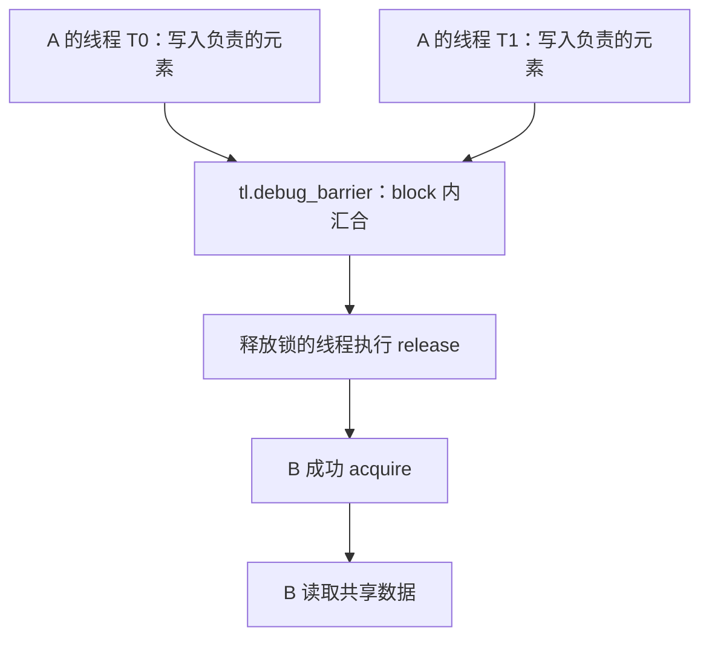

# Triton 05 LayerNorm 学习与实践

> 此文件是规则化提取的“可追溯可见文本对话”，不是完整客户端 Session，也不代表已经匿名化。
> system、developer、reasoning、工具事件、客户端注入和附件正文默认不包含在内。

---

**001 · 用户** · `2026-09-09T08:20:51.057Z` · `msg-408fdb62248f85f580a5`

好，接下来我想根据仓库中的学习流程与配置，继续学习triton。接下来到哪节课了？

---

**002 · 助手 / 过程更新** · `2026-09-09T08:21:06.001Z` · `msg-118b8764d54f96812dfa`

我会按 `guide-learning` 的续学流程，核对 Triton 的课程进度、Checkpoint 和当前配置，确认下一节课。

---

**003 · 助手 / 正式回答** · `2026-09-09T08:22:43.306Z` · `msg-bea5471914f3ba1242f3`

接下来是 **第 05 课：Layer Normalization（层归一化）**。

根据仓库的 [Program 与 Checkpoint](/root/autodl-tmp/programming-lab/docs/triton-learning/README.md#checkpoint)，第 01–04 课均已完成；上一课 **Low-memory Dropout** 于 **8 月 24 日**确认关闭，没有阻塞下一课的遗留问题。当前停在课间，第 05 课尚未开始。

这节课会沿着三个节点展开：

1. **计算模型**：LayerNorm 对哪些元素求均值、方差，归一化解决什么问题。
2. **前向实现**：把逐行归约、归一化和仿射变换融合到 Triton kernel。
3. **反向实现**：理解梯度计算，以及跨行梯度累加的并发处理。

当前配置已经指向 Triton，无需切换。开课后先建立整体图景，再从第一个节点讲起；正式代码练习放在理解检查和综合验收之后。

也可以随手浏览 [学习流程说明](/root/autodl-tmp/programming-lab/.agent-skills/docs/user-guides/guide-learning.md)，了解你需要参与的环节和授权边界。

---

**004 · 用户** · `2026-09-09T08:23:08.119Z` · `msg-48173f5e79977d9fab5b`

好的，让我们开始吧。

---

**005 · 助手 / 过程更新** · `2026-09-09T08:23:11.700Z` · `msg-6b917f9a1c7a405fb73e`

我们开始第 05 课：Layer Normalization。我会先核对仓库固定版本的教程，确定本课目标，再从整体计算模型讲起。

---

**006 · 助手 / 过程更新** · `2026-09-09T08:23:51.047Z` · `msg-44e57ef7b35982d32008`

本课会把前向计算和反向梯度连起来，目标是能解释数据流，并独立实现、验证一个最小版本。性能调优不作为本课的完成门槛。

我会按现有目录建立 `docs/triton-learning/lessons/05-layer-norm.md`，记录目标与后续证据，并把课程 README 的 Checkpoint 移到本课起点。正式练习的具体文件和验收要求，等综合验收后再确定。

---

**007 · 助手 / 正式回答** · `2026-09-09T08:26:29.789Z` · `msg-072d83430f4053e87867`

我们从 **LayerNorm 的整体计算模型**开始。

你在 Softmax 中已经学过：一个输出元素可能依赖同一行的所有输入。LayerNorm 也有这种关系——它先用整行数据计算均值和方差，再逐元素归一化。训练时还需要沿这条依赖关系计算梯度；而不同的行共享参数，又会引出跨行梯度累加。这就是本课从前向走向反向、再走向并行归约的主线。

本课沿用仓库的[固定教程快照](/root/autodl-tmp/programming-lab/docs/triton-tutorials/official/05-layer-norm.py)，目标如下：

| 目标 | 完成所需证据 |
|---|---|
| 理解归一化范围、统计量及仿射参数 | 概念解释与变式 |
| 理解并实现融合前向 | 概念解释、独立实现与正确性验证 |
| 理解并实现反向及梯度归约 | 概念解释、独立实现与梯度验证 |

三项目标均不要求性能实证。我已建立[本课记录](/root/autodl-tmp/programming-lab/docs/triton-learning/lessons/05-layer-norm.md)并更新 Checkpoint。正式练习在综合验收后确定；结课时由你确认关闭。

现在只看第一个节点：**哪些元素一起计算统计量？**

在本教程中，把输入看作 \(M\times N\) 的矩阵：有 \(M\) 行，每行有 \(N\) 个特征。每一行分别计算自己的均值和方差：

\[
\mu_i=\frac{1}{N}\sum_{j=0}^{N-1}x_{ij},
\qquad
v_i=\frac{1}{N}\sum_{j=0}^{N-1}(x_{ij}-\mu_i)^2
\]

这里方差的分母是 \(N\)。本教程采用沿最后一维归一化的情形；一般的 LayerNorm 接口也可以指定多个末尾维度。[PyTorch 官方定义](https://docs.pytorch.org/docs/2.9/generated/torch.nn.LayerNorm.html)

得到统计量后，对该行每个元素执行：

\[
\hat{x}_{ij}=\frac{x_{ij}-\mu_i}{\sqrt{v_i+\epsilon}},
\qquad
y_{ij}=\hat{x}_{ij}w_j+b_j
\]

可以把这两步理解为：先根据该行的中心和尺度调整数值，再用可学习的 \(w_j,b_j\) 调整各个特征。小常数 \(\epsilon>0\) 可以避免常量行出现除零；因此归一化后的方差也不必严格等于 1。

这里有两个不同的依赖范围：

- **统计量按行计算**：第 \(i\) 行有自己的 \(\mu_i,v_i\)。
- **参数按列对应、跨行共享**：各行第 \(j\) 个特征都使用同一个 \(w_j,b_j\)。

例如：

\[
X=
\begin{bmatrix}
1&3&5\\
10&30&50
\end{bmatrix}
\]

第一行使用均值 \(3\)，第二行使用均值 \(30\)。它们各自完成归一化，再应用共享的仿射参数。

先检查这个依赖关系：**如果只把第二行替换为 \([100,300,500]\)，保持 \(w,b,\epsilon\) 不变，第一行的均值、方差和最终输出会不会改变？请说明原因。**

---

**008 · 用户** · `2026-09-10T02:00:05.602Z` · `msg-37cbb1fc429f73cae229`

第一行的均值、方差和最终输出都不会改变。因为均值和方差只与第一行的初始值有关。然后第一行的最终输出由于\\(w,b,\epsilon\\)保持不变，也就不会改变。

---

**009 · 助手 / 正式回答** · `2026-09-10T02:00:25.465Z` · `msg-bbbf2f8bc512fddc180e`

正确。你把依赖关系说清楚了：第一行的统计量由第一行输入决定，固定 \(w,b,\epsilon\) 后，输出也随之确定。**参数共享表示各行使用同一组参数；参数固定时，各行的前向计算仍然独立。**

接着做一个小的形状映射，为后面的 Triton 行映射做准备。

假设输入 `X.shape = (2, 3, 4)`，表示 **2 个样本，每个样本 3 个 token，每个 token 有 4 个特征**。我们只沿最后一维做 LayerNorm，并把前两维合并为矩阵的行。

请写出：

- 展平后的 \(M\) 和 \(N\)；
- 每行一个值的均值数组、方差数组，各自的形状；
- 跨行共享的 \(w\) 和 \(b\)，各自的形状。

---

**010 · 用户** · `2026-09-10T02:37:19.039Z` · `msg-c11e3962b9417ed86f2d`

1. 展平合并后，M为6，N为4；
2. 均值数组和方差数组的形状应都为[6, 1]；
3. w和b的形状应都为[1, 4]。

---

**011 · 助手 / 正式回答** · `2026-09-10T02:38:07.120Z` · `msg-6cc04dd1709b6888a061`

**按二维广播的表示方式，你的三个答案都正确。** 你已经区分了“每行一份统计量”和“各行共享一组特征参数”。

在[教程的实际实现](/root/autodl-tmp/programming-lab/docs/triton-tutorials/official/05-layer-norm.py:239)中，它们会采用更紧凑的存储形状：

| 数据 | 你写的广播形状 | 教程中的存储形状 |
|---|---|---|
| 每行统计量 | `[6, 1]` | `[6]` |
| \(w,b\) | `[1, 4]` | `[4]` |

每个 program 取出自己那一行的统计量，得到标量，再用于整行计算。教程实际保存的是均值和 \(rstd=1/\sqrt{v+\epsilon}\)，供反向复用。

接下来把这个模型接到你熟悉的 **padding 和归约**上。

假设一行只有三个有效元素 `[1, 2, 3]`，用四个 lane 装载，无效位置补零：

```text
有效性：      真   真   真   假
装载结果：     1    2    3    0
```

求均值时，补零不影响总和；除以真实元素数 \(N=3\)，得到 \(\mu=2\)。

但计算方差时，如果直接让所有 lane 都减去均值：

```text
减去均值：   -1    0    1   -2
平方：        1    0    1    4
```

**无效 lane 原本的零，经过减均值后也产生了非零贡献。** 所以仅在 load 时补零还不够：求方差时，必须把无效 lane 的中心化值重新置零，再平方、求和，并除以真实的 \(N\)。这也是[教程前向代码](/root/autodl-tmp/programming-lab/docs/triton-tutorials/official/05-layer-norm.py:73)中再次使用 `tl.where` 的原因。

检查一个新例子：**若 \(N=5\)、块大小为 8、正确均值为 2，三个 padding lane 在装载时都补零，但减均值后没有再次屏蔽，那么算出的方差会比正确值多多少？**

---

**012 · 用户** · `2026-09-10T02:44:44.545Z` · `msg-aecae4b86b2b51a0a51d`

会比正确值多(1/N) \* (对无效数量求和(均值^2))，也就是1/5 \* (4+4+4) = 2.4

---

**013 · 助手 / 正式回答** · `2026-09-10T02:45:29.531Z` · `msg-6e53c19c5cdd6459811d`

正确，额外贡献就是 **2.4**。你给出的通式也成立：在均值已正确计算的前提下，

\[
v_{\text{错误}}-v_{\text{正确}}
=\frac{(B-N)\mu^2}{N}
\]

其中 \(B\) 是补齐后的块大小。这说明：**无效 lane 必须在最终参与归约的表达式中贡献零。**

接着做一次小的前向计算，把归约、\(\epsilon\) 和仿射变换连起来：

```text
有效输入 x = [5, 5, 5]
N = 3，块大小 = 4
w = [1, 2, 3]
b = [10, 20, 30]
epsilon = 1e-5
```

假设 padding 已正确处理，请依次写出：

\[
\mu,\quad v,\quad \hat{x},\quad y
\]

这里不需要写代码，直接按前向公式计算即可。

---

**014 · 用户** · `2026-09-10T02:50:12.899Z` · `msg-51f7c1d88ac92950c4ce`

1. 均值为5，方差为0，有效/hat{x}为[0,0,0]，y = [10, 20 ,30]

---

**015 · 助手 / 正式回答** · `2026-09-10T02:51:36.984Z` · `msg-d073293130de90024641`

正确。常量行减去均值后全为零；\(\epsilon>0\) 保证分母非零，所以 \(\hat{x}=[0,0,0]\)，最终 \(y=b\)。这也说明：**最终输出经过仿射变换后，不必具有零均值或单位方差。**

现在把前向公式落到 Triton 的数据流上。先考虑连续的二维输入 \(X[M,N]\)：**一个 program 负责一行。**

对于第 \(r\) 行、第 \(j\) 列，地址关系是：

| 数据 | 访问位置 | 原因 |
|---|---|---|
| 输入 \(X\)、输出 \(Y\) | `r * N + j` | 每行处理自己的元素 |
| 参数 \(w,b\) | `j` | 各行共享同一组特征参数 |
| 保存的 `mean`、`rstd` | `r` | 每行各保存一个标量 |

其中：

\[
rstd_r=\frac{1}{\sqrt{v_r+\epsilon}}
\]

[教程前向实现](/root/autodl-tmp/programming-lab/docs/triton-tutorials/official/05-layer-norm.py:49)把装载的输入转为 FP32，再计算均值、方差和归一化结果；写入输出时转回输出张量的类型。这延续了你在矩阵乘法中见过的思路：存储精度与中间计算精度可以不同。

前向还会保存每行的 `mean` 和 `rstd`，让反向能够复用统计量，重建 \(\hat{x}\)。

我们追踪一个 program：**若 \(M=4,N=5\)，块大小为 8，当前 `program_id=2`，它应该读取哪些有效的 \(X\) 线性偏移、哪些 \(w\) 偏移，并把 `mean` 存到哪个位置？**

---

**016 · 用户** · `2026-09-10T03:10:17.988Z` · `msg-39fc313611235caa0b7a`

假如输入数据x是连续的，那么第0维的stride为N=5，第1维的stride为1。那么它应该读取偏移为program\_id \* 5 + [0, 1, 2, 3, 4, 5, 6, 7] = [10, 11, 12, 13, 14, 15, 16, 17]。读取权重w，假设也是连续的，那么偏移为[0, 1, 2, 3 ,4, 5, 6, 7]。mean是标量，但存放位置与行号有关，应该存放偏移为program\_id=2。

---

**017 · 助手 / 正式回答** · `2026-09-10T03:10:41.199Z` · `msg-f109f79b00842e2fff26`

你对 stride、地址计算和 `mean` 存放位置的判断都正确。需要补上的一处是：**你列出的是 8 个 lane 的候选地址；有效读取还要经过列 mask。**

这里：

```text
cols：  0  1  2  3  4  5  6  7
mask：  真 真 真 真 真 假 假 假     ← cols < N
```

因此有效读取为：

- \(X\)：偏移 `[10, 11, 12, 13, 14]`。
- \(w\)：偏移 `[0, 1, 2, 3, 4]`。
- `mean`：写到偏移 `2`，这一点你已经答对。

尤其要注意：\(X\) 的偏移 `15、16、17` 虽然仍在整个张量内部，但它们属于**下一行**。如果参与当前行的归约，就会混入另一行的数据。因此，这里的合法性条件必须体现“属于当前行”。

换一个条件检查这个区别：假设 \(M=3,N=6\)，块大小为 8，当前 `program_id=1`。有人使用：

```python
offsets = program_id * N + cols
mask = offsets < M * N
```

**这个 mask 能保证只读取当前行吗？如果不能，应改成什么条件？**

---

**018 · 用户** · `2026-09-10T03:14:35.037Z` · `msg-02aaf958a17f922adf4f`

是的，还需要mask才能正确读取。本例中，offsets选取了第1行进行读取，但mask的限制是限制了全部总数据量，不能保证只读取当前行。读取到的6个元素中，后三个是下一行的数据。应改成mask = offsets < M

---

**019 · 助手 / 正式回答** · `2026-09-10T03:15:06.386Z` · `msg-b5f6f05604217b651e69`

你正确指出了总元素数这个边界的问题。还需要修正**元素数量**和**比较对象**：

本例有 8 个候选 lane：

```text
cols：      0  1  2  3  4  5  6  7
offsets：   6  7  8  9 10 11 12 13
所属行：    1  1  1  1  1  1  2  2
```

所以前 **6** 个属于当前行，后 **2** 个属于下一行。

`offsets < M` 也不合适：`M=3` 是**行数**，而 `offsets` 是整个张量中的**元素偏移**。这里所有偏移都大于 3，会把所有 lane 都屏蔽掉。

我们需要判断的是“这个 lane 的**行内列号**是否有效”，因此使用：

```python
mask = cols < N
```

换个小例子再确认一次：**\(M=5,N=3\)，块大小为 4，`program_id=2`。请写出 `cols < N` 对应的四个布尔值，以及有效的 \(X\) 线性偏移。**

---

**020 · 用户** · `2026-09-10T03:19:02.215Z` · `msg-2ee6278dbc0909179995`

噢，刚刚我看错了，以为N是block size，M是列数了。重新确认下，在本例中，mask结果应该是[T, T, T, F]，X有效偏移是[6, 7, 8]，完整偏移是[6, 7, 8 ,9].

---

**021 · 助手 / 正式回答** · `2026-09-10T03:19:42.046Z` · `msg-cdb00d30d97da0de5123`

正确，这次 mask、完整偏移和有效偏移都对。偏移 `9` 属于下一行，所以被屏蔽。

现在转到**反向传播中的参数梯度**。前向里，各行使用同一组 \(w,b\)；反向时，各行对这些共享参数产生的梯度需要相加。

先把归一化结果 \(\hat{x}\) 看作已知，只看仿射变换：

\[
y_{ij}=\hat{x}_{ij}w_j+b_j
\]

设整个网络最终产生标量损失 \(L\)，后续计算传回的“上游梯度”为：

\[
g_{ij}=\frac{\partial L}{\partial y_{ij}}
\]

它表示 \(y_{ij}\) 发生微小变化时，损失对这个变化有多敏感。根据链式法则，第 \(i\) 行对参数梯度的贡献是：

\[
\text{对 }w_j\text{ 的贡献}=g_{ij}\hat{x}_{ij},
\qquad
\text{对 }b_j\text{ 的贡献}=g_{ij}
\]

由于 \(w_j,b_j\) 被所有行共享，最终得到：

\[
\frac{\partial L}{\partial w_j}
=\sum_i g_{ij}\hat{x}_{ij},
\qquad
\frac{\partial L}{\partial b_j}
=\sum_i g_{ij}
\]

这里的归约方向发生了变化：**前向均值、方差沿一行的各列归约；参数梯度沿同一列的各行归约。**

看一个两行的小例子，只关注某一列 \(j\)：

| 行 | \(\hat{x}_{ij}\) | 上游梯度 \(g_{ij}\) |
|---|---:|---:|
| 0 | \(1\) | \(3\) |
| 1 | \(-1\) | \(5\) |

**请算出每行对 \(w_j,b_j\) 的梯度贡献，以及汇总后的两个参数梯度。**

---

**022 · 用户** · `2026-09-10T03:32:45.380Z` · `msg-361675db0c4325a2e779`

1. 第一行对w\_j的梯度贡献为3，对b\_j的梯度贡献为3；
2. 第二行为w\_j的梯度贡献为-5，对b\_j的梯度贡献为5；
3. 汇总后w\_j的梯度为2，b\_j的梯度为8.

---

**023 · 助手 / 正式回答** · `2026-09-10T03:33:42.602Z` · `msg-bea19d7a8035e7590e09`

每行的贡献都算对了，最后汇总 \(w_j\) 时有一处符号错误：

\[
dw_j=3+(-5)=\boxed{-2},\qquad db_j=3+5=\boxed{8}
\]

各行的贡献是**带符号相加**的，因此可能相互抵消。

接着把单列扩展到整个矩阵，为后面的并行归约做准备：

输入为 \(X[M,N]\)，每个 program 处理一行，产生这一行对全部 \(w\) 参数的梯度贡献。假设先把各行贡献分别存到独立位置，再统一求和。

**请用形状写出这个过程：临时贡献数组是什么形状，沿哪个维度求和，最终 \(dw\) 是什么形状？**

---

**024 · 用户** · `2026-09-10T03:36:22.152Z` · `msg-fc660260527a8859c4fc`

那么，临时贡献数组形状应该是[N]，后续沿着行维度求和，最终d\_w形状也为[N]

---

**025 · 助手 / 正式回答** · `2026-09-10T03:36:54.322Z` · `msg-f4ddcf5d5c52364124a4`

你说的 `[N]` 是**单个 program 产生的局部贡献向量**，这一点正确。你给出的归约方向和最终形状也正确。

我上一问指的是“保存全部 \(M\) 个 program 结果的临时缓冲区”，需要把这两个层次区分开：

| 对象 | 形状 |
|---|---|
| 单个 program 的局部贡献 | `[N]` |
| 全部行的贡献，分别保存 | `[M, N]` |
| 沿行维度 `axis=0` 求和后的 \(dw\) | `[N]` |

每一列对应一个共享参数 \(w_j\)，该列的 \(M\) 个值就是各行对它的贡献。

做一个具体的存放映射：**若 \(M=4,N=3\)，全部贡献连续存储，这块临时缓冲区共需要多少个标量？`program_id=2` 的三个贡献应该写到哪些线性偏移？**

---

**026 · 用户** · `2026-09-10T03:40:20.332Z` · `msg-5611921115842aec990e`

噢，每个program需要分别保存各自的贡献数组，所以贡献数组需要扩大成[M, N]。这个例子中，那么就需要M\*N个标量存储。应该写到线性偏移[6, 7, 8]位置。

---

**027 · 助手 / 正式回答** · `2026-09-10T03:41:10.788Z` · `msg-edf63e95bbf1f24b4598`

正确。本例需要 \(4\times3=12\) 个标量，`program_id=2` 写入 `[6,7,8]`，各行的贡献有独立的存放位置。

接下来看看教程怎样**减少临时缓冲区的大小**。

如果每行都保存一份贡献，单个参数梯度需要 `[M,N]` 的缓冲区。教程改用 \(G\) 个分组，让每组保存一份累加后的部分和，缓冲区形状为 `[G,N]`。当 \(G<M\) 时，就减少了临时空间。

分组规则是：

```python
group_id = program_id % G
```

例如 \(M=4,G=2\)，用 \(C_i\) 表示第 \(i\) 行产生的梯度贡献向量：

\[
P_0=C_0+C_2,\qquad P_1=C_1+C_3
\]

然后由第二个 kernel 合并：

\[
dw=P_0+P_1
\]

`db` 也采用相同结构。**分组只改变梯度贡献的累加位置，每行的归一化范围仍然保持原样。**

共享缓冲区带来了一个并发问题：一次累加包含“读取旧值 → 相加 → 写回”。如果两个 program 同时读到旧值零，分别加入 3 和 5，再分别写回，最终可能只留下其中一个结果。

因此，[教程实现](/root/autodl-tmp/programming-lab/docs/triton-tutorials/official/05-layer-norm.py:174)为每个组配置一把锁，让同组 program 互斥地完成整段累加；第二个 kernel 再汇总各组的部分和。

检查一个新分组：**若 \(M=5,G=2\)，`program_id=4` 应累加到哪个组？它会和哪些其他 program 争用同一把锁？**

---

**028 · 用户** · `2026-09-10T03:50:32.856Z` · `msg-acbb08099e6c560dfad2`

应该属于program\_id % G = 0，第0个组。他会和其他program\_id=0、2的program争用同一把锁。

---

**029 · 助手 / 正式回答** · `2026-09-10T03:51:35.840Z` · `msg-59979adabd73c99a2a4f`

正确。第 0 组汇总 program `0、2、4` 的贡献，它们共用一把锁；第 1 组汇总 `1、3`，使用另一把锁。

接下来回到反向传播的另一条线：**输入梯度 \(dx\)**。

参数梯度需要跨行相加；输入梯度的关键则是**同一行内的依赖关系**。因为某个输入元素会影响本行均值和方差，进而影响这一行的所有归一化输出。

我们先只保留“减均值”这一步，把依赖关系看清楚。对一行输入，定义：

\[
\mu=\frac1N\sum_k x_k,\qquad z_k=x_k-\mu
\]

如果只把 \(x_j\) 增加一个小量 \(\Delta\)，那么均值增加 \(\Delta/N\)：

- \(z_j\) 增加 \(\Delta(1-1/N)\)；
- 其他 \(z_k\) 都减少 \(\Delta/N\)。

所以，虽然只改变一个输入，**整行输出都会变化**。

设这一简化运算收到的上游梯度为 \(a_k=\partial L/\partial z_k\)。把各条影响路径相加，便得到：

\[
\frac{\partial L}{\partial x_j}
=a_j\left(1-\frac1N\right)
-\sum_{k\ne j}\frac{a_k}{N}
=\boxed{a_j-\frac1N\sum_k a_k}
\]

也就是：**去均值这一步的反向，同样需要从上游梯度中减去它的行均值。** 完整 LayerNorm 还要处理方差和缩放，我们稍后接上。

检查这个关系：**若 \(N=4\)，上游梯度为 \([4,0,0,0]\)，这一步得到的输入梯度是什么？为什么后三个上游梯度为零，对应输入梯度仍可能非零？**

---

**030 · 用户** · `2026-09-10T06:14:42.010Z` · `msg-b07ecdf0b760835136fa`

按照以上逻辑，这一步的输入梯度应为[3,-1,-1,-1]，因为各个输入分量之间存在相互影响，在计算输入梯度中，各分量需要减去上游梯度行均值。

---

**031 · 助手 / 过程更新** · `2026-09-10T06:16:41.965Z` · `msg-26fe1533163f4d706360`

这一步算得正确。接下来把“方差改变会影响缩放系数”这条路径接上，推导完整的输入梯度。

---

**032 · 助手 / 正式回答** · `2026-09-10T06:19:15.257Z` · `msg-504abd5313f6a657c79a`

结果正确。更精确地说，**各输入通过共享均值共同影响整行输出**，所以即使某个位置的上游梯度为零，它仍可能从其他输出路径收到梯度。

现在把方差这条路径接上。仍然只看一行，记：

\[
z=x-\mu,\qquad v=\operatorname{mean}(z^2),\qquad
r=\frac1{\sqrt{v+\epsilon}},\qquad \hat{x}=zr
\]

仿射变换 \(y=\hat{x}w+b\) 传给 \(\hat{x}\) 的上游梯度是：

\[
h=g\,w
\]

这里的乘法都是逐元素乘法。

**关键是：\(r\) 也会随输入变化。** 因而，从 \(\hat{x}=zr\) 回传到 \(z\) 有两条路径：

- 直接经过乘法中的 \(z\)，贡献为 \(rh\)；
- 经过 \(z\rightarrow v\rightarrow r\rightarrow\hat{x}\)，还会产生一项贡献。

第二条路径用链式法则计算。因为 \(dr/dv=-r^3/2\)，所以：

\[
\frac{\partial L}{\partial v}
=-\frac12r^3\sum_k h_kz_k
\]

再利用 \(\partial v/\partial z_j=2z_j/N\)，两条路径合起来得到：

\[
q_j\equiv\frac{\partial L}{\partial z_j}
=rh_j+\frac{2z_j}{N}\frac{\partial L}{\partial v}
=r\left[h_j-\hat{x}_j\operatorname{mean}(h\hat{x})\right]
\]

最后，经过你刚刚算对的 \(z=x-\mu\) 这一步：

\[
dx=q-\operatorname{mean}(q)
\]

由于 \(\operatorname{mean}(\hat{x})=0\)，可以整理成[教程中的形式](/root/autodl-tmp/programming-lab/docs/triton-tutorials/official/05-layer-norm.py:169)：

\[
\boxed{
c_1=\operatorname{mean}(h\hat{x}),\qquad
c_2=\operatorname{mean}(h),\qquad
dx=r\left(h-\hat{x}c_1-c_2\right)
}
\]

其中，\(c_1\) 对应方差路径带来的修正，\(c_2\) 对应减均值的反向修正。源码只需计算这两个行内归约，再逐元素计算 \(dx\)。

做一个方便手算的例子：

```text
x = [-1, 0, 1]
w = [1, 1, 1]
上游梯度 g = [-1, 0, 1]
epsilon = 1/3
```

这时 \(\mu=0,\ v=2/3,\ r=1\)，所以 \(\hat{x}=h=[-1,0,1]\)。

**请算出 \(c_1\)、\(c_2\) 和最终的 \(dx\)。**

---

**033 · 用户** · `2026-09-10T06:35:40.031Z` · `msg-11fc37d9621e8e33ac1c`

此时，c1 = mean(hx) = 2/3, c2=mean(h)=0, dx = [-1+2/3 , 0, 1 - 2/3]=[-1/3, 0 , 1/3]

---

**034 · 助手 / 正式回答** · `2026-09-10T06:36:19.155Z` · `msg-7c7ca30888ab4dfd2277`

正确，\(c_1=2/3,\ c_2=0\)，最终：

\[
dx=[-1/3,\ 0,\ 1/3]
\]

记号上补充一点：一般情况下，\(c_1\) 使用的是 \(\operatorname{mean}(h\hat{x})\)；本例恰好 \(x=\hat{x}\)，所以你写成 \(hx\) 得到的数值相同。

接着做一个常量行的变式，把前向和反向联系起来：

```text
x = [5, 5, 5]
w = [1, 1, 1]
上游梯度 g = [1, 0, 0]
epsilon > 0，b 固定
```

你已经知道，此时 \(\hat{x}=[0,0,0]\)、前向输出 \(y=b\)，且 \(r=1/\sqrt{\epsilon}\)。

**请用 \(r\) 表示输入梯度 \(dx\)，并据此判断：“前向输出等于 \(b\)，所以输入梯度必定为零”是否成立。**

---

**035 · 用户** · `2026-09-10T06:44:10.442Z` · `msg-c5cf0e30fe8c6909be1c`

dx=[2r/3,-r/3,-r/3].”前向输出等于 \\(b\\)，所以输入梯度必定为零“是不成立的

---

**036 · 助手 / 过程更新** · `2026-09-10T06:46:48.858Z` · `msg-acfc1137aa17d38f497b`

这个变式也正确。前向、输入梯度和参数梯度的关键关系已经串起来了；接下来我会汇总完整流程，并做一次综合验收。

---

**037 · 助手 / 正式回答** · `2026-09-10T06:49:47.695Z` · `msg-1544e1c9d8b5487ed147`

正确。这里 \(y=b\) 描述的是**当前这个输入点的输出值**。改变其中一个输入元素，会打破常量行的条件，输出仍可能变化，所以输入梯度可以非零。

我们把完整流程合起来：

| 阶段 | 核心计算 | 结果 |
|---|---|---|
| 前向 | 每行求均值、方差，归一化并应用 \(w,b\) | 输出 \(Y\)，保存每行 `mean/rstd` |
| 反向第一阶段 | 每行计算 \(c_1,c_2,dx\)；计算参数梯度贡献并在组内累加 | 各行 \(dx\)，各组参数梯度部分和 |
| 反向第二阶段 | 沿组维度汇总部分和 | 最终 \(dw,db\) |

还有一个实现细节要接上：**反向归约也需要正确处理 padding。** [教程代码](/root/autodl-tmp/programming-lab/docs/triton-tutorials/official/05-layer-norm.py:166)在计算 \(c_1,c_2\) 前，把无效 lane 的 \(\hat{x}\) 和 \(h=w\,dy\) 都显式置零，归约仍除以真实的 \(N\)。

现在进入综合验收。下面三题共用这个案例：

```text
X.shape = (2, 3, 5)，连续存储
只沿最后一维做 LayerNorm
BLOCK_SIZE = 8
```

1. **前向索引与边界**  
   展平后的 \(M,N\) 分别是多少？`program_id=4` 应读取哪些有效的 \(X\) 和 \(w\) 偏移？为什么 `offsets < X.numel()` 不能替代列 mask？

2. **分组与最终梯度**  
   若 \(G=4\)，`program_id=4` 属于哪个组，与哪个其他 program 共享缓冲区？保存**所有组部分和**的缓冲区是什么形状，最终 \(dw\) 又是什么形状？如果改成 \(G=M\)，这套实现能否直接删掉第二个归约 kernel？说明原因。

3. **前向与反向的共同依赖**  
   忽略浮点舍入，只把某一行的所有输入都加上同一个常量 \(c\)，保持 \(w,b,\epsilon\) 和上游梯度不变。该行的 \(y\) 和 \(dx\) 是否变化？再根据公式说明：这一行的 \(dx\) 分量之和应满足什么关系？

可以按 1–3 依次回答。

---

**038 · 用户** · `2026-09-10T08:05:36.676Z` · `msg-d940d44f77525cbaa7e5`

1. 展平后的M=6，N=5. 应读取X有效偏移为[20, 21, 22, 23, 24]，w有效偏移为[0, 1, 2, 3, 4]。  因为每一个program处理一行数据，offset\<X.numel()是整个输入的有效数据，但不是本行数据。多读进来的半行数据会影响本行数据的计算。
2. 属于第0组，与id为0的program共享缓冲区。保存所有组部分和的缓冲区形状为[G, N] = [4, 5].最终dw形状为[N]=[5]。如果改成G=M，依旧需要第二个归约kernel，而且还扩大了缓冲区大小。因为是第二个kernel为了将多个临时贡献归约最终贡献，改成G=M是的贡献更加分散了，还没有得到归约结果，还需要归约。
3. 那么该行的输出y是不变的，因为对y的计算中会归一化x。而dx同样也是不变的，因为dx计算公式中依赖的r和\hat{x}都经过了归一化x。这一行的dx分量之和应为0.公式推导部分我写在纸上附图了。

---

**039 · 助手 / 过程更新** · `2026-09-10T08:09:19.014Z` · `msg-d53873f0cc48b99333c6`

三题的主要结论都正确。我会核对纸面推导中的求和记号，再把接下来的最小代码练习和验收要求列清楚。

---

**040 · 助手 / 过程更新** · `2026-09-10T08:12:37.248Z` · `msg-fb954ce4ec789d8457b4`

纸面推导只需把行内求和上限统一改为 \(N-1\)。练习会采用你刚分析过的 \(G=M\)：每行独占临时槽，保留两阶段归约。当前 RTX 5090、PyTorch 和 Triton 环境已确认可用。

---

**041 · 助手 / 正式回答** · `2026-09-10T08:16:39.784Z` · `msg-5530f1485e75c17a84de`

**三题通过，概念综合验收的证据已经充分。**

纸面推导的思路正确，只需把行内求和上限从 \(M-1\) 改成 **\(N-1\)**。你展开后的分母 \(v+\epsilon\) 也正确，因为：

\[
r\hat{x}=r^2(x-\mu)=\frac{x-\mu}{v+\epsilon}
\]

第 3 题的依赖关系可以说得更精确：整行平移后，均值也增加 \(c\)，所以中心化输入、方差、\(r\) 和 \(\hat{x}\) 均不变。

接下来是正式练习契约 **`triton-05-practice-01 / revision 1`**：

1. **为什么做**  
   补足 O2、O3 的独立实践证据：把已经解释清楚的前向和反向，落实为可运行的 Triton 实现。

2. **你交付什么**  
   在 `gpu/triton/lesson05_layer_norm.py` 实现两个接口：

   ```text
   layer_norm_forward(x, w, b, eps=1e-5) -> (y, mean, rstd)
   layer_norm_backward(dy, x, w, mean, rstd) -> (dx, dw, db)
   ```

   前向使用一个 kernel；反向采用 **\(G=M\)、每行独占 FP32 临时槽**的两阶段实现。

   输入限定为连续、同一 CUDA 设备上的 FP16 或 FP32 张量：`x/dy` 为 `[M,N]`，`w/b` 为 `[N]`，它们 dtype 相同；\(M\ge1,\ 1\le N\le4096\)。`eps` 必须有限且为正。保存的 `mean/rstd` 为连续 FP32 `[M]`，反向使用同一输入前向产生的统计量。

   `y/dx` 保持输入形状和 dtype，`dw/db` 保持参数形状和 dtype。

3. **怎样算通过**
   - **P05-A1：接口正确。** 检查输出 metadata；非法形状、dtype、设备、连续性、尺寸范围或 `eps` 明确抛出 `ValueError` 或 `TypeError`。
   - **P05-A2：数值正确。** 前向、统计量及 `dx/dw/db` 与 PyTorch 和 autograd 对照；覆盖普通输入、非二次幂列数、尾部、单元素、常量行和非均匀上游梯度。FP32 使用 `atol=rtol=1e-4`，FP16 使用 `atol=rtol=2e-2`；统计量使用 `1e-4`。
   - **P05-A3：数据流正确。** 核心计算由 Triton 完成，反向先分别保存各行贡献，再归约；不修改输入。
   - **P05-A4：独立变式。** 在契约范围内完成一个未提前给出的形状变式，并解释关键索引和验证结果。

   接受后，我先建立测试并确认预期失败，再由你实现到通过。验收命令为：

   ```bash
   bash scripts/host-gpu.sh run -- python -m pytest -q gpu/triton/lesson05_layer_norm_test.py
   ```

4. **文件边界**  
   **你写：** `gpu/triton/lesson05_layer_norm.py`。  
   **我维护：** 对应的 `lesson05_layer_norm_test.py`、本课记录和 Program/Checkpoint。  
   **我只读：** 官方教程、运行脚本及项目配置。其他课程和实现保持在本次范围之外。

5. **帮助如何影响证据**  
   可以随时求助。若帮助透露了关键实现，只需针对受影响部分完成一个无提示新变式，恢复独立证据。

6. **非目标与完成门槛**  
   本次聚焦正确性；性能调优、共享槽的锁实现、任意 stride、多轴接口和 autograd 封装不纳入验收。静态检查中的纯样式或 Triton 类型标注问题作为非阻塞观察。全部验收通过、相关阻塞问题关闭后，再展示结课证据，由你确认关闭。

**是否接受这份练习契约？**

这里需要单独确认，是因为你选用的 [guide-learning/SKILL.md](/root/autodl-tmp/programming-lab/.agents/skills/guide-learning/SKILL.md) 明确要求：“进入正式练习时另行取得完整契约授权。”

---

**042 · 用户** · `2026-09-10T08:18:19.492Z` · `msg-c1e1f647cb9534c98c58`

确认。

---

**043 · 助手 / 过程更新** · `2026-09-10T08:18:25.119Z` · `msg-9c5a58c8800d66a27ed2`

契约已接受。我会先建立验收测试，确认初始失败确实来自尚未完成的实现，再把测试入口交给你。

---

**044 · 助手 / 过程更新** · `2026-09-10T08:22:01.703Z` · `msg-af0a1b1b7607b5395276`

验收会分别检查接口边界、数值结果和输入是否被修改。测试中的梯度参考使用 PyTorch autograd；每行临时缓冲区和两阶段 Triton 实现会在你提交后做代码审查。

---

**045 · 助手 / 过程更新** · `2026-09-10T08:28:41.612Z` · `msg-2308b708a5e98f8cb051`

测试已分成可单独运行的前向和反向部分。现在检查参考计算与负例构造是否正常，再运行完整测试，确认初始失败原因。

---

**046 · 助手 / 过程更新** · `2026-09-10T08:32:03.076Z` · `msg-606dd4dd84950effa298`

初始验证符合预期：98 项已收集，只有“实现文件尚不存在”这一项失败，其余按设计跳过。16 组参考计算和 45 种负例构造均已独立预检通过，测试文件的静态检查也通过了。

---

**047 · 助手 / 正式回答** · `2026-09-10T08:34:49.742Z` · `msg-13ec7f7c8e1dfa243337`

[验收测试已就绪](/root/autodl-tmp/programming-lab/gpu/triton/lesson05_layer_norm_test.py)，参考计算、负例构造和静态检查均已通过。

完整测试目前为 **1 failed、97 skipped**：唯一失败是实现文件尚不存在，符合预期。

现在请创建 `gpu/triton/lesson05_layer_norm.py`，先实现 `layer_norm_forward`。前向验收命令：

```bash
bash scripts/host-gpu.sh run -- python -m pytest -q gpu/triton/lesson05_layer_norm_test.py -k 'implementation_exists or forward'
```

完成反向接口后，去掉 `-k 'implementation_exists or forward'`，运行全部验收。

---

**048 · 用户** · `2026-09-10T09:07:47.141Z` · `msg-0579bf5688e682503bd0`

好的，我正在进行练习代码的编写。我想到一个问题。目前主流的框架对于layerNorm的反向计算都是这样的两阶段且需要临时槽的设计吗？感觉这样设计的反向计算开销有点大，需要多个kernel才能完成反向计算而且还需要临时的空间。当今主流训练框架是怎么做的呢？

---

**049 · 助手 / 过程更新** · `2026-09-10T09:07:53.704Z` · `msg-4da20a42ba949ff91e2d`

我会查一下主流实现的源码，区分输入梯度和参数梯度各自怎样计算，以及它们是否使用临时缓冲区。这也能说明教程的两阶段设计适用于哪些场景。

---

**050 · 助手 / 过程更新** · `2026-09-10T09:10:48.355Z` · `msg-3f950c9f6fd9560187ac`

已经确认，两次 kernel launch 不一定意味着“先写部分和、再归约”。PyTorch 原生 CUDA 的常见分支把 `dx` 与最终 `dw/db` 分开计算；Transformer Engine 则常用主 kernel 加归约 kernel，但按 CTA 保存部分和，不是每行都留一份。

---

**051 · 助手 / 正式回答** · `2026-09-10T09:17:42.910Z` · `msg-62deb7600a8378ec0044`

**不都是。两阶段归约很常见，但“每行保存一份 `[M,N]` 临时贡献”并不是生产实现的统一方案。** 你的担忧对我们当前的 \(G=M\) 版本确实成立。

首先要区分：**反向用了两个 kernel，不一定表示参数梯度做了两阶段归约。** 我核对了你当前 PyTorch 2.13.0 对应提交，以及 NVIDIA 的实现；在需要全部三个梯度时：

| 实现路径 | 反向怎样组织 | 参数梯度的全局临时槽 |
|---|---|---|
| 当前练习 | 第一个 kernel 算 `dx` 和各行贡献；第二个汇总 `dw/db` | 每种参数 `[M,N]` |
| PyTorch 原生 CUDA 的常规分支 | 一个 kernel 算 `dx`；另一个直接算最终 `dw/db` | 无上述部分和缓冲区。[源码](https://github.com/pytorch/pytorch/blob/cf30153c4c131c8164ee7798e5022d810682e2cb/aten/src/ATen/native/cuda/layer_norm_kernel.cu#L1564) |
| Transformer Engine 的 CUDA/NVRTC 路径 | 主 kernel 融合 `dx` 与参数梯度部分和，再由 finalize kernel 汇总 | `[C,N]`，\(C\) 由 CTA 配置、SM 数量等决定。[源码](https://github.com/NVIDIA/TransformerEngine/blob/1634a5a615e164c3e0d4277f25e921bc1c600d39/transformer_engine/common/normalization/rtc_dispatch.cpp#L455) |
| Apex 经典 `fused_layer_norm` | 参数梯度部分和 → 最终参数梯度 → `dx`，共三个 kernel | 每种参数 `[16,N]`。[源码](https://github.com/NVIDIA/apex/blob/a1d527a857e8da64c4e7237ca89ec699fb4d9eaf/csrc/layer_norm_cuda_kernel.cu#L824) |

这里的“无部分和缓冲区”不包含前向保存的 `mean/rstd`，也不表示没有寄存器或 shared memory。并且 PyTorch 在**很大的 \(M\)、相对较小的 \(N\)** 下，也会切换到部分和加最终归约的路径；同一框架会按形状选择不同策略。[分支条件](https://github.com/pytorch/pytorch/blob/cf30153c4c131c8164ee7798e5022d810682e2cb/aten/src/ATen/native/cuda/layer_norm_kernel.cu#L976)

生产实现减少空间的一种重要方式是：**一个 CTA 循环处理多行，先在寄存器里累计贡献，最后才写一份部分和。** Transformer Engine 就采用了这种组织，因此大 \(M\) 时，临时槽的行数可以远小于输入行数。[主 kernel](https://github.com/NVIDIA/TransformerEngine/blob/1634a5a615e164c3e0d4277f25e921bc1c600d39/transformer_engine/common/normalization/layernorm/ln_bwd_kernels.cuh#L75)

举个纯空间计算的例子：\(M=8192,N=4096\) 时，两份 FP32 `[M,N]` 部分和占 **256 MiB**；假设只保存 128 行部分和，则占 **4 MiB**。这里只计算参数梯度部分和，不是总 workspace，也不是某个库的固定配置。

至于为什么还愿意用多个 kernel，关键在于两种归约方向不同：

- `dx` 需要**行内**归约，适合按行组织。
- `dw/db` 需要**跨行**归约，适合另一种工作划分。

分开计算可以省掉部分和，却要分别访问输入；融合计算可以复用数据，却可能需要部分和缓冲区。再加上并行度、寄存器压力和同步成本，**少一次 launch 并不自动意味着更快**。

对于 `torch.compile`、JAX/XLA，kernel 数量还受计算图分解、融合和归约调度影响，不能只凭 LayerNorm 这个算子名确定。[PyTorch 分解](https://github.com/pytorch/pytorch/blob/v2.13.0/torch/_decomp/decompositions.py#L1833)、[XLA 融合说明](https://openxla.org/xla/gpu_architecture#fusion)

所以，我们当前的 \(G=M\) 版本适合作为**容易验证正确性的基线**。你已经注意到它的真实空间代价；生产优化正是在这个基础上，选择更合适的工作划分和部分和规模。

---

**052 · 用户** · `2026-09-11T08:48:50.356Z` · `msg-442e01f8b684602ca0b5`

好的，明白，请将这些内容也加到课程记录中吧。此外，我想更多了解一下关于triton中的lock的写法。

---

**053 · 助手 / 过程更新** · `2026-09-11T08:49:01.710Z` · `msg-8810552894c4a9649a78`

我会把刚才的生产实现对比补进本课记录，再结合教程讲清 Triton 锁的获取、临界区和释放，以及它在 GPU 上的使用边界。

---

**054 · 助手 / 过程更新** · `2026-09-11T08:53:52.854Z` · `msg-af433fd3c487aaeceea0`

我会将生产实现对比保存为本课的补充讨论，并保留源码版本链接。锁的讲解也作为补充内容，当前练习仍按 \(G=M\) 的已接受契约进行。

---

**055 · 助手 / 正式回答** · `2026-09-11T08:58:58.654Z` · `msg-e21ba8b9eccc209e903c`

已把生产实现对比、空间计算示例和源码链接加入[第 05 课的补充讨论](/root/autodl-tmp/programming-lab/docs/triton-learning/lessons/05-layer-norm.md#production-design)。

教程中的锁，本质上是：**用 GPU 内存中的一个整数标志，让多个 program 轮流完成同一段“读—改—写”。**

约定每组有一个 `int32` 锁槽：

- `0`：空闲。
- `1`：已被某个 program 持有。

下面是与教程对应的示意片段，限定为 **NVIDIA 后端、Triton 3.7.1、单 CTA program、标量锁地址和普通 load/store**。锁和共享缓冲区在使用前已清零；`buf_ptrs` 指向该组的共享向量，`contribution` 是当前 program 的贡献。

```python
lock_ptr = Locks + group_id

# 获取锁：原子地尝试将 0 改成 1
while tl.atomic_cas(lock_ptr, 0, 1, sem="acquire", scope="gpu") != 0:
    pass

# 临界区：整段更新受到锁保护
old = tl.load(buf_ptrs, mask=mask, other=0.0)
tl.store(buf_ptrs, old + contribution, mask=mask)

# 本 program 的协作线程完成写入后，再释放锁
tl.debug_barrier()
tl.atomic_xchg(lock_ptr, 0, sem="release", scope="gpu")
```

这里最容易误读的是 **CAS 的返回值**。`atomic_cas(ptr, 0, 1)` 返回的是操作前的旧值：

| 操作前的锁值 | 本次操作 | 返回值 | 当前 program |
|---|---|---|---|
| `0` | 把锁改为 `1` | `0` | 获锁成功，退出循环 |
| `1` | 保持为 `1` | `1` | 继续等待 |

所以，**成功取得锁时返回的是 `0`，尽管锁内存此时已经变成了 `1`。** 原子比较与修改是一个不可分割的操作，避免两个竞争者都把同一个空闲状态认作自己的。[CAS 官方说明](https://triton-lang.org/main/python-api/generated/triton.language.atomic_cas.html)

锁的正确性还涉及另外两个层次：

- **`acquire/release` 管数据的交接顺序。** 前一个持有者释放锁时发布临界区的更新，后一个成功获取锁的持有者才能按同步关系读取这些更新。`scope="gpu"` 覆盖同 GPU 上不同 block 的竞争者。教程省略参数时，默认使用的是 `acq_rel` 和 `gpu`。[原子操作参数](https://triton-lang.org/main/python-api/generated/triton.language.atomic_xchg.html)
- **`tl.debug_barrier()` 管当前 block 内的协作。** 一次向量写入由多个线程完成，释放锁前需要让它们汇合。这个 barrier 只同步本 block，不能代替不同 program 之间的锁交接。[barrier 官方说明](https://triton-lang.org/main/python-api/generated/triton.language.debug_barrier.html)

原教程里还有一个 `Count`。它是**首次写入标记**：第一次持锁者直接写入贡献，后续持锁者读取旧部分和再累加。它从 `0` 改成 `1` 后不会逐次增加，因此不能用它判断“已经完成了多少个 program”。

GPU 上还要考虑调度：自旋等待的 program 仍占用资源，持锁者应能自行完成临界区并释放锁。不要持锁等待另一个可能尚未被调度的 program，也不要把这种锁拼成要求整个 grid 同时到达的 barrier；普通 block 的执行顺序没有保证。[CUDA 调度模型](https://docs.nvidia.com/cuda/cuda-programming-guide/01-introduction/programming-model.html#thread-blocks-and-grids)

先确认获取锁这一点：**锁最初为 `0`，A 先执行 CAS，尚未释放时 B 再执行 CAS。两次调用分别返回什么？此时锁内存中保存的值又是什么？**

---

**056 · 用户** · `2026-09-11T09:38:01.603Z` · `msg-75cb4fcd8d45952eeb03`

第一次调用时，返回操作前值为0；第二次调用，此时已经锁内存被改成1，返回操作前值就是1。此时A依旧尚未释放，锁内存保存值为1.

---

**057 · 助手 / 正式回答** · `2026-09-11T09:39:00.265Z` · `msg-f68790028a5116782d3c`

正确。A 已经持有锁，B 继续等待。等 A 释放后，B 必须通过某次 CAS 成功完成 `0 → 1`，才能进入临界区。

接着用一个反例，巩固 **“原子地检查并修改”** 为什么必要。下面把获取锁拆成了两步：

```python
# 错误的获取锁方式
while tl.load(lock_ptr) != 0:
    pass

tl.store(lock_ptr, 1)
# 进入临界区
```

问题在于：**读到 `0` 和写入 `1` 之间，其他 program 也可能执行操作。**

假设锁初始为 `0`，请安排 A、B 的 `load` 和 `store` 执行顺序，构造出**两者都进入临界区**的情况。只需写一个简短的交错时间线。

---

**058 · 用户** · `2026-09-11T09:43:02.944Z` · `msg-f2df5cbc7066a6dd4de2`

load\_A -> load\_B -> store\_A ->store\_B -> A进入-> B进入

---

**059 · 助手 / 正式回答** · `2026-09-11T09:44:16.384Z` · `msg-962ad3ebf123043a9243`

正确。两个 `load` 都读到 `0`，随后两个 program 都写入 `1`，于是都认为自己获得了锁。CAS 将“比较与修改”合成一次原子操作，阻止了这种交错。

接下来区分两个层次：**锁槽的更新是否原子，以及临界区数据能否正确交接。**

假设 A 更新共享缓冲区，B 随后读取：

- A 完成临界区写入，并让本 block 的协作线程在 `tl.debug_barrier()` 汇合。
- A 用 **release** 语义释放锁。
- B 用 **acquire** 语义成功获取同一把锁，再读取受保护数据。

release 与后续成功的 acquire 建立跨 program 的同步关系，使 B 能按该关系观察 A 的更新。这里需要覆盖双方的 `scope="gpu"`。[PTX 内存模型](https://docs.nvidia.com/cuda/parallel-thread-execution/#memory-consistency-model)

如果把原子操作改为 `sem="relaxed"`，CAS 本身仍然是原子的，但它不再提供上述数据交接的同步关系。而 `tl.debug_barrier()` 只同步本 block 内的线程。[Triton barrier 定义](https://triton-lang.org/main/python-api/generated/triton.language.debug_barrier.html)

**有人保留了 `tl.debug_barrier()`，却把获取锁和释放锁都改成 `relaxed`，理由是“已经有 barrier 了”。这个理由为什么不成立？**

---

**060 · 用户** · `2026-09-11T09:52:42.595Z` · `msg-7f3a5e5c73eb73a5a73e`

我不太理解“它不再提供上述数据交接的同步关系”是什么意思？与acquire有什么区别？

---

**061 · 助手 / 过程更新** · `2026-09-11T09:52:46.913Z` · `msg-2dcd111ff705672e772d`

这里要区分的是“谁拿到了锁”和“拿到锁后能看到哪些数据”。我会用两个 program 交接一个缓冲区的例子，把 `relaxed` 与 `acquire/release` 的区别讲清楚。

---

**062 · 助手 / 正式回答** · `2026-09-11T09:56:27.694Z` · `msg-4ee762248dae955001d8`

我刚才说得太抽象了。关键在于：**锁标志 `lock` 和受保护的数据 `buffer`，是两个不同的内存位置。**

假设 A 已持锁，`buffer` 原来为 `0`。代码中的操作顺序是：

```text
program A：写 buffer = 42 → 释放锁
program B：成功获得锁    → 读取 buffer
```

你自然会期待 B 读到 `42`。区别就在于：**这个期待有没有内存模型的保证。**

| 锁操作采用的语义 | CAS 本身是否原子 | B 获锁后是否保证读到 `42` |
|---|---|---|
| 双方使用 `relaxed`，没有其他同步措施 | 是 | 不能保证 |
| A 用 `release` 解锁，B 用 `acquire` 成功接到这次释放 | 是 | 在没有其他写者的本例中，保证 |

为什么 `relaxed` 不够？因为它保证的是对 **`lock` 这个位置**的原子操作。B 看到了锁变为可获取状态，不能仅凭这一点，推断对**另一个位置 `buffer`**的更新也已经按要求对 B 可见。旧值 `0` 不能被这个协议排除，但也不是说一定会读到旧值。

`release/acquire` 则把两个位置的访问联系起来：

- **release：**将 A 在释放之前完成的更新，纳入这次交接。
- **acquire：**B 成功接到这次释放后，其后续读取受到这些更新的约束。

于是建立了：

\[
\text{A 写 buffer}
\;\longrightarrow\;
\text{A release}
\;\longrightarrow\;
\text{B acquire}
\;\longrightarrow\;
\text{B 读 buffer}
\]

这就是我说的“数据交接的同步关系”。NVIDIA 的内存模型用类似的消息传递例子说明这一保证。[官方说明](https://docs.nvidia.com/cuda/parallel-thread-execution/#causality)

**`acquire` 需要与生产者一侧正确的 `release` 配合；它不会独自把所有内存变成“最新”。**

换个小检查：如果 A 使用 `release` 解锁，但 B 仍用 `relaxed` CAS 获锁，在没有其他同步措施时，能否仅凭获锁成功保证读到 `42`？

---

**063 · 用户** · `2026-09-11T13:46:02.035Z` · `msg-b22f9d9ecd5de47c06ab`

我还是有点不理解，为什么B看到relaxed锁变为可获取状态，不能保证另一个位置的更新也已经按要求对B可见？因为我理解这个锁变为可获取状态，就说明A已经将先前写入buffer位置的操作完成了，而后A的代码才执行到释放锁，然后B看到锁释放了再去获取buffer数据。难道释放relaxed锁这个动作是和写入buffer动作是同时的吗？释放了锁，但写入buffer还没完成？但programA的代码顺序执行应该不会出现这样情况呀？relaxed锁不能保证代码顺序执行吗？

---

**064 · 助手 / 过程更新** · `2026-09-11T13:46:24.520Z` · `msg-8459c47a36435f0b81ce`

你卡住的点是“写入指令已经执行”是否就等于“另一个 program 已经能读到新值”。我会把这两个概念分开说明，并核对它们与 `relaxed` 的关系。

---

**065 · 助手 / 正式回答** · `2026-09-11T13:49:28.345Z` · `msg-382c5cbad9965f040899`

你这段推理卡在了**“写入已经完成”是什么意思**。我之前没有把它讲清楚：

**A 已经执行过一条写入指令、可以继续执行下一条，并不等于这次更新已经对 B 可见。**

为了理解，可以先用一个简化模型：**执行 store，是向内存系统发出写入请求；它不是一次“等待其他所有执行者都能读到新值”的全局同步。** 内存操作可以处于处理中，不同地址的访问也可以重叠。即使 A 先发出 `buffer` 的写入，再操作 `lock`，也不能仅凭这个顺序推出 B 观察到它们的顺序。CUDA 官方明确区分了这两种顺序。[CUDA 内存模型](https://docs.nvidia.com/cuda/archive/13.0.0/cuda-c-programming-guide/index.html#memory-fence-functions)

例如，下面是一种说明问题的**可见性示意**：

| 步骤 | 操作 | 含义 |
|---|---|---|
| 1 | A 发出 `buffer = 42` 的写入 | 尚不能据此保证 B 已能读到 `42` |
| 2 | A 用 `relaxed` 把锁改成 `0` | 锁的新状态被 B 观察到 |
| 3 | B 的 `relaxed` CAS 返回 `0`，成功获得锁 | 确认的是锁槽的原子竞争成功 |
| 4 | B 读取 `buffer` | 这个协议没有排除读到旧值 `0` 的结果 |

这不要求“写 buffer”和“释放锁”同时发出。**先发出的请求，其效果未必先被另一个执行者观察到。** 表格也不是某款 GPU 必然采用的精确硬件时序。

所以，你问：

> 释放了锁，但写入 buffer 还没完成？

如果这里的“完成”指的是“B 已经能按要求观察到这次更新”，那么确实不能仅凭 relaxed 解锁断定它完成了。

至于 **“relaxed 是否不保证代码顺序执行”**，准确说法是：

`relaxed` 不会主动把代码随机打乱；它只是**不为周围其他内存访问增加所需的跨线程排序保证**。编译器和硬件仍须遵守程序语义，但“源码中写在前面”本身，不足以建立另一个 program 可以依赖的观察顺序。

`release/acquire` 补上的正是这一点。在前述双方范围匹配、内部线程协作正确的条件下：

```text
A 写 buffer
    → A release 解锁
        → B acquire 成功接到这次释放
            → B 随后读取 buffer
```

这条同步链建立后，在没有其他写者的例子中，B 的读取必须看到 `42`。它规定的是这些访问之间的顺序与可见性，**并不要求把整个 GPU 同步完成，或把所有数据刷入 DRAM**。[PTX release/acquire 定义](https://docs.nvidia.com/cuda/parallel-thread-execution/#release-and-acquire-patterns)

---

**066 · 用户** · `2026-09-11T14:11:23.236Z` · `msg-1fdbf673651e32b57b11`

那可能有哪些原因会导致B还无法读到这个42呢？我能否理解为store和load这些操作本质上是异步的，仅发出读取和写入的指令。该条代码执行完成还不能保证读取和写入动作的完成。然后，对于单个program内，编译器在后续有依赖关系的代码中再同步先前的读取和写入动作。而对于跨program之间，就不存在这种“自动”同步，所以需要acquire+release的同步锁。但relaxed锁无法确保这种同步关系。是这样吗？

---

**067 · 助手 / 过程更新** · `2026-09-11T14:11:32.909Z` · `msg-f466bebf04611ece80ca`

你的理解已经接近了。我会重点澄清两点：普通 `load/store` 与显式异步操作的区别，以及同一 program 内的数据依赖能保证什么。

---

**068 · 助手 / 正式回答** · `2026-09-11T14:15:36.479Z` · `msg-8f838f017a2abb88abcd`

你的理解抓住了关键方向，但 **“load/store 本质上都是异步任务”和“program 内由编译器自动同步”需要说得更精确**。我之前用“发出请求”的比喻，也容易让这两点混在一起。

B 没读到 `42`，可能涉及这些机制：

- **访问的重排或重叠**：在缺少相应顺序约束时，不同地址的访问可能被优化、重叠处理；A 对 `buffer` 和 `lock` 的更新，不一定按你期待的顺序被 B 观察到。
- **缓存中的旧数据**：读取可能命中旧副本。PTX 文档就举出了不同 SM 的 L1 缓存导致全局数据读取陈旧值的例子。不过，不能仅凭现象认定某次问题一定来自 L1；缓存选项也不能替代正确的同步协议。[PTX 缓存说明](https://docs.nvidia.com/cuda/parallel-thread-execution/#cache-operators)

其中很重要的一点是：**B 的 load 可以已经完整结束，返回的却是旧值。** 所以问题不只是“读取还没完成”。

对于普通 Triton 代码：

```python
v = tl.load(ptr)
y = v + 1
```

计算 `y` 时，`v` 必须已经就绪。编译器安排指令、硬件跟踪依赖，必要时等待；这不意味着编译器在每个依赖处都插入一次 barrier。独立的指令则可能在等待期间执行。[CUDA 指令依赖说明](https://docs.nvidia.com/cuda/archive/13.0.0/cuda-c-programming-guide/index.html#multiprocessor-level)

假设这次 load 已经返回了 `0`，后面的加法就会使用 `0`，算出 `1`。**数据依赖机制保证“拿到读取结果后再计算”，并不负责保证“这个读取结果必须来自 A 刚才写入的那个版本”。**

因此，普通 `tl.load/store` 的硬件执行可以流水化、存在在途访问，但不宜把它们直接等同于 `cp.async` 这类需要专门完成等待机制的显式异步操作。[PTX 异步操作定义](https://docs.nvidia.com/cuda/parallel-thread-execution/#asynchronous-operations)

你后半段的理解可以这样修正：

- **同一计算链内**，已表达的数据依赖会得到满足；但一个 program 包含多个协作线程，不能据此认为任意线程间的内存通信都自动安全。
- **不同 program 之间**，需要建立合适的顺序与可见性关系。本例的 release/acquire 锁提供这种交接；只有 relaxed 锁操作、没有其他同步措施时，不能据获锁成功推断受保护数据已经正确交接。

而且跨 program 的交接**不一定需要锁**。例如，你当前练习的两个 kernel 在同一 CUDA stream 中按顺序执行：第一核写部分和，第二核读取并归约，这个执行边界就提供了所需的交接顺序。[CUDA stream 顺序](https://docs.nvidia.com/cuda/archive/13.0.0/cuda-c-programming-guide/index.html#streams)

---

**069 · 用户** · `2026-09-11T14:29:25.051Z` · `msg-748c5a732a47ad76ddab`

噢，最终是内存操作的重排和重叠进行和缓存旧数据的原因。那tutorial代码中释放锁之前的barrier又是为什么需要呢？store应该确保再释放锁前完成了呀？为什么还不能保证所有线程完成呢？

---

**070 · 助手 / 过程更新** · `2026-09-11T14:30:45.064Z` · `msg-f62a6a58822e60ba3de8`

这里的关键是：`tl.store` 这一行会由多个线程共同执行，而释放锁的原子操作并不是一个“等待整个 program”的屏障。我会把 program 内部的协作和 program 之间的交接分开说明。

---

**071 · 助手 / 正式回答** · `2026-09-11T14:32:14.992Z` · `msg-24d1e722885a90e7f87f`

这里又多了一层：**一个 program 中有多个协作线程。某个线程做完自己的 store，不代表其他线程也做完了。**

你看到的是一行：

```python
tl.store(buf_ptrs, values, mask=mask)
```

但这份向量的写入工作会分配给多个线程。**源码中的一行，并不是“全体线程一起做完，才能进入下一行”的集合操作。**

例如，考虑 program A 中位于不同 warp 的两个线程：

- T0 已写完自己负责的 `buffer[0]`，走到了后续代码。
- T1 还在处理自己负责的部分，尚未完成 `buffer[1]` 的写入。

如果负责解锁的线程这时就执行 `release`，B 随后获得锁，**release 不能替 T1 发布一项尚未完成、也未通过同步关系汇合过来的工作**。即使暂时不考虑缓存，这个问题仍然存在。

`release` 约束的是释放线程先前的访问，以及通过已有同步关系传递过来的访问；它不会自动等待同一个 block 的其他线程。[PTX 定义](https://docs.nvidia.com/cuda/parallel-thread-execution/#release-and-acquire-patterns)

因此，教程需要先做一次 block 内汇合：



`tl.debug_barrier()` 让本 block 的参与线程都到达这里，并为它们之前的普通内存访问建立相应的同步保证。之后执行解锁的线程，才能通过 release/acquire 把这些协作线程的更新一起交接给 B。[Triton barrier](https://triton-lang.org/main/python-api/generated/triton.language.debug_barrier.html)、[CUDA block 同步语义](https://docs.nvidia.com/cuda/archive/13.0.0/cuda-c-programming-guide/index.html#synchronization-functions)

所以，`store` 写在解锁之前，首先表达的是各执行线程自己的操作顺序；**barrier 才补上“本 program 的所有协作线程都已汇合，然后才能解锁”这个条件。**

---

**072 · 用户** · `2026-09-11T14:34:10.706Z` · `msg-23b3dd3194b5143ec1f1`

如果没有这个barrier，只要有一个线程完成了store工作，就直接会触发执行后面的释放锁吗？

---

**073 · 助手 / 正式回答** · `2026-09-11T14:34:49.574Z` · `msg-0bac50b0c2701aab3bb8`

**不是“任意一个线程完成 store，就自动触发解锁”。** 解锁仍然是一条需要被执行到的指令。

在我们讨论的标量锁模式中，假设由编译器安排的代表线程 T0 执行解锁，T1 是另一个 warp 中的协作线程：

- **T1 先完成，T0 还没走到解锁指令**：不会因此自动解锁。
- **T0 已走到解锁指令，但 T1 尚未完成自己的写入**：没有这道 barrier 时，就可能提前解锁。

因此，去掉 barrier 的含义是：**解锁前少了“等待本 block 的其他线程汇合”这一条件**，并不是增加了“谁先完成谁触发解锁”的机制。

有了 barrier，T0 即使先到，也必须等待其他参与线程到达同步点，之后才能继续执行释放锁的操作。

---

**074 · 用户** · `2026-09-11T14:37:38.851Z` · `msg-b552c155f3a4e5be3375`

噢，就是对于这个标量锁，编译器是安排某一个线程去执行这个解锁的，如果负责解锁的这个线程先完成了，就可能提前解锁。而我们无法确定是哪个线程负责解锁，所以需要barrier。是吗？

---

**075 · 助手 / 正式回答** · `2026-09-11T14:38:05.476Z` · `msg-26d4b530d966dc82868d`

前半部分对，但**需要 barrier，与我们是否知道哪个线程负责解锁无关**。

即使明确规定由 T0 解锁，仍然可能出现：

- T0 已完成自己负责的写入，走到解锁位置；
- T1、T2 等线程还没有完成它们负责的写入。

所以需要 barrier，让所有参与线程汇合，并建立它们先前普通内存访问的 block 内同步保证，然后才能继续释放锁。

关键顺序是：

**多个线程共同更新数据 → block 内汇合 → 释放锁。**

知道解锁线程的身份，并不能替代中间这一步同步。

---

**076 · 用户** · `2026-09-11T14:40:26.936Z` · `msg-01026b2be0d556c8c8cf`

明白了。这下终于搞清楚这个锁了。真是不容易啊。

---

**077 · 助手 / 正式回答** · `2026-09-11T14:40:53.056Z` · `msg-37e58da1f82a166287eb`

这部分确实容易绕，因为三种保证叠在了一起：

- **CAS**：决定谁获得锁。
- **block barrier**：让本 program 的协作线程汇合。
- **release/acquire**：把受保护数据的更新交接给下一个持有者。

最关键的突破是：**一个线程走到了解锁位置，不代表整个 program 都完成了更新。**

接下来继续你正在写的 \(G=M\) 版本，按已有测试推进即可。

---

**078 · 用户** · `2026-09-11T14:42:36.570Z` · `msg-f22eadc5284891f20e65`

好的。在我学习官方源码时，发现\_layer\_norm\_bwd\_dx\_fused里并没有在N的维度上循环block计算，这正确吗？之前fwd是有的。

---

**079 · 助手 / 过程更新** · `2026-09-11T14:43:14.556Z` · `msg-45eeaa35649374188f17`

我会对照这两个 kernel 和外层 wrapper，确认 `BLOCK_SIZE` 的选择是否保证一次覆盖整行。

---

**080 · 助手 / 过程更新** · `2026-09-11T14:43:50.727Z` · `msg-9c230468ac34297653c5`

本地沙箱因命名空间权限问题无法启动。我会仅重试读取这份官方教程，不改动文件。

---

**081 · 助手 / 正式回答** · `2026-09-11T14:44:45.701Z` · `msg-e174c950f835ed75121b`

**在这份教程的调用路径下，这样写是正确的，因为 wrapper 保证了 \(BLOCK\_SIZE\_N\ge N\)，一次就能覆盖整行。**

关键在[外层 wrapper](/root/autodl-tmp/programming-lab/docs/triton-tutorials/official/05-layer-norm.py:245)：

```python
MAX_FUSED_SIZE = 65536 // x.element_size()
BLOCK_SIZE = min(MAX_FUSED_SIZE, triton.next_power_of_2(N))
if N > BLOCK_SIZE:
    raise RuntimeError(...)
```

它会拒绝一行放不进 block 的输入，并将这个大小保存到 `ctx.BLOCK_SIZE`。反向 launch 再通过 `BLOCK_SIZE_N=ctx.BLOCK_SIZE` 复用它。

因此，前向虽然写了：

```python
for off in range(0, N, BLOCK_SIZE):
```

**在 wrapper 接受的输入上，每段循环实际上都只迭代一次，`off=0`。** 三段循环分别计算均值、方差和最终输出。

例如 \(N=1000,\ BLOCK\_SIZE=1024\)：

- 前向每段循环只执行一次。
- 反向的 `tl.arange(0, 1024)` 已包含全部 1000 个有效列，其余列由 mask 屏蔽。

边界也很重要：如果绕过 wrapper，强行令 `BLOCK_SIZE_N < N`，这个反向实现就不正确了。它不仅会漏写后面的 `dx`，连 \(c_1,c_2\) 都会因没有收集整行贡献而算错。前向源码保留了循环形式，并不意味着这套前后向组合已经支持跨多个 block 宽度的行。

---

**082 · 用户** · `2026-09-11T14:48:40.673Z` · `msg-c779bb11d3980643e20f`

明白了，是外层wrapper设置的原因。

---

**083 · 助手 / 正式回答** · `2026-09-11T14:48:55.008Z` · `msg-ef48e3284132e23ff411`

对，关键是 wrapper 建立了 **\(N \le BLOCK\_SIZE\_N\)** 这个前提，反向 kernel 据此一次覆盖整行。

阅读这类源码时，要把 **wrapper 的输入约束、launch 参数和 kernel 内部逻辑**一起看，才能判断某段处理是否真的遗漏了。

---

**084 · 用户** · `2026-09-13T07:30:43.909Z` · `msg-8536512a30e50c3796ea`

我现在已经编写好了前向与反向的kernel。测试后发现反向kernel计算出的dw和db有问题。但我不知道是哪里出了错。请你帮我检查一下。

---

**085 · 助手 / 过程更新** · `2026-09-13T07:30:57.655Z` · `msg-ed8935e9fbedcb1d0f5c`

我会先复现 `dw/db` 的测试失败，再检查反向 kernel 的索引、临时贡献写入和最终归约，定位出错的位置。

---

**086 · 助手 / 过程更新** · `2026-09-13T07:35:13.497Z` · `msg-a2df5a234170b59ca9e7`

已复现失败：现有 16 个前向数值用例通过，16 个反向用例失败。第一阶段的 `dw` 贡献目前乘的是原始 `x`；我会再单独比较三个梯度，确认 `db` 是否也存在错误。

---

**087 · 助手 / 过程更新** · `2026-09-13T07:37:58.622Z` · `msg-8d8de76a31733e0afa62`

单独比较后，原有合法样例中的 `db` 全部符合参考；测试是在检查 `dw` 时先失败，还没检查到 `db`。另外确认了一个 FP16 边界问题：前向方差的 padding 会引入额外误差。我会补一个回归用例，并让测试报错明确标出梯度名称。

---

**088 · 用户** · `2026-09-13T07:42:04.973Z` · `msg-0ca02f87600625efa374`

请继续

---

**089 · 助手 / 过程更新** · `2026-09-13T07:42:32.763Z` · `msg-0a3374e9f263d1a2b3c2`

继续。我会完成新增回归用例和接口检查，并把结果整理成明确的修改顺序。当前已确认的主要错误是 `dw` 使用了原始 `x`，而不是归一化后的输入。

---

**090 · 助手 / 正式回答** · `2026-09-13T07:49:13.404Z` · `msg-7e3baa5bc9de4b7b0d77`

已定位：**`dw` 的第一阶段公式写错了；`db` 在本轮 16 组合法样例中全部通过独立对照。** 原测试在 `dw` 断言失败后，就没有继续检查 `db`。

需要按顺序处理三处：

1. **`dw` 使用了原始输入。**  
   [第 173 行](/root/autodl-tmp/programming-lab/gpu/triton/lesson05_layer_norm.py:173)是：

   ```python
   partial_dw += dy * x
   ```

   但仿射变换的输入是 \(\hat{x}\)，正确的贡献关系是：

   \[
   dw_j=\sum_i dy_{ij}\hat{x}_{ij},
   \qquad \hat{x}_{ij}=(x_{ij}-\mu_i)r_i
   \]

   例如 \(N=1\) 时，\(\hat{x}=0\)，所以正确 `dw=0`；当前的 `dy*x` 一般非零。这正是单元素测试失败的原因。

2. **前向存在一个 FP16 padding 精度问题。**  
   [第 39–44 行](/root/autodl-tmp/programming-lab/gpu/triton/lesson05_layer_norm.py:39)中的 `other=mean` 会先转换为输入的 FP16 类型，再转回 FP32。因此无效位置减去原来的 FP32 `mean` 后，可能留下非零残差。

   新增的近常量行用例中，实际 `rstd=298.3215`，参考值为 `312.9292`。需要保证：**无效 lane 在参与 FP32 方差归约时，贡献严格为零。**

3. **反向 wrapper 的输入校验不完整。**  
   [第 290 行起](/root/autodl-tmp/programming-lab/gpu/triton/lesson05_layer_norm.py:290)缺少 `dy` 行数，以及 `mean/rstd` 的形状、dtype、设备和连续性校验。已有 `mean-rank` 用例证实没有拒绝非法形状；可能触发越界读取的其他负例尚未运行。

另外，当前共享组加锁方案与原契约的 \(G=M\) 独占槽方案不同，已记为待对齐事项；它本身不是此次 `dw` 数学错误的原因。

我已更新[测试](/root/autodl-tmp/programming-lab/gpu/triton/lesson05_layer_norm_test.py)和 [Review 记录](/root/autodl-tmp/programming-lab/docs/triton-learning/lessons/05-layer-norm.md#review-2026-09-13)，没有改动你的实现。**先修正第一阶段的 `dw` 贡献**，再运行：

```bash
bash scripts/host-gpu.sh run -- python -m pytest -q gpu/triton/lesson05_layer_norm_test.py -k backward_matches_torch
```

现在错误消息会明确标出 `dw mismatch`，便于继续定位。

---

**091 · 用户** · `2026-09-13T08:13:10.964Z` · `msg-57bc1c2819b4a6249954`

好的。我修改了一遍，现在测试全部能通过了。请检查。

---

**092 · 助手 / 过程更新** · `2026-09-13T08:13:24.574Z` · `msg-5b96cf4c28f370370713`

我会复跑完整验收，并检查之前的 `dw`、FP16 padding、输入校验和分组方案是否已修正，再核对独立变式的要求。

---

**093 · 助手 / 过程更新** · `2026-09-13T08:16:58.075Z` · `msg-eacb473f2078a14eef0b`

这会改变 P05-A3 的实现约束。[guide-learning]( /root/autodl-tmp/programming-lab/.agents/skills/guide-learning/SKILL.md) 的[练习规则](/root/autodl-tmp/programming-lab/.agents/skills/guide-learning/references/practice-review-mastery.md)要求契约语义变更时“展示变化并重新取得接受”。

---

**094 · 用户** · `2026-09-13T08:17:06.732Z` · `msg-3019f35060033d6d8e8f`

> 你的修订仍采用共享分组和锁，而原练习约定为 G=M、每行独占槽。最终验收希望采用哪一种？我会继续复验数值结果。

保留当前共享分组方案，并相应修订契约（推荐）

---

**095 · 助手 / 过程更新** · `2026-09-13T08:17:52.368Z` · `msg-7a831a5b1cbc65ee7323`

收到，我会按共享分组方案修订契约。源码上，`dw` 的归一化输入和前向 padding 已修正；我会继续复验完整测试，并检查反向的 FP16 中间乘法。

---

**096 · 助手 / 过程更新** · `2026-09-13T08:26:14.617Z` · `msg-24658425215e5cd52b12`

现有 99 项复跑为 **91 通过、8 项双 GPU 检查跳过**，之前的 `dw` 公式和前向 padding 问题已修复。新变式中发现了 FP16 `dx` 的误差，我会先隔离它的原因，避免把参考计算的误差也归到你的实现上。

---

**097 · 助手 / 过程更新** · `2026-09-13T08:29:47.805Z` · `msg-a6a99876032cdb18a198`

新变式确认了两处精度问题：FP16 的加权上游梯度在中间乘法时被舍入，导致 `dx` 变成零；FP32 常量行的微小均值误差则累积到了 `dw`。我已用同 dtype 的 PyTorch 结果交叉检查，并会补上对应回归用例。

---

**098 · 助手 / 正式回答** · `2026-09-13T08:40:18.365Z` · `msg-cf31c67d94c43dc21dc9`

复验确认：**原有 99 项为 91 通过、8 项双 GPU 检查跳过**。之前的 `dw` 公式和前向 padding 问题已修复；共享分组方案也已按你的选择纳入契约 revision 2。

但在契约范围内的新变式中，仍发现三处问题：

1. **FP16 的 `dx` 中间乘法丢失精度。**  
   [第 215 行](/root/autodl-tmp/programming-lab/gpu/triton/lesson05_layer_norm.py:215)和第 243 行的 `dy*w` 都先在 FP16 中形成乘积。测试中，原本不同的 `1.0004067` 和 `1.0` 都被舍入成 `1.0`，最终 `dx` 全零，而参考值约为 `0.06335`、`-0.06525`。  
   **需要在乘法前提升精度，并同时检查归约和最终 `dx` 表达式。FP32 累加器无法恢复已经舍入的信息。**

2. **FP32 均值的小误差会放大到 `dw`。**  
   常量行变式中，正确 `dw=0`，实际最大偏差约为 `3.65e-4`，超过 `1e-4` 容差。已确认[均值计算](/root/autodl-tmp/programming-lab/gpu/triton/lesson05_layer_norm.py:33)编译成了 `div.full.f32`，属于近似除法；微小均值偏差经过归一化和跨行累加后被放大。可查看 `tl.div_rn` 的精确除法语义。[PTX 说明](https://docs.nvidia.com/cuda/parallel-thread-execution/#floating-point-instructions-div)、[Triton 接口](https://triton-lang.org/main/python-api/triton.language.html#math-ops)

3. **统计量的设备检查仍遗漏。**  
   [第 297 行](/root/autodl-tmp/programming-lab/gpu/triton/lesson05_layer_norm.py:297)没有检查 `mean/rstd` 是否与 `x` 同设备。CPU 指针会被底层 launcher 拒绝，但它不能保证拒绝所有可访问的跨 GPU 指针；本机的双 GPU 用例也都跳过了。

我已将两个精度问题加入[回归测试](/root/autodl-tmp/programming-lab/gpu/triton/lesson05_layer_norm_test.py)，它们当前均失败。另有样式和类型标注提示，按契约作为非阻塞项记录。

**先处理 FP16 的加权上游梯度精度，再处理均值除法和统计量设备检查。**

---

**099 · 用户** · `2026-09-13T09:27:31.855Z` · `msg-9630f7991fa41cf9ae55`

该如何处理这两个精度问题呢？

---

**100 · 助手 / 过程更新** · `2026-09-13T09:30:00.515Z` · `msg-d71ddd76f900a83b0c32`

这两处都要在精度损失发生之前处理：`dy*w` 要先把操作数转为 FP32，均值除法则要选择精确舍入。我会按你当前代码的位置给出最小修改片段。

---

**101 · 助手 / 正式回答** · `2026-09-13T09:34:13.690Z` · `msg-2828a42c86cec2768116`

可以用下面两处修改处理。

1. **在两个 `dx` 循环中，先转 FP32，再相乘。**

   在“累加 `g_sum/gx_hat_sum`”和“最终计算 `dx`”这两个循环中，都这样加载：

   ```python
   dy = tl.load(dy_ptr + offset, mask=mask, other=0.0).to(tl.float32)
   w = tl.load(w_ptr + offset, mask=mask, other=0.0).to(tl.float32)
   g = dy * w
   ```

   转换必须在乘法前；乘完再转 FP32，已经丢掉的信息无法恢复。

   最终计算 `dx` 时，使用**第二个循环当前迭代重新计算的 `g`**：

   ```python
   res = rstd * (g - g_mean - (x - mean) * rstd * gx_hat_mean)
   ```

   这样，行内归约和最终输出使用的加权上游梯度都在 FP32 中计算。

2. **前向均值使用精确舍入的 FP32 除法。**

   将[均值计算](/root/autodl-tmp/programming-lab/gpu/triton/lesson05_layer_norm.py:33)替换为：

   ```python
   n_fp32 = tl.cast(N, tl.float32)
   mean = tl.div_rn(tl.sum(mean_temp, axis=0), n_fp32)
   ```

   `tl.div_rn` 仍然使用 FP32，但选择 IEEE 标准的最近舍入除法。这针对的是本次均值除法额外引入的误差，不意味着任意浮点计算都会完全精确。[接口说明](https://triton-lang.org/main/python-api/generated/triton.language.div_rn.html)

修改后，先跑新增的两个回归：

```bash
bash scripts/host-gpu.sh run -- python -m pytest -q \
  gpu/triton/lesson05_layer_norm_test.py \
  -k 'small_gradients_on_constant_rows or fp32_constant_rows_parameter_gradients'
```

它们通过后，再运行完整验收。

---

**102 · 用户** · `2026-09-13T14:35:55.927Z` · `msg-e67e85daf08556d9a14c`

好的，我进行修改了并测试了，均已通过。

---

**103 · 助手 / 过程更新** · `2026-09-13T14:36:14.402Z` · `msg-551536377fd1f02036a6`

我会复验完整测试，确认这两处精度修订和统计量设备检查，再继续独立变式验收。

---

**104 · 助手 / 过程更新** · `2026-09-13T14:41:44.300Z` · `msg-652277359256584b3329`

完整测试复验结果是 **93 项通过、8 项跳过**；跳过的都是需要两张 GPU 的设备检查。两处精度回归用例都已通过。我会再核对源码，并按练习契约做一次新形状的独立验收。

---

**105 · 助手 / 过程更新** · `2026-09-13T14:44:47.767Z` · `msg-4bf985e4a6a12321c6f2`

源码也确认了两处修订：均值使用了 `tl.div_rn`，两个 `dx` 循环都在乘法前将 `dy/w` 转成了 FP32。仍有一处接口遗漏：反向 wrapper 没有检查 `mean/rstd` 是否与 `x` 位于同一设备。单卡测试无法验证跨 GPU 的情况。

---

**106 · 助手 / 过程更新** · `2026-09-13T14:45:31.972Z` · `msg-08df87367dd90b466da0`

新形状 `(129,131)` 的 FP16、FP32 变式也通过了，加入测试后共 **95 项通过、8 项跳过**；测试文件的静态检查也通过。我正在更新课程记录，关闭两条精度问题。接下来需要补齐统计量设备检查，并由你解释新变式的索引与计算结果。

---

**107 · 助手 / 正式回答** · `2026-09-13T14:47:01.592Z` · `msg-90029f9931d5aa687e8d`

两处精度修订均已通过复验。加入 `(129,131)` 的 FP16／FP32 新变式后，结果为 **95 项通过、8 项因需要双 GPU 跳过**。[课程记录已更新](/root/autodl-tmp/programming-lab/docs/triton-learning/lessons/05-layer-norm.md:124)。

还剩一处接口遗漏：[反向设备检查](/root/autodl-tmp/programming-lab/gpu/triton/lesson05_layer_norm.py:298)需要补齐：

```python
mean.device == x.device
rstd.device == x.device
```

接着做变式解释：对于 `(M,N)=(129,131)`，按你当前的 wrapper，最后一次列循环有哪些有效列？`program_id=128` 属于哪个组，会与哪些其他 program 共享槽？

---

**108 · 用户** · `2026-09-13T14:53:08.503Z` · `msg-eb9ae965d0fa30cc691b`

按目前的wrapper，对于该场景，block size和group size均为64.最后一列循环时有1个有效列。program_id=128对应第0号组，与id=0、64的program共享槽。

---

**109 · 助手 / 正式回答** · `2026-09-13T14:53:23.709Z` · `msg-52d822197df761832bcb`

`BLOCK_SIZE=64`、`G=64`，以及第 0 组由 program `0、64、128` 共享，这些都正确。

尾部应有 **3 个有效列**。列数是 \(N=131\)，因此：

\[
131=2\times64+3
\]

最后一次循环覆盖列索引 `128…191`，其中 `128、129、130` 满足 `offset < N`；其余位置无效。

只换一个条件确认一下：如果 **N 改为 130**，最后一个 block 的前四个 mask 值是什么？

---

**110 · 用户** · `2026-09-13T15:00:23.380Z` · `msg-25d2ef9264e6635ce7fb`

前四个mask是T, T, F, F

---

**111 · 助手 / 正式回答** · `2026-09-13T15:00:52.574Z` · `msg-9e41beee17e051b4eb84`

正确。有效列是 `128、129`，所以前四个 mask 为 `[T,T,F,F]`。

接下来检查精度修订的理解。考虑常量行：

\[
x=[0.5,0.5,0.5]
\]

假设在 FP32 中计算得到 \(h=dy\cdot w=[1+\delta,1,1]\)，其中 \(\delta>0\) 很小，FP16 乘法会将三个结果都舍入成 \(1\)。

请写出数学上该行的 \(dx\)（用 \(\delta\) 和 \(r=1/\sqrt{\epsilon}\) 表示），并说明：**先用 FP16 计算 `dy*w`，再将乘积转成 FP32，是否足够？为什么？**
