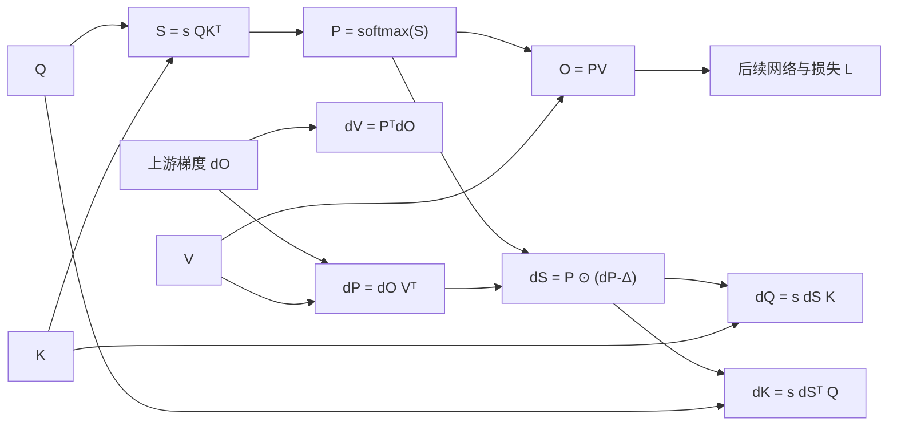

# Triton 06 Fused Attention 前向与概念

> 此文件是规则化提取的“可追溯可见文本对话”，不是完整客户端 Session，也不代表已经匿名化。
> system、developer、reasoning、工具事件、客户端注入和附件正文默认不包含在内。

---

**001 · 用户** · `2026-09-14T05:46:11.531Z` · `msg-a36cacef74ef43c24785`

1. 完整的Q/K/V形状为[4, 2]，S/P为[4, 4]，O形状为[4,2]；
2. 应包含位置j=0、1、2的key。其输出依赖V_0,V_1和V_2;
3. 如果显式保存，那么S和P合计有32个元素。避免物化他们，不能消除QK^T和PV的主要计算。

---

**002 · 助手 / 正式回答** · `2026-09-14T05:46:36.025Z` · `msg-6ee79e5713de594db65d`

三项都正确。补一个形状记号：

- 你写的是单个 `(batch, head)` 切片的形状。
- 若保留完整张量维度，则 \(Q/K/V=[1,1,4,2]\)、\(S/P=[1,1,4,4]\)、\(O=[1,1,4,2]\)。

现在进入在线 softmax。对一行 score，依次处理多个分块时，维护：

\[
m=\max(s_j),\qquad
l=\sum_j e^{s_j-m},\qquad
a=\sum_j e^{s_j-m}V_j
\]

最终输出为：

\[
O=\frac{a}{l}.
\]

新分块到来后，若新最大值为 \(m'\)，旧状态必须乘：

\[
\alpha=e^{m-m'}
\]

然后更新：

\[
l'=\alpha l+\sum_{\text{new}}e^{s_j-m'},
\]

\[
a'=\alpha a+\sum_{\text{new}}e^{s_j-m'}V_j.
\]

这个重标定使旧分块与新分块都改用同一个最大值 \(m'\)，因此结果与一次性 softmax 完全等价。

做一个具体推导。令 value 为标量：

- 第一块：scores \(=[1,2]\)，values \(=[10,20]\)
- 第二块：score \(=[3]\)，value \(=[30]\)

请依次写出：

1. 第一块处理后的 \(m_1,l_1,a_1\)；
2. 合并第二块时的 \(m_2,\alpha,l_2,a_2\)；
3. 最终输出 \(O=a_2/l_2\)。

---

**003 · 用户** · `2026-09-14T06:54:19.525Z` · `msg-aa33725e76eaa5c3d7c4`

1. m\_1=2,l\_1=e^{-1}+1,a\_1=10e^{-1}+20 \\
2. m\_2=3,\alpha=e^{-1},l\_2=e^{-2}+e^{-1}+1,a\_2=10e^{-2}+20e^{-1}+30\\
   O=\frac{10e^{-2}+20e^{-1}+30}{e^{-2}+e^{-1}+1}

---

**004 · 助手 / 正式回答** · `2026-09-14T06:55:12.818Z` · `msg-7b84523542b3ed01ea28`

完全正确。你已经正确完成了两个分块的在线 softmax 合并：

\[
m_2=3,\qquad
l_2=e^{-2}+e^{-1}+1,
\]

\[
a_2=10e^{-2}+20e^{-1}+30.
\]

它与一次性对 scores `[1,2,3]` 做 softmax 后加权 values `[10,20,30]` 完全相同。

对应到[教程前向内循环](/root/autodl-tmp/programming-lab/docs/triton-tutorials/official/06-fused-attention.py:74)：

| 数学量 | Triton 变量 |
|---|---|
| 旧最大值 \(m\) | `m_i` |
| 合并后的最大值 \(m'\) | `m_ij` |
| 重标定系数 \(\alpha\) | `alpha` |
| 分母 \(l\) | `l_i` |
| 未归一化输出分子 \(a\) | `acc` |
| 新块的指数权重 | `p` |

源码使用 `exp2`，因此先做：

\[
qk\_scale=sm\_scale\cdot\frac1{\ln 2}.
\]

这样：

\[
2^{\,s/\ln2}=e^s.
\]

前向初始化为：

\[
m_i=-\infty,\qquad l_i=1,\qquad acc=0.
\]

第一块到来时：

\[
\alpha=2^{-\infty-m_{ij}}=0,
\]

所以初始的 `l_i=1` 会被乘成 0，不会污染结果。结尾保存：

\[
M=m_i+\log_2(l_i),
\]

它是这一行 softmax 分母的 base-2 log 表示，反向可以用它重建概率而不保存完整 \(P\)。

请确认三个映射：

1. 第一块到来时 `alpha` 是多少？为什么初始 `l_i=1` 不会多算一个元素？
2. 为什么使用 `exp2` 前要把自然指数的 score 乘以 \(1/\ln2\)？
3. 保存的 \(M=m_i+\log_2(l_i)\) 在数学上等于什么？

---

**005 · 用户** · `2026-09-14T07:11:25.465Z` · `msg-1edcbdbed7a77a84c59d`

1. 第一块到来时 `alpha` 是0，此时前缀的l\_i=1会被乘0就消除了，所以不会多算一个元素；
2. 因为自然指数以e为底，如果要改成以2为底，数学上就要乘1/ln2进行缩放变换；
3. 如果说是这一行 softmax 分母的 base-2 log 表示，我不明白为什么前面要加m\_i的最大值。

---

**006 · 助手 / 正式回答** · `2026-09-14T07:11:57.416Z` · `msg-9bba37a0317f90dd6bfd`

前两项正确。第三项缺的连接是：为了数值稳定，我们计算 \(l_i\) 时先从每个 score 中减去了最大值 \(m_i\)：

\[
l_i=\sum_j 2^{x_j-m_i},
\]

其中 \(x_j=score_j/\ln2\)。

把 \(2^{-m_i}\) 提出来：

\[
l_i
=2^{-m_i}\sum_j2^{x_j}.
\]

因此原始 softmax 分母是：

\[
\sum_j2^{x_j}=2^{m_i}l_i.
\]

取 base-2 对数：

\[
\log_2\left(\sum_j2^{x_j}\right)
=m_i+\log_2(l_i).
\]

所以，加回 \(m_i\) 是在**撤销数值稳定计算时减去最大值造成的平移**。

源码中的命名还有一个容易混淆的地方：

```python
m_i += tl.math.log2(l_i)
tl.store(M, m_i)
```

执行加法前，`m_i` 是运行最大值；执行后，存入 `M` 的已经是完整的 log-sum-exp。反向便可直接重建：

\[
p_j=2^{x_j-M}
=\frac{2^{x_j}}{\sum_k2^{x_k}}.
\]

换一个便于手算的 base-2 例子：\(x=[1,3]\)。

请计算：

\[
m=\max(x),\qquad
l=\sum_j2^{x_j-m},\qquad
M=m+\log_2(l),
\]

然后用 \(p_j=2^{x_j-M}\) 写出两个 softmax 概率。

---

**007 · 用户** · `2026-09-14T08:00:48.874Z` · `msg-405984a90d7ad274e798`

m=3, l=2^{-2}+1, M=3+log\_2^{2^{-2}+1}=1+log\_2^5;
softmax概率值为[2^{1-1-log\_2^5}=1/5, 4/5]

---

**008 · 助手 / 正式回答** · `2026-09-14T08:01:57.770Z` · `msg-dcb57cc83fefd2d0f9d4`

计算正确：

\[
m=3,\qquad l=\frac14+1=\frac54,
\]

\[
M=3+\log_2\frac54
=1+\log_2 5
=\log_2 10.
\]

所以：

\[
p_0=2^{1-\log_2 10}=\frac15,\qquad
p_1=2^{3-\log_2 10}=\frac45.
\]

记号上建议写成 \(\log_2(2^{-2}+1)\)；上标形式容易被理解成对数的幂。在线 softmax 的核心不变量已经建立。

接下来映射到 Triton 前向。输入形状是：

\[
[Z,H,N_{\text{CTX}},D].
\]

[前向 kernel](/root/autodl-tmp/programming-lab/docs/triton-tutorials/official/06-fused-attention.py:179)使用：

\[
grid=\left(
\left\lceil\frac{N_{\text{CTX}}}{BLOCK_M}\right\rceil,
Z\cdot H,
1
\right).
\]

其中：

- `program_id(0)` 选择一个 query tile；
- `program_id(1)` 选择一个展平后的 `(batch, head)`；
- Q tile 只加载一次并留在片上；
- program 沿 key 方向以 `BLOCK_N` 扫描 K/V tile。

因果模式把扫描分成两部分：

| 区域 | key 范围 | 是否需要逐元素 mask |
|---|---|---|
| 对角线之前 | `[0, start_m*BLOCK_M)` | 不需要，所有 key 都早于当前 query tile |
| 对角线 tile | `[start_m*BLOCK_M, (start_m+1)*BLOCK_M)` | 需要执行 `query_index >= key_index` |
| 对角线之后 | 不扫描 | 全部属于未来位置 |

具体检查：设

\[
Z=2,\ H=3,\ N_{\text{CTX}}=8,\ BLOCK_M=4,\ BLOCK_N=2
\]

某个 program 的 `program_id(0)=1`、`program_id(1)=5`。

请给出：

1. 它对应哪个 `batch` 和 `head`？
2. 它处理哪些 query 行？
3. causal 模式下，无 mask 区域和需要 mask 的区域分别扫描哪些 key？
4. 对其中的 query 行 \(i=5\)，最终允许使用哪些 key？

---

**009 · 用户** · `2026-09-14T08:02:32.962Z` · `msg-847c1b0b3108607d5b3c`

话说之前的例子中为什么没有乘1/ln2的缩放，是这里的x是已经缩放后的吗？

---

**010 · 助手 / 正式回答** · `2026-09-14T08:03:12.567Z` · `msg-5a5f64e88f7c018c8b81`

是的。刚才为了方便手算，我明确把

\[
x=[1,3]
\]

定义成了**已经转换到 `exp2` 域的 score**，所以没有再乘 \(1/\ln2\)。

要区分两个变量：

\[
z=sm\_scale\cdot QK^\mathsf{T}
\]

是通常数学公式中的自然指数 score，softmax 使用 \(e^z\)。

Triton 源码将它转换为：

\[
x=z\log_2 e=\frac{z}{\ln2},
\]

于是：

\[
2^x
=2^{z/\ln2}
=e^z.
\]

因此，刚才的 \(x=[1,3]\) 对应的原始自然指数 score 实际是：

\[
z=[\ln2,3\ln2].
\]

如果原始 score 是 \(z=[1,3]\)，那么代码送入 `exp2` 的值应为：

\[
x=\left[\frac1{\ln2},\frac3{\ln2}\right],
\]

最终概率仍是：

\[
\left[
\frac{e^1}{e^1+e^3},
\frac{e^3}{e^1+e^3}
\right].
\]

相应地，源码保存的 \(M\) 是：

\[
M=\log_2\sum_j e^{z_j}.
\]

若要换回常见的自然对数 log-sum-exp：

\[
\ln\sum_j e^{z_j}=M\ln2.
\]

所以你的判断正确：刚才例子里的 \(x\) 已经是缩放到 base-2 指数域后的数。澄清这一点后，可以继续回答前面的 program/grid 与 causal tile 映射题。

---

**011 · 用户** · `2026-09-14T08:18:22.407Z` · `msg-5561e87555cb6f42d10c`

program/grid 与 causal tile 映射问题，我感觉讲的有些太抽象了，我不知道`program_id(0)`是怎么选择query tile，也不知道展平后的 `(batch, head)`是怎样的。

---

**012 · 助手 / 正式回答** · `2026-09-14T08:19:30.932Z` · `msg-1a02d66a4552d46f0e98`

关键点是：`program_id` 不会在 kernel 内“挑选”任务。wrapper 启动一个二维 grid，Triton 为 grid 中的每个坐标创建一个 program。

先只看输入：

\[
Q.shape=[Z,H,N_{\text{CTX}},D].
\]

把元素写成：

\[
Q[z,h,m,d].
\]

其中：

- \(z\)：batch；
- \(h\)：attention head；
- \(m\)：query 位置；
- \(d\)：head 内特征。

假设：

\[
Z=2,\quad H=3,\quad N_{\text{CTX}}=8,\quad BLOCK_M=4.
\]

query 方向被切成：

\[
\left\lceil\frac{8}{4}\right\rceil=2
\]

个 tile：

| `program_id(0)` | query tile |
|---:|---|
| 0 | query 行 `0,1,2,3` |
| 1 | query 行 `4,5,6,7` |

所以：

\[
query\_start=program\_id(0)\times BLOCK_M.
\]

这就是 `program_id(0)` 与 query tile 的关系。

另一方面，共有：

\[
Z\times H=2\times3=6
\]

个 `(batch, head)` 组合。源码把它们展平为 `program_id(1)`：

| `program_id(1)` | batch \(z\) | head \(h\) |
|---:|---:|---:|
| 0 | 0 | 0 |
| 1 | 0 | 1 |
| 2 | 0 | 2 |
| 3 | 1 | 0 |
| 4 | 1 | 1 |
| 5 | 1 | 2 |

反向映射就是：

\[
z=program\_id(1)\mathbin{//}H,
\qquad
h=program\_id(1)\bmod H.
\]

整个 grid 为：

\[
grid=(2,6,1).
\]

可以把 12 个 program 看成下面这张表：

| `(batch, head)` | `pid0=0` | `pid0=1` |
|---|---|---|
| `(0,0)` | Q 行 `0:4` | Q 行 `4:8` |
| `(0,1)` | Q 行 `0:4` | Q 行 `4:8` |
| `(0,2)` | Q 行 `0:4` | Q 行 `4:8` |
| `(1,0)` | Q 行 `0:4` | Q 行 `4:8` |
| `(1,1)` | Q 行 `0:4` | Q 行 `4:8` |
| `(1,2)` | Q 行 `0:4` | Q 行 `4:8` |

例如坐标：

\[
(program\_id(0),program\_id(1))=(1,5)
\]

表示：

- `pid1=5`：batch 1、head 2；
- `pid0=1`：query 行 4 到 7；
- 这个 program 固定处理 `Q[1,2,4:8,:]`；
- 随后它再沿 key 方向扫描这个 head 的 K/V。

我们先不加入 causal mask。换一个坐标检查：

\[
program\_id(0)=0,\qquad program\_id(1)=4.
\]

它对应哪个 batch、哪个 head，并处理哪些 query 行？

---

**013 · 用户** · `2026-09-14T08:31:38.289Z` · `msg-c29fc9892e42c70bb03e`

他应该处理query行0-3，对应batch为4//3=1，对应head为4%3=1.

---

**014 · 助手 / 正式回答** · `2026-09-14T08:32:24.457Z` · `msg-7a2abe10f1308b3ea888`

正确：

\[
z=4//3=1,\qquad h=4\bmod3=1,
\]

因此该 program 处理：

\[
Q[1,1,0:4,:].
\]

接下来只加上 key tile。`program_id(0)` 固定选择一个 Q tile；同一个 program 再通过循环依次扫描多个 K/V tile。假设：

\[
N_{\text{CTX}}=8,\quad BLOCK_M=4,\quad BLOCK_N=2.
\]

key 方向被分为：

\[
[0,2),\ [2,4),\ [4,6),\ [6,8).
\]

考虑 `program_id(0)=1`，它处理 query 行 `4,5,6,7`。causal attention 要求：

\[
key\_index\le query\_index.
\]

对应的有效关系是：

| query \ key | 0 | 1 | 2 | 3 | 4 | 5 | 6 | 7 |
|---:|:---:|:---:|:---:|:---:|:---:|:---:|:---:|:---:|
| 4 | ✓ | ✓ | ✓ | ✓ | ✓ | × | × | × |
| 5 | ✓ | ✓ | ✓ | ✓ | ✓ | ✓ | × | × |
| 6 | ✓ | ✓ | ✓ | ✓ | ✓ | ✓ | ✓ | × |
| 7 | ✓ | ✓ | ✓ | ✓ | ✓ | ✓ | ✓ | ✓ |

因此源码把 key 扫描分为：

- `[0,4)`：位于整个 Q tile 之前，对四个 query 都有效，无需逐元素 mask；
- `[4,8)`：与 Q tile 位于对角区域，需要比较每个 query/key 索引；
- `[8,N_CTX)`：如果存在，全部属于未来 key，直接不扫描。

这样做比对所有 tile 都执行 mask 更简单，也避免扫描完全无效的未来区域。

现在请对 query tile `4:8` 分类这四个 K/V tile：

1. `[0,2)`
2. `[2,4)`
3. `[4,6)`
4. `[6,8)`

哪些可以无 mask 计算，哪些需要逐元素 causal mask，哪些会完全跳过？再说明 query 行 \(i=5\) 最终能使用哪些 key。

---

**015 · 用户** · `2026-09-14T08:39:35.639Z` · `msg-af2e52f4fed754e4baee`

明白，这里tile 1和2可以无mask计算，tile3和4需要逐元素的causal mask，没有tile可以完全跳过。query 行 i=5最终能使用0-5位置的key。

---

**016 · 助手 / 正式回答** · `2026-09-14T08:40:14.597Z` · `msg-0e6ac17122dc027a11d3`

正确。对于 query tile `4:8`：

- key tile `[0,2)`、`[2,4)`：全部有效，无需 mask；
- key tile `[4,6)`、`[6,8)`：需要逐元素 causal mask；
- 没有完整 tile 被跳过；
- query 行 \(i=5\) 使用 key `0–5`。

现在把这个模型映射到源码中容易混淆的 `STAGE`。

外层 wrapper 设置：

```python
stage = 3 if causal else 1
```

这里的值是一个 bitmask：

- bit 1：执行第一个扫描阶段；
- bit 2：执行对角线阶段。

前向 kernel 中：

```python
if STAGE & 1:
    _attn_fwd_inner(..., STAGE=4-STAGE)

if STAGE & 2:
    _attn_fwd_inner(..., STAGE=2)
```

而内层 `STAGE` 的含义是：

| 内层 `STAGE` | `lo, hi` | 含义 |
|---:|---|---|
| 1 | `0, start_m*BLOCK_M` | causal 对角线之前，无 mask |
| 2 | `start_m*BLOCK_M, (start_m+1)*BLOCK_M` | causal 对角区域，有 mask |
| 3 | `0, N_CTX` | non-causal，扫描完整 key 序列 |

因此：

| 模式 | 外层 `STAGE` | 实际内层调用 |
|---|---:|---|
| non-causal | 1 | `4-1=3`，完整扫描一次 |
| causal | 3 | 先调用 stage 1，再调用 stage 2 |

继续使用：

\[
N_{\text{CTX}}=8,\quad BLOCK_M=4,\quad program\_id(0)=1
\]

此时 `start_m=1`。请分别写出：

1. causal 模式两次 `_attn_fwd_inner` 的内层 `STAGE` 和对应的 `[lo,hi)`；
2. non-causal 模式会调用几次，内层 `STAGE` 与 `[lo,hi)` 是什么。

---

**017 · 用户** · `2026-09-14T08:48:11.033Z` · `msg-37e2a60ff7d2c877092c`

有个问题，为什么外层stage=3时内层还调用stage 2呢？3&2的值是True吗？

---

**018 · 助手 / 正式回答** · `2026-09-14T08:48:44.801Z` · `msg-ce906e6ac623db5423bb`

是的。这里的 `&` 是**按位与**，不是逻辑 `and`。

十进制 3 的二进制表示是：

\[
3=0b11
\]

因此：

\[
3\ \&\ 1
=
0b11\ \&\ 0b01
=
0b01
=
1
\]

条件为真；同时：

\[
3\ \&\ 2
=
0b11\ \&\ 0b10
=
0b10
=
2
\]

结果虽然是整数 `2`，但非零整数在 `if` 中被视为真。所以外层 `STAGE=3` 会执行两个分支。

| 外层 `STAGE` | 二进制 | `STAGE & 1` | `STAGE & 2` | 执行阶段 |
|---:|---:|---:|---:|---|
| 1 | `01` | 1，真 | 0，假 | 第一个分支 |
| 3 | `11` | 1，真 | 2，真 | 两个分支 |

还要注意：外层和内层虽然都叫 `STAGE`，语义不同。

- 外层 `STAGE` 是 bitmask，表示需要执行哪些阶段。
- 传给 `_attn_fwd_inner` 的 `STAGE` 是具体模式编号。

causal 时：

```python
outer STAGE = 3  # 二进制 11

# 第一个 bit 生效
inner STAGE = 4 - 3 = 1  # 对角线之前

# 第二个 bit 也生效
inner STAGE = 2          # 对角区域
```

non-causal 时：

```python
outer STAGE = 1  # 二进制 01

inner STAGE = 4 - 1 = 3  # 扫描完整序列
# STAGE & 2 == 0，不执行第二次
```

所以 `3` 不是“第三阶段”，而是“bit 1 和 bit 2 都打开”。这种复用 `STAGE` 名称的写法确实很容易误读。

---

**019 · 用户** · `2026-09-14T08:52:20.370Z` · `msg-0ffdd6691d1d1c7b7110`

明白了。我还是第一次见这种用bitmask来进行分支判断的做法。为什么要这样做呢？是有什么特殊优势吗？

---

**020 · 助手 / 正式回答** · `2026-09-14T08:53:03.918Z` · `msg-cc08ed69657235e540f6`

这里没有特殊的 GPU 魔法。bitmask 的主要作用是：**用一个整数表示一组可以同时开启的选项。**

例如给三个阶段分配互不重叠的 bit：

```python
OFF_BAND = 1   # 001
DIAGONAL = 2   # 010
DROPOUT = 4    # 100
```

组合多个选项时使用按位或：

```python
mode = OFF_BAND | DIAGONAL  # 001 | 010 = 011 = 3
```

检查某个选项是否存在时使用按位与：

```python
if mode & OFF_BAND:
    ...

if mode & DIAGONAL:
    ...
```

它的常见优势有：

- 一个整数可以同时表达多个独立开关；
- 可以方便地组合、传递和保存一组配置；
- 增加新选项时，只需分配新的 \(2^k\) bit；
- 比为每个选项分别传一个参数更紧凑。

在当前 Triton kernel 中还有一个关键条件：`STAGE` 是 `tl.constexpr`。因此它在编译 kernel 时已经确定，例如分别编译出：

- non-causal 的 `STAGE=1` 版本；
- causal 的 `STAGE=3` 版本。

编译器可以把永远不会执行的分支直接删掉，不会让 GPU 在线程运行时反复判断，也不会因此产生 warp divergence。这个优化主要来自 **compile-time specialization**；换成两个 `tl.constexpr` 布尔值也能做到，并非 bitmask 独有。

这段源码的写法也有明显代价：

- 外层 `STAGE` 是 flag 集合；
- 内层 `STAGE` 又是模式编号；
- `4-STAGE` 虽然简短，但可读性不高。

因此这里只能说 bitmask 让参数表达更紧凑，不能说它天然更快。若只有两个固定模式，下面这样的写法往往更容易读：

```python
if CAUSAL:
    run_off_band()
    run_diagonal()
else:
    run_full()
```

做个很小的确认：若

```python
mode = 5  # 二进制 101
```

那么下面三个检查中，哪些分支会执行？

```python
mode & 1
mode & 2
mode & 4
```

---

**021 · 用户** · `2026-09-14T08:55:55.587Z` · `msg-ff4d99704f404c086033`

```css
mode & 1 和 mode & 4 的分支会执行。
所以原本的stage做法在理论上效率应该是和
if CAUSAL:
    run_off_band()
    run_diagonal()
else:
    run_full()
是一样的吧？
```

---

**022 · 助手 / 正式回答** · `2026-09-14T08:56:39.047Z` · `msg-6874065a8d90b4733f5a`

正确，`5=0b101`，所以 `mode & 1` 和 `mode & 4` 为真。

对于这份 Triton kernel，下面两种写法在执行效率上通常可以认为等价，前提是 `CAUSAL` 也声明为 `tl.constexpr`：

```python
if CAUSAL:
    run_off_band()
    run_diagonal()
else:
    run_full()
```

与：

```python
if STAGE & 1:
    ...

if STAGE & 2:
    ...
```

原因是编译时已经知道 `CAUSAL` 或 `STAGE` 的值。编译器会分别生成专用版本：

```text
causal kernel:
    run_off_band()
    run_diagonal()

non-causal kernel:
    run_full()
```

运行时不会保留无效分支，因此没有额外的逐线程判断或 divergence。

bitmask 在这里主要是代码组织方式：

- `1` 表示只执行第一条路径；
- `3` 表示同时执行两个阶段；
- 一个 constexpr 参数就能表示阶段组合。

如果 `CAUSAL` 是运行时变量，或者两种写法最终生成的 IR 不同，就不能直接断言性能相同。但在当前固定源码的 compile-time specialization 条件下，没有理由认为 bitmask 本身更快。

回到源码追踪题：

- causal：外层 `STAGE=3`，先以内层 stage 1 扫描 `[0,4)`，再以内层 stage 2 扫描 `[4,8)`；
- non-causal：外层 `STAGE=1`，只以内层 stage 3 扫描 `[0,8)`。

这正对应你刚才完成的 tile 分类。接下来可以进入每个 K/V tile 如何更新 `m_i、l_i、acc` 的 Triton 数据流。

---

**023 · 用户** · `2026-09-14T09:07:22.049Z` · `msg-fa9e525632808ca70697`

明白。那对于non-causal，BLOCK\_SIZE就没用了吗？

---

**024 · 助手 / 正式回答** · `2026-09-14T09:08:17.848Z` · `msg-44ffceb7981d50baeb4e`

仍然有用。non-causal 只是不需要 **causal 的区域拆分和 mask**，分块本身仍然是 FlashAttention 的核心。

源码中主要有两个 block size：

- `BLOCK_M`：一个 program 同时处理多少个 query；
- `BLOCK_N`：每次循环加载多少个 key/value。

例如：

\[
N_{\text{CTX}}=8,\quad BLOCK_M=4,\quad BLOCK_N=2.
\]

non-causal 时，每个 program：

1. 固定一个包含 4 行的 Q tile；
2. 依次扫描 4 个 K/V tile：

\[
[0,2),[2,4),[4,6),[6,8);
\]

3. 每次只临时计算一个形状为：

\[
[BLOCK_M,BLOCK_N]=[4,2]
\]

的 score tile；

4. 用在线 softmax 更新 `m_i、l_i、acc`；
5. 扫描完全部 K/V 后，得到 4 行输出。

因此完整的 \(8\times8\) score 矩阵不会被物化。两个 Q program 分别处理：

```text
Q rows 0:4 ─┐
             ├─ 各自扫描全部 K/V
Q rows 4:8 ─┘
```

causal 与 non-causal 的差别只是扫描范围：

| 模式 | K/V 扫描 |
|---|---|
| non-causal | 每个 Q tile 扫描全部 key tile，不做 causal mask |
| causal | 扫描过去区域和对角区域，跳过未来区域，对角区域做 mask |

block size 还会影响：

- score tile 和 accumulator 的大小；
- K/V 循环次数；
- 片上存储、寄存器压力与并行度；
- `tl.dot` 的矩阵形状；
- autotune 选择。

所以 non-causal 中没用的是 causal 的“off-band/diagonal”划分，`BLOCK_M/BLOCK_N` 仍然不可缺少。

小检查：若

\[
N_{\text{CTX}}=16,\quad BLOCK_M=4,\quad BLOCK_N=8,
\]

non-causal 模式下，每个 head 会启动多少个 Q program？每个 program 扫描多少个 K/V tile？每次产生的 `qk` tile 是什么形状？

---

**025 · 用户** · `2026-09-14T09:41:22.837Z` · `msg-92eed14353fb88cdf15d`

会启动16/4=4个Q program，每个program扫描16/8=2 个K/V tile，每次产生的qk tile是(4, 8)形状的。

---

**026 · 助手 / 正式回答** · `2026-09-14T09:41:58.554Z` · `msg-bbd1c708b81402262694`

正确：

\[
\#Q\ programs=\frac{16}{4}=4,
\qquad
\#K/V\ iterations=\frac{16}{8}=2,
\]

每轮：

\[
qk.shape=[4,8].
\]

现在把一轮内循环的数据形状串起来。设：

\[
BLOCK_M=4,\quad BLOCK_N=8,\quad HEAD\_DIM=64.
\]

| 变量 | 形状 | 作用 |
|---|---|---|
| `q` | `[4,64]` | 当前 Q tile，循环期间保持不变 |
| 原始 `k` tile | `[8,64]` | 当前 K tile |
| `k.T` | `[64,8]` | 用于矩阵乘法 |
| `qk = q @ k.T` | `[4,8]` | 当前 score tile |
| `p` | `[4,8]` | 当前块重标定后的指数权重 |
| `v` | `[8,64]` | 当前 V tile |
| `acc` | `[4,64]` | 4 个 query 的加权输出分子 |
| `m_i`、`l_i` | `[4]` | 每个 query 行各自的在线 softmax 状态 |

每轮的两次矩阵乘法是：

\[
[4,64]\times[64,8]\rightarrow[4,8],
\]

\[
[4,8]\times[8,64]\rightarrow[4,64].
\]

其中：

- `q`、`m_i`、`l_i`、`acc` 跨 K/V 循环保留；
- `k`、`v`、`qk`、`p` 每轮换成下一个 key tile；
- 完整的 \(S\) 和 \(P\) 不会写入 HBM；
- 不同 Q program 仍会各自扫描 K/V，不能理解成所有 K/V 永久驻留在片上。

请用这个例子回答两个问题：

1. 为什么 `m_i` 和 `l_i` 是 `[4]`，而不是 `[4,8]`？
2. 扫描完第一个 K/V tile 后，哪些变量必须保留到第二轮，哪些中间量可以直接丢弃？

---

**027 · 用户** · `2026-09-14T10:02:12.179Z` · `msg-964c77d4d8d89b8c44ca`

1. `[4,8]`是整个score tile的形状，而对于m\_i和l\_i这种score tile的按行统计量的形状就是[4]；
2. 进入到第二轮时，`m_i`、`l_i`需要保留，用于后续的数值校准。而对于先前的k tile、v tile、score tile可以进行丢弃。

---

**028 · 助手 / 正式回答** · `2026-09-14T10:02:39.508Z` · `msg-c6650cec30b1435232e1`

第一项正确。第二项还漏了两个变量：

- `acc` 必须保留；
- `q` 在这份实现中也会保留。

完整分类是：

| 跨循环保留 | 每轮可以丢弃 |
|---|---|
| `q`、`m_i`、`l_i`、`acc` | 当前 `k`、`v`、`qk`、`p` |

其中，真正的在线 softmax 状态是：

\[
m_i,\quad l_i,\quad acc.
\]

`m_i/l_i` 只保存归一化统计量；第一轮 V 对输出分子的贡献保存在 `acc` 中：

\[
acc'=\alpha\,acc+p_{\text{new}}V_{\text{new}}.
\]

如果丢掉第一轮的 `acc`，即使保留 `m_i/l_i`，也只能知道 softmax 分母，无法恢复第一轮 values 对输出的贡献。

`q` 不是在线统计量，但每个 K tile 都要计算：

\[
qk=qK_{\text{tile}}^\mathsf{T},
\]

所以源码将同一个 Q tile 保留在片上，避免每轮重新从显存加载。

换一个条件确认：假设第二个 V tile 全部为 0，但第二块 score 会令最大值发生变化。更新式

\[
acc_2=\alpha acc_1+p_2V_2
\]

中，第一块对最终输出的贡献由哪一项保留下来？为什么仍需要乘 \(\alpha\)？

---

**029 · 用户** · `2026-09-14T10:06:49.902Z` · `msg-3a8aee1c134fb3130d84`

对，acc是输出结果的当前原始状态，也需要保留。q则是循环中不变的输入，也要保留。本题中，第一块对最终输出的贡献由第一项\alpha\*acc\_1进行保留，因为最大值发生了变化，需要重新校准之前的结果。

---

**030 · 助手 / 正式回答** · `2026-09-14T10:07:30.436Z` · `msg-ba67bf768480c643bb3a`

正确。你已经区分了两类跨循环状态：

- `q`：循环中不变的输入 tile；
- `m_i/l_i/acc`：随每个 K/V tile 更新的在线状态。

下一步看 tensor descriptor 和线性行号。源码把：

\[
[Z,H,N_{\text{CTX}},D]
\]

视为一个二维矩阵：

\[
[Z\cdot H\cdot N_{\text{CTX}},D].
\]

对于 `(batch=z, head=h)`，它在这个二维矩阵中的起始行是：

\[
offset_y=z(HN_{\text{CTX}})+hN_{\text{CTX}}
       =(zH+h)N_{\text{CTX}}.
\]

然后当前 Q tile 的起始行是：

\[
qo\_offset_y=offset_y+program\_id(0)\cdot BLOCK_M.
\]

例如：

\[
Z=2,\ H=3,\ N_{\text{CTX}}=8,\ D=64.
\]

二维 descriptor 共有：

\[
2\cdot3\cdot8=48
\]

行，每行 64 个特征：

| `(batch, head)` | descriptor 行 |
|---|---|
| `(0,0)` | `0:8` |
| `(0,1)` | `8:16` |
| `(0,2)` | `16:24` |
| `(1,0)` | `24:32` |
| `(1,1)` | `32:40` |
| `(1,2)` | `40:48` |

descriptor 让 kernel 可以写：

```python
q = desc_q.load([qo_offset_y, 0])
```

直接加载一个 `[BLOCK_M,HEAD_DIM]` 块，而不必显式构造每个元素的二维指针。它改变的是访问表达方式，不改变原张量的逻辑索引。

做一个具体映射。仍设：

\[
BLOCK_M=4,\quad BLOCK_N=2,
\]

并取：

\[
program\_id(0)=1,\qquad program\_id(1)=5.
\]

请计算：

1. 对应的 `(batch, head)`；
2. `offset_y` 和 `qo_offset_y`；
3. Q descriptor 会加载哪些行；
4. 当 `start_n=2` 时，当前 K tile 会加载哪些 descriptor 行。

---

**031 · 用户** · `2026-09-14T11:26:45.436Z` · `msg-f3b33634af2188769fd8`

1. 对应（5//3=1，5%3=2）；
2. offset\_y为5\*8=40，qo\_offset\_y=40+1\*4=44；
3. Q descriptor   将加载第44、45、46、47行；
4. 将从start\_n开始加载，加载BLOCK\_N行，为2、3行。

---

**032 · 助手 / 正式回答** · `2026-09-14T11:27:05.526Z` · `msg-e638e0c96f362ae3948a`

前三项正确：

1. `batch=1`、`head=2`；
2. `offset_y=40`、`qo_offset_y=44`；
3. Q descriptor 加载全局行 `44–47`。

第四项需要区分**局部 token 索引**与**descriptor 全局行号**：

- `start_n=2` 表示当前 head 内的 key 位置 `2、3`；
- 该 `(batch=1, head=2)` 的 descriptor 基址是 `offset_y=40`；
- 所以实际加载的全局行是：

\[
40+[2,3]=[42,43].
\]

对应关系为：

```text
K[batch=1, head=2, token=2:4, :]
        ↓ 展平
descriptor rows 42:44
```

源码中的 K/V 扫描始终不能丢掉当前 `(batch,head)` 的 `offset_y`。

换一个例子确认：若 `program_id(1)=4`、`start_n=6`、`BLOCK_N=2`，对应的 K token 是哪些？descriptor 全局行又是哪些？

---

**033 · 用户** · `2026-09-14T12:09:29.657Z` · `msg-bd35c8c0fe2395752a05`

噢，是因为一个program只对应处理一个（batch，head）是吗？所以对于key和v的扫描读取也要针对该（batch，head）。所以对k tile的读取也要从该（batch，head）的偏移开始读取。对于新例子，对应的（batch，head）是（1，1），offset\_y为4\*8=32，那么对应的K token位置是6、7，全局行是38、39.

---

**034 · 助手 / 正式回答** · `2026-09-14T12:10:01.842Z` · `msg-95e5fefd277f3f4848e8`

完全正确。

更精确地说，一个 program 坐标固定的是：

\[
(batch,\ head,\ query\ tile).
\]

- `program_id(1)` 固定 `(batch,head)`；
- `program_id(0)` 固定该 head 中的 Q tile；
- K/V 循环必须始终扫描同一个 `(batch,head)` 内的 token。

你的新例计算正确：

\[
program\_id(1)=4
\Rightarrow
(batch,head)=(1,1),
\]

\[
offset_y=(1\cdot3+1)\cdot8=32.
\]

局部 K token 为 `6、7`，对应 descriptor 全局行：

\[
32+[6,7]=[38,39].
\]

前向 program 完成扫描后只写出：

- 当前 Q tile 的输出 `O`，形状 `[BLOCK_M,HEAD_DIM]`；
- 每个 query 行的 log-sum-exp `M`，形状 `[BLOCK_M]`。

完整的 \(S\) 和 \(P\) 都不会保存。

现在请用自己的话，把一个前向 program 的生命周期按下面五步串起来：

1. 它首先根据两个 `program_id` 确定什么？
2. 哪个 tile 被加载一次并保留？
3. 循环中依次加载什么？
4. 每轮怎样更新在线 softmax 状态？
5. 最后向全局内存写回什么？

---

**035 · 用户** · `2026-09-14T12:16:28.465Z` · `msg-c3fda0addf5cfcf874a2`

1. 确定要处理的（batch，head，q\_tile）；
2. q tile加载一次且一直保留；
3. 循环中依次加载k\_tile和v\_tile；
4. 每轮根据新的最大值计算校准系数，将旧状态进行校准之后加上新block的计算结果；
5. 最后向全局内存写回输出结果O和统计量log-sum-exp `M`  。

---

**036 · 助手 / 正式回答** · `2026-09-14T12:17:10.105Z` · `msg-0e787fa26155a4b1d0f4`

这五步全部正确。你已经把前向 program 的完整生命周期串起来了。

现在进入反向数据流。对一行注意力：

\[
S=sQK^\mathsf T,\qquad
P=\operatorname{softmax}(S),\qquad
O=PV.
\]

给定上游梯度 \(dO\)，先有：

\[
dP=dO\,V^\mathsf T.
\]

softmax 的逐元素梯度可以写成：

\[
dS_{ij}
=
P_{ij}
\left(
dP_{ij}
-
\sum_k P_{ik}dP_{ik}
\right).
\]

定义每个 query 行的标量：

\[
\Delta_i=\sum_jP_{ij}dP_{ij}.
\]

因为：

\[
dP_{ij}=dO_i\cdot V_j,
\]

所以：

\[
\begin{aligned}
\Delta_i
&=\sum_jP_{ij}(dO_i\cdot V_j)\\
&=dO_i\cdot\sum_jP_{ij}V_j\\
&=dO_i\cdot O_i.
\end{aligned}
\]

这就是[反向预处理 kernel](/root/autodl-tmp/programming-lab/docs/triton-tutorials/official/06-fused-attention.py:251)只需要计算：

```python
delta = tl.sum(o * do, axis=1)
```

的原因。每个 query 行保存一个 \(\Delta_i\)，形状为 `[N_CTX]`；不需要完整保存 \(P\)。主反向 kernel 会重新计算 score 和概率，再使用：

\[
dS=P\odot(dP-\Delta).
\]

随后：

\[
dV=P^\mathsf T dO,
\qquad
dQ=s\,dS K,
\qquad
dK=s\,dS^\mathsf TQ.
\]

做一个标量 value 的小例子：

\[
P=[1/4,3/4],\qquad V=[2,6],\qquad dO=2.
\]

请计算：

1. \(O=PV\)；
2. \(dP=dO\,V^\mathsf T\)；
3. 分别通过 \(P\cdot dP\) 和 \(O\cdot dO\) 计算 \(\Delta\)；
4. \(dS=P\odot(dP-\Delta)\)，并检查两个 \(dS\) 分量之和。

---

**037 · 用户** · `2026-09-15T08:27:14.006Z` · `msg-455fd36daaba10308ea8`

小s是什么？

---

**038 · 助手 / 正式回答** · `2026-09-15T08:28:05.321Z` · `msg-89480b762873c98d2d17`

小写 \(s\) 是 attention score 的**缩放系数**，源码中叫 `sm_scale`：

\[
S=sQK^\mathsf T.
\]

标准 scaled dot-product attention 通常取：

\[
s=\frac{1}{\sqrt D},
\]

其中 \(D\) 是 `HEAD_DIM`。例如 \(D=64\) 时：

\[
s=\frac18.
\]

它用于抑制 \(QK^\mathsf T\) 随 \(D\) 增大而产生的过大数值，避免 softmax 过度饱和。

需要区分：

- 小写 \(s\)：标量缩放系数；
- 大写 \(S\)：形状为 `[N,N]` 的缩放后 score 矩阵；
- `sm_scale`：教程传入的实际缩放参数，不强制一定等于 \(1/\sqrt D\)。

在教程的 `exp2` 计算中还会转换为：

\[
qk\_scale=s\cdot\frac{1}{\ln2},
\]

于是：

\[
2^{(QK^\mathsf T)s/\ln2}
=e^{sQK^\mathsf T}.
\]

刚才的反向小例子直接给定了 \(P=[1/4,3/4]\)，所以缩放系数已经包含在生成 \(P\) 的 score 中；计算 \(dQ\) 和 \(dK\) 时才需要再显式乘上 \(s\)。

---

**039 · 用户** · `2026-09-15T08:44:04.684Z` · `msg-c7d76f77bf219c8b5adb`

1. O= 1/2 + 9/2 = 5;
2. dP=2\*(2,6)=(4,12);
3. \delta = P dP=1+9=10,OdO=2\*5=10;
4. dS=(1/4,3/4)\*(-6,2)=(-3/2,3/2).

---

**040 · 助手 / 正式回答** · `2026-09-15T08:44:38.700Z` · `msg-7ddc421aea47b10a6591`

全部正确：

\[
O=5,\qquad dP=(4,12),\qquad \Delta=10,
\]

\[
dS=\left(-\frac32,\frac32\right).
\]

并且：

\[
\sum_j dS_j=0,
\]

这与 softmax 对整行 score 平移不变相对应。

接下来关注反向中的两种扫描方向。设：

\[
P,dS\in\mathbb R^{N\times N},
\qquad
Q,K,V,dO\in\mathbb R^{N\times D}.
\]

梯度为：

\[
dV=P^\mathsf T dO,
\]

\[
dK=s\,dS^\mathsf TQ,
\]

\[
dQ=s\,dS K.
\]

它们的归约方向不同：

| 目标梯度 | 固定什么 | 沿什么扫描 |
|---|---|---|
| \(dV_j\) | key/value 位置 \(j\) | 所有 query \(i\) |
| \(dK_j\) | key 位置 \(j\) | 所有 query \(i\) |
| \(dQ_i\) | query 位置 \(i\) | 所有 key \(j\) |

因此固定源码拆成两个内层逻辑：

- `_attn_bwd_dkdv`：固定一个 K/V tile，扫描 Q 与 dO tile，累计 `dk/dv`；
- `_attn_bwd_dq`：固定一个 Q/dO tile，扫描 K/V tile，累计 `dq`。

这与上一课的经验相似：不同梯度的归约轴不同，适合不同的数据驻留和扫描方向。

做一个形状检查。若：

\[
N=4,\qquad D=2,
\]

请写出下列矩阵乘法的输入和输出形状，并说明结果中的每一行沿 query 还是 key 方向归约：

1. \(dV=P^\mathsf TdO\)；
2. \(dK=dS^\mathsf TQ\)；
3. \(dQ=dS K\)。

---

**041 · 用户** · `2026-09-15T08:45:35.175Z` · `msg-2d5a761450ca37c847b4`

我觉得我还不太明白反向的整体概况。比如输入有哪些，需要输出什么。

---

**042 · 助手 / 正式回答** · `2026-09-15T08:46:23.516Z` · `msg-aaa1a53da846793a5b29`

先退回到 autograd 接口看整体，会清楚很多。对模型调用者来说，反向只做一件事：

> 已知损失对注意力输出的梯度 \(dO\)，求损失对 \(Q,K,V\) 的梯度。

先忽略 batch 和 head，只看一个 head。

前向输入与输出：

\[
Q,K,V\in\mathbb R^{N\times D}
\]

\[
S=sQK^\mathsf T,\qquad
P=\operatorname{softmax}(S),\qquad
O=PV.
\]

反向从后续网络收到：

\[
dO=\frac{\partial L}{\partial O}\in\mathbb R^{N\times D},
\]

最终需要返回：

\[
dQ,\ dK,\ dV\in\mathbb R^{N\times D}.
\]

完整计算图是：



其中 \(dP,dS\) 都只是反向内部的中间量，不需要返回。

完整张量的接口可以写成：

| 对象 | 形状 | 含义 |
|---|---|---|
| `q/k/v` | `[B,H,N,D]` | 前向输入 |
| `o` | `[B,H,N,D]` | 前向输出 |
| `do` | `[B,H,N,D]` | 后续网络传回的上游梯度 |
| `dq/dk/dv` | `[B,H,N,D]` | 反向最终输出 |
| `M` | `[B,H,N]` | 前向保存的每个 query 行的 log-sum-exp |
| `Delta` | `[B,H,N]` | 反向临时保存的每行 \(O_i\cdot dO_i\) |

`causal`、`sm_scale` 和调优选项在教程里被视为固定配置，不计算它们的梯度。

FlashAttention 的特殊之处在于它没有保存完整的：

\[
S,P\in\mathbb R^{B\times H\times N\times N}.
\]

所以反向分为两步：

1. 预处理：

   \[
   \Delta_i=O_i\cdot dO_i
   \]

2. 主反向 kernel：

   利用保存的 \(Q,K,V,O,M\)、临时量 \(\Delta\) 和上游梯度 \(dO\)，按 tile 重新计算所需的 \(S/P\)，然后累计 \(dQ,dK,dV\)。

这是一种“多做一部分计算，少保存巨大的 \(P\)”的取舍。

先只确认接口：如果

\[
Q.shape=[2,4,128,64],
\]

那么 `O`、`dO`、`dQ/dK/dV`、`M` 和 `Delta` 的形状分别是什么？

---

**043 · 用户** · `2026-09-15T08:51:46.043Z` · `msg-3660c5773e1a855189ad`

`O`、`dO`、`dQ/dK/dV`的形状也都是[2, 4, 128, 64]，`M` 和 `Delta` 的形状则是[2, 4, 128].那么反向attention也是需要两个kernel吗

---

**044 · 助手 / 正式回答** · `2026-09-15T08:52:14.119Z` · `msg-b36a6c89d4394f33f0c7`

形状全部正确。

在这份固定教程中，attention 反向确实启动两个 Triton kernel：

```text
O、dO
  │
  ▼
_attn_bwd_preprocess
  │  计算 Delta_i = sum_d(O_id · dO_id)
  ▼
Delta [B,H,N]
  │
  │ 加上 Q、K、V、M、dO
  ▼
_attn_bwd
  │
  ├── dQ
  ├── dK
  └── dV
```

第一个 kernel 是[反向预处理](/root/autodl-tmp/programming-lab/docs/triton-tutorials/official/06-fused-attention.py:251)：

\[
\Delta_i=\sum_d O_{id}dO_{id}.
\]

第二个 kernel 才是主反向，它重新计算需要的 score 和 \(P\)，并完成：

\[
dV=P^\mathsf TdO,
\]

\[
dS=P\odot(dP-\Delta),
\]

\[
dQ=s\,dS K,\qquad dK=s\,dS^\mathsf TQ.
\]

这里要和上一课 LayerNorm 的两个 kernel 区分：

| 算子 | 第一个 kernel | 第二个 kernel |
|---|---|---|
| LayerNorm backward | 计算 `dx` 和参数梯度部分和 | 归约部分和得到 `dw/db` |
| 本教程 Attention backward | 预先计算每行 `Delta` | 计算完整 `dQ/dK/dV` |

Attention 的第一个 kernel 不是参数梯度归约，而是在准备 softmax 反向需要的行标量。

单独计算 `Delta` 的原因是：同一个 query 行的 \(\Delta_i\) 会在多个反向 tile 中重复使用。先用一个简单 kernel 计算一次并保存，比在不同 key tile program 中反复计算或跨 program 共享更直接。

但这不是 FlashAttention 算法规定“必须恰好两个 kernel”。其他实现可以尝试融合预处理，或把 `dQ` 与 `dK/dV` 拆开。两个 kernel 是这份固定教程选择的工作划分。

对于刚才的形状：

\[
[B,H,N,D]=[2,4,128,64],
\]

完整 \(P\) 有：

\[
2\cdot4\cdot128^2=131072
\]

个元素，而 `Delta` 只有：

\[
2\cdot4\cdot128=1024
\]

个元素。教程保存这个线性大小的行统计量，并在反向重新计算所需的概率 tile。

---

**045 · 用户** · `2026-09-15T08:53:58.396Z` · `msg-640ddebb0181758c11db`

好，我们继续。

---

**046 · 助手 / 正式回答** · `2026-09-15T08:54:20.877Z` · `msg-4ed8c4df3109342df551`

继续看主反向 kernel。最清楚的方式是把注意力矩阵看成一张“query 行 × key 列”的表：

\[
P,dS\in\mathbb R^{N\times N}.
\]

以 \(N=4\) 的 causal attention 为例：

| query \ key | \(j=0\) | \(j=1\) | \(j=2\) | \(j=3\) |
|---:|:---:|:---:|:---:|:---:|
| \(i=0\) | ✓ |  |  |  |
| \(i=1\) | ✓ | ✓ |  |  |
| \(i=2\) | ✓ | ✓ | ✓ |  |
| \(i=3\) | ✓ | ✓ | ✓ | ✓ |

有效条件是：

\[
j\le i.
\]

三种梯度分别沿不同方向读取这张表。

### 计算 \(dQ\)：固定 query 行，横向扫描 key

\[
dQ_i=s\sum_j dS_{ij}K_j.
\]

对于一个固定的 query \(i\)，要读取矩阵的第 \(i\) 行：

```text
query i ──→ 扫描所有允许的 key j
```

因此 `_attn_bwd_dq` 固定 Q/dO tile，再循环扫描 K/V tile。

### 计算 \(dK,dV\)：固定 key 列，纵向扫描 query

\[
dK_j=s\sum_i dS_{ij}Q_i,
\]

\[
dV_j=\sum_iP_{ij}dO_i.
\]

对于一个固定的 key \(j\)，要读取矩阵的第 \(j\) 列：

```text
固定 key j
    │
    ▼
扫描所有会使用它的 query i
```

因此 `_attn_bwd_dkdv` 固定 K/V tile，再循环扫描 Q/dO tile。

这也是主反向 kernel 中存在两段不同循环的原因：

| 内层逻辑 | 保持不变 | 循环扫描 |
|---|---|---|
| `_attn_bwd_dkdv` | K/V tile | Q/dO tile |
| `_attn_bwd_dq` | Q/dO tile | K/V tile |

在 causal 模式下，两种方向的有效范围也不同：

- 固定 query \(i\)：只能向左看 \(j\le i\)；
- 固定 key \(j\)：只有下面的 query \(i\ge j\) 会使用它。

请用上面的 \(N=4\) 表回答：

1. 计算 \(dQ_2\) 时需要哪些 key 位置？
2. 计算 \(dK_2\) 和 \(dV_2\) 时，需要累加哪些 query 位置？
3. 为什么这两组答案的扫描方向相反？
